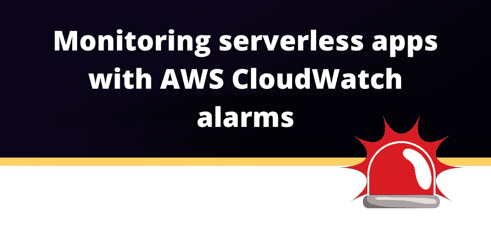
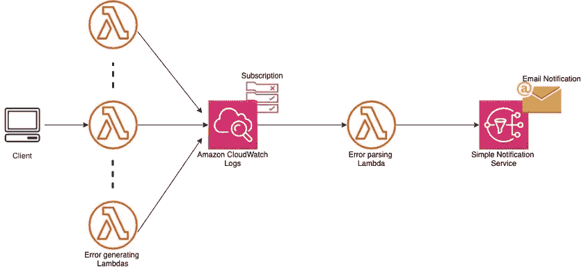
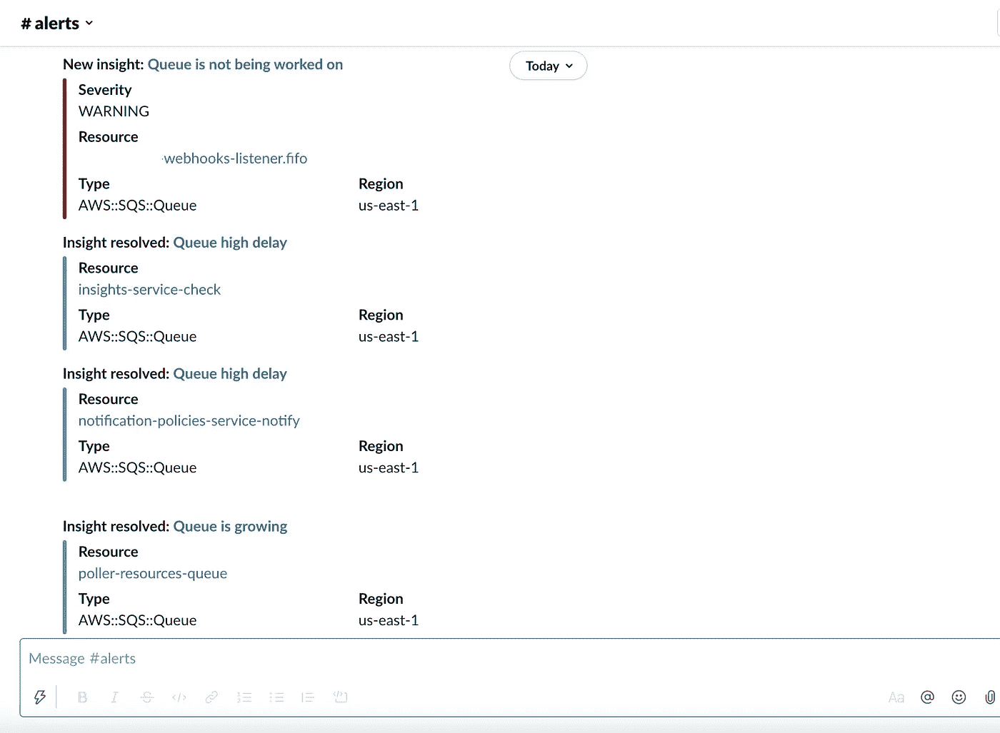
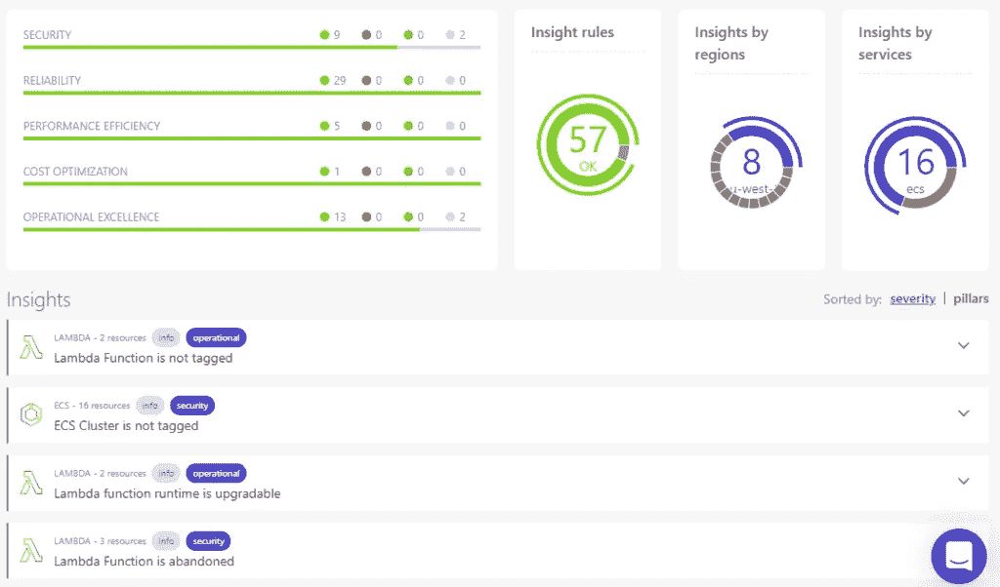

# 使用 AWS CloudWatch 警报监控无服务器应用程序

> 原文：<https://blog.devgenius.io/monitoring-serverless-applications-with-aws-cloudwatch-alarms-e3c6deab938c?source=collection_archive---------9----------------------->



在生产环境中运行任何应用程序都假设[可靠的监控](https://dashbird.io/blog/ultimate-guide-monitoring-serverless-applications/)到位，无服务器应用程序也不例外。

随着现代云应用变得越来越分散和复杂，监控可用性、性能和成本的挑战变得越来越困难。不幸的是，云提供商并没有提供太多现成的服务。虽然您不能完全理解仅使用 CloudWatch 会发生什么，但这是一个很好的起点，可以将其作为确保服务可用性和性能的第一道防线。

让我们**探索一下用 CloudWatch 监控**Lambda 函数的基本和**更复杂的用例。**

# 您可以收集的 CloudWatch 指标

CloudWatch 收集基本指标，让您能够[观察](https://dashbird.io/blog/monitoring-vs-observability/)您的系统运行情况。

对于 Lambda 函数，收集的指标是:错误、调用、并发、延迟和内存使用。由于**当出现问题或即将出现问题时，您不太可能碰巧在准确的时间**检查您的指标，因此最好**配置警报**，以防遇到某些**意外阈值或条件**，通过各种渠道通知您。

# 如何设置 CloudWatch 指标警报

您可以配置 CloudWatch 警报，以便在满足预定义条件的情况下触发 SNS 主题。SNS 触发器然后可以调用 Lambda 函数，该函数将采取行动通知或可能修复该情况。

您将需要使用 CloudWatch 日志订阅，并将条目与日志中的特定错误模式进行匹配。通过这种方式，您可以自动获得错误通知，而不是手动解析无数行日志。



解决方案是:

*   您可以定义希望收到警报的错误。
*   CloudWatch Logs 捕捉这些错误，并调用 Lambda 函数来处理错误，通过 Amazon SNS topic 向您发出警报。

让我们为 Lambda 函数因任何原因失败时配置一个基本警报——下面是部署上述警报的简单指南:

创建 SNS 主题以配置电子邮件订阅

创建 IAM 角色和策略

创建一个 Lambda 函数，通过 SNS 提醒你(下面是示例代码)

```
# Copyright 2020 Amazon.com, Inc. or its affiliates. All Rights Reserved.
# Licensed under the Apache License, Version 2.0 (the "License").
# You may not use this file except in compliance with the License.
# A copy of the License is located at## http://aws.amazon.com/apache2.0/
# or in the "license" file accompanying this file.
# This file is distributed on an "AS IS" BASIS, WITHOUT WARRANTIES OR CONDITIONS OF ANY KIND,
# either express or implied. See the License for the specific language governing permissions
# and limitations under the License.
# Description: This Lambda function sends an email notification to a given AWS SNS topic when a particular
#              pattern is matched in the logs of a selected Lambda function. The email subject is
#              Execution error for Lambda-<insert Lambda function name>.
#              The JSON message body of the SNS notification contains the full event details.

# Author: Sudhanshu Malhotra

import base64
import boto3
import gzip
import json
import logging
import os

from botocore.exceptions import ClientError

logging.basicConfig(level=logging.INFO)
logger = logging.getLogger(__name__)

def logpayload(event):
    logger.setLevel(logging.DEBUG)
    logger.debug(event['awslogs']['data'])
    compressed_payload = base64.b64decode(event['awslogs']['data'])
    uncompressed_payload = gzip.decompress(compressed_payload)
    log_payload = json.loads(uncompressed_payload)
    return log_payload

def error_details(payload):
    error_msg = ""
    log_events = payload['logEvents']
    logger.debug(payload)
    loggroup = payload['logGroup']
    logstream = payload['logStream']
    lambda_func_name = loggroup.split('/')
    logger.debug(f'LogGroup: {loggroup}')
    logger.debug(f'Logstream: {logstream}')
    logger.debug(f'Function name: {lambda_func_name[3]}')
    logger.debug(log_events)
    for log_event in log_events:
        error_msg += log_event['message']
    logger.debug('Message: %s' % error_msg.split("\n"))
    return loggroup, logstream, error_msg, lambda_func_name

def publish_message(loggroup, logstream, error_msg, lambda_func_name):
    sns_arn = os.environ['snsARN']  # Getting the SNS Topic ARN passed in by the environment variables.
    snsclient = boto3.client('sns')
    try:
        message = ""
        message += "\nLambda error  summary" + "\n\n"
        message += "##########################################################\n"
        message += "# LogGroup Name:- " + str(loggroup) + "\n"
        message += "# LogStream:- " + str(logstream) + "\n"
        message += "# Log Message:- " + "\n"
        message += "# \t\t" + str(error_msg.split("\n")) + "\n"
        message += "##########################################################\n"

        # Sending the notification...
        snsclient.publish(
            TargetArn=sns_arn,
            Subject=f'Execution error for Lambda - {lambda_func_name[3]}',
            Message=message
        )
    except ClientError as e:
        logger.error("An error occured: %s" % e)

def lambda_handler(event, context):
    pload = logpayload(event)
    lgroup, lstream, errmessage, lambdaname = error_details(pload)
    publish_message(lgroup, lstream, errmessage, lambdaname)
```

如果你需要一个产生错误的 Lambda 函数来测试，你可以使用亚马逊的这个:

```
import logging
import os

logging.basicConfig(level=logging.DEBUG)
logger=logging.getLogger(__name__)

def lambda_handler(event, context):
    logger.setLevel(logging.DEBUG)
    logger.debug("This is a sample DEBUG message.. !!")
    logger.error("This is a sample ERROR message.... !!")
    logger.info("This is a sample INFO message.. !!")
    logger.critical("This is a sample 5xx error message.. !!")
```

代码来源:亚马逊

# 设置指标警报的最佳实践

那么什么时候应该配置度量警报呢？

一般来说，**您只希望在需要您关注的情况下收到提醒**。如果你创造了一个**警报过于频繁**的情况，并且对它们的响应是可选的，那么**不用多久就会因为噪音**或者更糟的情况而错过一个关键警报——开始完全忽略警报。

例如，**你可以问自己这些问题**:对于一个特定的 Lambda 函数，如果所有请求中有 1%失败，这样可以吗？也许请求不超过 1 秒很重要？您可能想知道您的 Lambdas 是否达到了帐户范围的并发限制。**每个应用**的设置都是独立的，通常需要一些**时间和迭代**才能正确设置。

另一件要考虑的事情是，您是否应该尝试**配置本质上是预防性的**警报——当**某个东西尚未失败但可能很快就会失败时触发**。例如，如果一个 [Lambda 函数接近超时](https://dashbird.io/blog/task-timed-out-after-x-seconds/)或非常接近其内存容量？

## 在 CloudWatch 上设置自定义指标

一旦你定义了你对指标的需求，你就可以开始一个接一个地设置它们**。**

这也可以通过 CloudWatch 来完成。亚马逊在这里分享了一些你可以效仿的例子[，但这是一项相当**繁琐的任务**，不仅要**正确配置它们**，还要确保**一切都保持最新**并与你不断增长的应用程序一起正常工作**。**](https://docs.aws.amazon.com/AmazonCloudWatch/latest/logs/MonitoringPolicyExamples.html)

# 使用 CloudWatch 警报是一个很好的第一道防线，但是**仅仅通过 CloudWatch 调试应用程序既困难又耗时**，尤其是当您的函数有大量调用时。

从上面的内容可以看出，**为最基本的指标创建警报是一项相当烦人的任务**。定制指标的警报也是大量的工作。有一个更简单、更好的解决方案——dash bird 的自动预配置警报！ [Dashbird 的自动警报](https://dashbird.io/failure-detection/)监听来自日志和指标的事件，捕捉代码异常、缓慢的 API 响应、失败的数据库请求和缓慢的队列，并且如果有任何问题即将发生，将通过 Slack、电子邮件、SNS 或 Webhooks 立即通知您错误，以便您可以在任何问题开始影响您的客户之前快速介入并解决它。



**不需要额外的工具**,所以你今天就可以开始使用它，你不需要重新部署你的 Lambda 函数。Dashbird 会为所有受支持的 AWS 资源设置指标和警报，因此您不必这么做。这些是基于多年来为 Dashbird 客户监控无服务器系统的经验，我们有超过 5，000 个 AWS 帐户连接并接收监控数据。

我们构建 Dashbird 是为了让无服务器的监控、调试和警报**变得简单明了**，而不会丢失粒度。Dashbird 不仅检测故障，它还**将您指向确切的请求**，向您显示日志、X 射线跟踪和该调用的相关元数据。



最后，我们使用 AWS [架构良好的框架](https://aws.amazon.com/architecture/well-architected/)——来自 AWS 的官方资源，用于在 AWS 云上构建和维护应用程序。

[**免费试用 dash bird**](https://app.dashbird.io/auth/register)

延伸阅读:

*   [监控无服务器应用的终极指南](https://dashbird.io/blog/ultimate-guide-monitoring-serverless-applications/)
*   [您应该监控的λ指标](https://dashbird.io/blog/lambda-metrics-monitoring-what-matters/)