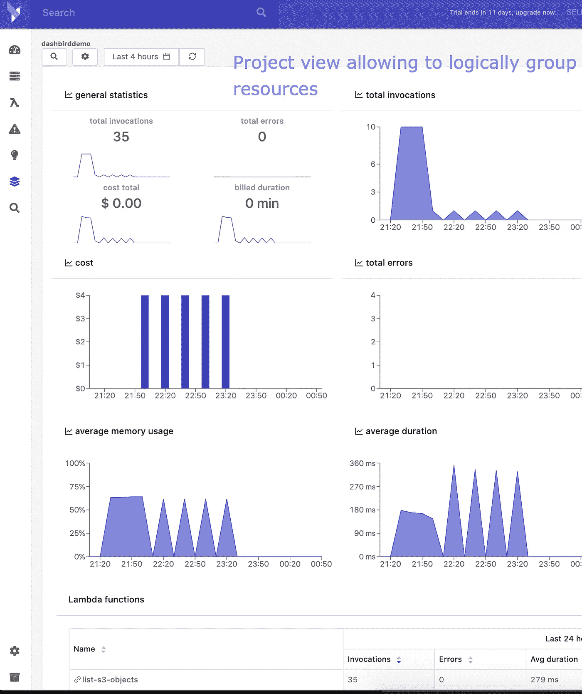

# 监控与可观察性:你能看出区别吗？

> 原文：<https://blog.devgenius.io/monitoring-vs-observability-can-you-tell-the-difference-f29f855580e3?source=collection_archive---------1----------------------->

## 你的监控系统能被观察到吗？

照片由 [Scott Webb](https://www.pexels.com/@scottwebb?utm_content=attributionCopyText&utm_medium=referral&utm_source=pexels) 从 [Pexels](https://www.pexels.com/photo/two-gray-bullet-security-cameras-430208/?utm_content=attributionCopyText&utm_medium=referral&utm_source=pexels) | [内容披露](https://www.annageller.com/disclosure)

近年来，可观察性已经变得非常流行。现代 DevOps 范例鼓励通过合并自动化、基础设施即代码和敏捷开发来构建健壮的应用程序。为了评估 IT 系统的健康和“健壮性”，工程团队通常使用日志、度量和[跟踪](https://en.wikipedia.org/wiki/Tracing_%28software%29)，这些被各种开发工具用来促进可观察性。但是究竟什么是可观察性，它与监控有什么不同？

# 维基百科对可观察性的定义

> **“可观测性**是一种度量标准，用于衡量系统的内部状态可以从其外部输出的知识中推断出来的程度。”— [维基百科](https://en.wikipedia.org/wiki/Observability)

一个可观察的系统允许我们在不干扰甚至不与之互动的情况下评估系统如何工作。简单地通过查看系统的输出(*如日志、度量、跟踪*)，我们可以评估这个系统的表现如何。

# 监控与可观察性

我所见过的关于监控和可观察性的最好解释之一是在线课程*“在 AWS 上构建现代 Python 应用”，*由 AWS 的高级云技术专家 Morgan Willis 提供。

> **监控是收集数据的行为**。我们收集什么类型的数据，我们用这些数据做什么，以及这些数据是否容易分析或可用，则是另一回事。这就是可观察性发挥作用的地方。可观察性不是一个动词，也不是你做的事情。相反，**可观测性**更多的是系统的**属性摩根·威利斯**

按照这种解释，像 [CloudWatch](https://dashbird.io/blog/dashbird-vs-aws-cloudwatch/) 或者 X 射线这样的工具，可以看作是监控或者追踪工具。它们允许我们收集有关系统的日志和指标，并发送有关错误和事件的警报。**因此，监控是** **收集** **数据**的活跃部分，这些数据将帮助我们评估我们系统的健康状况及其不同组件如何协同工作。一旦我们建立了持续收集日志、系统输出、指标和跟踪的监控，我们的**系统就变得可观察**。

作为一名数据工程师，我喜欢将监控视为 ETL(提取、转换、加载)的数据摄取部分——您从多个来源(*日志、跟踪、指标*)收集数据，并将它们放入数据湖。一旦所有这些数据都可用，一个熟练的分析师就可以从这些数据中获得洞察力，并构建漂亮的仪表板来讲述这些数据所传达的故事。这就是可观察性部分——从收集的数据中获得洞察力。而**可观察性平台**如[dash bird](https://dashbird.io/)则扮演着熟练分析师的角色。它们为您提供了关于系统健康状况的可视化和洞察力。

监控是可观察性的先决条件。我们不监控的系统是不可观察的。

# 举例说明可观察性和监控之间的区别

## 监视

监控的最终目的是通过**主动收集**错误日志和系统指标来控制系统的健康状况，然后利用这些来发出事故警报。这意味着:

*   跟踪**错误**和**一旦错误发生就向**发出警报，
*   跟踪关于 **CPU 利用率**或**网络流量**的**指标**以便稍后观察特定计算资源是否健康，
*   通过警告、警报和通知对**中断**和**安全事故**做出反应。

尽管监控是一个主动的过程，但当我们使用 CloudWatch 或 X-Ray 时，AWS 会自动完成这项工作。

## 可观察性

可观察性的目的是**使用系统的输出** **来收集见解并对其采取行动**。示例:

*   确定所有函数或容器调用的错误百分比，
*   通过观察显示单个函数调用之间的延迟和组件之间的转换的轨迹，识别微服务中的瓶颈。
*   识别错误或瓶颈发生时的**模式**,并使用洞察采取行动，以防止将来出现这种情况。
*   测量和评估整个应用程序的**性能**，
*   识别**冷启动**，
*   确定您的应用程序消耗了多少内存，
*   确定您的代码何时运行以及运行多长时间，
*   确定每个特定资源发生了多少**成本**，
*   识别**异常值** —例如。比平常花费更多时间的特定函数调用，
*   确定一个组件的**变化**如何影响系统的其他部分，
*   识别并排除流经我们微服务的**流量流**，
*   确定**系统在一段时间内如何执行**——每天、每周或每月**我们会看到多少次对每个函数的调用**，其中有多少次是成功的。

# 无服务器微服务的可观测性

尽管无服务器微服务在解耦、减少单个组件之间的依赖性以及整体更快的开发周期方面提供了无数的好处，但最大的挑战是**确保所有那些小的“移动部件”一起良好地工作**。通过手动查找分散在不同云服务中的日志、指标和跟踪来跟踪所有微服务是非常不切实际的，甚至是不可能的。

在查看 AWS 时，您必须去 AWS 查看日志，找到您的 Lambda 函数的日志组，然后找到您真正感兴趣的日志。然后，要查看相应的 API 跟踪，您可以使用 X-Ray 或 CloudTrail，再次搜索可能有数百个组件，以找到您想要研究的组件。如您所见，查找和访问每个组件的日志和跟踪非常耗时。此外，调试单个部件并不能让您对这些组件如何协同工作有一个“宏观”的了解。

随着微服务架构的不断发展，我们需要一种更简单(*自动化*)的方式来增加无服务器生态系统的可观察性。

# Twitter 是如何做到的？

这里有一个我们都太熟悉的服务的例子——Twitter。正如你可能想象的那样，像 Twitter 这样的产品有很多活动部件，当某个部件出现故障时，很难理解为什么会出现问题或者 T2 是什么导致了问题。想象一下，有 3.5 亿活跃用户通过你的系统相互交流，发微博、点赞、发微博、转发等等。当处理成千上万个彼此异步通信的小服务时，**越来越难以找到错误的根本原因**，比如为什么一条推文没有被发布，或者为什么一条消息比平时花了更长的时间才被传递。Twitter 写了他们在 2013 年迁移到微服务，你可以在这里找到帖子。

随着分布式系统或微服务的规模化，**可观察性成为一种必要**。你需要一个为你提供正确信息的系统来采取行动。Twitter 的可观察性系统非常庞大，花了数年时间才发展成今天这样运转良好的机器。

> “我们的时间序列指标接收服务每分钟处理超过 28 亿个写请求，存储 4.5 的时间序列数据，每分钟处理 25，000 个查询请求。” *— Antony Asta 在 2016 年发表的关于他们的可观测性系统的范围—更多信息，参见第* [*部分一*](https://blog.twitter.com/engineering/en_us/a/2016/observability-at-twitter-technical-overview-part-i.html) *和第* [*部分二*](https://blog.twitter.com/engineering/en_us/a/2016/observability-at-twitter-technical-overview-part-ii.html) *。*

# 无服务器的可观测性平台能有什么帮助？

可以理解的是，并不是所有的企业都有 Twitter 的规模，他们可能没有资源和时间来建立自己的可观察性系统。所以，我想演示一个简单直观的可观测性平台。只需 2 分钟的设置，你就可以注册 [Dashbird](https://dashbird.io/) 并立即为你的无服务器 AWS 架构添加可观察性。您的 AWS 帐户中的每个无服务器组件(您在其上启用了 CloudWatch 日志和 X 射线或 CloudTrail 跟踪)都将被这些工具自动**监控**。但是在你对这些收集到的数据做些什么之前，还看不到它。

Dashbird 的真正好处是它**不需要**任何代码更改，也不需要**你方的任何努力**——它只需要**使用已经存在的数据**，也就是说，你已经通过为此目的设计的 AWS 原生服务启用了监控的数据。

作为一个可观察性平台，Dashbird 允许您在讨论从可观察系统收集的洞察示例时完成所有要点:

*   当**事件、冷启动、**和**错误**发生时，通过自定义**报警、**得到通知
*   观察所有调用的**错误百分比**并识别潜在的异常值，
*   找出您的应用程序消耗了多少内存，以及您的代码何时运行以及运行多长时间，
*   确定每个特定资源发生了多少成本，
*   …还有更多。

Dashbird 项目视图—图片由作者提供

# 结论

虽然监控工具允许您收集应用程序日志以及关于资源利用和网络流量的指标，或者对特定服务的 HTTP 请求的跟踪，但可观察性是系统的一个**属性，它分析并可视化收集的数据，**从而允许您通过收集关于底层系统的见解来改进应用程序的生命周期。

**资源:**

[1] [维基百科](https://en.wikipedia.org/wiki/Observability)

[2]“在 AWS 上构建现代 Python 应用程序” *—* [摩根·威利斯](https://www.edx.org/course/building-modern-python-applications-on-aws)

[3]“监控与可观察性:有什么区别？”— [詹姆斯·亚里亚](https://www.logicmonitor.com/blog/monitoring-vs-observability-whats-the-difference)