# 使用 TIG 监控您的机器

> 原文：<https://blog.devgenius.io/monitoring-your-machine-s-with-tig-a9ef39cd0eec?source=collection_archive---------0----------------------->

## Grafana | InfluxDB | Telegraf |监控|指标

## TIG = Telegraf，InfluxDB，Grafana。受众:开发人员、书呆子、devops 初学者…

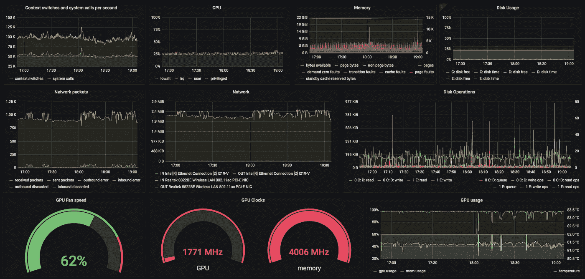

运行游戏时的 Windows 10 机器

## 在 15 分钟内监控你自己的主机

*(这个故事/方法/教程假设你对 linux、命令行和计算机如何工作有基本的了解)*

# 捉人游戏

你可能听说过“TICK”栈:Telegraf，InfluxDB，Chronograf，Kapacitor。我经常使用 Telegraf 和 InfluxDB，但是作为可视化前端，Grafana 已经成为我工作环境中的标准。Kapacitor 仍可用于特定用途。对于这篇文章，这是不必要的。

几年前——出于好奇和学习成长的渴望——我开始玩 Telegraf 和 InfluxDB。我得到了几台旧机器(双核)，在上面我为我的两个孩子安装了 linux。由于我想了解更多关于监控的知识，我决定监控它们(linux 机器 ofc！)用 Telegraf(一个用 golang 写的小型数据收集工具)。

因此，在我们可以监控任何东西之前，我们需要设置目标数据库和前端来查看一些东西。

# 设置 InfluxDB 和 Grafana

因为我们想更专注于收集数据，所以我们会做得很快。

获取下面的`docker-compose.yml`文件，并在您喜欢的主机上启动它。为了使用它，**我建议在您的本地机器上启动它**。如果你有一个专用的或者虚拟的 linux 机器，那也很好。

## macOS 先决条件:

*   安装自制软件:[https://brew.sh/](https://brew.sh/)
*   安装 docker : `brew cask install docker`

## Linux 先决条件:

*   安装码头工人:[https://docs.docker.com/get-docker/](https://docs.docker.com/get-docker/)

## Windows 先决条件:

*   安装码头工人:[https://docs.docker.com/get-docker/](https://docs.docker.com/get-docker/)

## Docker 撰写

下载以下内容，并在新目录下保存为`docker-compose.yml`文件。

docker-compose.yml

## 它的作用

它下载并启动一个 InfluxDB 以及一个 Grafana docker 映像。为了获得一些数据，它还将在 docker 中启动一个 Telegraf 服务，该服务从您的主机收集数据，并将其发送到您自己的本地 InfluxDB 实例。

如果您想在 Docker 上了解更多信息，以及为什么学习如何使用它是件好事，请访问:

[](https://medium.com/swlh/8-reasons-why-every-developer-should-use-docker-and-you-wont-believe-5-c71f8a58cd83) [## 每个开发人员都应该使用 Docker 的 8 个理由——你不会相信第 5 个！

### 它将节省您的时间，避免问题，帮助构建可扩展的应用程序，并使您和您的团队更加高效。

medium.com](https://medium.com/swlh/8-reasons-why-every-developer-should-use-docker-and-you-wont-believe-5-c71f8a58cd83) 

在存储您的`docker-compose.yml`文件的目录中运行以下命令**——它将显示如何下载和启动 docker 服务:**

```
host% **docker-compose up**
Creating network "XXX_monitoring" with the default driver
Creating network "XXX_influxdb" with the default driver
Creating network "XXX_grafana" with the default driver
[...]
```

您会注意到，该命令没有返回，并将连续打印所有三个服务的日志。在这里，您可以看到是否有任何错误弹出。

# 玩它

当它启动并运行时，打开 [http://localhost:3000/](http://localhost:3000/) ，您应该会看到一个 Grafana 登录屏幕。使用用户名`admin`和密码`admin`登录。现在要求您设置新密码。

## 通过两个简单的步骤进行设置:

1.  添加数据源
2.  创建仪表板

# 添加数据源

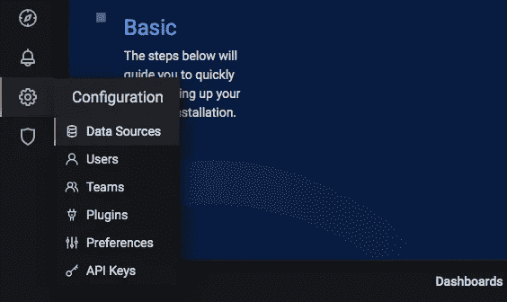

在左侧菜单中导航至`Configuration`，然后导航至`Data Sources`。

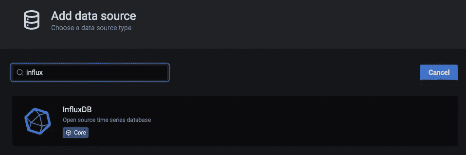

选择`InfluxDB`数据源并输入以下值:

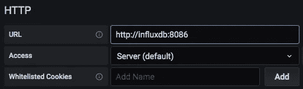

*   URL: `[http://influxdb:8086](http://influxdb:8086)`(这指向您的本地 influxdb docker 容器)

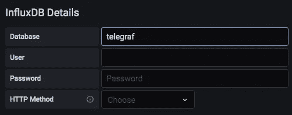

*   数据库:`telegraf`(这是 telegraf 写入的默认数据库)

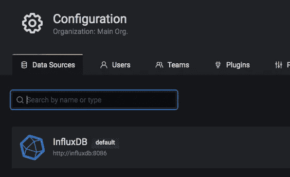

*   点击`Save & Test`按钮，应显示绿色信息。

**祝贺你！**您已经成功添加了一个数据源。

# 创建您的第一个仪表板

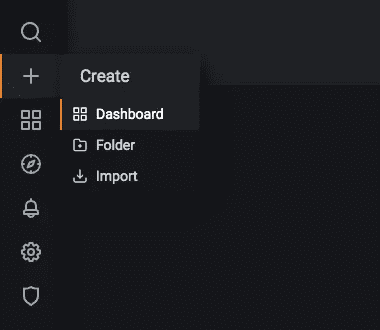

在左侧菜单中，点击`+`然后点击`Dashboard`，然后点击`Add new panel`按钮。

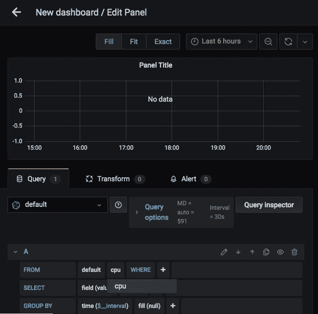

在面板屏幕上，您现在创建对`influxdb`数据库的查询。这是简单的拖放操作，因为可能的值是从`influxdb`中获取的。

点击`select measurement`(这就是在 InfluxDB 中调用“表”的方式)，你会看到一个选项`cpu`。

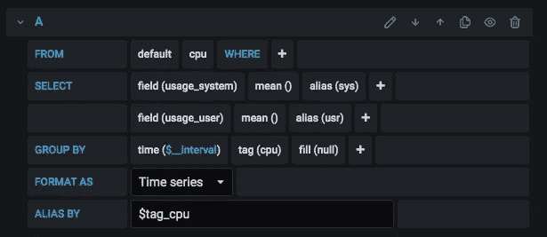

现在配置查询，这样您就可以看到您想要看到的内容。

左边是一个工作配置的示例。它甚至有一个用于 cpu 内核的`GROUP BY`，所以您应该会看到多个系列，每个系列对应一个 cpu 内核。

你也可以**直接从[grafana.com](https://grafana.com/grafana/dashboards)导入现有的仪表板**，这将节省你设置有用仪表板的大量时间。例如，对于一个简单的主机仪表板，这个可能就足够了:[https://grafana.com/grafana/dashboards/10581](https://grafana.com/grafana/dashboards/10581)

此外, [Grafana 入门指南](https://grafana.com/docs/grafana/latest/getting-started/getting-started/)可能会帮助您找到自己的路。

# 恭喜你！

现在，监控主机数据所需的 3 个组件都已运行。

您可以使用`docker-compose stop`暂时停止它们，并使用`docker-compose start`重新启动它们。数据将保存在 docker 卷中，因此您的仪表板和 Grafana 的登录数据以及 InfluxDB 中的数据都将保留。

# 监控更多

您可以监控更多的基本值，也可以使用大量的输入插件，这些插件在 [Telegraf](https://github.com/influxdata/telegraf) 中已经可用。要了解如何通过环境变量配置 Telegraf 容器，请查看 [README.md](https://github.com/DrPsychick/docker-telegraf/blob/master/README.md#usage) 。

如果您达到了通过环境变量实际可配置的极限，您可以创建自己的`telegraf.conf`配置文件并将其安装到 telegraf 容器中。只需将此安装指令添加到用于 Telegraf 的`docker-compose.yml`中:

```
 volumes:
      - "/my/directory/telegraf.conf:/etc/telegraf/telegraf.conf:ro"
```

要从多台主机收集统计数据，您可能需要一台指定的机器运行 InfluxDB 24/7。同一台机器可以作为主机，所以你可以从任何地方访问它。在我的情况下，它是互联网上的服务器。但是如果您有一个可以运行 docker 容器的本地 NAS，那么您的本地 NAS 也可以达到这个目的。

我不会在这里详细介绍如何设置，但我会在下面提到，如何在不同的机器上安装和运行 Telegraf。

# 监控 linux 主机

在 Linux 上，我更喜欢在 docker 容器中运行它，因为我不需要在机器上安装太多。

**安装** : `docker create [..options..] --name telegraf drpsychick/telegraf`
**配置**:通过环境变量从文件`--env-file`或者直接`--env`
**运行服务:** `docker start telegraf`

当然你可以使用其他图片或者来自 InfluxData 的官方`[telegraf](https://hub.docker.com/_/telegraf)`[图片](https://hub.docker.com/_/telegraf)。

# 监控 macOS 主机

**安装** : `brew install telegraf` **配置** : `/usr/local/etc/telegraf.conf` **运行服务** : `brew services restart telegraf`

更多 macOS 监控在这里

[](https://medium.com/dev-genius/monitor-temperatures-with-telegraf-on-macos-4a0eae03549d) [## 在 macOS 上使用 Telegraf 监控温度

### 在 macOS 上使用 Telegraf 可以监控的内容:适用于书呆子、开发人员和 devops 初学者…

medium.com](https://medium.com/dev-genius/monitor-temperatures-with-telegraf-on-macos-4a0eae03549d) 

# 监控 Windows 主机

**安装** : [下载发布](https://github.com/influxdata/telegraf/releases)并安装到`C:\Program Files\telegraf`
**配置** : `C:\Program Files\telegraf\telegraf.conf`(提示，你可能要配置`[[inputs.win_perf_counters]]` )
**运行服务** : `telegraf.exe --service install`一次，然后`net start telegraf`

有时在 Windows 上，telegraf 不再收集数据。要解决这个问题，您必须以管理员身份运行`lodctr /r`来刷新性能监视器。

# 撤销一切

docker-compose 的一个好处是:一个简单的命令和**你所做的一切(下载的服务、创建的卷、收集的数据……)都消失了:**

```
docker-compose down -v --rmi local
```

# 对我有什么好处？

总结一下，你可能会奇怪我为什么这么做，有什么好处？值得付出所有的努力吗？

看情况。首先，你必须自己决定。我用它来了解更多关于 monitoring、docker、influxdb、grafana 和 telegraf 的信息。我肯定这不是让其他人都使用它的足够好的理由。随着时间的推移，它也给我带来了其他一些好处:

1.  故障排除:我可以快速检查网络中我的机器的状态，以查看哪里出了问题。它节省时间。
2.  磁盘提醒:我在 grafana 中设置了提醒功能，当磁盘变满时会通知我。您可以在 grafana 中轻松设置自己的提醒。
3.  监控我的网络连接:这可能是我最大的好处。我们确实有一个蹩脚的 DSL 线路，我有多少带宽被使用的图表等等。现在我们有了光纤，我再也不用担心带宽了，但我仍然喜欢这些图表😄
4.  软件度量:如果您编写或部署软件，您可能需要一些应用程序度量。例如，每当我运行一个部署时，我都会向我的 InfluxDB 发送一个注释，使它在图形中可见。

# 示例图表

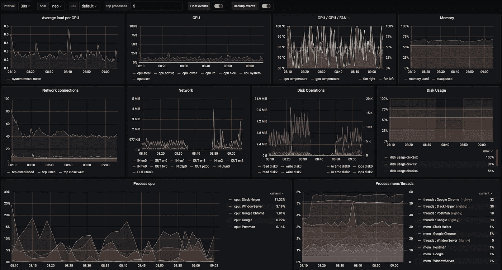

MacBook Pro 的统计数据

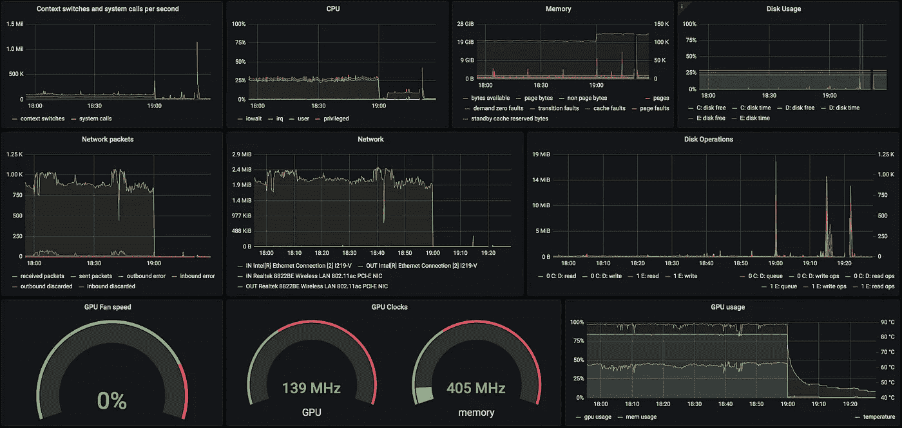

游戏期间和之后 Windows 10 机器的统计数据

# 参考

telegraf:[https://github.com/influxdata/telegraf](https://github.com/influxdata/telegraf)
influx db:[https://github.com/influxdata/influxdb](https://github.com/influxdata/influxdb)格拉夫纳:[https://github.com/grafana/grafana](https://github.com/grafana/grafana)