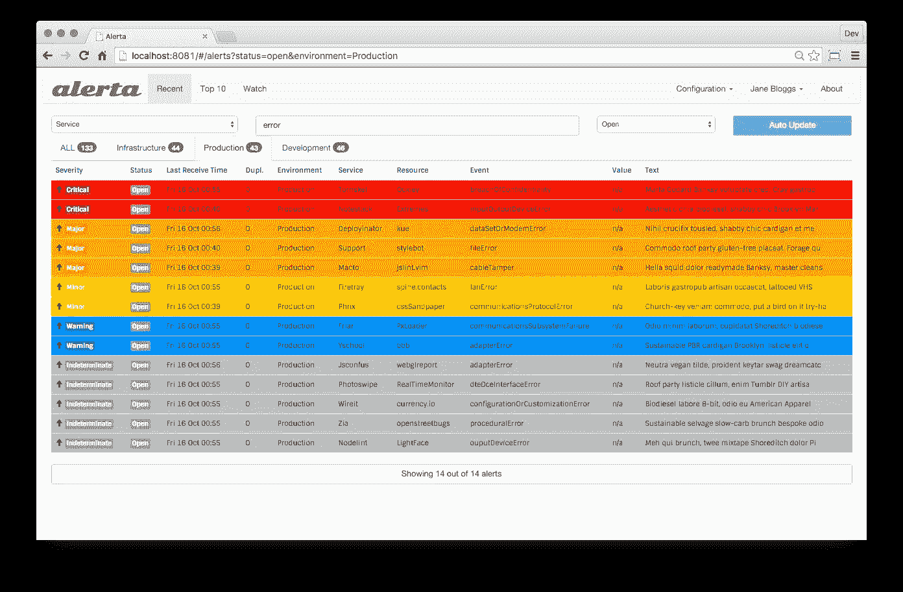

# 从头到尾监控生产，这是你的紧急计划

> 原文：<https://blog.devgenius.io/monitoring-your-production-from-a-to-z-this-is-your-crashplan-3e727d6ec04c?source=collection_archive---------2----------------------->

米歇尔·雅库博夫斯基在 [Unsplash](https://unsplash.com/s/photos/monitoring?utm_source=unsplash&utm_medium=referral&utm_content=creditCopyText) 上的照片

您的监控计划可以分为三个主要部分:

可观察性、监控和分析相结合，提供可操作的情报。

**1-可观察性**可观察性使我们能够收集服务器的所有日志、事件和行为。

**2-监控**提供来自生产的反馈，并提供关于应用性能和使用模式的信息，例如:

*   告诉你系统是否工作
*   关于系统的指标和日志的集合
*   以失败为中心
*   “如何”/是你做的事情吗

**3-可观察性**

*   让你问为什么它不工作
*   从系统中传播信息
*   了解系统行为，无论是否发生故障
*   “目标”是你有的东西吗
*   你让自己引人注目

# 可观察性与监控？澄清困惑

# 让我们把手弄脏吧

让我们制定一个监控名为“测试”的公司的应急计划

想象一下，我们有一个正在运行的网站，它有多个服务，每个服务由不同的子域托管。

该公司的完整架构如下:

为了实现完美的监控，我们需要列出所有的依赖项:

**商店**和**service.test.com**和**登陆页面**和**移动应用**依赖于 API.service.com(4 个依赖项)

**API.service.com**依赖**第三方 API。**

因此，这意味着我们有两个重要的崩溃点，或者具体地说，我们称之为单点故障。

不幸的是，我们不能改变公司的结构，但我们需要提供良好的监控和警报，以提高服务的可用性百分比。

**—用 Monit 监控:**

Monit 是一个用于管理和监控 Unix 系统上的进程、程序、文件、目录和文件系统的工具。

Monit 以守护模式运行，它由**周期**配置，这是一个以秒为单位的轮询间隔**。**

在我们的例子中，我们定义 1 个周期= 5 秒

一些非常有用的 Monit 规则

*   负载平均值(15 分钟)> vCPU x，持续 12 个周期
*   12 个周期的 CPU 使用率> 90%
*   12 个周期内存使用率> 75%
*   正常运行时间超过 90 天
*   磁盘使用率> 80%
*   磁盘使用率> 90%
*   数据库服务应该运行 1 个周期
*   SSH 服务应该运行(端口 22)6 个周期
*   通过模拟对 API 的 HTTP 请求来监视登录页面(预期状态代码为 200 或发出警报)
*   监控所有关键端点的可达性监控页面速度负载
*   监控 SSL 有效性应该处理 2 周，这给你一些时间来呼吸和计划 SSL 升级。
*   监控运行的不同组件之间的延迟。
*   监控所有外部和第三方端点

一旦检测到警报，应触发触发器以通知运营团队:

**规则触发器**

*   警报应记录在 Alerta 仪表板上，以供参考，并具有相应的严重级别。
*   应该向松弛渠道/不和谐/电子邮件发送松弛通知。等等

请在这里找到 Monit 的完整文档:【https://mmonit.com/monit/documentation/monit.html 

应在每台服务器上部署的监控仪表板

alerta GUI 上的警报仪表板

请在这里找到 Alerta 的完整文档:【https://docs.alerta.io/en/latest/】T5

**—弹性 APM 性能监控:**

APM 需要将其安装在 API、商店和其他服务上，以监控、检测和诊断复杂的应用程序性能问题，从而保持预期的服务级别

*   提供可见性
*   确定根本原因
*   保持服务水平
*   随着增长而扩展

弹性 APM 适用于大多数语言:

*   [APM Go 代理【1 . x】](https://www.elastic.co/guide/en/apm/agent/go/current/index.html)—[其他版本](https://www.elastic.co/guide/en/apm/agent/go/index.html)
*   [APM iOS 代理【0 . x】](https://www.elastic.co/guide/en/apm/agent/swift/current/index.html)—[其他版本](https://www.elastic.co/guide/en/apm/agent/swift/index.html)
*   [APM Java 代理【1 . x】](https://www.elastic.co/guide/en/apm/agent/java/current/index.html)—[其他版本](https://www.elastic.co/guide/en/apm/agent/java/index.html)
*   [APM。网代理【1.11】](https://www.elastic.co/guide/en/apm/agent/dotnet/current/index.html)——[其他版本](https://www.elastic.co/guide/en/apm/agent/dotnet/index.html)
*   [APM Node.js 代理【3 . x】](https://www.elastic.co/guide/en/apm/agent/nodejs/current/index.html)——[其他版本](https://www.elastic.co/guide/en/apm/agent/nodejs/index.html)
*   [APM PHP 代理【1 . x】](https://www.elastic.co/guide/en/apm/agent/php/current/index.html)—[其他版本](https://www.elastic.co/guide/en/apm/agent/php/index.html)
*   [APM Python 代理【6 . x】](https://www.elastic.co/guide/en/apm/agent/python/current/index.html)——[其他版本](https://www.elastic.co/guide/en/apm/agent/python/index.html)
*   [APM Ruby 代理【4 . x】](https://www.elastic.co/guide/en/apm/agent/ruby/current/index.html)——[其他版本](https://www.elastic.co/guide/en/apm/agent/ruby/index.html)
*   [APM 真实用户监控 JavaScript 代理【5 . x】](https://www.elastic.co/guide/en/apm/agent/rum-js/current/index.html)—[其他版本](https://www.elastic.co/guide/en/apm/agent/rum-js/index.html)

**—具有 TICK 堆栈的服务器指标:**

我们使用 telegraf 来为即将到来的调试提供硬件指标的最小内存占用。

我们使用时间序列数据库 influence DB 来存储所有实时指标，

我们使用 Grafana 来可视化所有数据，并创建精彩的仪表板

Grafana 中的仪表板示例

telegraf 的完整文件:[https://www.influxdata.com/time-series-platform/telegraf/](https://www.influxdata.com/time-series-platform/telegraf/)

influxDB 的完整文档:
[https://docs.influxdata.com/influxdb/v2.0/](https://docs.influxdata.com/influxdb/v2.0/)

**—哨兵错误报告:**

Sentry 是跨平台的应用程序监控，重点是错误报告。

在这里，您可以跟踪生产中正在运行的应用程序的错误，并在错误发生时通过推送新版本来解决问题。

生产错误的哨兵仪表板。

我强烈推荐部署自托管版本的 sentry，因为它免费且易于部署。

完整文档:[https://develop.sentry.dev/self-hosted/](https://develop.sentry.dev/self-hosted/)

我希望我遇到了监控、警报和可观察性的所有棘手问题。

如果你有任何问题或你需要更多的细节，请随时联系我在 contact@soufianebouchaara.com