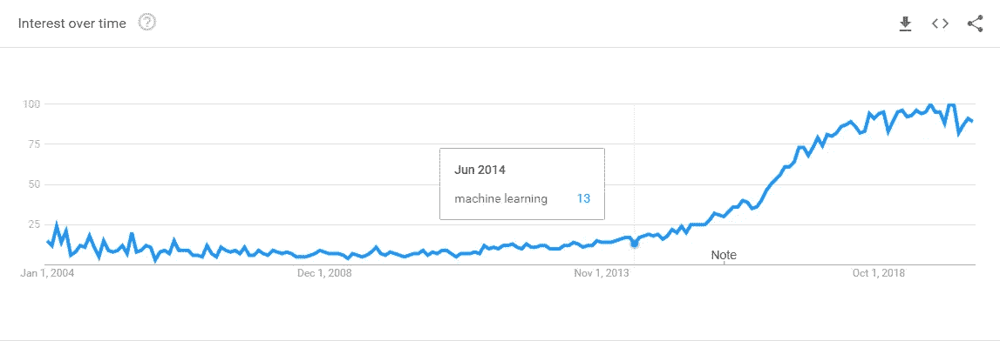
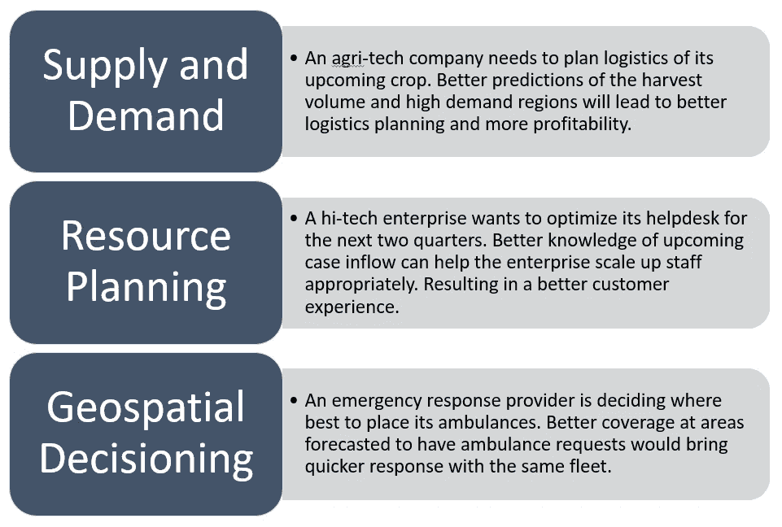

# 使用机器学习进行更准确的预测:聚焦亚马逊预测

> 原文：<https://blog.devgenius.io/more-accurate-predictions-with-machine-learning-spotlight-on-amazon-forecast-5119b2a81a69?source=collection_archive---------25----------------------->

伊恩·巴塔格利亚在 [Unsplash](/s/photos/servers?utm_source=unsplash&utm_medium=referral&utm_content=creditCopyText) 上拍摄的照片

自 2014 年以来，机器学习变得越来越受欢迎，今天被认为是人工智能的核心焦点。

机器学习搜索的趋势(谷歌趋势)

不到一年前，亚马逊推出了亚马逊预测——一个完全专注于预测问题的 AI/ML 工具。

# 为什么预测？

对于任何层次的商业战略和计划，更好地了解客户需求、供应商供应、交通等因素，可以做出更好的决策。

用例范围很广。以下是不同行业如何从更好的预测中受益的一些例子:

广泛的预测用例，从农业技术到高科技和医疗保健。

通过更准确地预测媒介(农业技术公司的作物供应、服务台的病例流入或救护车部署的高风险位置)，组织可以更好地部署可用资源，并在保持成本效益的同时提供更好的客户体验。

## 预测工具:Excel vs BI vs AI/ML

传统上，excel 表在预测中发挥了重要作用，商业智能工具增加了丰富的功能和可视化。这对于有限的时间序列数据和有限的 SKU 集合是很好的。然而，在规模上，这些方法是不够的(例如，想象一下如果 YouTube 使用 excel 或 BI 工具来确定向其百万用户显示哪个视频——每个用户都有自己的兴趣！).

然而，机器学习算法可以分析多个维度之间的关系，提供的预测准确率从 15%到 50%不等。

直到最近，机器学习一直被认为只属于专业数据科学家的领域。借助 Amazon Forecast 等工具，人工智能/人工智能正在成为当今知识工作者的可用工具。

## 零售场景

一家零售连锁店想知道它的每家商店都有哪些 SKU 库存。

一种简单的方法是查看历史销售数据并做出未来预测(简单的时间序列预测)。

但考虑一下预测质量对零售链的影响:卖不出去的 SKU 会浪费不动产，增加商店的成本。还有库存不足的 SKU 会缺货，降低店铺的盈利能力。因此，更准确的预测将导致更好的库存计划和更大的利润。

管理 10 家商店的 50 个 SKU 意味着 500 次预测。当您考虑可能影响销售的其他因素时(考虑相关的时间序列，如价格、促销、天气、星期几、季节性、特殊节日、营销活动、客流量)，500 个预测中的每一个都需要更大的努力来提高预测准确性。

人工智能/人工智能算法擅长寻找多维度的相关性。因此，训练神经网络并创建更精确的预测模型是可能的，并且可以扩展到更大的集合。

例如，DeepAR 算法被发现比大多数经典算法精确 15%,亚马逊预测工具声称预测精确 50%。

## 亚马逊预测

亚马逊预测提供了许多经典的机器学习算法，一个贝叶斯(概率)选项，以及建立在亚马逊研究的全球预测模型上的 DeepAR+。

Amazon Forecast 提供了通过查看训练数据集来自动选择最佳算法的能力，并可以帮助填充缺失的数据(后填充/前填充和中间填充)——这是真实世界数据集的常见问题，会影响训练质量。Amazon Forecast 还可以将数据聚合到一个固定的采样频率，并可以自动将数据分成多个训练测试集:接管机器学习的一些繁重工作。

需要为整个预测范围提供相关的时间序列数据(即，需要为预测的未来日期提供价格、客流量或任何其他相关数据)。许多数据集(例如天气)可以从其他来源接收。或者，可以在开始时对相关的时间序列数据进行单独的预测。

亚马逊预测可以从 AWS 云控制台启动。你上传数据集，选择模型(或者让 Amazon Forecast 来选择)并开始预测过程。可以使用命令行界面，该界面允许更多高级功能，如选择预测范围、缺失数据处理、设置采样频率等。

# 获取正确的数据

在与一家食品科技企业合作时，我最近遇到了一个请求，要求我使用经过清理的开发数据进行预测。任何熟悉 GIGO(垃圾输入-垃圾输出)数据科学原理的人都知道，虚拟数据只会给出虚拟结果。

出于这个原因，第一个原则是使用准确的数据集进行准确的预测。

至于有多少数据是足够的，还没有定论。根据经验，数据集应该分布在多个季节性事件和多个相关的时间序列事件上，以提供训练有素的 AI/ML 预测模型。

此外，您的相关时间序列数据必须涵盖整个预测范围(例如，应提供所有未来日期的价格、促销、营销支出和其他相关 SKU 数据)。请记住，我们预测的不是相关的时间序列数据，而是 SKU。

更多的相关时间序列数据将有助于改进您的预测模型。例如，您可能想要添加 5 分钟步行半径内的竞争卖家数量、员工数量、每个商店的面积。随着时间的推移，会发现更多相关的时间序列数据，这些数据可以改进预测(例如，实体商店的建设或流量模式、网站的服务器维护窗口、流量的 SEO 关键字排名等)。

特征数据也起着重要的作用(即与 SKU 相关的数据，如颜色、尺寸、物品类型、品牌等)。这将改善 SKU 的预测，并有助于“冷启动”预测(即预测没有历史信息的新 SKU /商店/产品的销售)。

# 后续步骤

正如我们所见，尽管我们考虑的主要是零售场景，但人工智能/人工智能实际上在所有领域都有应用。

下一次你在制定计划时，考虑一下你对未来需求的假设。鉴于当今数据湖中的企业数据，您也许能够利用 AI/ML 来验证您的假设。因此 AI/ML 可以帮助你建立一个更健壮的计划，减少意外。

考虑你的预测模型是动态的。随着时间的推移，随着更多相关时间序列的发现，可以进一步训练您的算法，并提供新的训练数据。

预测的准确性可以让你专注于更好的计划。把猜测工作留给机器。

***参考文献*** *:深度学习，桑德罗·斯坎斯。人工智能，沃尔夫冈·埃尔特尔。时间序列和预测—彼得·J·布罗克韦尔&理查德·A·戴维斯。时间序列预测原则——亚马逊预测(王渔洋等)。DeepAR:用自回归递归网络进行概率预测(David Salinas，Valentin Flunkert，Jan Gasthaus)。press.aboutamazon.com。aws.amazon.com*

***关于作者:*** *Saket Khanna 是 en quero(INC，2018 年排名 250 成长最快的组织)的技术项目经理。在过去，Saket 建立并退出了 Mealtango，这是一家盈利的食品科技创业公司。Saket 是一名技术爱好者，电子工程师，牛津大学商学院 MBA。*