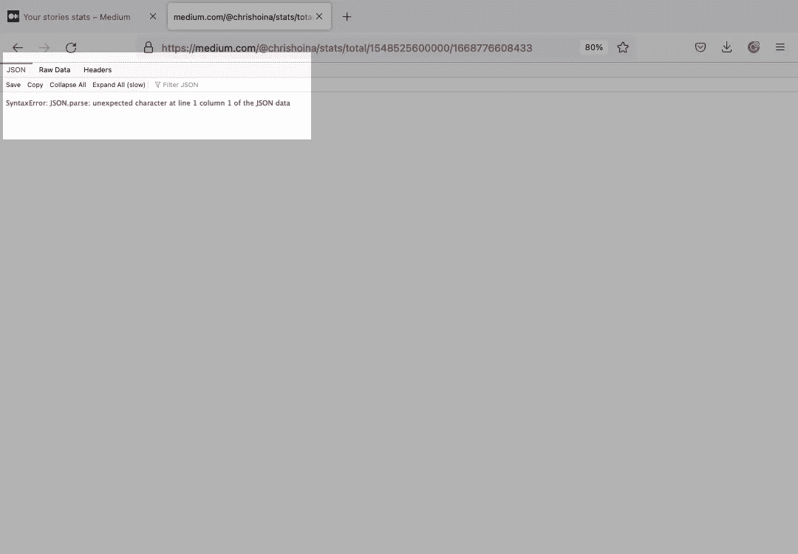
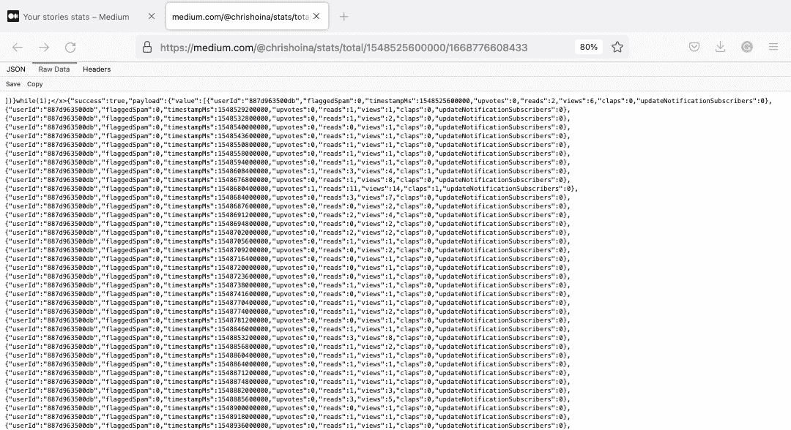
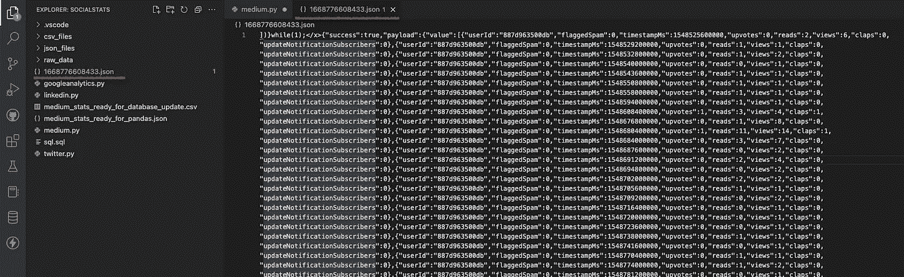
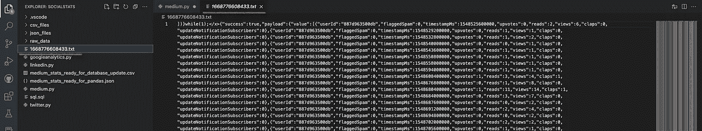
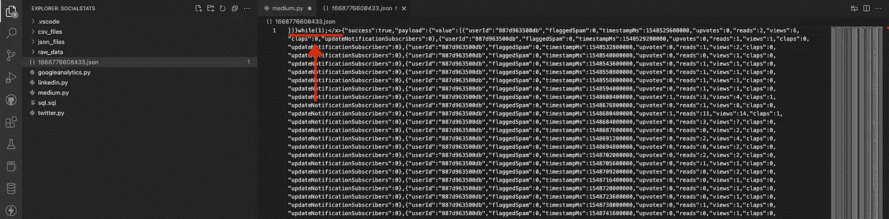
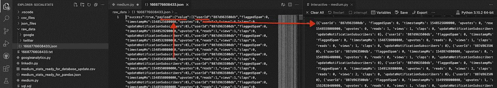
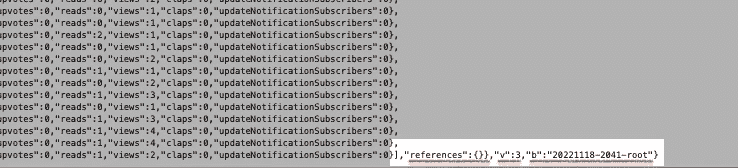
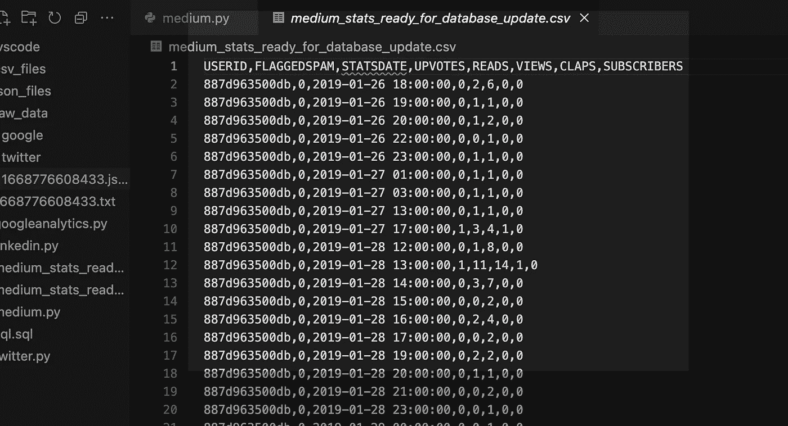
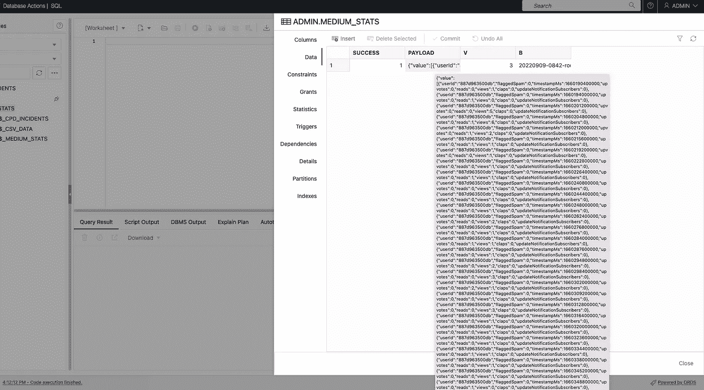
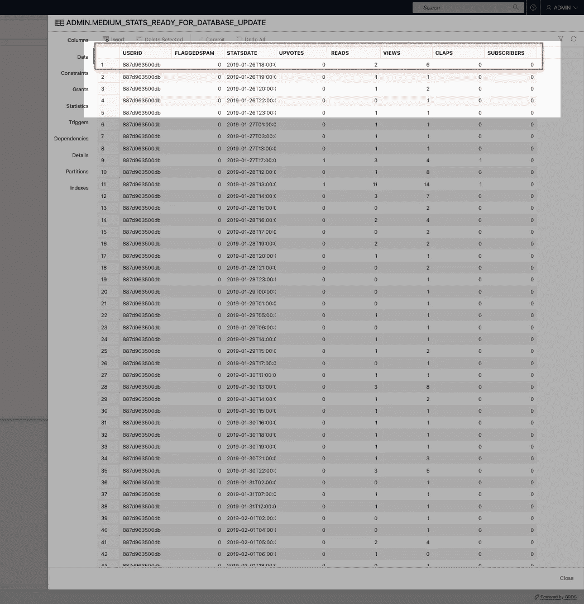

# Medium story stats、JSON、Python、Pandas 和 Oracle SQL Developer Web 带来更多乐趣

> 原文：<https://blog.devgenius.io/more-fun-with-medium-story-stats-json-python-pandas-and-oracle-sql-developer-web-e3f9f5c7a86e?source=collection_archive---------7----------------------->

没错；我又回来了，这是致力于与 Medium.com 故事统计的持续系列的另一部分。我在以前的一篇文章中首次介绍了这个话题。也许你看到了。如果没有，可以在这里找到[。](https://followthecoffee.com/fun-with-python-get-requests-medium-stats-and-the-oracle-autonomous-database/)

# 概述

我的最终目标是从我的中型账户中收集所有的故事统计数据，并将它们放入我的自治数据库中。我想练习一下我的 SQL，看看我是否能从数据中获得洞察力。不幸的是，收集这些数据很复杂。

一旦我知道在哪里可以找到这些故事统计数据，提取数据就变得轻而易举了。我必须破译我在 Medium REST API 中看到的东西(我想这有点棘手)。我的搜索主要是对耐心的锻炼(有*很多*的尝试和错误)。

我在之前的帖子上传了一个快速视频。但是我将把它嵌入到这里，这样您就可以看到我如何找到特定 JSON 有效负载的过程。

# 获取原始 JSON

找到那个 URL 后，我将这个 json 保存为一个. JSON 文件。下图显示了用 JSON 的其余部分捕获的 JavaScript 函数的残余部分。我不是 JavaScript 专家，所以我不知道这个函数是做什么的。但在我将它加载到我的自治数据库之前(我使用的是 OCI 自由层账户，如果你好奇，你可以在这里查看),它需要消失。



JSON 响应错误



更好的 JSON 演示

> **自述**
> 
> 我在这里指出一些看起来复杂和不必要的事情。请花时间阅读这一节，这样你就能更好地理解我的疯狂。
> 
> **首先:**是的，您可以手动删除与主要 JSON 有效负载一起保存的[大概] JavaScript(参见以上段落)。作为一个实践练习，我将展示如何用 Python 来做这件事。但是我也为未来的自动化留下了机会(因为它与清理数据有关)。
> 
> **其次:**说到熊猫数据框的步骤，当然，你可以在 Excel、Numbers 或 Sheets 中完成所有这些！同样，这里的想法是向您展示我如何在 Python 中清理和处理它。有时在 Excel、Numbers 和 Sheets 中做这样的事情是不可能的(在这里考虑企业安全性)。
> 
> **第三:**无可否认，日期时间转换是令人捧腹和费解的。*当然*，我可以在电子表格应用程序中这样做。这不是重点。我实际展示了这个功能，并为未来潜在的自动化做好了准备。
> 
> **第四:**我第一个承认 JSON > TXT > JSON > CSV 文件转换很滑稽。所以如果你有什么建议，在这里或者在我的 GitHub 知识库上留下评论(下面我会链接)，我会给你归属！

# 代码

用嵌入的注释在上下文中解释代码将是最有启发性的。

我已经尽可能按字面意义命名了代码中的所有内容。在生产中，这似乎不切实际；*然而，*代码到底在做什么是毫无疑问的！更加文字化对于调试和代码维护来说是理想的。

下面是整个代码块(所以 CTRL+C/CTRL+V 随心所欲😘).我仍然会把它分成几个独立的部分来回顾。

```
import csv
import json
import pandas as pd
import datetime
from pathlib import Path

# You'll first need to sign in to your account, then you can access this 
# URL without issues:
# https://medium.com/@chrishoina/stats/total/1548525600000/1668776608433
# NOTES:
# Replace the "@chrishoina" with your username
# The two numbers you see are Unix Epochs; you can modify those as 
# needed; in my case, I wanted to see the following:
# * 1548525600000 - At the time of this post, this seems to be
# whenever your first post was published or when
# you first created a Medium account. In this case, for me, this
# was Sat, Jan/26/2019, 6:00:00PM - GMT
# * 1665670606216 - You shouldn't need to change this since it will 
# just default to the current date.
# For the conversion, I an Epoch Converter tool I found 
# online: https://www.epochconverter.com/

# Step 1 - Convert this to a,(.txt) file

p = Path("/Users/choina/Documents/socialstats/1668776608433.json")
p.rename(p.with_suffix('.txt'))

# Step 2 - "read" in that text file, and remove those pesky
# characters/artifacts from position 0 through position 15.
# I'm only retaining the JSON payload from position 16 onward.

with open("/Users/choina/Documents/socialstats/1668776608433.txt", "r") as f:
  stats_in_text_file_format = f.read()

# This [16:] essentially means grabbing everything in this range. Since
# there is nothing after the colon; it will just default to the end (which is
# what I want in this case).

cleansed_stats_from_txt_file = stats_in_text_file_format[16:]
print(cleansed_stats_from_txt_file)

# This took me a day to figure out, but this text file needs to be encoded
# properly, so I can save it as a JSON file (which is about to happen). I
# always need to remember this, but I know that the json.dumps = dump
# string, which json.dump = dump object. There is a difference, I'm not
# the expert, but the docs were helpful.

json.dumps(cleansed_stats_from_txt_file)

# Step 3 - Here, I create a new file, then indicate we will "w"rite to it. 
# Here we take the progress from Step 2 and apply it here.

with open('medium_stats_ready_for_pandas.json', 'w') as f:
  f.write(cleansed_stats_from_txt_file)

# Step 4 - Onto Pandas! We've already imported the pandas library as "pd."
# We first create a data frame and name the columns. I kept the names
# very similar to avoid confusion. I feared that timestampMs might be a
# reserved word in Oracle DB or too close, so I renamed it.

df = pd.DataFrame(columns=['USERID', 'FLAGGEDSPAM', 'STATSDATE', 
'UPVOTES', 'READS', 'VIEWS', 'CLAPS', 'SUBSCRIBERS'])

with open("/Users/choina/Documents/socialstats/medium_stats_ready_for_pandas.json", "r") as f:
  data = json.load(f)
  data = data['payload']['value']
  print(data)

for i in range(0, len(data)):
  df.loc[i] = [data[i]['userId'], data[i]['flaggedSpam'],
  data[i]['timestampMs'], data[i]['upvotes'], data[i]['reads'], 
  data[i]['views'], data[i]['claps'], data[i]['updateNotificationSubscribers']]

df['STATSDATE'] = pd.to_datetime(df['STATSDATE'], unit="ms")
print(df.columns)

# Step 5 - use the Pandas' df.to_csv function and save the data frame as
# a CSV file

with open("medium_stats_ready_for_database_update.csv", "w") as f:
  df.to_csv(f, index=False, header=True)
```

我在这个脚本中使用了几个 Python 库:

[CSV](https://docs.python.org/3/library/csv.html)

[JSON](https://docs.python.org/3/library/json.html)

[熊猫](https://pandas.pydata.org/)(进口为“pd”)

[日期时间](https://docs.python.org/3/library/datetime.html)

Path(从 [Pathlib](https://docs.python.org/3/library/pathlib.html) 导入的文件路径库)

# 第一步

```
p = Path("/Users/choina/Documents/socialstats/1668776608433.json")
p.rename(p.with_suffix('.txt')
```

路径库允许您将文件的路径分配给“p”。从那以后，我改变了。json 文件扩展名为. txt 扩展名。

> 同样，我确信有更好的方法来做到这一点，所以如果你正在阅读，请在这里或我的 GitHub 知识库上留下评论，这样我就可以把它归功于你🙃。

这一步的前后看起来是这样的:



在之前的 JSON

**

*在之后的 TXT*

**这样一来，我需要删除文件中的 JavaScript“前缀”。我在第二步中这样做(我想得太多了，可能达到了收益递减)。我的方法很有效，我也可以将它用于其他应用程序！**

# **第二步:**

```
**# Step 2 - "read" in that text file, and remove those pesky
# characters/artifacts from position 0 through position 15\. Or in other
# words, you'll retain everything from position 16 onward because that's
# where the actual JSON payload is.

with open("/Users/choina/Documents/socialstats/1668776608433.txt", "r") as f:
  stats_in_text_file_format = f.read()

# This [16:] essentially means grabbing everything in this range. Since
# there is nothing after the colon; it will just default to the end (which is
# what I want in this case).

cleansed_stats_from_txt_file = stats_in_text_file_format[16:]
print(cleansed_stats_from_txt_file)

# This took me a day to figure out, but this text file needs to be
# appropriately encoded to save as a JSON file (which is about to
# happen). I always forget the difference between "dump" and "dumps";
# json.dumps = dump string, whereas json.dump = dump object. There is
# a difference, I'm not the expert, but the docs were helpful (you should
# read them).

json.dumps(cleansed_stats_from_txt_file)**
```

****

**我需要从中等 JSON 响应中移除这些残余**

**虽然这最初是作为 JSON 有效负载出现的，但前 0-15 个字符必须删除。**

> ****完整声明:**当它还是一个 JSON 文件时，我不知道如何删除它，所以我把它转换成了文本文件(这是我唯一能找到的方法)。**

**我将位置 16 捕获到无穷远处(或者文件的结尾，无论哪个先出现)，然后将文件重新编码为 JSON(我将此解释为“目标机器可以读取并理解为 JSON 的东西”)。**

> ****开季:** CompSci 乡亲们，如果我说错了，请在评论里烤我。**

# **第三步**

```
**# Step 3 - I create a new file, then I'll "w"rite to it. I took the result
# from Step 2 and applied it here.

with open('medium_stats_ready_for_pandas.json', 'w') as f:
  f.write(cleansed_stats_from_txt_file)**
```

**我仍然处在这个旅程的数据争论阶段，但是我已经接近尾声了。我将创建一个新的 JSON 文件，获取(新编码的)文本文件中我需要的部分，然后将它们保存为新的 JSON 文件。**

# **第四步**

```
**# Step 4 - Onto Pandas! We've already imported the pandas library as "pd"
# I first create a data frame and name the columns. I kept the names
# similar to avoid confusion. I feared that timestampMs might be a
# reserved word in Oracle DB or too close, so I renamed it.

df = pd.DataFrame(columns=['USERID', 'FLAGGEDSPAM', 'STATSDATE', 
'UPVOTES', 'READS', 'VIEWS', 'CLAPS', 'SUBSCRIBERS'])

with open("/Users/choina/Documents/socialstats/medium_stats_ready_for_pandas.json", "r") as f:
  data = json.load(f)
  data = data['payload']['value']
  print(data)

for i in range(0, len(data)):
  df.loc[i] = [data[i]['userId'], data[i]['flaggedSpam'], 
  data[i]['timestampMs'], data[i]['upvotes'],
  data[i]['reads'], data[i]['views'], data[i]['claps'], 
  data[i]['updateNotificationSubscribers']]

df['STATSDATE'] = pd.to_datetime(df['STATSDATE'], unit="ms")
print(df.columns)**
```

**我不会教熊猫(老实说，你做 ***而不是*** 想让我教你熊猫)，但我会尽力解释我的过程。我首先创建了数据框的结构(在本例中是“df”)。然后，我命名了所有的列标题(这些可以是任何东西，但是我把它们保持得非常接近原始 JSON 有效负载中的标题)。**

**然后，我打开新保存的 JSON 文件，提取我需要的内容。**

> ****注:**我在这里卡了大概一天半，我来解释一下这部分。**

**数据['有效载荷']['值']指的是这个特定{key: value}对中的键和值。这种方法让我抓住了“价值”的所有价值。这张图片解释了我的开始(左边)和结束(右边)。**

****

**之前和之后的 `JSON` 有效负载**

**您会注意到一个{"success": true}键:值对。通过这种方法，我在 JSON 有效载荷的末尾去掉了这一对，并去掉了其他的。**

****

**清除大量垃圾**

**我不能因为*有机地*想出了下一部分而邀功；YouTube 上的 Kidson 是我的救世主。我会看这个视频来完全理解这段代码中发生了什么:**

```
**for i in range(0, len(data)):
  df.loc[i] = [data[i]['userId'], data[i]['flaggedSpam'], 
  data[i]['timestampMs'], data[i]['upvotes'],data[i]['reads'], 
  data[i]['views'], data[i]['claps'], data[i]['updateNotificationSubscribers']]**
```

**简而言之，您从 JSON 文件(如上)的列中获取值，然后将它们放入这段代码中指定的列位置:**

```
**df = pd.DataFrame(columns=['USERID', 'FLAGGEDSPAM', 'STATSDATE', 
'UPVOTES', 'READS', 'VIEWS', 'CLAPS', 'SUBSCRIBERS'])**
```

**例如，JSON 文件中的“USERID”值将全部放入 Pandas 数据框中的“userId”列。对于其他值和相关联的(Pandas 数据框)列，也会发生同样的事情。**

**最后，我用 Datetime 库将日期(如果您还记得的话，在这个纪元格式中仍然是*还是*)更改为一个更友好的、可读的日期。使用此代码:**

```
**df['STATSDATE'] = pd.to_datetime(df['STATSDATE'], unit="ms")**
```

# **第五步**

```
**with open("medium_stats_ready_for_database_update.csv", "w") as f:
  df.to_csv(f, index=False, header=True)**
```

**我现在在最后冲刺阶段。我把我在熊猫里做的所有东西都存成 CSV 文件。我想保留标题，但放弃任何索引。干净的 CSV 文件将如下所示:**

****

**干净整洁的 CSV，可通过 SQL Developer Web 加载数据**

# **第六步**

**最后，我登录到 SQL Developer Web 并点击 new Data Load 按钮(在 [Oracle REST 数据服务](https://www.oracle.com/database/technologies/appdev/rest.html)版本 22.3 中引入)将 CSV 文件上传到一个新表中。自治数据库自动推断列名和数据类型。我稍微修改了“statsdate”一栏(老实说，我本来可以不去管它，但它很容易修改)。**

# **之前和之后**

**就是这样！一旦上传，我可以比较我以前做的和我最近完成的。而且两种方式都是正确的。例如，根据您的需求，您可以将 JSON 有效负载保留为 CLOB(如第一幅图所示)或更传统的表格格式(如第二幅图所示)。**

****

**作为 CLOB 的中等统计**

****

# **包裹**

**如果你已经做到了这一步，恭喜你！现在，您应该有两种方法将中等统计数据存储在一个表中(位于 Oracle 自治数据库中),分别是:**

*   **一个小丑**
*   **一张桌子**

**如果你想回顾代码，你可以在这里找到它。**

**下次再见，🫠，快乐查询。**

# **别忘了跟着**

**如果您还没有分享或关注，请务必分享或关注:**

*   **[推特](https://twitter.com/chrishoina)**
*   **[我的博客](http://followthecoffee.com)**
*   **[YouTube](https://www.youtube.com/user/chrishoina/)**
*   **[抖音](https://www.tiktok.com/@chrishoina)**
*   **[GitHub](https://github.com/chrishoina)**
*   **[领英](https://www.linkedin.com/in/chrishoina/)**
*   **[乳齿象](https://mastodon.technology/web/@chrishoina)**
*   **[不和谐](https://discord.gg/seYeAPgq9E)**
*   **[堆栈溢出](https://stackoverflow.com/users/9552864/chris-hoina)**