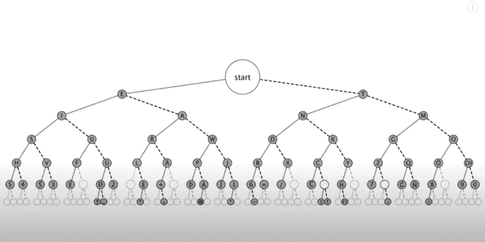
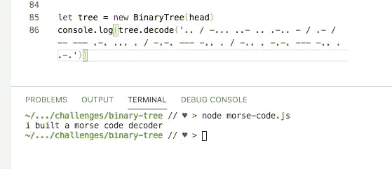

# 莫尔斯电码、二叉树和巴德尔·迈因霍夫现象

> 原文：<https://blog.devgenius.io/morse-code-binary-trees-and-the-baader-meinhof-phenomenon-c0aa27876369?source=collection_archive---------0----------------------->


前几天晚上，我看了两个我非常喜欢的 Youtube 频道的视频。第一个是汤姆·斯科特关于为什么本初子午线不正好在 0 度的视频。我注意到他恰好在拍摄我所有社交账户(包括 medium)的个人资料照片的同一个地方。这是一个有趣的巧合，而且很高兴知道我在不知道的情况下参观了本初子午线。

我看的下一个视频是我喜欢的另一个 Youtube 频道 Vsauce。这是在[莫尔斯电码](https://youtu.be/HY_OIwideLg)上。在这个视频中还有另一个有趣的巧合。在最开始，他定义了什么是回文，并用“赛车”作为例子。他的解释几乎一字不差地重复了我在之前关于[的博客文章中描述的解决算法的两个部分](https://medium.com/dev-genius/the-two-parts-of-solving-an-algorithm-ef95d3a9b811)。看到我刚刚研究和写的东西，很快又冒出来，感觉很奇怪。


我继续看他的视频，他解释了一些关于莫尔斯电码的有趣的历史和事实。在莫尔斯电码中，每个字符都是由点组成的。和破折号'-'。他解释说，它的开发是为了让莫尔斯电码中最常见的字符具有最简单或最短的构成。

后来，来自 Vsauce 的 Michael 介绍了一些 nemonic 设备，可以帮助您学习或理解莫尔斯电码。正如他所描述的，其中一个设备是“一个看起来像流程图的东西”。这是它看起来的样子。



这不仅仅是一个流程图，这是一个二叉树。它是节点的连接，每个节点有一个或两个子节点，并存储一个值。真是太巧了，我正在为我的技术挑战学习这种数据结构。原来这种巧合有一个术语。它被称为巴德尔·迈因霍夫现象，它描述了这样一种情况，你第一次遇到某样东西，然后很快又以一种不相关的方式再次看到它。

这个二叉树的有趣之处在于，给定节点左边的每一个值都会在莫尔斯电码中相对于其父节点多加一个点，右边的每一个值都会多加一个破折号。这意味着我们可以编写一个函数，接受任何有效的莫尔斯电码字符串，对其进行解码，并返回解码后的消息。

```
decode(morse){
        morse = morse.split(' / ') //['... .- --', '... .. .']
        let message = ''
        for(let word of morse){
            let chars = word.split(' ') //['...', '.-', '--']
            let decoded = ''
            for(let char in chars){   // '...'  
                let node = this.root
                for(let symb in chars[char]){ // '.' '.' '.'
                    if(chars[char][symb] === "-") node = node.right
                    else if(chars[char][symb] === '.') 
                        node = node.left
                    else console.log('error')
                }
                decoded = decoded + node.data
            }
            message = message + decoded + " "
        }
        return message
    }
```

有了这个二叉树类中的函数，我们就可以在一个有效的莫尔斯电码字符串上调用 tree.decode 并返回它的英文对应物。当我们调用 decode 时，我们将字符串按单词分开，并定义一个变量来存储返回的解码消息。然后我们遍历单词数组。然后，我们用空格将每个单词分开，这允许我们为消息中的每个单词准备一个字符数组。接下来，我们定义一个变量来保存我们正在迭代的单词。然后，我们抓住我们的莫尔斯树的根，并通过我们的信的每个莫尔斯符号迭代。如果符号是一个破折号，我们移动到我们右边的节点，如果它是一个点，我们移动到左边。在我们完成迭代之后，我们知道节点的值就是我们的符号所代表的字符。我们将每个节点数据添加到我们的 word 变量中。完成字母迭代后，我们将完成的单词和一个空格添加到消息变量中。最后，我们返回解码后的消息。



通过实现这个函数，我们可以看到 Vsauce 是对的，这棵树解码了莫尔斯码，我们可以用我们对树及其遍历的理解来解码。感谢您的阅读，我希望您和我一样对此感兴趣！