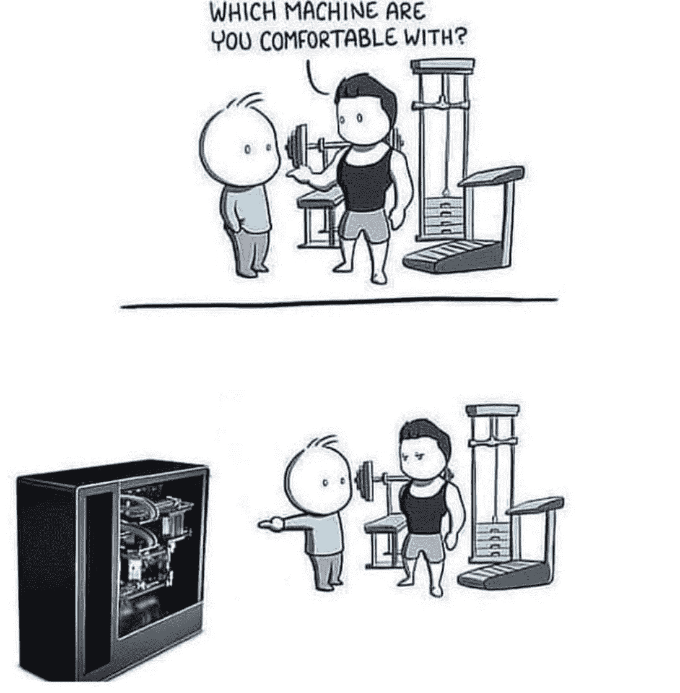

# 大多数上瘾的笑声是以给程序员制造的迷因的形式出现的

> 原文：<https://blog.devgenius.io/most-addicted-laughter-dose-in-form-of-memes-made-for-programmers-770a3b36b6f0?source=collection_archive---------4----------------------->

## 编程笑话的剂量

亚历山大·格雷在 [Unsplash](https://unsplash.com?utm_source=medium&utm_medium=referral) 上拍摄的照片

你可能已经听过很多次了，喝更好的咖啡可以让你一整天都很美好。但是，如果某件事给你带来了笑容，你当然可以说… **我感觉到了…或者我很喜欢…**

今天，我试图整理一些在互联网和脸书上发现的让我开心的笑话/迷因。

> *开始吧…准备好改变你的心情吧…*

# 当我们需要 80%的覆盖率来提交 PR 而没有时间的时候…

图片鸣谢:[https://programmerhumor.io/](https://programmerhumor.io/)

# 根据环境激活的隐藏宝石…

图片鸣谢:[https://programmerhumor.io/](https://programmerhumor.io/)

# 向任何学生解释的最佳例子…

图片来源:monkeyuser.com

# 万圣节时间狩猎…

图片鸣谢:[https://programmerhumor.io/](https://programmerhumor.io/)

# 当您在代码中避免警告时..

图片鸣谢:[https://programmerhumor.io/](https://programmerhumor.io/)

# 他们只允许你提问..

图片鸣谢:[https://www.reddit.com/r/ProgrammerHumor/](https://www.reddit.com/r/ProgrammerHumor/)

# 我总是觉得好看…

图片鸣谢:[https://www.reddit.com/r/ProgrammerHumor/](https://www.reddit.com/r/ProgrammerHumor/)

# 当戴夫做家务时…

图片鸣谢:[https://programmerhumor.io/](https://programmerhumor.io/)

# 火焰增强器…

图片鸣谢:图片鸣谢:[https://www.reddit.com/r/ProgrammerHumor/](https://www.reddit.com/r/ProgrammerHumor/)

# 额外剂量:

# 通常发生在我周五工作并为客户做演示的时候…

[https://www . Facebook . com/programmers create life/photos/a . 241809332534619/3750971258285058/](https://www.facebook.com/ProgrammersCreateLife/photos/a.241809332534619/3750971258285058/)

# 有时初级开发人员知道得更多…

[https://www . Facebook . com/dzone Inc/photos/a . 336758034711/10159280091324712](https://www.facebook.com/DZoneInc/photos/a.336758034711/10159280091324712)

# 我根据项目购买课程，当我按照这样的指示结束时…

[https://www . Facebook . com/JavaScript js/photos/a . 1387402908063976/2172042662933326/](https://www.facebook.com/javascriptJS/photos/a.1387402908063976/2172042662933326/)

# 当我试图修复一个让事情变得更糟的小错误时…

[https://www . quora . com/What-is-the-best-programming-comic-strips](https://www.quora.com/What-are-the-best-programming-comic-strips)

# 总有一些隐藏的错误..不要打扰他们…

[https://www . Facebook . com/programmers create life/photos/a . 241809332534619/3817315068317343/](https://www.facebook.com/ProgrammersCreateLife/photos/a.241809332534619/3817315068317343/)

# 当我的教练问我最喜欢哪台机器时…

[https://www . Facebook . com/JavaScript js/photos/1833542923449970](https://www.facebook.com/javascriptJS/photos/1833542923449970)

# 星期五提前离开…

# 永远不要试图扰乱工作代码…

[https://www . Facebook . com/JavaScript js/photos/1602108066593458](https://www.facebook.com/javascriptJS/photos/1602108066593458)

# 随着太多框架的出现…

[https://www . Facebook . com/yuva . Krishna . memes/photos/a . 105527467815845/29995221702401/](https://www.facebook.com/yuva.krishna.memes/photos/a.105527467815845/299995221702401/)

# 当我的学长让我在代码中添加注释时…

[https://www . Facebook . com/JavaScript js/photos/a . 1387402908063976/2170533493084243/](https://www.facebook.com/javascriptJS/photos/a.1387402908063976/2170533493084243/)

# 添加所有东西，这样它就能在自动工具中捕捉到…

[https://www . Reddit . com/r/programmer humor/comments/mnbgz 1/knows _ every _ programming _ language/](https://www.reddit.com/r/ProgrammerHumor/comments/mnbgz1/knows_every_programming_language/)

# 我最好的敌人是…

[https://www.facebook.com/DZoneInc/photos/10158920521754712](https://www.facebook.com/DZoneInc/photos/10158920521754712)