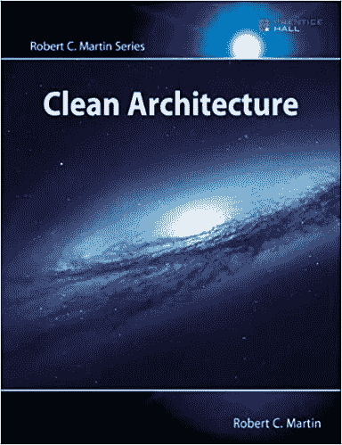

# 最常见的 Java/JEE 面试问题(第二部分)

> 原文：<https://blog.devgenius.io/most-commonly-asked-java-jee-interview-questions-part-2-b45a297c26c9?source=collection_archive---------9----------------------->

Artem Maltsev 在 [Unsplash](https://unsplash.com?utm_source=medium&utm_medium=referral) 上拍摄的照片

在这篇文章中，我将讨论 Java/JEE 面试中常见问题的下一部分。

在跳到这个列表之前，我想说的是，技术好固然很好，但要想成功，你还必须擅长沟通。

成为一个好的沟通者会让你的面试变得更容易。

有一个工具可以帮助你写一封好的求职信和电子邮件

[**Grammarly 的 AI 辅助写作助手**](https://www.jdoqocy.com/click-100203662-11275739) **(附属链接)**

那么，让我们回到我们的列表。

## 什么是瘦客户机？

一个 **J2EE** 应用**客户端**运行在一个**客户端**机器上，可以提供比标记语言所能提供的更丰富的用户界面。

应用程序**客户端**通常从服务器下载，但是也可以安装在**客户端**机器上。

## 区分。耳朵，。罐子和。战争档案

**一)。jar 文件**
这些文件是用。jar 扩展。

的。jar 文件包含库、资源和附件文件，就像属性文件一样。

**b)。战争档案**

这些文件在。战争延期。

的。war 文件包含 jsp、html、javascript 和其他开发 web 应用程序所必需的文件。

**c)。ear 文件**

EAR 是 Java EE 使用的一种文件格式，用于将一个或多个模块打包到一个归档文件中，以便将各种模块同时一致地部署到应用服务器上。

## **27)JSP 标签有哪些？**

在 JSP 中，标签可以分为 4 种不同的类型。
指令、声明、脚本和表达式

## 什么是 JSP 指令？

a)页面指令
b)包含指令
c)标记库指令

## 2 **9)什么是 Struts？**

Struts 框架是一种用于设计大型应用程序的模型-视图-控制器(MVC)架构。

它是 Java Servlets、JSP、定制标记和消息的组合。

Struts 基于已发布的标准和成熟的设计模式，帮助为应用程序创建可扩展的开发环境。

许多应用程序中的模型将系统的内部状态表示为一个或多个 JavaBeans 的集合。

*视图*通常是使用 JavaServer Pages (JSP)技术构建的。

控制器主要负责接收来自客户机的请求，并为适当的视图组件生成下一阶段的用户界面。

框架中控制器的主要组件是 ActionServlet 类的 servlet。

这个 servlet 通过定义一组 ActionMappings 来配置。

## **30)什么是动作错误？**

封装已发现的任何验证错误的 ActionErrors 对象。

如果没有发现错误，则返回 null 或没有记录错误消息的 ActionErrors 对象。

默认实现试图转发到此方法的 HTTP 版本。

保存请求参数映射和请求，如果验证失败，则返回一组验证错误；空集或空值

## **31)什么是动作形式？**

ActionForm 是关联一个或多个 ActionMappings 的 Java bean。

当扩展 org . Apache . struts . action . actionform 类时，java bean 成为 FormBean。

ActionForm 对象在服务器端自动填充，数据由客户端从 UI 输入。ActionForm 维护 web 应用程序的会话状态。

## 什么是动作映射？

**ActionMapping** 表示 **ActionServlet** 知道的关于特定请求到特定
**Action** 类的实例的映射的信息。

将 ***映射*** 传递给 **Action** 类的 ***execute()*** 方法，从而可以直接访问这些信息。

## **33)struts 上的 MVC 是什么？**

**MVC** 站模型-视图-控制器。
**模型**:许多应用中的模型将系统的内部状态表示为一个或多个 JavaBeans 的集合。
**视图**:*视图*通常使用 JavaServer Pages (JSP)技术构建。
**控制器**:控制器主要负责接收来自客户端的请求，并为适当的视图组件生成下一阶段的用户界面。

框架中控制器的主要组件是 ActionServlet 类的 servlet。

这个 servlet 通过定义一组 ActionMappings 来配置。

## **34)春天有哪些不同的模块？**

spring 中有七个核心模块:

1-核心容器模块
2- O/R 映射模块(对象/关系)
3- DAO 模块
4-应用上下文模块
5-面向方面编程
6- Web 模块
7- MVC 模块

## 什么是春天？

Spring 是一个用于开发企业应用程序的轻量级开源框架，它解决了企业应用程序开发的复杂性，也为 J2EE 应用程序开发提供了一个内聚的框架。

它主要基于 IOC(控制反转)或 DI(依赖注入)设计模式。

## 36**ActionServlet 和 RequestProcessor 的功能？**

接收 HttpServletRequest 请求

从请求参数中填充 JavaBean】在网页上显示响应问题
内容类型问题处理
提供扩展点

## **37) ActionServlet、RequestProcessor 和 Action 类是**的组件

控制器

## 38**Spring 的默认作用域是什么？**

单身。

## 使用弹簧有什么好处？

基于 Pojo 的编程支持重用组件。
提高生产力，进而降低开发成本。
依赖注入可以用来提高可测试性。
Spring 需要企业服务，不需要昂贵的应用服务器。
减少代码中的耦合，提高可维护性。

## **40)Spring 框架有什么好处？**

轻质容器。

不需要从属性文件中读取应用程序代码。

单元测试对象的创建是懒惰的，这要容易得多。

Spring 的配置管理服务可以用于任何架构层，任何运行时环境

什么是 servlet？
Servlet 是一个服务器端组件，为开发服务器端程序提供了强大的机制。

Servlet 是独立于平台的服务器，并且 servlet 是为各种协议设计的。

最常用的 HTTP 协议。

Servlet 使用 java 包 javax.servlet，javax . servlet . http . http servlet request，javax . servlet . http . http servlet response，javax . servlet . http session 中的类。

所有 Servlet 都必须实现 Servlet 接口，它定义了生命周期方法。

## **42) Servlet 是不是纯 java 对象？**

是的，纯 java 对象。

## servlet 生命周期有哪些阶段？

servlet 的生命周期由以下阶段组成:
Servlet 类加载
Servlet 实例化
init 方法
请求处理(调用服务方法)
从服务中移除(调用销毁方法)

## 所有 Servlets 都必须实现什么？

Servlet 接口必须由所有 Servlet 实现

## 结论:

我希望这篇文章能让你深入了解 JAVA/JEE 面试的问题和答案。

上面给出的回答将真正丰富你的知识，增加你对 JAVA/JEE 编程的理解。

不要忘记沟通在招聘过程中起着很大的作用。

在把你的文章发给你未来的雇主之前，确保使用 Grammarly 的人工智能写作助手 **来修改它们。**

如果你觉得这个有用，点击那个👏**按钮:)**

**奖金:**

通过应用软件架构的通用规则，您可以在任何软件系统的整个生命周期中极大地提高开发人员的生产率。

现在，基于他的畅销书 *Clean Code* 和 *The Clean Coder 的成功，*传奇软件工匠 Robert c . Martin(“Bob 叔叔”)揭示了这些规则并帮助你应用它们。

使用以下链接获取您的副本:

[**【干净的架构:软件结构和设计的工匠指南(Robert C. Martin 系列)**](https://amzn.to/35etgMt) (附属链接)

一些您可能感兴趣的相关文章:

[1-最常见的 Java/JEE 面试问题(第一部分)](https://selcote.com/2020/11/12/most-commonly-asked-java-jee-interview-questions-part-1/)

2-OOP 现在是计算机科学的基础

[有史以来最好的 3- 6 名程序员](https://selcote.com/2020/10/27/6-best-programmers-of-all-time/)

[4-未来编程最有前途的领域](https://selcote.com/2020/10/22/the-most-promising-fields-for-programming-in-the-future/)

[5-网络开发中最常用的 5 种语言](https://selcote.com/2020/10/20/the-5-most-used-languages-for-web-development/)

[6-提高你编程技能水平的最佳方法](https://selcote.com/2020/10/16/the-best-way-to-improve-your-programming-skill-level/)

[7-推荐初学者先学的编程语言](https://selcote.com/2020/10/13/recommended-programming-language-for-beginner-to-learn-first/)

与我联系:[博客](https://selcote.com/)， [Youtube](https://www.youtube.com/channel/UCU_LhClyNOtEQw7R0q9ovoQ?view_as=subscriber) ，[脸书](https://www.facebook.com/zelakioui)，[推特](https://twitter.com/zelakioui)

来源:[selcote.com](https://selcote.com/2020/11/16/most-commonly-asked-java-jee-interview-questions-part-2/)