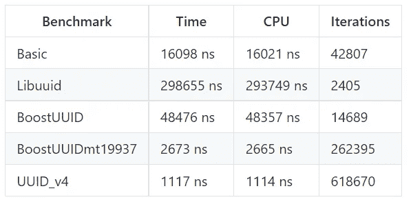
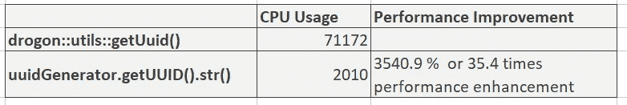

# 在 C++中生成 uuid 的最有效方法

> 原文：<https://blog.devgenius.io/most-efficient-way-of-generating-uuid-in-c-a10242a77946?source=collection_archive---------0----------------------->


由 [Unsplash](https://unsplash.com/s/photos/identity-card?utm_source=unsplash&utm_medium=referral&utm_content=creditCopyText) 上的 [CardMapr.nl](https://unsplash.com/@cardmapr?utm_source=unsplash&utm_medium=referral&utm_content=creditCopyText) 拍摄的照片

最近，我被分配了一项任务，寻找提高应用程序函数路径效率的方法。我使用 Vallgrind 宏来计算函数的 CPU 周期。我们最初在实现中使用 drogon HTTP 应用框架的 getUUID 函数。

在我的侧写过程中，我发现

```
[drogon::utils::getUuid()](https://drogon.docsforge.com/master/api/drogon/utils/getUuid/)
```

消耗了调用该特定方法的函数的 50%以上的 CPU。我去谷歌搜索生成 UUID 的更好方法，发现有许多其他开源库在做同样的工作，并声称它们比其他库更有效。我发现了这个开源库，它的基准测试结果对我来说很有希望。这个库被称为 [uuid_v4](https://github.com/crashoz/uuid_v4) 。该库正在用以下其他 uuid 生成方法进行基准测试。



git 库中也提到过，这个库用伪随机数生成 UUIDs，由真(硬件)随机数作为种子。这是*而不是*一种生成 UUIDs 的加密安全方式。这是它速度快的一个主要原因。但是尽管如此，如果有人的目标是提高性能，这是值得一试。

看着 github 的结果，我决定用我们自己当前的实现对它进行基准测试，我发现当用 Valgrind 的宏计算它时，这个特殊的函数比 drogon::utils::getUuid()快 35 倍。



以下代码片段来自新库中:

```
#include "uuid_v4"UUID::UUIDGenerator<std::mt19937_64> uuidGenerator;
UUID::UUID uuid = uuidGenerator.getUUID();
std::string s = uuid.str();
```

要了解如何实现这个库，你可以访问 git 页面[这里](https://github.com/crashoz/uuid_v4)。如果在执行中有任何困难，留下评论。

# 结论:

如上所述，从函数库本身和 Valgrind 的分析工具的基准测试结果来看，我可以自信地说，如果你的目标是提高应用程序的效率，那么试试这个函数库并分享你的结果。通过从 drogon 的 getUUID 迁移到 uuid_v4 的 getUUId，我们的整体端到端功能在 CPU 使用方面的效率提高了三倍。