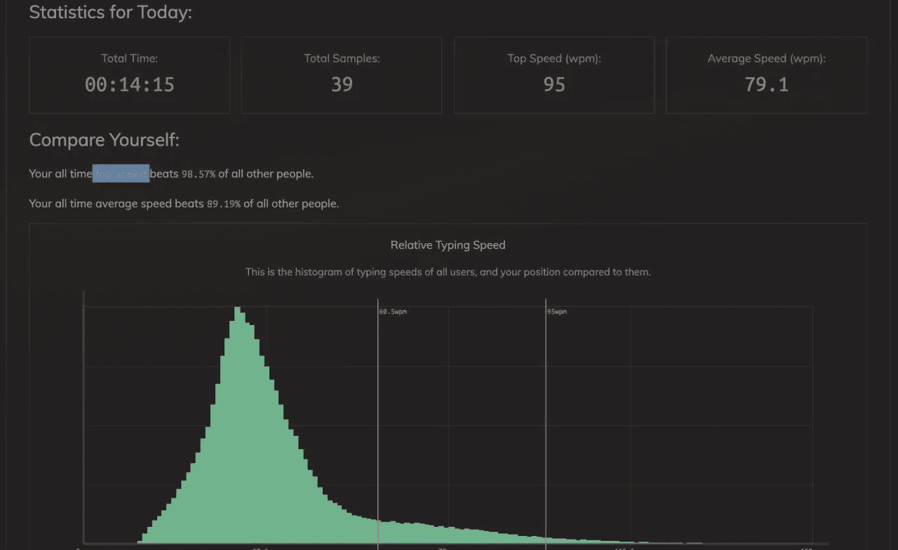

# 作为软件开发人员最重要的技能

> 原文：<https://blog.devgenius.io/most-important-skill-as-software-developer-9609de00350e?source=collection_archive---------4----------------------->

了解战场上你的武器库工具

作为软件开发人员，我们大多数人都试图学习最华丽的框架、发布最多职位信息的技术、强大的框架，用少量代码来提高我们的工作效率，但还有一件事对开发人员的工作效率非常重要。

触摸打字是我职业生涯中学到的最好的东西之一，它帮助我做和写很多东西比我的同事更快，他们可能比我知道得更多。

给定一个我们必须编码的任务，我们大部分时间不能谷歌，有时如果你的算法游戏对你不利，打字速度经常是我在我的同事中看到的瓶颈。

它应该很好地体现了忍者使用的工具，这包括知道快捷键以及使用他喜欢的键盘。我见过做图形设计的人飞过他们的编辑软件，因为他们牢牢地抓住了键盘快捷键。

这些是我从 keybr 得到的统计数据，要达到一个水平需要一定的时间，在使用 qwerty 风格的键盘时，有一个应该遵循的技巧。

有几种方法可以学习如何触摸打字…

# 我推荐的来源

 [## TypeRacer -全球打字比赛

### 提高您的打字速度，同时与他人比赛您必须在浏览器中启用 Javascript，以便…

play.typeracer.com](https://play.typeracer.com/)  [## keybr.com-打字课

### 参加打字速度测试，学习打字速度更快，更少的错误与这个免费的在线打字导师。的…

www.keybr.com](https://www.keybr.com/) 

除了知道一旦你熟悉了这种技术后如何快速书写之外，我建议你知道如何使用最适合你的 IDE。VS CODE 是我最喜欢的 IDE，我每天都在日常工作中使用它。这肯定会给你一个优势，不仅在你的工作中，而且在你的副业中。

如果你想更上一层楼，一定要回到基础，并保持强大。

您可以在这里访问我关于 VS 代码生产率的文章

【https://blog.devgenius.io/bulletproof-vscode-f9bfbe67c0fe 号

编码愉快，敬请关注。