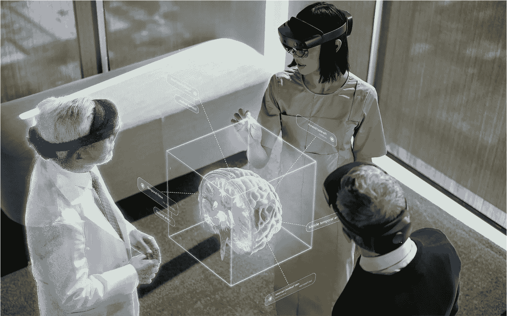
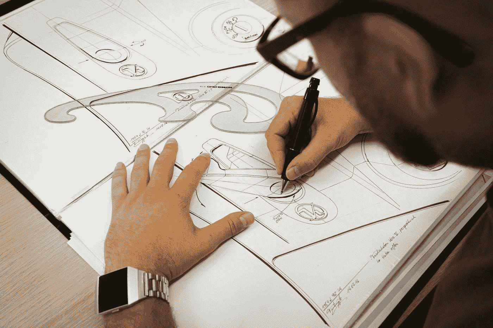

# 2022 年最受欢迎的创造性技术职业

> 原文：<https://blog.devgenius.io/most-in-demand-creative-tech-careers-in-2022-ffeeb149b317?source=collection_archive---------4----------------------->

## 你打算探索哪一个？

马文·迈耶在 [Unsplash](https://unsplash.com?utm_source=medium&utm_medium=referral) 上的照片

你愿意在创意科技领域开始你的职业生涯吗？在这个快节奏的世界里，技术不断发展，理所当然地重塑着我们的环境。你有机会通过科技探索自己的创造力，想象自己作为变革者受到赞赏的目光。我们将讨论创意技术领域最受欢迎的职业选择。

你可能会问什么是“创造性技术”？利用不同的软件或图形引擎，描绘数字艺术或设计并将其可视化的领域被认为是创造性技术。我们将深入探讨以下只适合你的职业选择。

## **1。元宇宙开发商:**

图片来源:[微软](https://docs.microsoft.com/en-us/mesh/overview)

元宇宙是一个将现实和数字生活结合在一起的概念。虽然处于初始阶段，但它承诺的潜在影响将是革命性的。随着扩展现实(XR)、区块链和人工智能(AI)的整合，数字体验的消费将经历一场重大变革。

要想在科技行业重整你的职业生涯，元宇宙就是未来。虽然脸书已经接受了它，并将其更名为 Meta，但许多其他公司也在投资它，例如 Epic Games。如果你渴望在科技世界中展现你的创造力，你有能力通过模拟、游戏和应用程序创建一个数字化的互动世界，将世界各地的人们联系起来。

由于元宇宙需要一个有技能和经验的人，它将支付一大笔钱，而年薪还没有预测。从好的方面来看，据《太阳报》报道，作为 Roblox 的一名元宇宙员工，你每年可以获得高达 43 万美元的薪酬，这是一笔巨款。虽然，元宇宙开发人员需要编程技能，必须熟悉 UI/UX 开发，了解扩展现实(XR)和 XR SDKs 等技术。这些技术方面需要相当长的时间来掌握，因此，对于一个元宇宙开发商来说，高薪绝对是合理的。

随着我们在世界上的发展，元宇宙将对我们的生活产生更大的影响。因此，元宇宙开发人员的职业生涯就像听起来一样有利可图和充满冒险。探索这个充满希望和潜力的科技网站不仅会让你变得大胆，还会让你兴奋地学习更多，并乐于学习新事物。

## **2。增强现实(AR)开发者:**

[XR Expo](https://unsplash.com/@xrexpo?utm_source=medium&utm_medium=referral) 在 [Unsplash](https://unsplash.com?utm_source=medium&utm_medium=referral) 上拍摄的照片

增强现实(AR)是一项技术杰作，它使你能够在自由移动的同时，通过智能手机等电子设备将图像投影到现实生活场景中。要在这个领域开始职业生涯，你必须发展 3D 建模、游戏引擎(允许你创建像 Unity 或 Unreal Engine 这样的 3D 环境)和编程语言(如 C++、C 和 JavaScript 等)方面的专业知识。

在美利坚合众国，增强现实开发人员的平均年收入为 95，000 美元。虽然这是一个不错的薪酬，但请记住，ar 正在快速发展，其潜力在不久的将来是巨大的。如果你愿意坚持下去，你就能摘到星星。

随着 AR 在互动游戏、医疗和教育领域的可视化体验以及安全授权方面的应用，机会之窗是激进的。

## **3。数据可视化专家:**

贾斯汀·摩根在 [Unsplash](https://unsplash.com?utm_source=medium&utm_medium=referral) 上的照片

如果你是那种喜欢摆弄数据的人，这正是你擅长的领域。数据可视化工具的作用是处理数据和信息，开发超越静态报告或电子表格等传统数据表示的新功能。图表、图形和动画形式的数据说明是这里涉及的几种格式。虽然，它不仅仅局限于彩色图表或花哨的动画，而是展示经过严格分析和研究的数据或信息。数据可视化专家还需要数据分析师的知识和技能。具备 SQL、Python、R 和 JavaScript 方面的知识。此外，通过 Tableau 或 Microsoft PowerBI 等商业智能系统和数据库管理，个人可以在该部门脱颖而出。

你有空间按照你的创造性思维来处理数据和信息。在向投资者推销商业想法或向你最大的客户做演示时，数据可视化在这种情况下可以改变游戏规则。数据可视化专家的平均年薪从 75，000 美元到 85，000 美元不等。

多种业务正在通过收集数据和能够分析和编排这些数据而增长，这使你在就业市场上处于高需求状态，因为像这样的技能组合正是公司所寻求的。

## **4。UI/UX 设计师:**

阿尔瓦罗·雷耶斯在 [Unsplash](https://unsplash.com?utm_source=medium&utm_medium=referral) 上拍摄的照片

用户界面(UI)和用户体验(UX)是设计师通过开发交互式用户友好界面来增加用户易用性和满意度的方法。UI 是视觉界面，而 UX 是用户在使用产品、应用程序或网站时的整体体验。尽管用户界面和 UX 并不完全相同，但它们是相辅相成的。

一个有创意的设计师可以描绘出精致的视觉体验，吸引他们更多地使用网站或软件。当用户发现 UX 设计易于使用，能以令人愉快的方式高效地完成目标时，就可以称之为成功。虽然用户界面设计需要正确使用排版，但设计要有针对性，整个设计或页面的配色方案要在视觉上令人愉悦和一致。

在美国，用户界面/UX 设计师的平均年薪约为 75，000 美元。软件如 Sketch、Adobe XD、Figma 和 Webflow 等。在开发 UI/UX 的设计师中非常突出。

在这种情况下，随着大多数公司走向数字化，工作机会变得更加容易获得，UI/UX 设计师的必要性是显而易见的。

## **5。工业设计师:**

由 [Unsplash](https://unsplash.com?utm_source=medium&utm_medium=referral) 上的 [Kumpan Electric](https://unsplash.com/@kumpan_electric?utm_source=medium&utm_medium=referral) 拍摄

我们在日常生活中看到的汽车、家电和机械都是由工业设计师开发的设计。具备工程和制图技能的人非常适合这类工作。凭借他们的专业知识，他们设计出用户友好且视觉上吸引人的产品。他们必须在方便性和视觉吸引力之间保持平衡，以便用户购买。

为了确保产品的使用体验不受阻碍，工业设计师被期望在实用的同时具有创造性。在掌握市场并知道什么会畅销的同时，他或她还需要操作软件的经验，如计算机辅助工业设计(CAID)、AutoCAD、Adobe Illustrator 和 Autodesk Inventor 等。设计一个 3D 产品在这里也是必要的，同时测试产品的技能，并确保在设计中没有缺陷。

虽然这份工作听起来很艰难，但工业设计师的年薪预计在 7 万美元左右。这种职业道路最适合那些想要探索市场并为大量客户或消费者工作的人。

随着 Web 3.0 的出现，去中心化的互联网和物理现实与虚拟现实的混合，我们生活的每一部分都变得更加身临其境。这是发展必要技能和磨练现有技能的最佳时机，以便在这个快速发展的世界中向前迈进一步。我们在本文中讨论的最受欢迎的职业选择不仅会提升你的技能，还会帮助你在科技领域产生更好的影响。钻研你的专业领域，创造一个更好的自己。如果你相信你的激情是为了变得更好，那么你的创造力是有限的。开始在创新技术领域建立你的职业生涯，让自己更上一层楼。