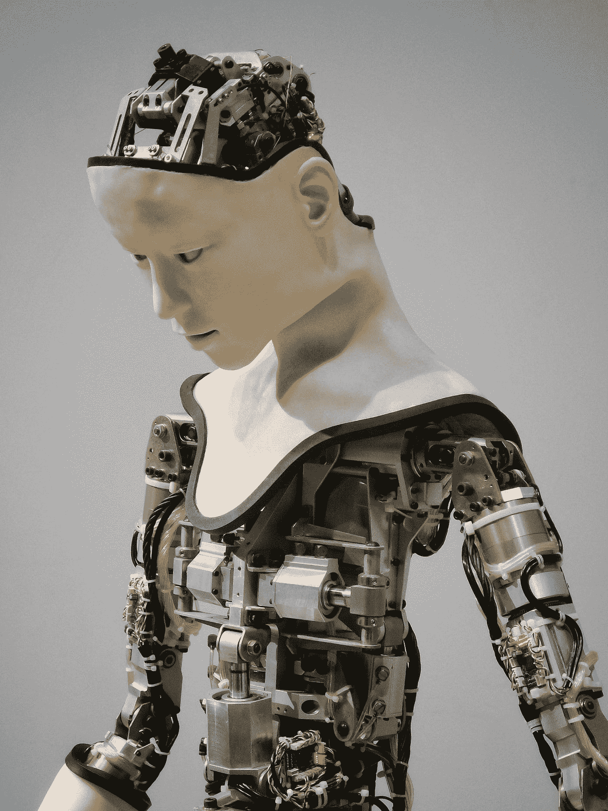

# (大多数)程序员很快就会失业

> 原文：<https://blog.devgenius.io/most-programmers-are-losing-our-jobs-very-soon-cd5c0770bbec?source=collection_archive---------10----------------------->

## 你是一个声明式程序员还是一个“接近机器”的程序员？

懒惰的程序员没有工作

如果你属于第二类，你很快就会失业。

机器学习在从数据集推断属性和解决问题(通常不显示解决方案路径)的重复性任务方面做得非常好。

> 今天的技术水平还没有威胁到优秀的软件工程师。

任何深度神经网络都可以学习 Knuth 的三卷本[计算机编程的艺术](https://en.wikipedia.org/wiki/The_Art_of_Computer_Programming)并准确选择哪种算法和数据结构最适合以达到一个目标。然而，模仿真实世界的计算模型并不是一件容易的事情，因为**真实世界是主观的**。

 [## 软件有什么问题？

### 软件正在吞噬世界。我们这些工作、生活和热爱软件的人通常不会停下来思考它的…

codeburst.io](https://codeburst.io/what-is-software-9a78c1172cf9) 

你不能假装什么都没发生。

今天，大多数算法都已经编写好并经过了很好的测试，我们需要做的就是在 GitHub 上选择一个好的库，并将其移植到我们的语言中。但是商业框架还没有那么成熟。

> *我们将向他们展示我们的需求，而不是编程计算机，他们会知道该怎么做。*

杰弗里·辛顿与 Coursera 创始人吴恩达讨论程序员的未来。

# 数学模型的兴起

随着[机器学习的大肆宣传](https://medium.com/@manjotpahwa/is-machine-learning-still-a-hype-261a7280f9b7)，几种低级语言正在[走向](https://towardsdatascience.com/top-10-in-demand-programming-languages-to-learn-in-2020-4462eb7d8d3e)，这包括 Go、Python 甚至 C++。

这些语言中的大多数都缺乏声明性(Python 是个例外),并且需要进行机器优化，因为时间和内存消耗是一个问题。

业务模型不会经常改变，所以耦合不是问题。

 [## 耦合:唯一的软件设计问题

### 对我们软件的所有故障进行根本原因分析，会发现一个有多种伪装的单一罪魁祸首。

codeburst.io](https://codeburst.io/coupling-the-one-and-only-software-design-problem-869e293a9f04) 

然而，一旦最好的机器学习算法被编码，它们将需要商业模型的支持。这将是我们今后几年的任务。

 [## 唯一的软件设计原则

### 如果我们在一个单一的规则上建立我们的整个范式，我们可以保持它的简单并做出优秀的模型。

codeburst.io](https://codeburst.io/the-one-and-only-software-design-principle-5328420712af) 

比赛已经开始了。 [GPT3](https://en.wikipedia.org/wiki/GPT-3) 及其惊人的成绩紧随其后。

这是一个漫长的旅程，我们仍然领先。

在 [Unsplash](https://unsplash.com/s/photos/robot?utm_source=unsplash&utm_medium=referral&utm_content=creditCopyText) 上由 [Franck V.](https://unsplash.com/@franckinjapan?utm_source=unsplash&utm_medium=referral&utm_content=creditCopyText) 拍摄的照片

# 结论

如果你是一名计算机工程师或[计算机科学家](https://medium.freecodecamp.org/why-do-so-few-people-major-in-computer-science-6c2c08272405)，我的建议是:一旦你读了一些编程书籍，就把这些东西留给人工智能，去处理商业模式设计。那里有足够的空间发挥人类的创造力。

这一系列文章的部分目标是为软件设计的辩论和讨论提供空间。

 [## 目标设计清单

### 这是已经发表的软件设计文章的索引。

medium.com](https://medium.com/@mcsee/object-design-checklist-47c63d351352) 

我们期待着对这篇文章的评论和建议。

原文发布[此处](https://chatbotslife.com/most-programmers-are-losing-our-jobs-very-soon-77adf846beb1)。