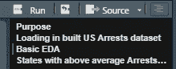

# 最被低估的技能——编写可读代码

> 原文：<https://blog.devgenius.io/most-underrated-skill-writing-readable-code-3e288db62ddf?source=collection_archive---------15----------------------->


克里斯里德在 [Unsplash](https://unsplash.com?utm_source=medium&utm_medium=referral) 上的照片

在 Analytics 中，我们经常全神贯注于最新的算法、包、故事，以及对 R v/s Python 永无止境的讨论。我们经常忽略对可读代码的需求。

*   有没有在几个月后重访你的代码，并想知道你为什么以这样的方式写这段代码？
*   读了一段糟糕的代码，认为重写这段代码比理解不可读的代码要好？
*   见过数据集/变量名如 df1、var_df2、master3、temp4、I、j 等？

```
if (Answer to above question == "Yes") {“Read Further and share your experience with un-readable code”}
```

# 为什么我养成了写可读代码的习惯？

谢天谢地，我别无选择。我在凯捷工作期间，我最初的代码不可读，收到了大量的评论。我面临的主要问题如下:

1.  庞大的代码库(客户是世界上最大的披萨连锁店之一)
2.  遗留 ERP(是的，我用 Vb 6.0 编码)
3.  一些部分不可读(涉及多个团队)
4.  相互依赖(一个模块中的变化会产生级联效应)
5.  敏捷方法(许多人同时处理同一个文件)

因此，在添加代码片段之前，我必须写一个描述性的注释，以确保其他浏览或调试代码的人能够理解核心功能，而无需依赖我。

> 专业人士善用他们的能力，编写他人可以理解的代码。
> ― **罗伯特·c·马丁，** [**干净代码:敏捷软件工艺手册**](https://www.goodreads.com/work/quotes/3779106)

# **如何铲球？**

*   **代码的用途**(简短总结)——我通常更喜欢写代码的简短总结。您可以提及以下内容:1)数据源 2)对数据集的基本理解 3)您测试的主要目的/假设 4)任何术语或相关列描述

```
##### Purpose for this article ######
# This is my 1st comment on any new file/project. For this story my purpose is to make the code more readable by focusing on the most ignored part of coding (Comments, Inundation, Casing)
```

*   **写假设**——糟糕的假设会产生糟糕的代码，不提任何假设都会导致灾难。假设您想根据客户的“年龄”创建一个派生变量“总工作经验”(年龄> 25 岁)。基于你过去的理解，你有一个假设，客户通常在“年龄= 22 岁”开始工作，因此“总工作经验=年龄-22”

```
##### Assumptions for this article ######
# You have a basic understanding of how codes work and have hands-on experience in any coding language
```

*   **排除** —你排除了什么？假设您正在研究教育贷款的倾向模型，您将排除那些还没有资格学习该课程的人，那些年龄远远超过年龄限制的人。最好提一下最重要的排除
*   **评论—** 有意义的评论，你的函数是做什么的，输入参数是什么？注释和代码应该同步，因此当你修改代码时，不要忘记添加/更新注释。还有，清理无关评论。假设您有一个进行基本日期操作的函数，它接受购买日期和交付日期作为参数。

```
#### Calculates the time to deliver in dd/mm/yyyy format. Pass date of purchase and date of delivery as arguments in mm/dd/yy format
```

*   **淹没**——看到一个代码，你不知道它在哪里开始，在哪里结束？

```
##### Same Code without and with inundation ####AbvAvgArrests <- USArrests %>% filter(Murder > mean(Murder), Rape > mean(Rape), Assault > mean(Assault))AbvAvgArrests <- USArrests %>%                  
                 filter(Murder > mean(Murder),
                        Rape > mean(Rape), 
                        Assault > mean(Assault))
```

*   **变量/数据集/函数的相关名称**——你不会想阅读一个包含 I、j、k 等变量的代码。根据它的作用来命名它。例如，如果您只想对年龄进行健全性检查，请将其命名为 SanityAgeCheck，而不是 Test1。您可能希望保持以下约定:1)健全性检查→sanitywhatidoes 2)临时数据集→tempwhatidoes 3)函数→fnwhatidoes 4)原始数据集→rawhatidoes 5)绘图→plotwhatittplots 等。

> "你应该像给第一个孩子命名一样小心地给一个变量命名。"
> ― **罗伯特·c·马丁，** [**干净代码:敏捷软件工艺手册**](https://www.goodreads.com/work/quotes/3779106)

*   **大小写**——请保持大小写一致，我不愿意*读码*是多个*大小写样式*的

```
*#### Types of casing styles ####
#camelCase
#PascalCase
#snake_case*
```

*   *空白很重要——在各部分之间留一些空间，这将有助于阅读代码*
*   *删除不需要的数据集——你不希望你的项目环境中有大量不相关的数据集造成混乱。*

# ***样本代码***

***R 工作室提示***

*   *您有一个最终数据集“CustomerMaster ”,它包含所有相关的列，并将用于绘图。现在，如果您想只保留 CustomerMaster 并删除所有其他数据集，您可以使用 gdata 包中的 *keep(CustomerMaster，sure = TRUE)**
*   *CTRL + I —淹没代码*
*   *要创建新的代码段注释并使其在文档大纲中可见，请按如下方式进行注释。*

```
*#### Sample Comment to create new code section which can be collapsed ####*
```

*参考下面的截图*

**

*将注释添加为####注释####。来源:作者*

# ***优点***

*   *很容易解释*
*   *缩短移交/记录时间*
*   *减少依赖性*
*   *不容易出错*
*   *易于调试，因此减少了解决错误的时间*
*   *基于业务需求易于重用和修改*

# ***缺点***

*   *耗费时间的*
*   *你可能会觉得这是平凡的活动(相信我，这是值得的)*
*   *如果需求是临时的和非常严格的时间表，则不适合(我更喜欢交付结果，然后使其可读以供将来使用)*

# *关键外卖*

1.  *写可读的代码和写高效的代码一样重要，把它当成用户手册(给你自己和同事)*
2.  *写**目的** /基本总结*
3.  *写下**假设**(即使是最基本的假设，6 个月后你的同事也不一定能理解你的思维过程)*
4.  *你**排除了什么**？(已故客户、极端价值等。)*
5.  ***注释**(取代所有其他内容，请这样做，并且不要忘记在需要时与您的代码同步)*
6.  ***淹没**(会减少混乱)*
7.  ***相关名称**(请根据其用途/含义命名)*
8.  ***肠衣**(驼色，帕斯卡尔盒，蛇 _ 盒)我更喜欢帕斯卡尔盒*
9.  ***空白**(在主要部分之间留一些线)*
10.  ***删除不相关的数据集**(你不会想摆弄 50 多个数据集)*
11.  *是的，这很费时间，但是很值得。一旦你开始写可读的代码，比较编辑前后的代码。*

*那么你有什么不可读代码的经历，你是如何解决的呢？*

***关于作者:**分析顾问，拥有 5 年以上与各行业利益相关者合作的丰富经验。我目前是一名业务分析师(People Analytics ),负责将数据转化为可操作的见解。*

*快乐编码:)*