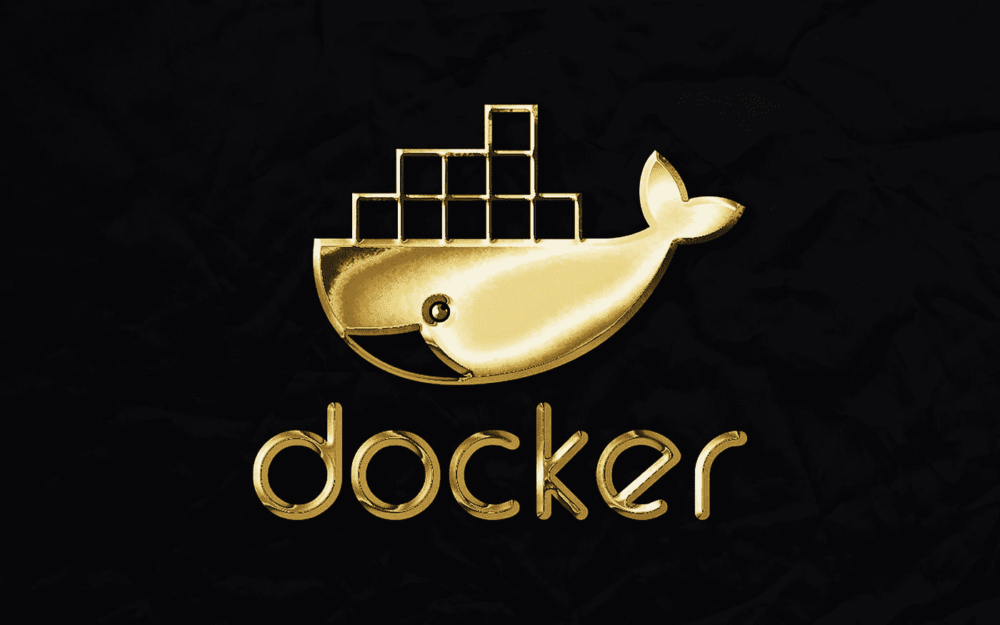

# 最有用的 Docker 命令备忘单

> 原文：<https://blog.devgenius.io/most-useful-docker-commands-cheat-sheet-f5115e10c047?source=collection_archive---------1----------------------->



鲁拜图·阿扎德在 [Unsplash](https://unsplash.com?utm_source=medium&utm_medium=referral) 上的照片

Docker 在这个快速发展的 IT 世界中获得了巨大的声望。组织不断地在他们的生产环境中采用它。在这里，我为您创建了一个备忘单。这个备忘单提供了 Docker 重要的基本命令。

# **列出 docker 版本详情**

```
docker version
```

# —容器—

# 从图像启动一个新容器

```
docker run IMAGE
docker run nginx
```

# 为容器指定一个名称

```
docker run --name CONTAINER_NAME IMAGE
docker run --name web nginx
```

# 将端口映射到容器

```
docker run -p HOSTPORT:CONTAINERPORT IMAGE 
docker run -p 8680:80 nginx
```

# 将所有端口映射到容器

```
docker run -P IMAGE
docker run -P nginx
```

# 在后台启动容器

```
docker run -d IMAGE
docker run -d nginx
```

# 为容器分配主机名

```
docker run --hostname HOSTNAME IMAGE  
docker run --hostname myhost nginx
```

# 显示正在运行容器的列表

```
docker ps
```

# 显示所有容器的列表

```
docker ps -a
```

# 删除容器

```
docker rm CONTAINER_NAME
docker rm web
```

# 删除正在运行的容器

```
docker rm -f CONTAINER_NAME
docker rm -f web
```

# 删除停止的容器

```
docker container prune
```

# 停止正在运行的容器

```
docker stop CONTAINER_NAME
docker stop web
```

# 启动停止的容器

```
docker start CONTAINER_NAME
docker start web
```

# 将文件从容器复制到主机

```
docker cp CONTAINER_NAME:SOURCE TARGET
docker cp web:/index.html index.html
```

# 将文件从主机复制到容器

```
docker cp TARGET CONTAINER_NAME:HOST
docker cp index.html web:/index.html
```

# 重命名容器

```
docker stop old_name new_name
docker rename myweb web
```

# 重新启动容器

```
docker stop CONTAINER_NAME
docker restart web
```

# 暂停容器

```
docker pause CONTAINER_NAME
docker pause web
```

# 在运行的容器中启动一个 shell

```
docker exec -it CONTAINER_NAME SHELL_NAME
docker exec -it web bash
```

# —图像—

# 下载图像

```
docker pull IMAGE[:TAG]
docker pull nginx:1.0
```

# **查看所有图像列表**

```
docker images
```

# **运行 docker 镜像**

```
docker run IMAGE_NAME
docker run nginx
```

# 将图像上传到存储库

```
docker push IMAGE_NAME:TAG
docker push my_image:1.0
```

# 登录到注册表

```
docker logindocker login localhost:8080
```

# 删除图像

```
docker rmi IMAGE_NAME
docker rmi nginx
```

# 删除所有未使用的图像

```
docker image prune -a
```

# 从 Dockerfile 文件构建一个图像

```
docker build -t IMAGE_NAME DIRECTORY
docker build -t my_image .
```

# 将图像保存到。焦油文件

```
docker save IMAGE_NAME > File
docker save nginx > nginx.tar
```

# 从加载图像。焦油文件

```
docker load -i TAR_FILE_NAME
docker load -i nginx.tar
```

# —日志和统计数据—

# 显示容器的日志

```
docker logs CONTAINER_NAME
docker logs my_web
```

# 显示正在运行的容器的状态

```
docker stats [container_Id]
```

# 显示容器的流程

```
docker top CONTAINER_NAME
docker top my_web
```

# 显示详细信息

```
docker inspect CONTAINER_NAME
docker inspect my_web
```

# —网络—

# **列出所有网络**

```
docker network ls
```

# **检查网络**

```
docker network inspect NETWORK_NAME
docker network inspect br0
```

# 将容器连接到网络

```
docker network connect NETWORK_NAME CONTAINER_NAME
docker network connect br0 my_web
```

# 断开容器与网络的连接

```
docker network disconnect NETWORK_NAME CONTAINER_NAME
docker network disconnect br0 my_web
```

# 列出网络

```
docker tag IMAGE_NAME NEW_IMAGE_NAME
docker tag nginx:1.0 nginx:1.1
```

我会在 **Dockers** 上发布更多博客。

请在[媒体](https://medium.com/@alexmurphyas8)上关注我，我会像上面一样发布有用的信息。

感谢你阅读这篇文章，❤

如果这篇文章对你有帮助，请鼓掌👏这篇文章。

insta gram→[https://www.instagram.com/alexmurphyas8/](https://www.instagram.com/alexmurphyas8/)

推特→[https://twitter.com/AlexMurphyas8](https://twitter.com/AlexMurphyas8)

如果我做错了什么？让我在评论中。我很想进步。