# 将您的 Kubernetes 开发环境迁移到云中！

> 原文：<https://blog.devgenius.io/move-your-kubernetes-dev-environment-to-the-cloud-6f6d6c07670d?source=collection_archive---------29----------------------->

在 [Unsplash](https://unsplash.com/s/photos/cloud?utm_source=unsplash&utm_medium=referral&utm_content=creditCopyText) 上由 [C Dustin](https://unsplash.com/@dianamia?utm_source=unsplash&utm_medium=referral&utm_content=creditCopyText) 拍摄的照片

虽然一些开发人员使用强大的工作站在家中构建他们的个人项目，但我们中的许多人更喜欢在现代笔记本电脑上工作，用处理能力换取便携性和简单性。在大多数情况下，这不会造成很多问题，尤其是在更轻量级的 web 开发领域。

当你的应用程序开始变大时，问题就出现了。在小型笔记本电脑上本地运行大规模应用程序很快就会变成一场可悲的拖延。对于一个小小的移动 CPU 来说，同时运行多个服务几乎是不可能的，即使它只运行一个 k8s 节点！

你能做些什么来继续开发一个更大的应用程序，而不花费大量的时间和资源来等待事情正确执行？很简单——买一台更好的电脑！更多的内存和 CPU 能力是我们问题的答案。不幸的是，这可能不是我们许多人的选择，因为更大更强大的计算机往往更昂贵。幸运的是，谷歌的人有一些备用计算机，它们的计算能力和互联网带宽超出了你的想象，他们让使用他们的机器为你运行整个开发环境变得非常容易，让你快乐的小笔记本电脑像一个简单的文本编辑器一样向它们上传代码。

([虽然你可能需要为这项服务付费，但这肯定比买一台新工作站要便宜。我目前还在谷歌云服务的 365 天免费期内，所以这还没花我一分钱。](https://cloud.google.com/free))

以下是为 K8s 开发设置 GCP 的分步指南:

(我正在创建一个名为“medium k8 demo”的 gcp 项目，它的 k8 集群是“medium-cluster”。我的所有代码片段都将使用这些示例标题，您只需用自己的标题替换它们。此外，请原谅我的 gcp 控制台的衬线字体截图，firefox-developer 和 mac-os11 目前有一些字体家族的分歧)

首先，为您喜欢的新开发环境创建一个新的 [google cloud 项目](http://console.cloud.google.com/home/dashboard)。

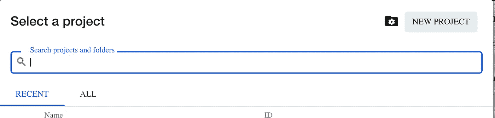

单击 Google Cloud 开发人员控制台左上角的项目下拉菜单，这将打开该模式。点击“新建项目”

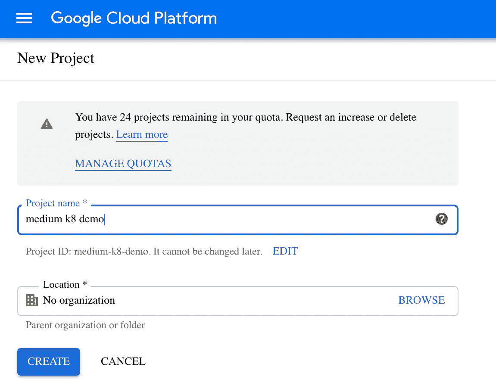

做你的项目！

接下来，前往库伯内特发动机区。

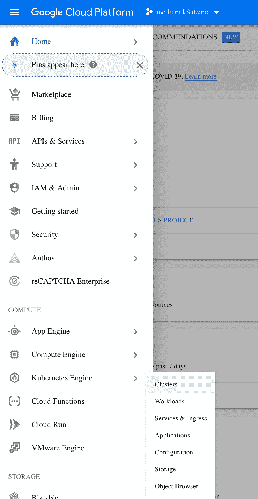

控制台菜单导航至 k8s 集群屏幕

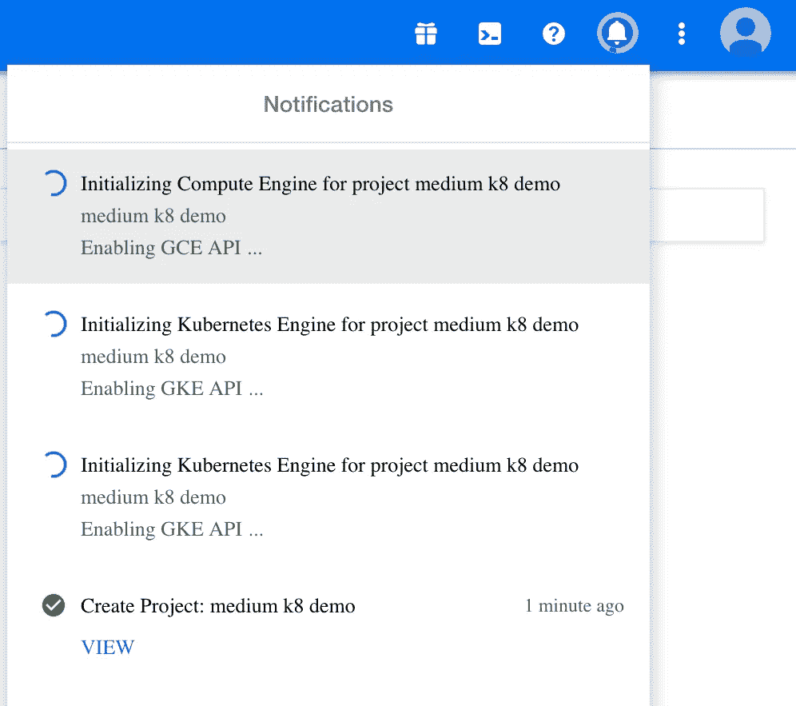

在 GCP，几乎所有进程的每一步都需要等待后台加载完成。控制台右上角的通知会显示正在发生的事情，有时需要刷新页面才能真正完成。这是检查 k8s 部分后的结果。

创建一个新的集群——给它起一个很酷的名字，选择一个离你近的地区，将版本设置为 1.15 或更高。

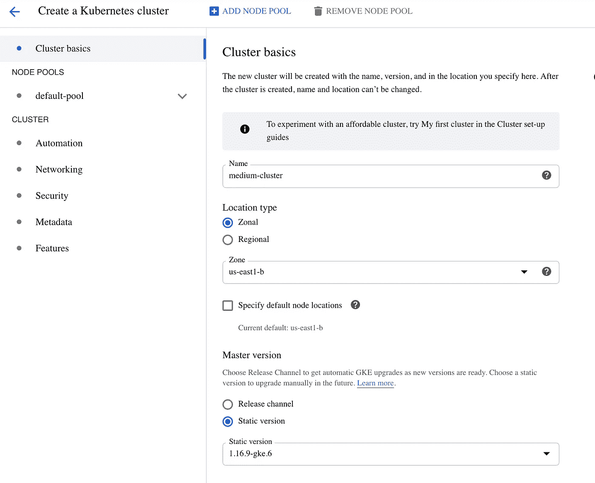

GKE 集群基础创建屏幕

然后，单击默认的 pool > Nodes 页面，将机器类型设置为 g1-small，这对于我们的开发目的来说应该已经足够了，而且成本更低。

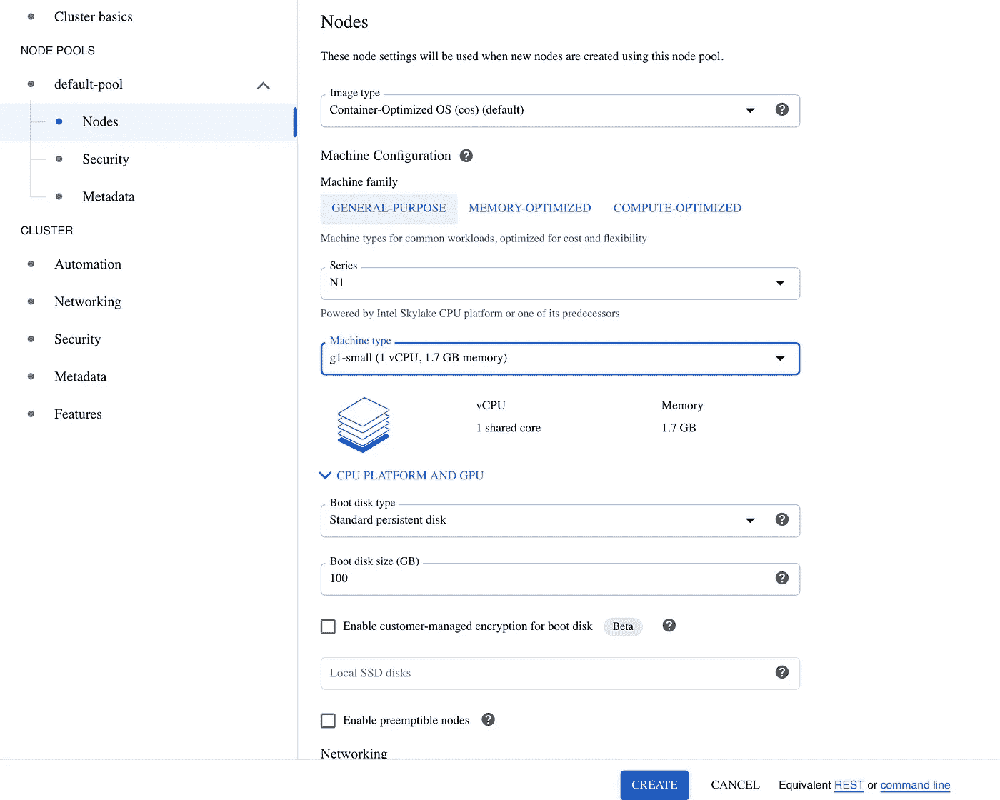

节点设置页面

现在创建集群，并等待它加载！

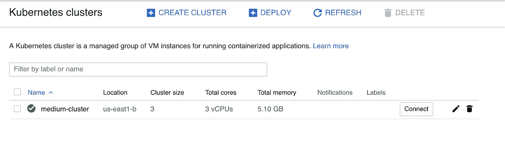

完成安装后，您的新集群应该如下所示

云控制台中设置的最后一步是初始化 Google Cloud Build，这是用于持续开发和集成的内置服务。

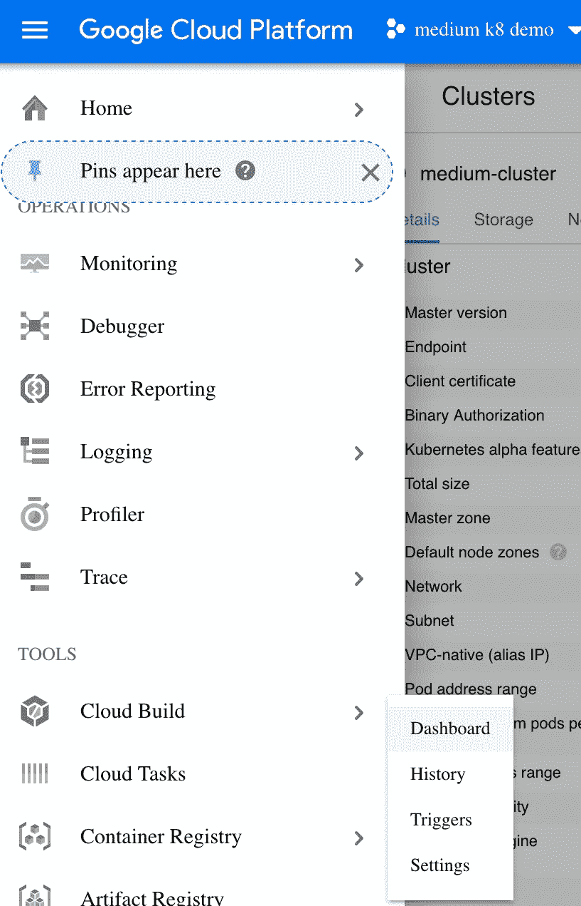

向下滚动到控制台下拉列表中的“工具”副标题，单击云构建控制面板。

在“云构建信息”页面中，单击“启用”按钮。控制台到此为止。

接下来，我们将在本地机器上设置 Google Cloud SDK。[如果你还没有安装，这里有说明。](https://cloud.google.com/sdk/install)通过在您的终端中运行`gcloud auth login`来验证您的 sdk。

在您的控制台中，运行`gcloud init`并按照屏幕上的指示进行操作。选择您用于制作应用程序的 google 帐户，并刚刚通过验证。选择你刚刚创建的同一个应用程序(在我的例子中，它的 ID 是`medium-k8-demo`，但对于你的应用程序，它可能会自动生成一个 ID。)选择您在云控制台中选择的同一个区域。现在你的 locak sdk 应该连接到你的 GCP 项目了！

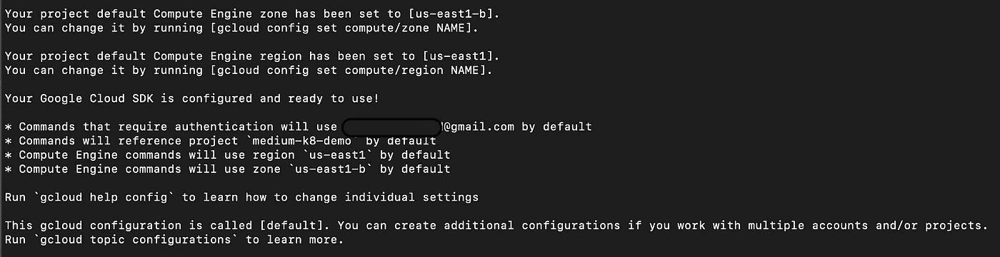

设置后所需的 sdk 输出

现在我们设置 gcloud 来运行 kubectl。(这是一个可选步骤，如果您想完全停止在本地机器上运行 Docker，并将其全部迁移到云中，可以遵循这个步骤。)[运行](https://kubernetes.io/docs/tasks/tools/install-kubectl/#download-as-part-of-the-google-cloud-sdk) `[gcloud components install kubectl](https://kubernetes.io/docs/tasks/tools/install-kubectl/#download-as-part-of-the-google-cloud-sdk)` [并按照说明操作。](https://kubernetes.io/docs/tasks/tools/install-kubectl/#download-as-part-of-the-google-cloud-sdk)

接下来，用`gcloud container clusters get-credentials medium-cluster`将 gcloud 连接到我们的 k8s 集群(或者最后一个值的集群名称)

(如果您选择保留本地 docker 环境，现在可以选择将 Kubernetes 上下文切换到新的 gcloud 环境。您需要为您的所有云开发使用这个上下文！如果你在 gcloud 上安装了 kubectl，你根本不需要在本地运行 docker。)

[接下来，您希望在您的云环境中安装 ingress-nginx。做起来很简单，完整的说明在这里。](https://kubernetes.github.io/ingress-nginx/deploy/#gce-gke)(显然，这仅适用于使用 Google 的 ingress-nginx 服务，并且在应用程序中有相应的配置文件的情况)

现在我们编辑一些 k8s 配置文件。对于每个部署配置，您必须将任何映像引用更改为新的云构建引用:`us.gcr.io/<Your Project ID Here>/<the project path to your service directory here>`,因此在我的例子中，与容器相关的部署 yaml 部分将更改为:

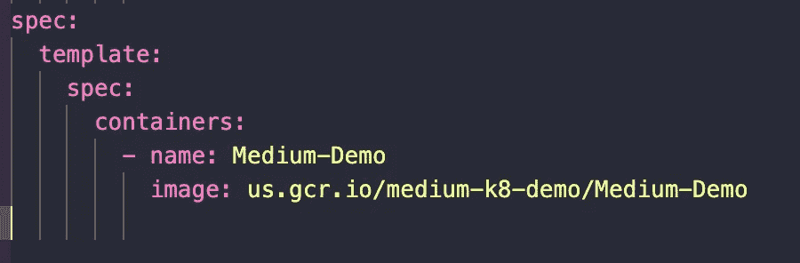

deployment.yaml 的代码片段

最后，我们对 Skaffold 配置文件进行最后的润色。[如果你需要安装 skaffold，说明在这里。](https://skaffold.dev/docs/install/)您需要移除`build: local:`配置设置，将它们从`local`更改为`googleCloudBuild`。

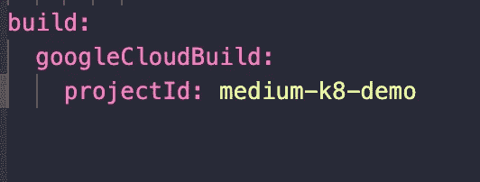

斯卡福德远程构建

然后检查所有的构建`artifacts`，将映像更改为您在每个部署配置中更改的相同的 URI:

斯卡福德的新神器图像

修复所有图像引用后，您就大功告成了！重启 Skaffold，(祈祷不要出现错误消息)，瞧——你现在完全在云中开发了！在您的云控制台中，查看网络>负载平衡页面，并复制 URL 和端口。这是您可以到达入口的根地址，以便对您的应用程序进行一些实时测试。

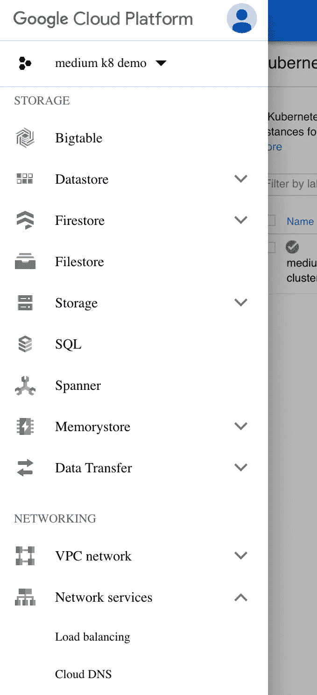

导航到负载平衡器页面

希望这是一个对我的慢速个人电脑用户有帮助的教程。本指南中的每一步都有自己完整的在线文档，可以回答您的任何问题。

**不要忘记**随着时间的推移，您的 GKE 实例会不断地使用资源，因此会产生费用。它们会非常小，但如果你不小心，它们会累积起来，所以如果你有一段时间不使用它，请删除你的应用程序，以避免意外费用！

资源:

 [## 云构建文档|谷歌云

### Cloud Build 是一项在 Google 云平台基础设施上执行构建的服务。云构建可以导入…

cloud.google.com](https://cloud.google.com/cloud-build/docs)  [## 斯卡福德文件

### Skaffold 是一个命令行工具，有助于 Kubernetes 本地应用程序的持续开发。斯卡福德…

斯卡福德开发公司](https://skaffold.dev/docs/)  [## 谷歌 Kubernetes 引擎文档|谷歌云

### 云容器管理。

cloud.google.com](https://cloud.google.com/kubernetes-engine/docs)