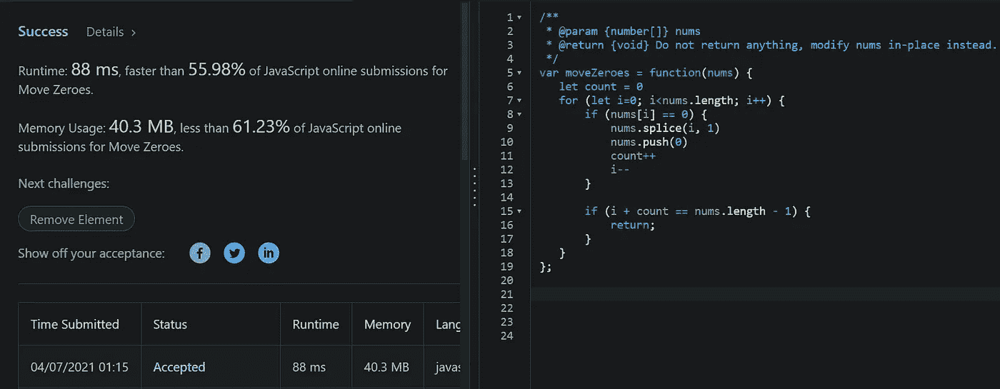

# “移零”:LeetCode 挑战

> 原文：<https://blog.devgenius.io/move-zeroes-leetcode-challenge-2866a7dceb9a?source=collection_archive---------6----------------------->

## 描述:

*给定一个整数数组* ***nums*** *，将所有 0 移动到它的末尾，同时保持非零元素的相对顺序。*

***注意*** *你必须就地做这个***而不做数组的拷贝。**

*我想到的解决这个问题的第一个方法是告诉机器“如果我正在看的当前项是 0，就把它推到数组的后面，删除这个索引。*

*令我惊讶的是，当我运行代码时，它加载了大约 15 秒，然后以粉红色登录“**时间限制超过**”。*

*我创造了一个无尽的循环。*

*让我们看一些代码。*

**

*这导致了无限循环*

*首先，我们使用一个传统的 for 循环，这样我们可以遍历数组中的每一项，并用一个变量 ***i*** 来跟踪我们现在的位置。*

*所以对于这个数组中的每一项，让我们检查数字是否为 0。如果是，让我们拼接该项(删除它)，并将 0 推到数组的末尾。*

*关于下一部分，需要记住的有趣的事情是，每次我们找到一个匹配并处理它时，我们都希望防止“我”增加。如果我们不将索引移回它的原始位置(I 减-1 ),当它滑入已删除项的位置时，我们将跳过数组中的下一项。*

**这个*解决方案的问题是，一旦零被移动到后面，我们必须告诉机器何时停止推回零。此时，我们在无限循环中一遍又一遍地循环这些零。*

**

*引入计数变量*

*我们可以通过记录找到零并按下它的次数来解决这个问题。在某些时候，我们会找到零和大于 0 的数字之间的边界。*

*我们可以通过使用*

**

*记得回来*

*我们走吧。*

*我们已经成功地从剩余的零中分离出来，而没有创建新的数组。*

**

*时间复杂度是线性时间，存储也是线性的。这是一个有趣的挑战，我希望我的解释能帮助你理解这个问题的解决方案。保重:)*