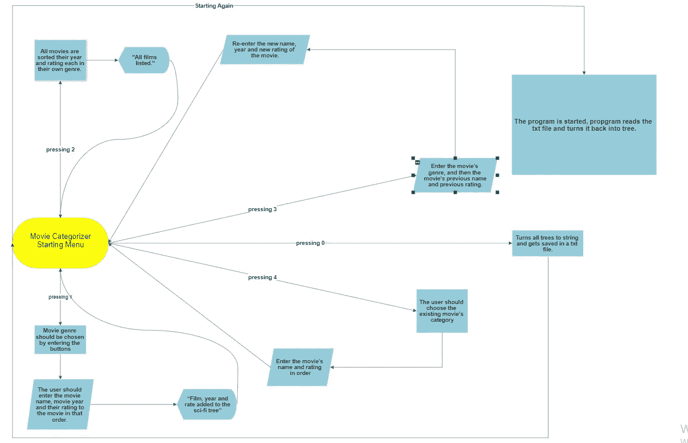
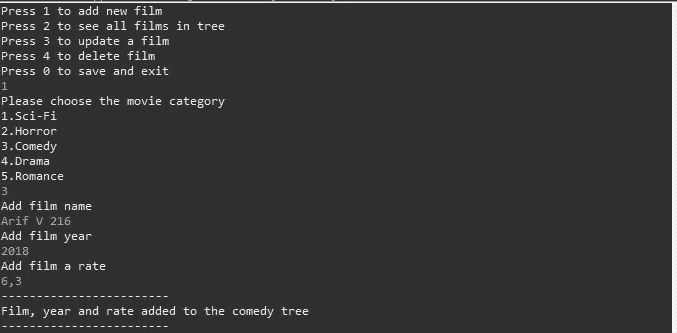
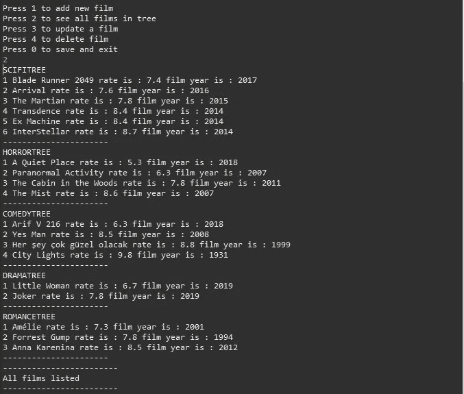
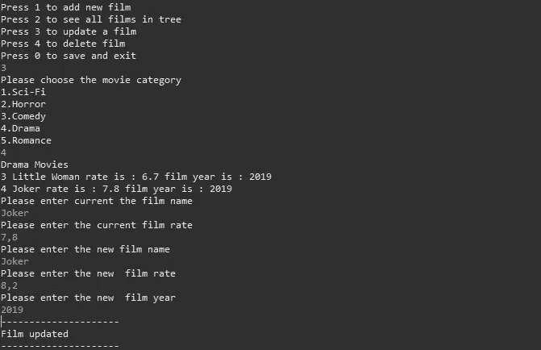
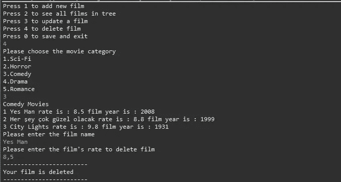
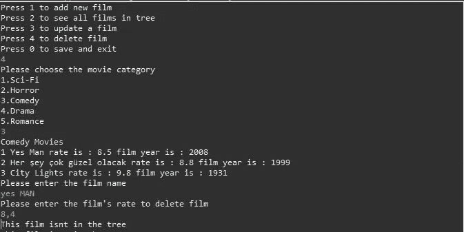
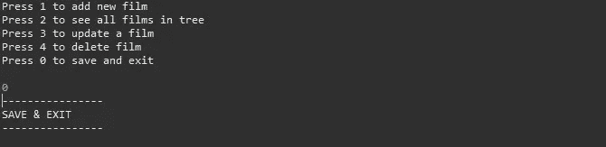

# 二叉查找树电影分类器

> 原文：<https://blog.devgenius.io/movie-categorizer-with-binary-search-tree-5161ee824fd1?source=collection_archive---------26----------------------->

流程图

*嗨，*

*这个项目的目的是让用户更容易对他们看过的每一种类型的电影进行评级和分类。该程序让用户对电影进行评级，然后将它们列在一棵树上，这样用户以后就可以再次看到它们的评级。该程序有 5 个主要功能；向列表中添加电影，查看树中的所有电影，更新电影，删除电影和“保存并退出”功能。这个项目中也使用了链表。这个想法出来做了 IMDB 的离线版。如果你看了很多电影，你想保持你的电影排名，这个项目是给你的。这个程序有两种不同的数据结构，一种是二叉查找树，另一种是链表。二叉查找树是用来保存电影的，链表是用来保存各种电影的二分搜索法树的。我们有 5 种不同的二叉查找树电影。*

***程序功能***

***1-)给树添加电影:***

添加电影

*在开始菜单中，为了将电影添加到列表中，用户应该输入 1 来初始化“按 1 添加新电影”功能。之后，应该通过输入为类型设置的按钮来选择电影类型(科幻、恐怖、喜剧、戏剧、浪漫)。选择类型后，用户应该依次输入电影名称、电影年份和他们对电影的评级。然后电影将被添加到树和程序会说“电影，年份和费率添加到科幻树”，并返回到开始菜单。*

***2-)查看树中所有电影:***

查看所有电影

*在开始菜单中，为了查看树中的所有电影，用户应在控制台中输入数字 2，并初始化“按 2 查看树中的所有电影”命令。这个命令将列出所有电影，它们的年份和各自的类型。然后程序会说“列出所有电影”并返回到开始菜单。*

***3-)更新一部已经在树上的电影:***

更新

*在开始菜单中，为了更新电影的名称、年份和分级，用户应该输入数字 3 并初始化“按 3 来更新电影”命令。然后，输入电影的类型，然后输入电影以前的名称和以前的评级。然后他们将能够重新输入电影的新名称、年份和新评级。完成这些后，程序将返回到开始菜单。*

***4-)从树中删除电影:***

删除

*为了从列表中删除电影，用户应输入数字 4 并初始化命令“按 4 删除电影”。之后，用户应该选择现有电影的类别。然后他们应该按顺序输入电影的名字和分级。这将删除树中的电影，并返回到开始菜单。*

***错误命令***

*当在控制台中，编写和/或输入的命令是错误的，程序不会给出异常，而是告诉用户错误。*

错误的命令

**5-*保存&退出***

保存并退出

*简单来说，当用户输入 0 并初始化命令“保存并退出”时，程序会将所有树转换为字符串并保存在 txt 文件中。下一次程序启动时，程序读取 txt 文件，并把它变成树。*

感谢您的阅读，如果您想了解完整的项目，您可以从这里进入我的 github 帐户:[https://github . com/bllhlskr/School-Project-Movie-categorizer-with-Binary-search tree](https://github.com/bllhlskr/School-Project-Movie-categorizer-with-Binary-SearchTree)