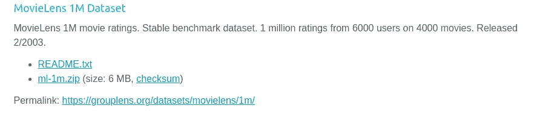
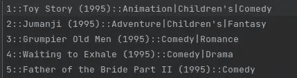
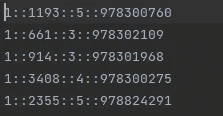
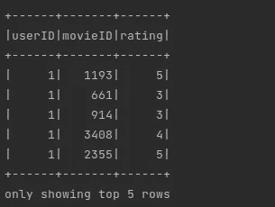
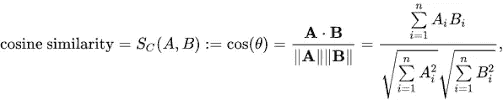
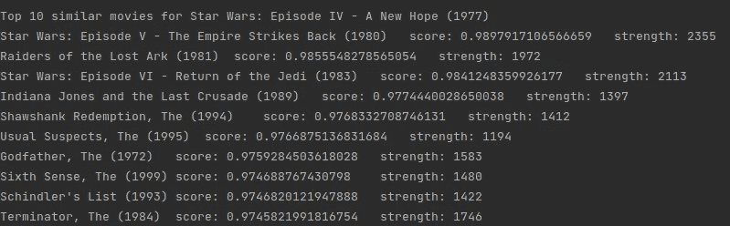

# 使用 Apache Spark 和 Scala 的电影推荐

> 原文：<https://blog.devgenius.io/movie-recommendation-using-apache-spark-scala-ade33fe81a6c?source=collection_archive---------4----------------------->

Apache Spark 是一个用于大数据和机器学习工作负载的开源、多语言和分布式处理引擎。它使用优化的查询执行和内存缓存来实现快速查询。


如今，Spark 被世界上的顶级公司使用，如亚马逊、雅虎、易贝…

看电影很有趣，但是想出接下来看什么电影却是一个令人恼火的经历。像网飞这样的公司开发了一个引擎，为我们推荐一个基于特定类型或与已经看过的电影相关的电影列表。


Spark 可以处理非常大的数据集。因此，在本文中，我们将构建一个 Spark-Scala 引擎，使用 100 万行的数据集，提出与所选电影相关的前 10 部类似电影。

开始吧！

# 1-导入数据集

我们将在下面的链接中使用数据集:[](https://grouplens.org/datasets/movielens/)

**

*如图所示，您可以下载 MovieLens 1M 数据集，该数据集提供了 100 万个评级。*

*“ml-1m”文件夹包含两个重要文件: *movies.dat* 和 *rating.dat**

*第一个文件包含电影的 Id，电影的标题和类型。*

**

*第二个包含用户的 Id，电影的 Id，评级和时间戳。*

**

# *2 —启动火花代码*

*这个项目中要做的第一件事是导入依赖项:*

```
*import org.apache.log4j._
import org.apache.spark.sql.functions._
import org.apache.spark.sql.types.{IntegerType, LongType, StringType, StructType}
import org.apache.spark.sql.{Dataset, SparkSession}*
```

*现在是时候创建我们的 Scala 类了:*

```
*object MoviesRecommendation{// To DO}*
```

*在本文中，我们将使用**数据集**代替 Dataframe 或 RDD。因此，我们可以从创建一个*案例类*开始，以读取下载的数据文件:*

```
*case class MoviesNames(movieID: Int, movieTitle String)
case class Movies(userID: Int, movieID: Int, rating: Int, timestamp:   Long)
case class MoviePairs(movie1ID: Int, movie2ID: Int, rating1: Int, rating2: Int)
case class MoviePairsSimilar(movie1ID: Int, movie2ID: Int, score: Double, numPairs: Long)*
```

*之后，我们创建一个 Spark 会话:*

```
*val spark = SparkSession
  .*builder* .master("local[*]")
  .appName("MoviesRecommendation")
  .getOrCreate()*
```

*创建会话后，我们创建模式来读取数据:*

```
*// Create schema for reading movies names file
val moviesNamesSchema = new StructType()
  .add("movieID", IntegerType, nullable = true)
  .add("movieTitle", StringType, nullable = true)

// Create schema for reading movies information
val moviesSchema = new StructType()
  .add("userID", IntegerType, nullable = true)
  .add("movieID", IntegerType, nullable = true)
  .add("rating", IntegerType, nullable = true)
  .add("timestamp", LongType, nullable = true)*
```

*现在，我们可以将数据集导入为 csv 文件:*

```
*// Read movies names file "movies.dat"
*println*("\nLoading movies names...\n")
import spark.implicits._
val moviesNames = spark.read
  .option("sep", "::")
  .option("charset", "ISO-8859-1")
  .schema(moviesNamesSchema)
  .csv("data/ml-1m/movies.dat")
  .as[MoviesNames]

// Read movies information file "rating.dat"
*println*("\nLoading movies rating...\n")
val movies = spark.read
  .option("sep", "::")
  .schema(moviesSchema)
  .csv("data/ml-1m/ratings.dat")
  .as[Movies]*
```

*我们不需要数据集中的 timestamp 列，所以我们只选择需要的列:*

```
*val ratings = movies.select("userID", "movieID", "rating")*
```

*通过一个简单的 show()，我们可以看到第一个结果:*

```
*ratings.show(5)*
```

**

*现在，我们将自我加入数据集“rating ”,以获得同一用户观看的一对电影及其给出的评级:*

```
*val moviePairs = ratings.as("ratings1")
  .join(ratings.as("ratings2"), $"ratings1.userID" === $"ratings2.userID" && $"ratings1.movieID" < $"ratings2.movieID")
  .select($"ratings1.movieID".alias("movie1ID"),
    $"ratings2.movieID".alias("movie2ID"),
    $"ratings1.rating".alias("rating1"),
    $"ratings2.rating".alias("rating2"))
  .repartition(100)
  .as[MoviePairs]*
```

> *备注:我们使用一组 100 万行，这非常庞大，因此我们必须使用重新分区选项将数据分布到所有这 100 个分区中。*

*我们的数据现在准备好了，我们将创建一个函数来计算一对电影之间的相似性。我们将使用一种叫做余弦相似度的方法。它是两个数字序列之间相似性的[度量，遵循以下公式:](https://en.wikipedia.org/wiki/Measure_of_similarity)*

**

*在 main 函数之外，我们创建了一个名为 *findSimilarity* 的方法来根据电影的评级计算一对电影的评分:*

```
*def findSimilarity(spark: SparkSession, data: Dataset[MoviePairs]): Dataset[MoviePairsSimilarity] = {

  val pairScores = data
    .withColumn("xx", *col*("rating1") * *col*("rating1"))
    .withColumn("yy", *col*("rating2") * *col*("rating2"))
    .withColumn("xy", *col*("rating1") * *col*("rating2"))

  val calculSimilarity = pairScores
    .groupBy("movie1ID", "movie2ID")
    .agg(
      *sum*(*col*("xy")).alias("numerator"),
      (*sqrt*(*sum*(*col*("xx"))) * *sqrt*(*sum*(*col*("yy")))).alias("denominator"),
      *count*(*col*("xy")).alias("numPairs")
    )

  import spark.implicits._
  val result = calculSimilarity
    .withColumn("score",
      *when*(*col*("denominator") =!= 0, *col*("numerator") / *col*("denominator"))
        .otherwise(null))
    .select("movie1ID", "movie2ID", "score", "numPairs")
    .as[MoviePairsSimilar]

  result
}*
```

*现在，我们可以用上面的方法找出相似的电影:*

```
*val moviePairSimilarities = *findSimilarity*(spark, moviePairs).cache()*
```

> *备注:建议使用“cache()”方法。这是一种优化机制，用于存储 Spark **数据集**的中间计算，以便它们可以在后续操作中重用。*

*为了测试我们的程序，我们甚至可以定义一个电影 Id 或者在参数:*

```
*var movieID: Int = 260 //Star Wars, by default

if (args.length > 0) {
  movieID = args(0).toInt
}*
```

*为了提高这个引擎的质量，我们可以添加一个准确性和分数阈值来选择最佳电影:*

```
*val scoreThreshold = 0.97
val coOccurenceThreshold = 1000.0

// Filter for movies with this sim that are "good" as defined by
// our quality thresholds above
val filteredResults = moviePairSimilarities.filter(
  (*col*("movie1ID") === movieID || *col*("movie2ID") === movieID) &&
    *col*("score") > scoreThreshold && *col*("numPairs") > coOccurenceThreshold)val results = filteredResults.sort(*col*("score").desc).take(10)*
```

*所使用的数据集包含电影 Id，因此要显示带有标题的结果，我们必须添加一个方法来按 Id 搜索标题(我们可以为此使用一个连接，但这不是一个快速的解决方案，尤其是当我们处理一个巨大的数据集时):*

```
**/** Get movie name by given movie id */* def getMovieName(movieNames: Dataset[MoviesNames], movieId: Int): String = {
  val result = movieNames.filter(*col*("movieID") === movieId)
    .select("movieTitle").collect()(0)

  result(0).toString
}*
```

*最后，我们可以显示如下结果:*

```
**println*("\nTop 10 similar movies for " + *getMovieName*(moviesNames, movieID))
for (result <- results) {
  // Display the similarity result that isn't the movie we're looking at
  var similarMovieID = result.movie1ID
  if (similarMovieID == movieID) {
    similarMovieID = result.movie2ID
  }
  *println*(*getMovieName*(moviesNames, similarMovieID) + "\tscore: " + result.score + "\tstrength: " + result.numPairs)
}*
```

*最终结果会是这样的:*

**