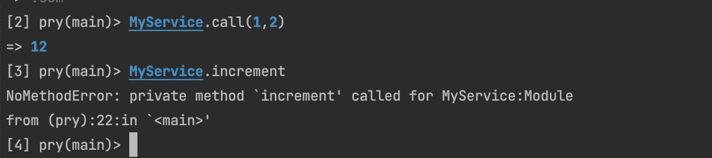

# 服务对象，ruby，OOP 和 FP

> 原文：<https://blog.devgenius.io/moving-away-from-oop-towards-fp-in-ror-c453cdaaf456?source=collection_archive---------5----------------------->


这篇笔记是我个人在多范例中实现 FP 方法的观察和旅程，但是非常倾向于 OOP，编程语言——Ruby(在这种情况下是在 Rails 上)。

如果你刚刚接触到软件工程，你可能会注意到 2022 年的今天的人们对函数式编程范式非常积极和热情。像 Elixir、JS & TS、Rust、F#这样的语言变得越来越普遍，社区中越来越多的人开始接受[函数式编程](https://en.wikipedia.org/wiki/Functional_programming)的理念——数据不变性、缺乏共享状态、作为一等公民的函数等等。

但情况并非总是如此。事实上并不是这样(还没有？)要么，这只是朝着那个方向迈出的一步。大多数企业软件都是用一种占主导地位的编程范例——面向对象编程——来构建的，大多数软件工程书籍也是这样写的。我甚至不会试图给出我对每一个问题的赞成和反对意见，无论如何不会在这篇笔记中给出。相反，我要做的是从 RoR 的角度，给你们一些我个人对 OOP -> FP 转变的经验。

因此，让我们假设您正在构建 REST API 来支持您美妙的 SPA，并且已经意识到您的业务逻辑太大而不适合您的模型，但是还没有大到可以使用 DDD。无论如何，在典型的 RoR 应用程序中，你将最终编写[服务对象](https://blog.appsignal.com/2020/06/17/using-service-objects-in-ruby-on-rails.html)。

通常情况下，它看起来像这样

```
# For some reason, your business requires to take two params, increment first, double second, sum them and double this some. #app/services/my_service.rbclass *MyService* def initialize(*param1*, *param2*)
    @param1 = *param1* @param2 = *param2* end

  def call
    *incremented_first_param* = @param1 + 1
    *doubled_second_param* = @param2 * 2
    *params_sum* = *incremented_first_param* + *doubled_second_param
    doubled_sum* = *params_sum* * 2
    *doubled_sum* end
end# Later in the controller
# app/controllers/my_controller.rbclass *MyController* def my_controller_action
    *param1* = params[:param1]
    *param2* = params[:param2]
    *service* = MyService.new(*param1*, *param2*)
    *result* = *service*.call

    render json: { result: *result* }
  end
end
```

太好了，你来了。它可以工作，并且它将业务逻辑从控制器和模型中移走——为了方便起见，我们假设有一些 ActiveRecord 模型正在进行一些持久性调用，并且您不想用我们“复杂”的业务逻辑来打扰它。

然后你读了一两篇文章，决定不直接使用实例变量，而是用 attr_readers 替换它们，并使它们私有，以避免暴露它们和违反[封装](https://en.wikipedia.org/wiki/Encapsulation_(computer_programming))。此外，您可能希望将一些操作转移到它自己的方法中。

```
*#app/services/my_service.rb* class *MyService* def initialize(*param1*, *param2*)
    @param1 = *param1* @param2 = *param2* end

  def call
    *incremented_first_param* = increment(param1)
    *doubled_second_param* = double(param2)
    *params_sum* = sum(*incremented_first_param*, *doubled_second_param*)
    *doubled_sum* = double(*params_sum*)
    *doubled_sum* end

  private

  attr_reader :param1, :param2

  def increment(*param*)
    *param* + 1
  end

  def double(*param*)
    @param2 = @param2 * 2 *param* * 2
  end

  def sum(*param1*, *param2*)
    *param1* + *param2* end
end
```

一切都好了，对吧？但是等等，有一个 bug。在“double”方法中，我们意外地改变了 param2 的状态，它是 instance_variable。我们可以通过删除这一行来解决这个问题，但是我们能排除这种可能的错误吗？我们能不能去掉实例变量，所以去掉共享状态，只对参数进行操作？

我们可以试试。如果我们不使用构造函数来设置服务和实例变量作为存储输入参数的地方，而是只接收输入参数并在其上运行操作，会怎么样？

```
*#app/services/my_service.rb* class *MyService* def call(*param1*, *param2*)
    *incremented_first_param* = increment(*param1*)
    *doubled_second_param* = double(*param2*)
    *params_sum* = sum(*incremented_first_param*, *doubled_second_param*)
    *doubled_sum* = double(*params_sum*)
    *doubled_sum* end

  private

  def increment(*param*)
    *param* + 1
  end

  def double(*param*)
    *param* * 2
  end

  def sum(*param1*, *param2*)
    *param1* + *param2* end
end# Later in the controller or other serviceservice = MyService.new
result = service.call(param1, param2)
```

每次都调用构造函数，只是为了用参数调用方法，这有点烦人。把那个也修好怎么样？我们想要某种“静态”方法，就像 Java 或 C#中的方法一样。而有这样的，就叫“类法”。我将向您展示实现它们两种常用方法。

```
*#app/services/my_service.rb*# Using class << self
module *MyService* class << self
    def call(*param1*, *param2*)
      *incremented_first_param* = increment(*param1*)
      *doubled_second_param* = double(*param2*)
      *params_sum* = sum(*incremented_first_param*, *doubled_second_param*)
      *doubled_sum* = double(*params_sum*)
      *doubled_sum* end

    private

    def increment(*param*)
      *param* + 1
    end

    def double(*param*)
      *param* * 2
    end

    def sum(*param1*, *param2*)
      *param1* + *param2* end
  end
end# Using private_class_method
class *MyService* def self.call(*param1*, *param2*)
    *incremented_first_param* = increment(*param1*)
    *doubled_second_param* = double(*param2*)
    *params_sum* = sum(*incremented_first_param*, *doubled_second_param*)
    *doubled_sum* = double(*params_sum*)
    *doubled_sum* end

  private_class_method def self.increment(*param*)
    *param* + 1
  end

  private_class_method def self.double(*param*)
    *param* * 2
  end

  private_class_method def self.sum(*param1*, *param2*)
    *param1* + *param2* end
end# Later in your code
result = MyService.call(param1, param2)
```

现在感觉好多了吧？

*   去掉烦人的 MyService.new.call，只使用它作为函数调用
*   去掉了实例变量和共享状态，这使得代码不容易出错

有点烦人的是，在一个例子中，我们有一个带有奇怪的“[类< <自我](https://stackoverflow.com/questions/2505067/class-self-idiom-in-ruby)习语”的模块，而在另一个例子中，我们有一个长方法定义。

对此我们能做些什么吗？当然有，是红宝石！就在最近，我的一位同事分享了这种方法

```
*#app/services/my_service.rb* module *MyService* extend self

  def call(*param1*, *param2*)
    *incremented_first_param* = increment(*param1*)
    *doubled_second_param* = double(*param2*)
    *params_sum* = sum(*incremented_first_param*, *doubled_second_param*)
    *doubled_sum* = double(*params_sum*)
    *doubled_sum* end

  private

  def increment(*param*)
    *param* + 1
  end

  def double(*param*)
    *param* * 2
  end

  def sum(*param1*, *param2*)
    *param1* + *param2* end
end
```



在接下来的笔记中，我们将讨论函数式编程和 ruby 的其他部分。

你觉得这些怎么样？你喜欢哪一个？你不反对 FP 的概念和想法吗？请在评论中告诉我，感谢你花时间阅读这篇文章，希望你和我一样喜欢！