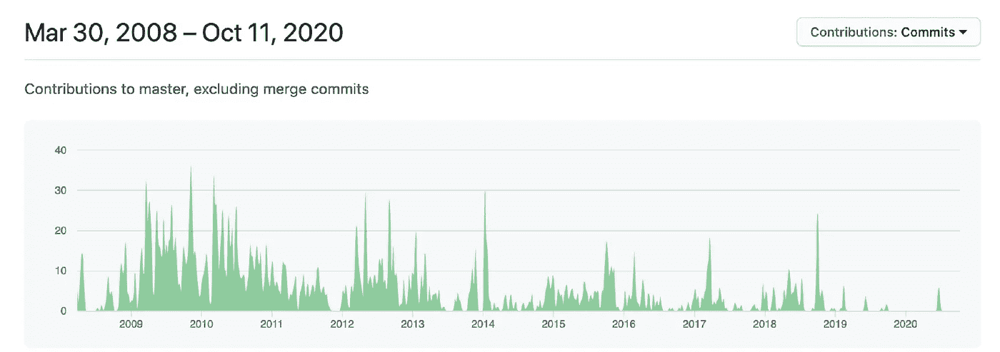
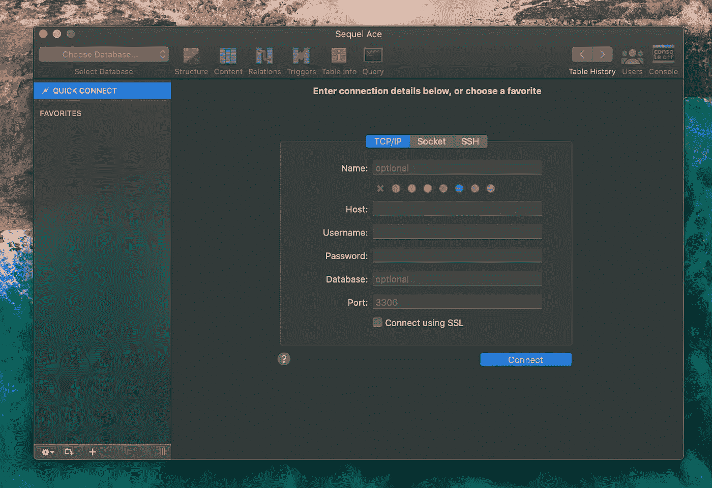
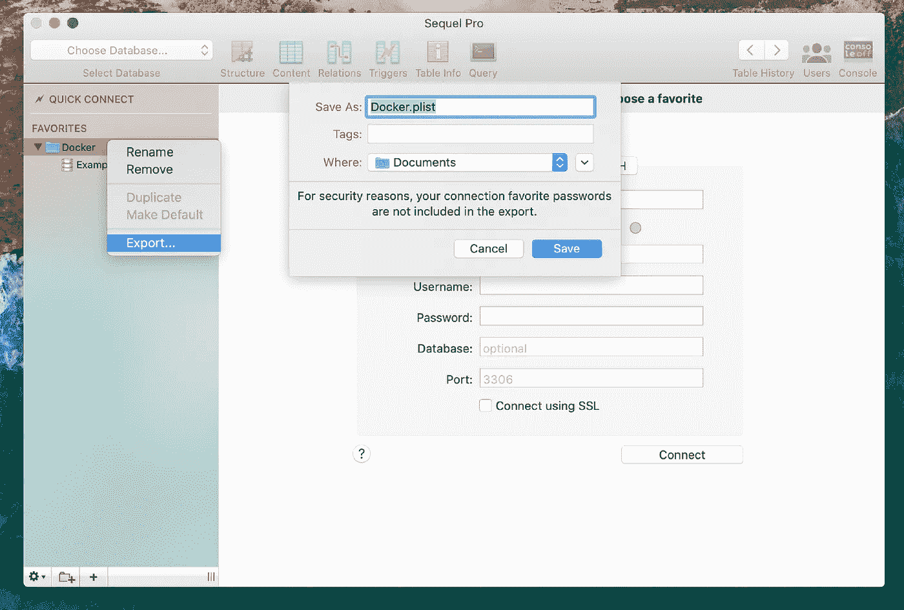
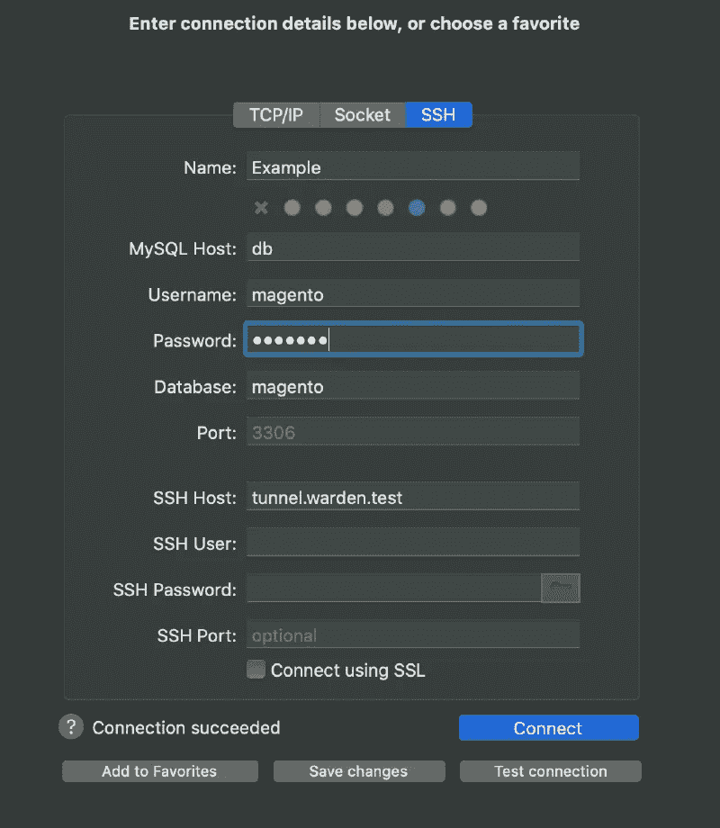

# 从 Sequel Pro 转向 Sequel Ace

> 原文：<https://blog.devgenius.io/moving-from-sequel-pro-to-sequel-ace-8c3e146f7947?source=collection_archive---------2----------------------->


泰勒·维克在 [Unsplash](https://unsplash.com/s/photos/data-center?utm_source=unsplash&utm_medium=referral&utm_content=creditCopyText) 上的照片

# 介绍

Sequel Pro 是一个用于 macOS 的开源 SQL 客户端，对于许多开发人员(包括我自己)来说，它是处理 SQL 服务器时的必备工具。它速度快，界面简单，使用起来非常直观。

你可能已经注意到，在最近几年里，在功能和外观方面几乎没有什么变化。在 macOS 最近的一些更新之后，我在 Sequel Pro 中不断遇到新的错误:

*   [Sequel Pro 在关闭标签页时在莫哈韦崩溃](https://github.com/sequelpro/sequelpro/issues/3360)
*   [MacOS 10.15 卡特琳娜快速连接&崩溃](https://github.com/sequelpro/sequelpro/issues/3479)
*   [无法连接本地数据库。Sequel Pro 遇到意外错误](https://stackoverflow.com/questions/56759610/cant-connect-local-database-sequel-pro-encountered-an-unexpected-error)

当你考虑到最后一个版本是 2016 年 4 月 3 日**的 [Sequel Pro — 1.1.2](https://sequelpro.com/news/post?id=1ee47439-a8ea-4937-86e9-be3216370889) 时，这也不足为奇。看看他们的 Github 页面上的提交，这几年越来越少了。**

****

**Sequel Pro 投稿**

**但是现在好消息来了！有一个替代品，那就是 [Sequel Ace](https://sequel-ace.com/) ，或者他们叫它什么:**“Sequel Ace 是长期 macOS 工具 Sequel Pro 的“续集”**。此外，它是开源的，可以在[苹果应用商店](https://apps.apple.com/us/app/sequel-ace/id1518036000?ls=1)获得。**

**它是 Sequel Pro 的一个分支，所以界面基本保持不变，这使得切换到 Sequel Ace 更好。**

# **准备**

*   **macOS >= 10.10**
*   **MySQL >= 5.6**
*   **MariaDB**

# **装置**

**最简单的方法是通过自制软件安装 Sequel Ace**

```
brew cask install sequel-ace
```

**现在它已经安装好了，你可以用 **⌘ +空格键**打开它，然后输入**续集 Ace****

****

**续集王牌**

# **将连接从 Sequel Pro 导入到 Sequel Ace**

**最简单的方法是右键点击导出，用同样的方法把这个文件导入回 Sequel Ace。**

****

**Sequel Pro 导出连接**

**另一种方法是复制你在 *~/Library* read: [中的文件，从 Sequel Pro 迁移到 Sequel Ace](https://medium.com/@harrybailey/migration-from-sequel-pro-to-sequel-ace-c6a579399c90)**

# **连接到 SSH**

**在我们想要从 Sequel Ace 建立一个 SSH 连接之前，我们需要首先给它一个访问权限。Sequel Pro 的情况并非如此。原因是 Sequel Pro 运行在沙盒模式下。这也提供了一层额外的保护。**

**为此我们需要添加我们的 *~/。ssh/config* 手动。**

**如果没有，请确保先创建一个。**

**下面是我的本地管理员(Docker)环境的 ssh 配置示例。**

```
Host tunnel.warden.test
  HostName 127.0.0.1
  User user
  Port 2222
  IdentityFile ~/.warden/tunnel/ssh_key
```

**现在转到:首选项->网络->嘘配置:其他文件…**

**选择您的 *~/。ssh/config* 文件。**

**一旦你添加了这个文件，你会在下面看到它:首选项->文件->可用文件。**

**当一切都设置好了，现在就可以连接到 SSH 环境了。**

****

**使用 SSH 的 Sequel Ace Connect**

> **Sequel Pro 使用默认端口:22 作为您的 SSH 端口。**

# **结论**

**希望这已经给了你足够的关于如何从 Sequel Pro 切换到 Sequel Ace 的信息。如果有任何问题或建议，请在评论中告诉我。**

# **觉得这个帖子有用吗？请点击👏下面的按钮！:)**