# 移动平台第 2 部分

> 原文：<https://blog.devgenius.io/moving-platform-part-2-71b3addbc462?source=collection_archive---------3----------------------->

## 使用 Cinemachine 平滑路径

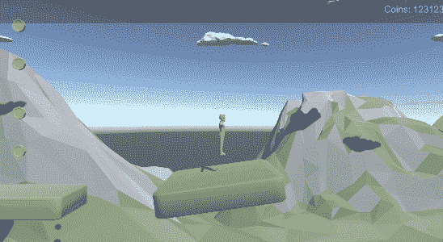

Cinemachine 是一套功能强大的工具，可以用来制作你的相机。它可以做任何事情，从相机之间的混合，跟踪场景中的对象，以及相机效果。这是与相机相关的一切的一站式解决方案。如果游戏里有摄像头我推荐用 Cinemachine。因为我打算在我的游戏中使用 Cinemachine，所以我想我会利用它沿着一条路径移动相机的特性来沿着一条路径移动我的游戏对象。我喜欢编辑器中路径的整洁外观。Cinemachine 有两种不同的路径类型可以使用， [**Cinemachine 路径**](https://docs.unity3d.com/Packages/com.unity.cinemachine@2.7/manual/CinemachinePath.html) 和 [**Cinemachine 平滑路径**](https://docs.unity3d.com/Packages/com.unity.cinemachine@2.7/manual/CinemachineSmoothPath.html) 。Cinemachine 还提供了[**cinema Chine Dolly Cart**](https://docs.unity3d.com/Packages/com.unity.cinemachine@2.7/manual/CinemachineDollyCart.html)，它使用路径来约束路径上的游戏对象变换，并可用于动画化游戏对象沿路径移动。

# 安装 Cinemachine

要安装 Cinemachine，我必须从软件包管理器中完成。

窗口->包管理器

我想换到 Unity 注册表，然后开始在搜索栏输入 Cinemachine。

一旦我找到它，我点击安装。我可用的当前版本是 2.7.3

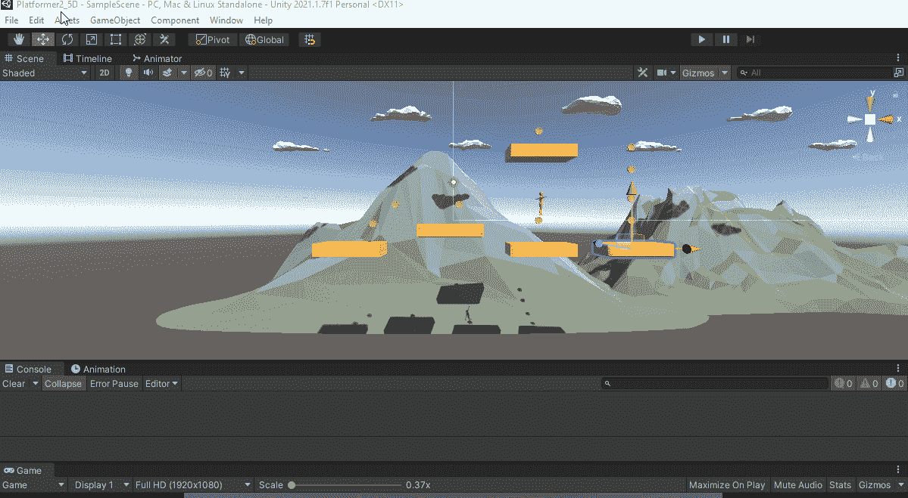

# 设置预制品

我复制了移动平台的预制品。我将使用 Cinemachine 沿着路径移动平台。我还需要一个从 Dolly Cart 继承的行为。

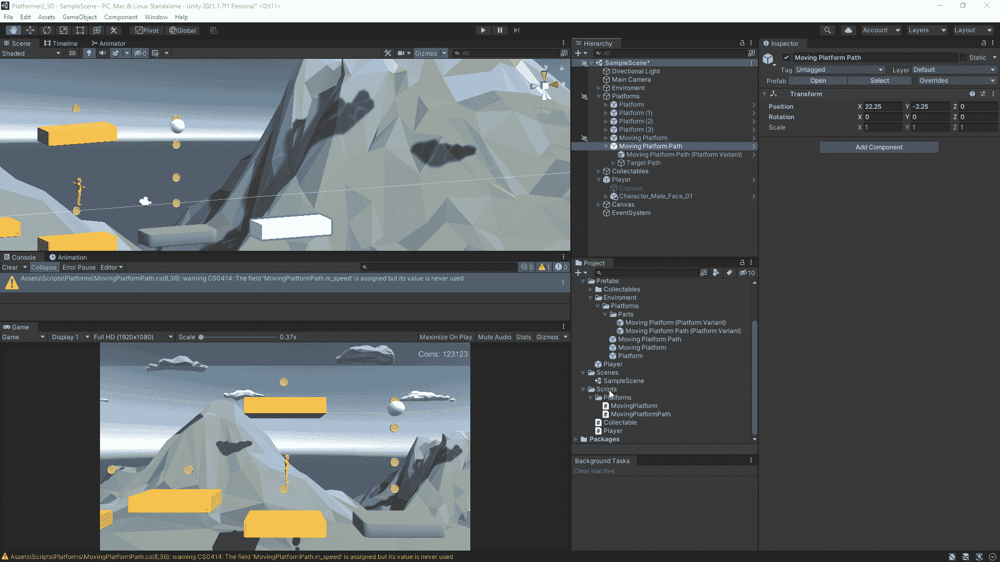

我将删除移动平台组件，并将移动平台小车组件添加到移动平台部分。我将位置单位改为归一化，这样无论路径上有多少个点，位置都被固定在 0(第一个点)和 1(最后一个点)之间。我还将速度设置为 1。我也忘了，我希望更新方式是固定更新。

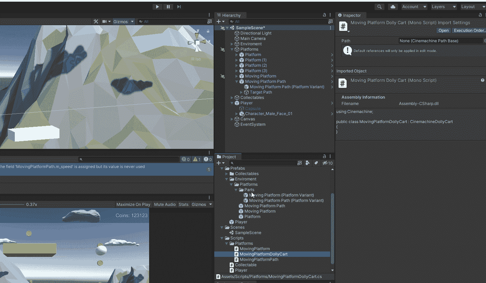

然后我编辑移动平台路径预设。我将 Cinemachine 平滑路径添加到目标路径，我可以使用 Cinemachine 路径中的任何一个。我删除了第二个航路点，并将所有第一个航路点的位置归零。我将目标路径分配给移动平台的路径。然后，我删除了 to Target 转换，因为不需要它们。

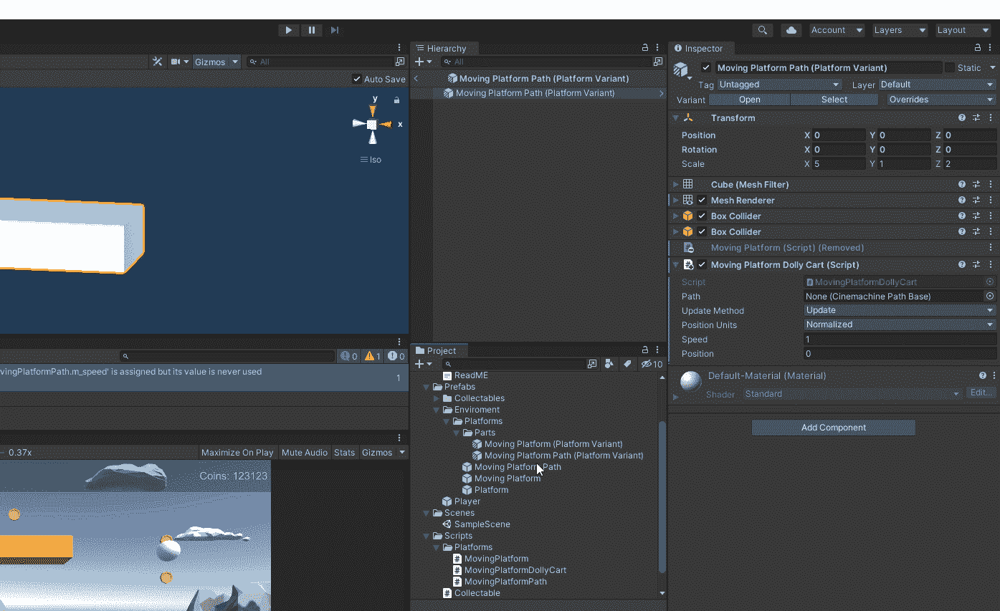

接下来，我给 may 路径添加一个点。请注意，当向旋转的平台添加点时，它会面向路径，如果我旋转路径，它会旋转以始终指向路径。

现在，当我运行游戏时，平台将按照检查器中设置的速度沿着路径移动。如果我将路径改为环形，它将从最后一个位置移动到第一个位置。

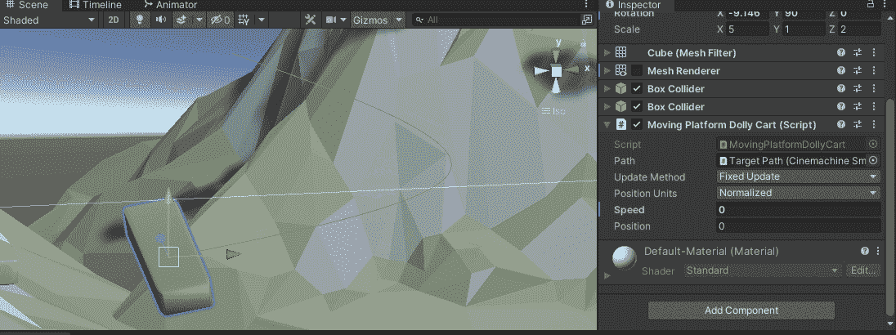

# 修理平台

要解决平台问题，我所要做的就是在 Y 轴上将原始平台预设旋转 90 度，并将 X 轴上的比例改为 2，z 轴上的比例改为 5。我确实去仔细检查了所有的平台预设是否都已更新，以防我在中途的某个地方更改了该值，并将其作为更改保存在变体中。使用 Cinemachine 移动的平台会自行旋转，使其沿着路径定向。

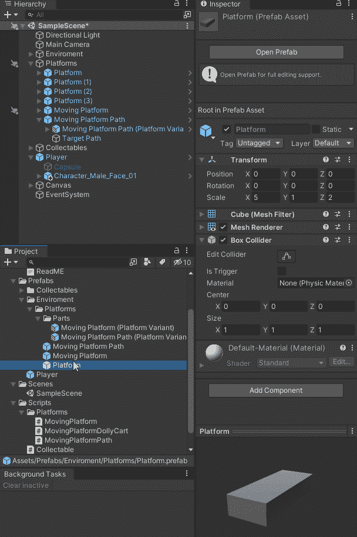

现在，游戏中的所有平台都旋转并显示相同的内容。

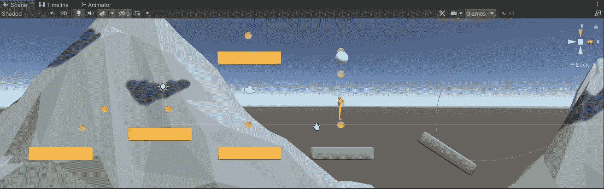

# 让玩家随着平台移动

因为玩家可以站在平台的任何一边，所以我必须调整触发碰撞器，这样它就可以检测到玩家在任何一边。

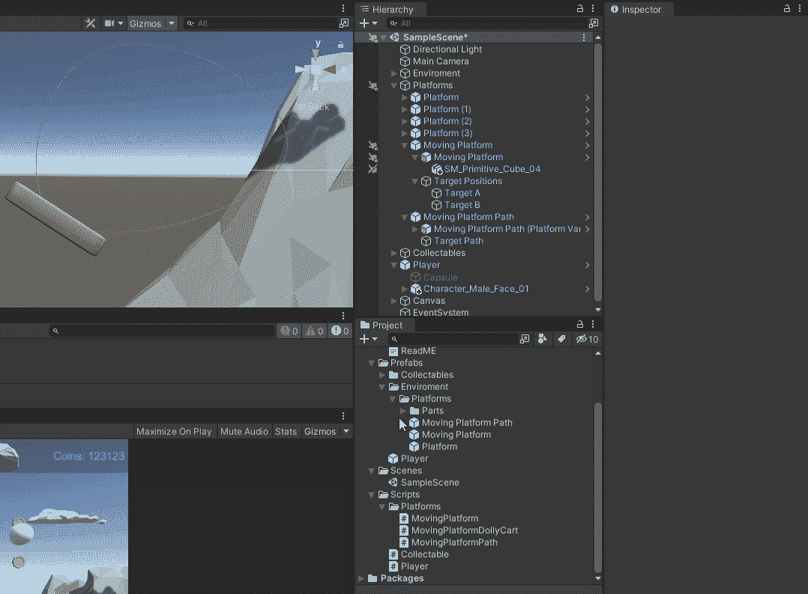

现在我需要做的就是将触发时进入和触发时退出代码从移动平台复制到移动平台推车。

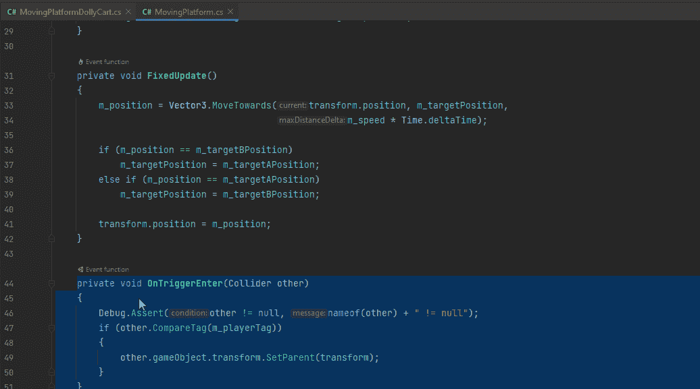

现在玩家会随着平台移动。最终在重力作用下将玩家甩下。

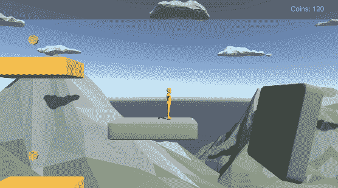

# 位置单位

根据位置单位的设置，取决于平台如何沿路径移动。距离速度控制它沿距离移动的速度。路径单位速度控制它从一个路径点移动到下一个路径点的速度。标准化速度控制它从 0 到 1 移动的速度。

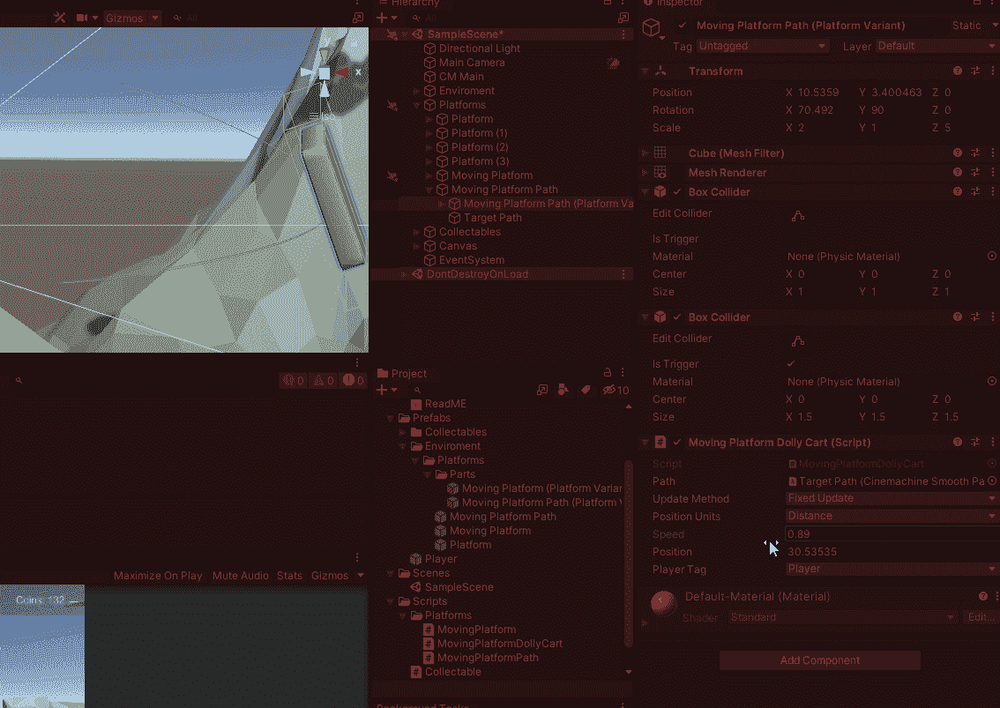

# 修改路径

现在我可以得到各种不同的结果，只要改变它所遵循的路径，不管它是不是循环，以及改变速度。我能用移动平台做的事情有无限的可能性，尤其是触发器和 Unity 事件。我可以让速度为 0，直到玩家落在上面，然后它开始移动。我可以在某个地方设置一个开关来启动游戏物体，它就会开始移动。我可以通过在 revers 中设置匹配第一组的点，并将其设置为循环，使其自动乒乓。我可以完全控制它，而无需添加任何代码行。使其成为比使用

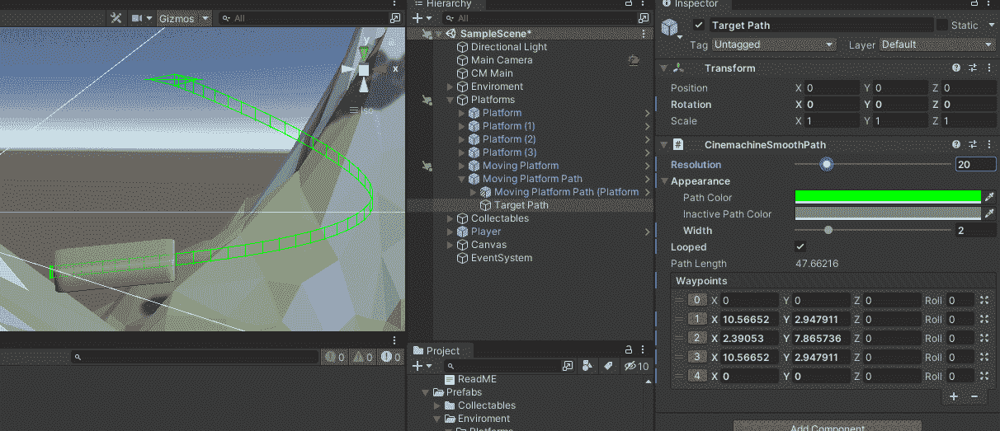

# 分离逻辑

因为父对象的设置不同于移动平台的逻辑，所以最好将这个逻辑分离出来，形成一个新的行为。这允许我完全移除自定义移动平台轨道小车，并允许我决定是否需要此行为。因为使玩家成为该对象的父对象可能会导致一些不希望的效果。

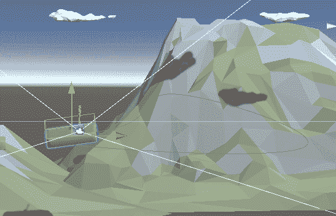

我删除了移动平台推车轨道，创建了一个新的平台行为移动播放器。我将触发器 Enter 和触发器 Exit 代码放入新行为中。我从移动平台上移除了触发进入和触发退出代码。然后我将新的带平台的移动玩家添加到移动平台部分预设中。我还将 Cinemachine Dolly 轨道组件添加到移动平台路径中。

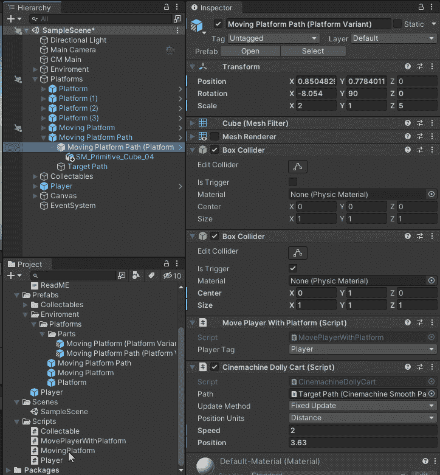

# 修正了玩家奇怪的旋转

我将让玩家带着这个物体移动，而不是设置玩家的父母。我将 set parent 代码改为缓存玩家的变换。我添加了一个检查，看看是否有另一个转换，如果没有，我就退出这个方法。

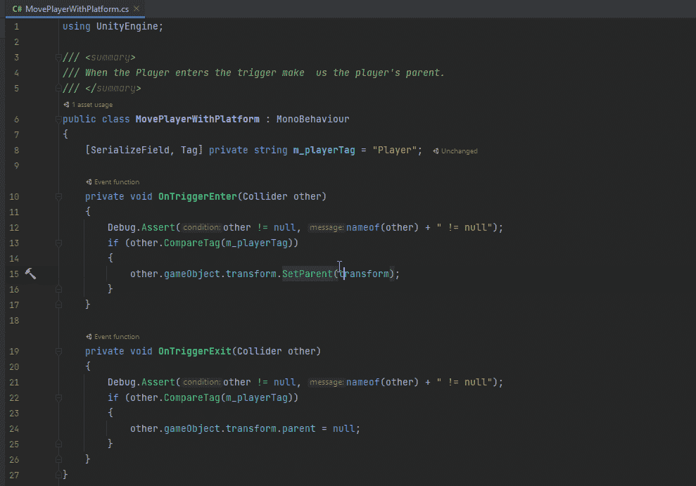

在固定更新方法中，我将玩家的位置设置为这个位置。如果我仍然使用固定的更新方法，那么还有另一个转换。

现在，这种方法有效，但并不完全符合要求。

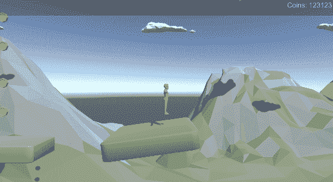

诀窍是按照平台移动的量来移动另一个变换。为了得到位置的变化，我用平台的当前位置减去平台的最后位置。我把这个数量加到玩家的位置上。然后，我将平台的最后位置设置为平台的当前位置。我确保当玩家输入触发器时，我将平台的最后位置设置为平台所在的位置。

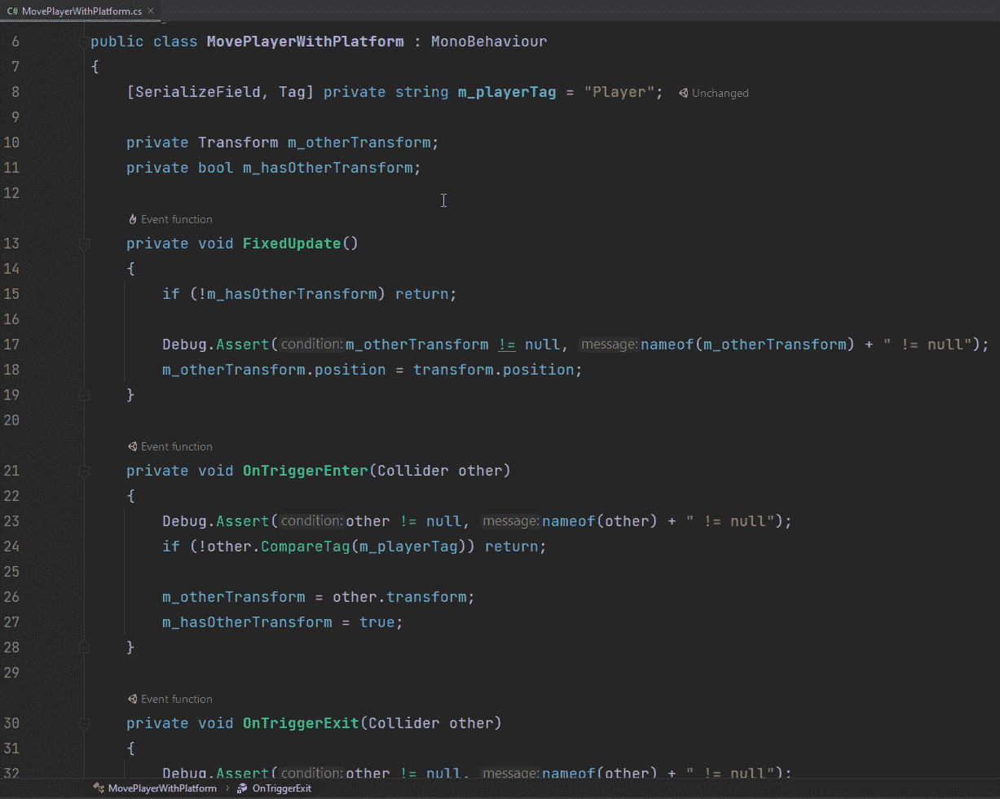

现在我的球员随着平台移动，我没有得到任何奇怪的旋转应用到球员身上。

