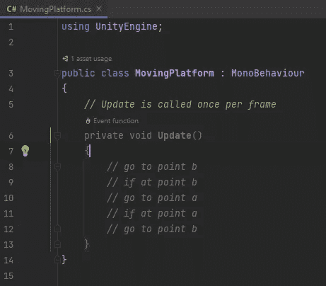

# 在 Unity 中移动平台

> 原文：<https://blog.devgenius.io/moving-platforms-in-unity-4d7299b2d013?source=collection_archive---------2----------------------->

## 在两个变换之间移动

首先，我需要决定我将使用哪个平台作为移动平台。我将使用最后一个平台(4)。我把它重命名为移动平台，添加了一个移动平台行为作为组件。

# 在两点之间移动

我希望我的平台能在两点之间来回移动。

要移动平台，我将使用`[**Vector3.MoveTowards**](https://docs.unity3d.com/2021.1/Documentation/ScriptReference/Vector3.MoveTowards.html)`。

我需要一个目标位置和速度。为了在两个位置之间来回切换，我需要目标位置来移动，我将在检查器中指定这些位置作为变换。

现在我要做的就是选择我需要移动到的位置。如果我在位置 b，那么我需要移动到位置 a，如果我在位置 a，我需要移动到位置 b。

现在我需要在 Unity 中添加目标转换，并将它们添加到移动平台组件中。

我把目标定位，然后把它变成一个预制的。

我现在有一个移动平台。但是有一个问题。我的玩家不随平台移动。

# 用平台移动玩家

为了解决这个问题，我将使用触发器来检测玩家何时进入和退出平台。

我需要确保给移动平台加一个触发器。我可以在一个物体上安装多个碰撞器。

现在，我让平台在进入触发器时成为玩家的父平台，并在退出时让玩家的父平台为空。

当我跳到平台上时，我的玩家确实得到了作为其父平台的平台，但是它仍然不能很好地与平台一起移动。

这是因为我是如何做我的运动代码的，平台和玩家在更新中都有运动代码。对此的一个修复是使用一个名为 [**的物理更新固定更新**](https://docs.unity3d.com/2021.1/Documentation/ScriptReference/MonoBehaviour.FixedUpdate.html) 为平台的运动代码。

现在我的角色随着平台移动。

