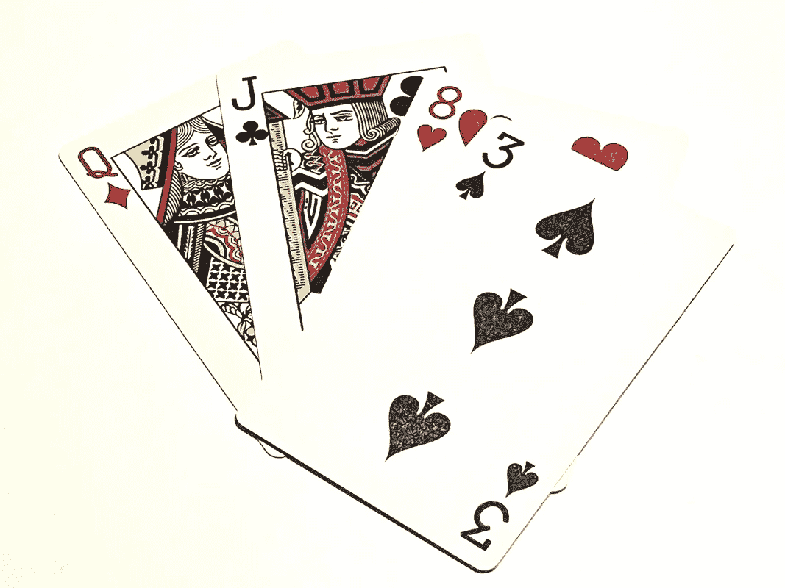
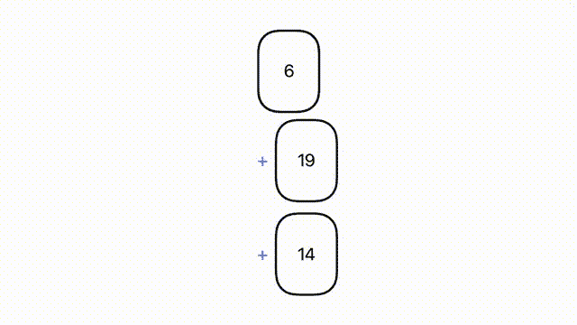
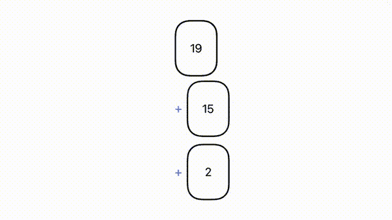
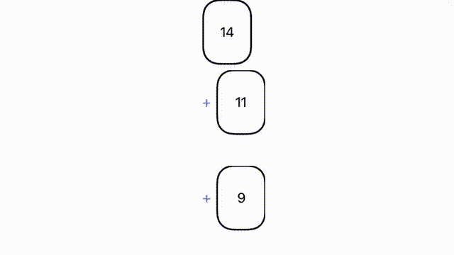

# 在 SwiftUI 中移动视图

> 原文：<https://blog.devgenius.io/moving-views-around-in-swiftui-271b5bb4fdd8?source=collection_archive---------6----------------------->

我们来玩个游戏吧！

在 SwiftUI 的早期，我组装了一个纸牌游戏(为了好玩),大部分都做得很好，但我不知道如何将纸牌从牌堆中移到玩家手中。iOS 14 此时处于测试阶段，我发现了对其新的*matchegeometryeffect*修改器的引用，这似乎是答案。不幸的是，当时我还不能利用测试版的特性，所以这个项目陷入了停顿。

快进到现在，我终于发现自己回到了在 SwiftUI 中移动扑克牌的概念，现在可以愉快地使用*matchegeometryeffect*！我挣扎了一会儿，想知道如何让它工作起来，我没有遇到任何博客处理我所面临的具体问题(他们都专注于为“英雄动画”移动*视图*，这有点不同)，所以我想我应该写下我的发现，希望它能帮助其他人！

总结一下我所追求的行为:

*   卡片在移动时不会改变大小
*   当纸牌需要在不同的手牌和/或主副牌之间移动时，它们应该以真实的方式平稳地移动

对于那些渴望获得完整代码解决方案的人，你可以在我的 GitHub [这里](https://github.com/ChrisMash/SwiftUI-Playing-Cards)查看完整的示例项目。对于那些想了解这一过程的人，请继续阅读！

# 第一步:模特

首先，我们需要纸牌游戏中的对象的一些模型:

我们有一张*牌*和一只*手*，其中包含一组*牌*。

*卡片*是*可识别的，*是 SwiftUI 经常需要的(因此它知道如何处理不同于另一个视图的视图的引入或移除)，并且*等同于*以便于在数组中找到卡片。*牌*拥有的唯一其他数据是一个代表其价值的数字(在这个例子中没有花色或牌面)。

出于同样的原因，*手*也是*可识别的*，并且它是一个*可观察的对象*，因为我们的*视图* s 想要知道牌何时被添加到手上，或者何时被移除。 *cards* 数组使用*@ Published*property*包装器，以便它自动向正在监视变化的*视图*报告变化。*

# *第二步:游戏状态*

*接下来让我们创建一个对象来保存游戏的状态:*

*它只是保存了一副牌(由*手*模型表示，因为它完成了我们当前需要它做的工作)和一组代表游戏中玩家的*手*模型。*

**init* 用 20 张牌设置一副牌，洗牌，然后创建两个*手*和一个*牌*开始游戏。*

# *第三步:卡片视图*

*接下来让我们创建一个*视图*来表示一张*卡片*:*

*大多数情况下相当简单。我们已经有了一个带有两个代表卡片背景和边框的 *ZStack* 和两个 *RoundedRectangle* ，在此之上，我们用一个*文本*呈现卡片的值。*

*我们有一个*名称空间*属性，类型为*名称空间。ID* ，被传入*视图*。这是对 *matchedGeometryEffect* 的一个要求，提供卡片存在的上下文。在这个例子中，我使用了*卡*的值作为*matchegeometryeffect*的 id，因为它足够唯一，可以在*卡*在*视图*之间移动时识别出它。*

*根据我找到的一些其他博客，我遇到的第一个问题是，虽然我可以让卡片动画到它们的新位置，但有一个渐变动画被应用。这张卡片似乎立刻从原来的位置消失了，然后在移动到新位置时又消失了:*

**

*除了卡片在移动过程中褪色之外，一切都很好*

*这种行为在我看到的其他博客中没有显示，所以我不确定这是 iOS 14 和 15 之间的差异还是我的代码中有细微的不同。*

*经过更多的挖掘，我偶然发现了一个博客，它指出这是应用于视图动画的默认过渡样式(在任何场景中，不仅仅是使用*matchegeometryeffect*)。我研究了改变过渡到不影响不透明度的东西，最终我发现使用缩放过渡，设置为 1，是我所能找到的最好的选项，用于期望的“不要影响*视图*的外观，只是将它移动到新的位置”。*

*我想在这里指出的另一件事是，我阅读的关于英雄动画的其他博客说，你应该将*matchegeometryeffect*修改器放在任何*帧*修改器之前，以获得想要的效果。对于英雄动画，你需要考虑到帧的变化，这样才有意义。在我的例子中，框架保持不变，所以没有必要。事实上，在把我的例子放在一起的时候，它**有**要放在帧之后，否则，动画就全乱了。实际上，我现在不能重现这个问题，但它可能是你遇到的问题，所以请记住视图修饰符的顺序通常很重要！这对所有 SwiftUI 工作来说都是公平的好建议！*

# *步骤 4:预览和名称空间*

*我发现我必须对这个*视图*的 *PreviewProvider* 结构进行一点创新，因为名称空间被传入并且 *previews* 属性是 *static* :*

*基本上，我们定义了一个*视图*，它包含了 *CardView* ，并且可以传入一个*名称空间。ID* 这就是我们从*预览*中返回的内容。*

# *第五步:手的视角*

*接下来让我们创建一个*视图*来表示一只*手*:*

*这里我们将传入*手*，*名称空间。ID* 和当卡片被点击时的关闭。手使用 *@ObservedObject* 属性包装器，以便*视图*响应手发布的更改(即添加/删除卡片)并在必要时重新构建自己。*

*我们简单地有一个 *HStack* 来呈现*手*中的每个*卡片*，如果它们中的任何一个被点击，它就调用传递到*视图*中的闭包。*

# *第六步:甲板景观*

*接下来让我们创建一个*视图*来表示主副牌:*

*与 *HandView* 非常相似，但是我们只渲染了 *ZStack* 中的最后两张卡片，所以它们在彼此之上，就像一副叠起来的卡片。*

# *第七步:把所有东西放在一起*

*最后，让我们一起把它放入主*内容视图*:*

**ContentView* 创建 *GameState* 并持有它(根据您的层次结构，您可能希望将它传递到视图中)。它还为传递给每个 *CardView* 的*matchegeometryeffect*提供顶级 *@Namespace* 上下文。*

*这个*视图*非常简单。顶部有一些简短的说明，解释你如何与卡片互动，随后是*桌面视图*和*手视图*根据*游戏状态*中的*手*。每个*手视图*还有一个“+”*按钮*，它允许你将*卡片视图*从*桌面视图*拖到那个*手视图*中，每当你点击*手视图*中的*卡片视图*时，它就将它移回*桌面视图**

*通过在相关的*手*模型之间移动*卡片*模型，在带有动画关闭的*内移动卡片，就可以简单地在卡片组和手之间移动卡片，这样 UI 就知道我们想要它动画。 *CardView* 中的 *matchedGeometryEffect* 和 *transition* 修改器向 SwiftUI 提供关于它应该如何执行这些动画的信息。**

**

*最后的结果！*

*就是这样！如前所述，在我的 GitHub [这里有一个完整的示例项目。](https://github.com/ChrisMash/SwiftUI-Playing-Cards)*

*欢迎留下任何反馈意见或问题！*

# *您仍可能面临的问题*

## *不同的 iOS 版本*

**iOS 14 提供了 matchegeometryeffect*，不过我只在 iOS 15 上测试了我的例子，所以如果你想在 iOS 14 上使用它，可能会有一些不同。该示例针对 iOS 14 进行了编译，但 SwiftUI 仍处于初级阶段，因此不同的操作系统版本可能会有问题！*

## *重复视图错误*

*我在观察不同的*手*之间的纸牌移动时遇到了一些麻烦。有时动画不会发生，控制台会记录一个错误，提示不同的*视图*同时出现重复的 id。因此，这可能是你最终会遇到的事情，并且很难找出如何避免它。*

*在我引入 *DeckView* 之前，我的设置没有成功，只是将它的 *ZStack* 直接包含在 *ContentView* 中。因为无法观察到*游戏状态*的牌组的*手*，这意味着当卡片移入/移出牌组时，SwiftUI 会重建一些*视图*，但并不认为牌组本身需要重建。所以只要试着确保任何可以改变的东西都被观察到，这样 SwiftUI 就知道它需要重建了！*

## *滚动查看问题*

*将卡片放在*滚动视图*中对玩家的手来说可能是可取的，否则它很容易离开屏幕，特别是在纵向 iPhone 上。不幸的是，这种转变并不顺利。当卡片从卡片组移动到手中时，它呈现在 *ScrollView* 的裁剪过的画布上，而不是在顶部，所以你会看到它不知从哪里滑了进来。希望这是在未来的 iOS 版本中可以解决的问题！*

**

*ScrollView 错误！*