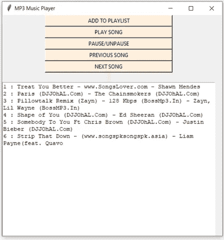

# Python 中使用 Tkinter 和诱变剂的 MP3 播放器

> 原文：<https://blog.devgenius.io/mp3-player-using-tkinter-and-mutagen-in-python-6fec027aeced?source=collection_archive---------6----------------------->

有时候只需要一首好歌就能勾起成千上万美好的旧日回忆！有什么比创建自己的 MP3 播放器和听你的个性化播放列表更好的呢？

MP3 音乐播放器

# 摘要

音频是一种重要的通信来源，在当今时代与文本同等重要。我们知道音频文件是数字文件。因此，需要一种工具来运行数字文件，或者换句话说，播放文件。没有这个工具或播放器，我们将永远无法听音乐、电影或任何音频文件的内容。

因此，我们需要 MP3 播放器。这是一个用来播放 MP3 和其他数字音频文件的设备。我们可以自己构建，而不必下载和安装高级音乐播放器。MP3 播放器 GUI 项目想法试图模拟物理 Mp3 播放器。

这个程序将允许你在你的台式机或笔记本电脑上播放歌曲、音乐和所有 MP3 文件。使用 Python 的 MP3 播放器是使用编程语言 Python 构建的基本编程应用程序。这是一个通过 Python 库 Tkinter、Pygame 和 Mutagen 构建的 GUI 程序。

MP3 播放器应用程序应该具有播放歌曲、创建和显示播放列表、暂停和继续播放以及改变歌曲(即播放上一首或下一首歌曲)的能力。

# 介绍

我们需要一个允许我们播放或收听数字音频文件的应用程序。MP3 播放器是播放 MP3 和其他数字音频文件的设备。MP3 GUI 程序应用程序试图模拟物理 MP3 播放器。这个程序将允许你在你的台式机或笔记本电脑上播放歌曲、音乐和所有 MP3 文件。

这个项目的主要目标是允许用户播放 MP3 和数字音频文件。为了吸引用户，应用程序必须有一个简单但漂亮的用户界面。

这个 GUI 项目是使用 Python 编程语言开发的。应用程序的 GUI 方面是使用 Python 的 Tkinter 库构建的。处理 MP3 文件的应用程序的交互部分使用 Pygame 和诱变剂库。

你可以有一个列出可用 MP3 文件的界面。您还可以让用户选择列出其他非 MP3 的数字音频文件。用户还期望 MP3 播放器具有显示正在播放的文件的信息的界面。您可以包括的一些信息有文件名、文件长度、播放量和未播放量，以分钟和秒为单位。

Python 有可以播放音频文件的库，比如 Pygame，它允许你用几行代码处理多媒体文件。类似的库有 Pymedia 和 Simpleaudio。这些库可以处理大量的数字音频文件。它们可以处理其他文件类型，而不仅仅是 MP3 文件。您还可以实现允许用户创建播放列表的功能。为此，您需要一个数据库来存储创建的播放列表的信息。Python 的 sqlite3 模块允许您使用 sqlite 数据库。

在这种情况下，SQLite 数据库是更好的选择，因为它是基于文件的，比其他 SQL 数据库更容易设置。虽然 SQLite 是基于文件的，但它比常规文件更适合保存数据。

# 问题描述

1.  使用 Python 编程语言构建一个 MP3 播放器，能够播放和收听歌曲、MP3 文件和其他数字音频文件。
2.  确定 MP3 播放器的功能。
3.  播放器应该有一个简单易用的图形用户界面与各种功能的选项，显示屏显示整个播放列表和按钮关闭播放器。
4.  播放器应该可以播放任何歌曲。它应该能够播放 MP3 文件或任何其他数字音频文件。
5.  播放器应该允许用户浏览计算机驱动器的内容，以选择要播放或排队的歌曲。
6.  它应该为用户提供暂停或恢复歌曲的选项。
7.  用户应该能够播放播放列表中的上一首或下一首歌曲。
8.  最后，用户应该获得当前播放歌曲的基本细节。细节可以包括歌曲名、歌手名、歌曲持续时间、文件大小等。

# 算法

1.导入库。
2。创建 tkinter 和 Pygame 库的对象。
3。使用 Tkinter 对象创建一个窗口。
4。添加提供不同功能的按钮。
添加歌曲
播放歌曲
暂停歌曲
播放上一首歌曲
播放下一首歌曲
5。当按下添加歌曲按钮时，应该会打开一个对话框来浏览和选择文件。
6。添加标签以显示歌曲的信息。
姓名
歌手
时长
文件大小等。
7。显示屏将显示整个播放列表的详细信息。
8。关闭按钮将自动清除歌曲列表并将停止播放歌曲

# **功能性 MP3 播放器**

MP3 播放器

将歌曲添加到播放列表

将多首歌曲添加到播放列表

显示的播放列表

播放歌曲—播放列表中最靠前的歌曲

暂停/取消暂停歌曲

播放下一首歌

播放上一首歌曲

# 结论

MP3 播放器是一种用来播放和收听数字音频文件的设备。这些可以是 MP3 文件或其他一些音频文件。播放器是用 Python 语言构建的。开发了一个简单易用的应用程序 GUI 实现。

该应用程序为用户提供了五个选项——将歌曲添加到播放列表、播放歌曲、暂停或继续播放歌曲、播放上一首歌曲和播放下一首歌曲。

播放器还能够同时向播放列表添加多首歌曲。它有一个大的显示区域，播放列表是可见的。

一旦选择并播放了一首歌曲，我们就可以听到它，还可以在显示屏上看到歌曲的详细信息。该信息包括关于歌曲的细节，例如歌曲名称、歌手姓名、歌曲持续时间、文件大小等。

Python 的 Tkinter 库用于创建项目的 GUI。它用于创建选项按钮、标签和显示区域。

Pygame 和诱变剂库用于添加歌曲、播放歌曲、提供暂停和恢复选项。

总之，这是一个成功的项目，歌曲会一首接一首地自动播放，整个播放列表会在结束后重新播放。

_____________________________________________________________

_____________________________________________________________

MP3 播放器的源代码可以在 Github 资源库中找到:

 [## srinidhi 14 vaddy/MP3-播放器-使用-Tkinter-和-Python 中的-诱变剂

### 音频是一种重要的通信来源，在当今时代与文本同等重要。我们知道音频文件…

github.com](https://github.com/srinidhi14vaddy/MP3-Player-using-Tkinter-and-Mutagen-in-Python) 

欢迎所有建议、意见和反馈！如果认为有价值，请鼓掌奖励！