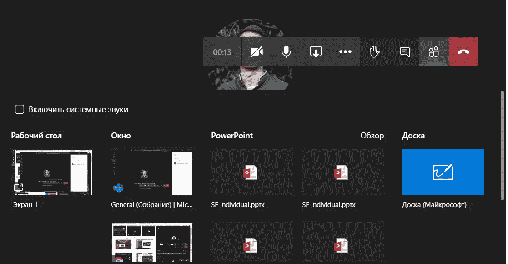

# 您不知道的 MS Teams 功能

> 原文：<https://blog.devgenius.io/ms-teams-features-you-didnt-know-about-b60a25ecf308?source=collection_archive---------46----------------------->

## 你现在应该利用的最佳特性

(图片由 Mio Dispatch 提供)

微软团队是目前最流行的协作软件之一。不用说，它有它的优点和缺点。但是如果你正在使用它，不妨了解一下它免费提供的这些有用或简单有趣的功能。

# 斜线命令

(图片由开发者提供)

MS Teams 最近引入了一种编码功能。这实际上比听起来要简单得多。通过在搜索栏中输入命令，你现在甚至不用鼠标就可以完成很多事情。例如，通过键入“/离开”，您的状态将更改为“离开”。以下是更深入的功能列表:

*   /activity —查看某人的活动
*   /可用—将您的小组状态更改为“可用”
*   /away —将您的小组状态更改为“离开”
*   /busy —将您的小组状态更改为“忙碌”
*   /call —发起呼叫
*   /dnd —将您的团队状态更改为“请勿打扰”
*   /files —查看您最近的文件
*   /goto —转到某个团队或频道
*   /help —获得帮助(与团队；不是“躺在沙发上”的那种)
*   /join —加入团队
*   /keys —查看键盘快捷键
*   /mentions —查看您的所有提及(如果您的团队渠道非常繁忙，这很方便！)
*   /org —查看组织结构图(您的或其他人的)
*   /saved —查看您保存的列表
*   /未读—查看所有未读活动
*   /whatsnew —查看团队中的新功能
*   /who——向 Who(一款新应用，可让您按姓名或主题搜索人员)提问

# 背景图像

这个很受欢迎，但如果你不知道它真的很有趣。开会时，您可以按下三个点并选择*背景效果*。

您将看到一个类似于左边的窗口。它允许电话中的任何人隐藏他们肮脏的房间或转移到外太空，有大量的背景可供选择。

此外，您可以添加自己的背景。随着新的更新，它比以往任何时候都更容易，所以请确保您有一些乐趣。

# @提及次数

许多 messenger 应用程序允许您在群聊中标记特定的人，Teams 也不例外。通过键入@username，这个特定的人将获得一个单独的通知，并且他被提到的消息将被突出显示。此外，您可以使用@team 或@channel 通知整个群组。

# PowerPoint 集成

微软一直擅长将他们的应用程序连接在一起。例如，在团队中，您可以直接使用 PowerPoint，而不必共享您的屏幕。在共享部分，您可以选择 PowerPoint，它会很好地加载到会议中。然后，每个人都可以滚动和演示。

# 摘要

MS Teams 有很多普通用户可能不知道的小功能。不要害怕尝试和寻找其他功能，因为我只涉及了几个。请在评论区告诉我你接下来会尝试哪些功能。