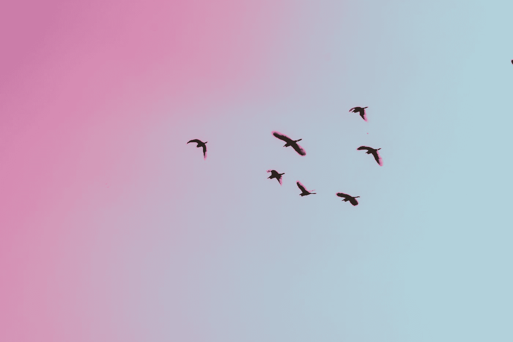

# 多智能体算法:粒子群优化

> 原文：<https://blog.devgenius.io/multi-agent-algorithms-particle-swarm-optimization-6f11e6b35736?source=collection_archive---------15----------------------->


达米安·图皮尼尔在 [Unsplash](https://unsplash.com?utm_source=medium&utm_medium=referral) 上拍摄的照片

我们开始谈论[人工智能](/entering-the-artificial-intelligence-maze-d58fb6eb5554)，我们已经涵盖了两个最突出的策略:[进化算法](/evolutionary-algorithms-theoretical-aspects-of-evolution-c7dd021d8bd3)和它们的生物有机体启发的变体[遗传算法](/genetic-algorithms-applied-evolution-1c3afa0f7f3f)。这两种算法实现了促使系统产生越来越好的结果的进化特征。实际上，越来越好意味着更接近适应度函数中指定的所需结果。算法用复杂性换取时间。计算是琐碎的，但它们必须在多代中运行许多次才能得到可用的结果。

另一个受自然启发的人工智能策略是粒子群优化。在这种情况下，我们偏离了进化是如何工作的，我们选择了进化产生的东西:寻找食物并能够找到食物并将其分配给整个群体的成群昆虫。这里的要点是，虽然昆虫没有太多的推理能力，但它们能够简单地通过将智能外包给它们所拥有的唯一优势来模仿智能:它们的数量众多。这样的交易如何运作？让我们来了解一下！我的 [Github](https://github.com/raduzaharia-medium/particle-swarm-optimization) 页面上也有一个例子，但是我鼓励你跟随这篇文章并构建你自己的例子。

## 实现社交智能


照片由 [Hannah Busing](https://unsplash.com/@hannahbusing?utm_source=medium&utm_medium=referral) 在 [Unsplash](https://unsplash.com?utm_source=medium&utm_medium=referral) 上拍摄

科学家们再次将一个非常复杂的主题归结为可触摸的功能，同时避免整个哲学讨论。昆虫是如何找到食物的？鸟类在飞行中是如何相互跟随的？他们怎么能什么都不说就交流呢？事实证明，它们确实通过留下化学痕迹来传递信息。随着越来越多的昆虫沿着这条路走，更多的化学物质留在同一条路上，召唤更多的昆虫沿着同一条路走。

但是计算机科学家更进了一步:我们关心他们如何交流吗？如果一只昆虫找到了食物，并神奇地让整个群体都知道了，那么群体的其他成员也可以跟着做。虽然这不是一个非常聪明的算法，但它完美地说明了一只昆虫和一个群体之间的区别。你看，如果只有一只昆虫进行搜索，那就不能作为一个智能系统。如果有 100 个人去寻找，就会有神奇的事情发生。我们将此建模为坐标:

```
let bee1 = [20, 30];
let bee2 = [60, 60];
```

我们有两只蜜蜂，都放在地图上。一个在坐标`(20, 30)`，一个在`(60, 60)`。它们都在寻找食物。如果他们发现了什么，他们需要将那个地方标记为兴趣点:

```
let bee1 = [20, 30];
let bee1LastPlaceFoodFound = [95, 45];let bee2 = [60, 60];
let bee2LastPlaceFoodFound = [77, 60];
```

他们都知道目前为止发现的最好的地方。这些信息在它们之间共享，并随着新食物来源的发现而更新:

```
let bestPlaceSoFar = [30, 30];let bee1 = [20, 30];
let bee1LastPlaceFoodFound = [95, 45];let bee2 = [60, 60];
let bee2LastPlaceFoodFound = [77, 60];
```

信不信由你，这就是我们模仿智能所需要的一切。接下来发生的是一个简单的公式，让每只蜜蜂遵循它的路径，同时考虑它所拥有的信息:最后发现食物的地方和蚁群中任何其他人发现食物的最佳地方。

## 实施运动



照片由[gauravdepe Singh Bansal](https://unsplash.com/@gauravdsb?utm_source=medium&utm_medium=referral)在 [Unsplash](https://unsplash.com?utm_source=medium&utm_medium=referral) 上拍摄

让我们让蜜蜂动起来。同样，我的例子是两只蜜蜂，但要开始获得真正的智慧，我们需要数百只蜜蜂。获得的智能仍然只是在我们问题的解决方案空间中的引导搜索。但是再次增加了一定的压力，以使解决方案朝着越来越好的结果发展。像进化和遗传算法一样，它不是随机搜索，而是受控的智能搜索:

```
function moveBee1() {
  bee1[0] += 
    2 * Math.random() * (bestPlaceSoFar[0] - bee1[0]) +
    2 * Math.random() * (bee1LastPlaceFoodFound[0] - bee1[0]);
  bee1[1] +=
    2 * Math.random() * (bestPlaceSoFar[1] - bee1[1]) +
    2 * Math.random() * (bee1LastPlaceFoodFound[1] - bee1[1]);
}
```

运动是目前已知的三个位置之间的舞蹈:当前位置、蜜蜂目前找到的最佳位置和蜂巢找到的总体最佳位置。我们用前面乘以的`2`来衡量这支舞。在上面的例子中，两个地方同等重要。我们可以定制蜜蜂的行为，让它更喜欢全局最优，或者让它更信任过去发现自己更好的行为。这将使它徘徊在自己的众所周知的地方，它以前发现食物。如果我们让它更信任这个群体，它会很快离开自己的领地。不管怎样，我们的价值`2`也受到健康的`Math.random`的影响。

请注意，蜜蜂不会简单地在不同的地方进行瞬间移动。新的位置是当前位置和下一个位置之间的差异，所以它很可能会在中间的某个地方结束。这一点至关重要，因为尽管我们已经知道了更好的地方，我们仍在进行搜索。其他地方可能会有更好的地方。从数学角度来说，这意味着我们不会误陷入局部最优，而忽略了附近的全局最优。

我们也可以在方程中加入更多的因子。一个非常受欢迎的是速度。为了给我们的蜜蜂增加速度，我们只需在方程中加入一个新的因子，比如:`2 * Math.random() * bee1Speed[0] * (bestPlaceSoFar[0] — bee1[0])`。速度与空间的维度相同，所以我们会有两个速度坐标，就像我们的搜索平面一样。我们可以将蜜蜂的速度设置为固定的，我们可以为所有的蜜蜂设置一个单一的速度，我们可以将其设置为`Math.random`:两种方式都可以。我们也可以及时提高或降低速度。这种模拟的现实极限正是我们所希望的。

## 评估食物来源


[莉莉·班丝](https://unsplash.com/@lvnatikk?utm_source=medium&utm_medium=referral)在[号航天飞机](https://unsplash.com?utm_source=medium&utm_medium=referral)上拍摄的照片

我们有蜜蜂，我们让它们移动，但蜜蜂仍然有一项非常重要的工作:它必须四处走动，评估它目前的位置是否合适。如果是这样，它必须让殖民地知道。就像以前的进化算法一样，我们必须在一个适应度函数中实现大脑的整个程序。当前职位的适合度告诉我们它与我们要解决的问题的关系有多好:

```
function evaluate(position) {
  var optimalPosition = [300, 200]; return (
    Math.abs(optimalPosition[0] - position[0]) +
    Math.abs(optimalPosition[1] - position[1])
  );
}
```

请注意，在最明显的层面上，我在作弊。我实际上是在告诉蜜蜂最佳点在哪里，全局最佳点在搜索平面上的位置。通常，您会有一个您想要优化的方程，所以这将是您运行方程中的蜜蜂坐标并返回结果的地方。接下来将由蜜蜂来发现更好的东西，或者决定结束搜寻并决定他们发现了什么。

现在我们有了评估函数，就有了完成优化程序所需的一切。我展示了单只蜜蜂的算法，实际上这将是一个贯穿整个蜂房的循环:

```
function optimize() {
  moveBee1(); let bee1Fitness = evaluate(bee1); if (bee1Fitness < evaluate(bee1LastPlaceFoodFound))
    bee1LastPlaceFoodFound = bee1; if (bee1Fitness < evaluate(bestPlaceSoFar))
    bestPlaceSoFar = bee1; 
}
```

基本上，我们的优化函数只是简单地接受蜜蜂，移动它们，评估它们的位置，如果当前位置比它们最后一次知道的最佳位置更好，就更新它。此外，如果当前位置比整个殖民地最后一个最著名的地方更好，通过更新它向每个人发出信号。就这样。这就是我们使用虚拟昆虫群体优化功能所需要的全部。

由此产生的虚拟运动看起来非常接近一个接近食物来源的真实蜂巢。它也像一群鸟在飞行中跟随一个领导者。它可以自然地模仿这些复杂行为的事实表明，复杂的行为可能会从非常简单的计算中产生。它还表明，让单个个体寻找食物就像在黑暗中磕磕绊绊，而在混合中加入越来越多的相互交流的个体，会立即将整个场景转变为类似自然的东西。

我在 [Github](https://github.com/raduzaharia-medium/particle-swarm-optimization) 上添加的解决方案提出了文章中描述的简单粒子群优化问题，但有所改变:我添加了整个场景的图形表示，这样我们就可以查看它，看看虚拟粒子如何很好地接近全局最佳值，同时仍停留在局部最佳值。他们不急于达到全球最佳，而是稳步向它努力，考虑到所有其他可能性。

我希望你喜欢这篇文章。下次我们将讨论[神经网络](/modelling-the-brain-neural-networks-6b1149fef1cc)，另一种人工智能算法，这次是模仿大脑。虽然想到这一点很酷，但它确实有一个巨大的缺点:就像生物大脑一样，我们可能永远无法窥视它的内部，看看它是如何做出决定的。下次见！