# 如何解决多臂土匪问题:乐观初始值算法

> 原文：<https://blog.devgenius.io/multi-armed-bandit-problem-optimistic-initial-values-89c10f04974c?source=collection_archive---------2----------------------->

## ε-贪婪算法的升级

照片由[贾尔·施米特](https://unsplash.com/@jarl_schmidt?utm_source=medium&utm_medium=referral)在 [Unsplash](https://unsplash.com?utm_source=medium&utm_medium=referral) 上拍摄

在的上一篇文章中，我解释了ε-贪婪算法，以及它如何受益于对不同强盗足够次数的探索，最终识别出最优的一个。

不过，你一定注意到了，这种模式( ***【蓝线】*** )所能达到的最大奖励率总是略低于最优强盗的奖励率( ***【绿线】*** )。

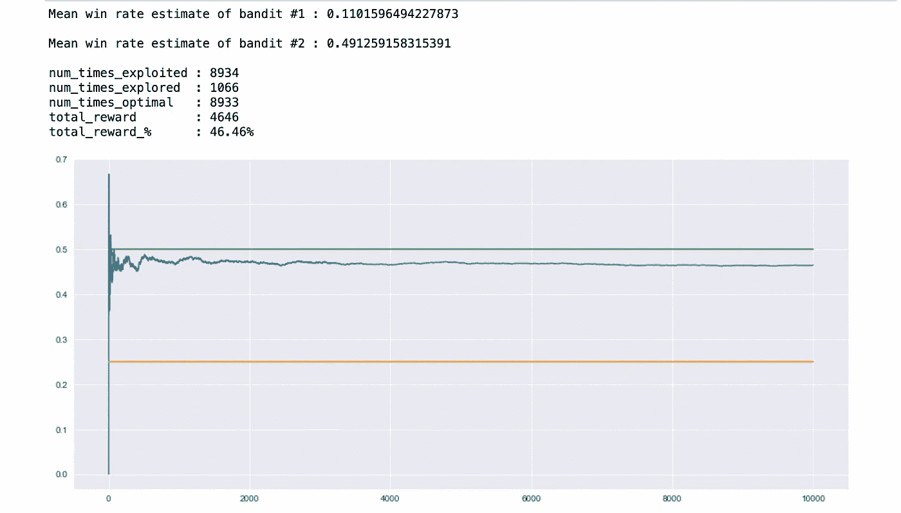

ε贪婪算法的仿真结果

具有讽刺意味的是，总体报酬率的这种轻微下降是由于探索因素，正是这一因素使得这一算法如此有效。因为，在整个模拟过程中，模型从不停止探索，在每次迭代中，模型总是有一定的机会去探索而不是开发。

虽然在模拟开始时探索可能是必要的，但随着收集的数据越来越多，重点应该转移到利用收集的数据上。这是一种弥合模型整体胜率和最佳强盗胜率之间微小差异的方法。这个修改叫做 ***衰变ε***。

您可以参考下面的那篇文章，以便更好地理解，因为当前的文章是建立在这篇文章的基础上的。

 [## 如何解决多臂强盗问题:ε-贪婪算法

### 包括代码解释和模拟结果！

blog.devgenius.io](/how-to-solve-the-multi-armed-bandit-problem-epsilon-greedy-approach-ebe286390578) 

*因此，底线是过度依赖探索因子(****【ε】****)会增加选择次优土匪的成本，从而提供比最优土匪稍差的结果。*

那么，如果我们能够在保持一定程度探索能力的同时，将这个ε从等式中去掉，会怎么样呢？

这就是乐观的初始值出现的原因。

# 乐观初始值方法

这种方法之所以如此命名，是因为与ε-贪婪算法不同，我们首先对强盗的胜率持乐观态度，并分配较高的初始胜率。有时甚至比实际可能的还要多。

至于探索因素，我们并不依赖于 Epsilon，而是依赖于这样一个事实，即随着每次迭代，乐观的初始胜率将不断下降至其实际胜率。重点是在校准过程中简单地选择估计胜率最高的 bandit。

胜率估计值的下降将达到这样一个点，即所有次优土匪的胜率估计值将低于最佳土匪的胜率估计值。

然后，我们只是继续选择这个最佳的强盗，并最大限度地获得回报。

## 示范

以下内容将帮助您理解它的工作原理。我们有两个吃角子老虎机(单臂强盗)机器 A 和机器 B，实际胜率分别为 25%和 75%。记住，就像 epsilon-greedy 算法一样，模型不知道实际的胜率。

按照乐观的初始值方法，假设我们给两台机器分配 200%的初始胜率。请注意，可能的最高胜率是 100%,我们分配的初始胜率值根本不可能。

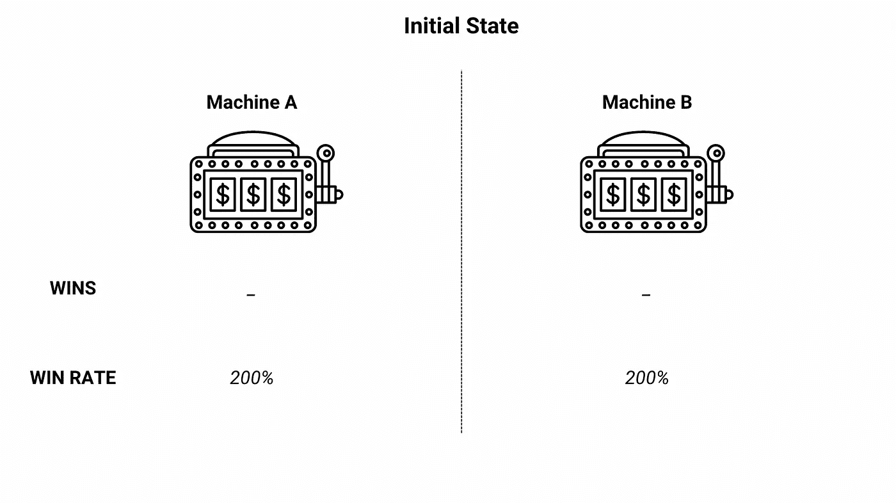

初态

## 迭代 1

由于两台老虎机在初始状态下的胜率相同，我们随机选择一台。

假设，随机选择 A 机，拉匪臂，没有收到奖励信号。

然后计算机器 A 的胜率估计值并存储在结果中。

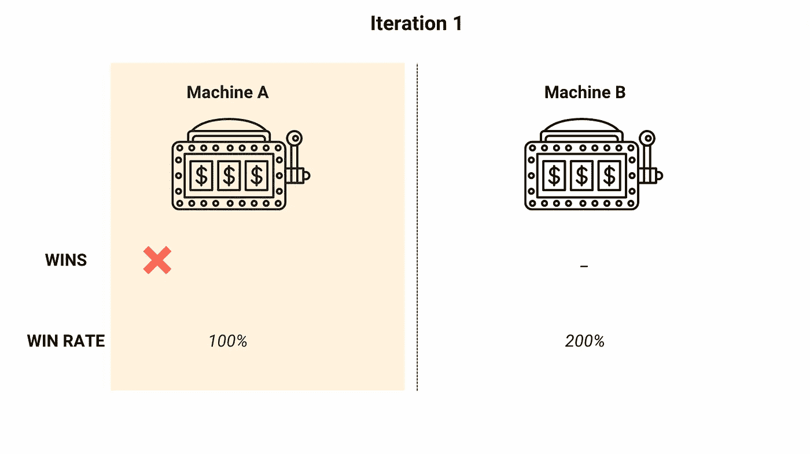

演示—迭代 1

## 迭代 2

迭代 1 后，机器 B 具有更高的胜率估计值，因此被选中(*贪婪方法*)。

土匪手臂一拉，收到了悬赏信号。

计算机器 B 的胜率估计值并存储在结果中。

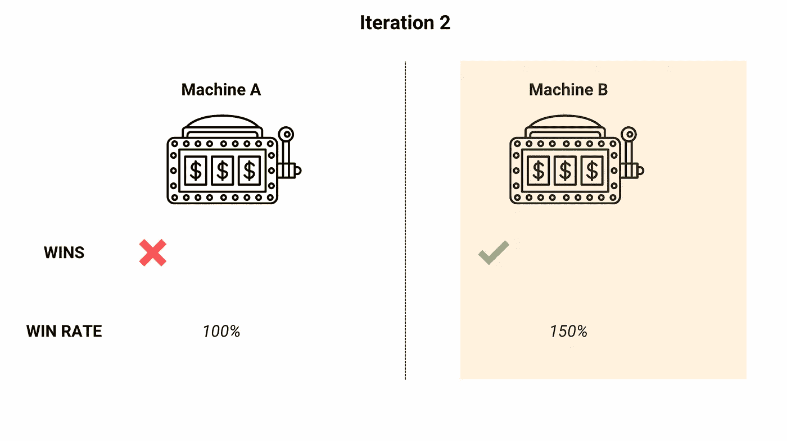

演示—迭代 2

## 迭代 3

迭代 2 之后，机器 B 具有更高的胜率估计值，因此被选中。

土匪手臂被拉，这次没有收到悬赏信号。

计算机器 B 的胜率估计值并存储在结果中。

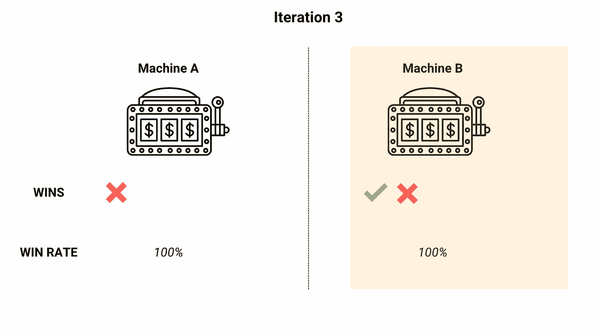

演示—迭代 3

## 迭代 4

迭代 3 后，两台机器都有相同的胜率估计值，因此机器 A 被随机选中。

土匪手臂被拉，没有收到悬赏信号。

机器 A 的修正胜率估计被计算并存储在结果中。

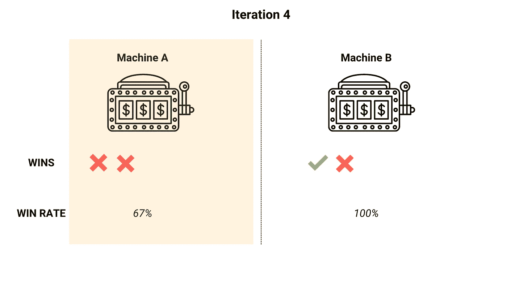

演示—迭代 4

## 迭代 5

迭代 4 之后，机器 B 具有更高的胜率估计值，因此被选中。

土匪手臂被拉，没有收到悬赏信号。

计算机器 B 的胜率估计值并存储在结果中。

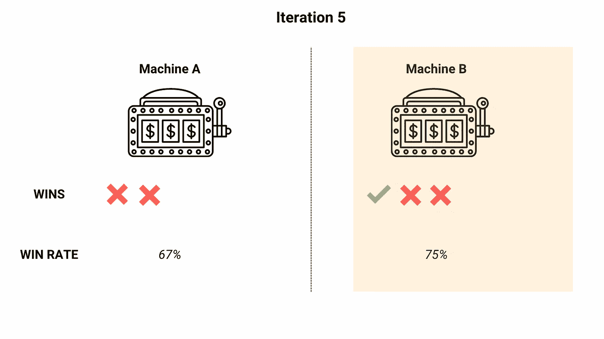

演示—迭代 5

请注意，在此迭代中，满足了两个特殊条件:

*   机器 B 胜率估计值已经接近其实际胜率。
*   机器 A 估计胜率低于机器 B 的实际胜率。

> **这些条件的意义在于，探索的目标是将模型暴露给所有强盗，以便识别具有最高胜率的最佳强盗，并且这已经通过该迭代实现。**

由于该模型遵循贪婪的方法，并且总是选择具有最高胜率估计的老虎机，所以即使在即将到来的迭代中它也会继续这样做，并且选择机器 b。

由于机器 B 的胜率估计已经收敛到其实际胜率估计，因此，与胜率估计的当前状态相比，波动将非常小。

从长远来看，这种对机器 B 的重复选择最终会使回报最大化。

**一些关键要点:**

*   在乐观初始值方法中，高初始值负责模型的探索。
*   *初始值越高，勘探量越大*。这是因为初始值设置得越高，模型收敛到其实际胜率值所需的迭代次数就越多，因此会有更多的探索。

> **你可能会问，如何为模拟提供最佳初始值？多少需要一些试凑法。然而，如果你手头有这个问题的一些领域知识，那会有所帮助。**

例如，多臂强盗问题在基于在线广告的营销中有广泛的应用。目标是选择具有最高点击率(点击数/印象数)的广告，以便最大化收入。

现在，在这个领域有经验的人会知道，2–4%的点击率是不同广告形式中普遍观察到的比率。

假设模拟被设计来测试两个不同广告的胜率(在这种情况下是点击率),并选择最佳的一个。那么，乐观初始值的一个好基线可以是 10%。

底线是一些领域暴露可能导致一个受过良好教育的猜测。

# 实施代码和结果

代码模拟了一个场景，有三台老虎机，实际胜率分别为 **25%、50% & 75%** 。初始值设置为 1 ( **100%** 胜率估计)。

乐观初始值方法的模拟代码

## 模拟的结果

以下结果是使用本文提供的代码获得的。初始胜率估计值被设置为 100%。

请注意:

*   *次优盗匪的胜率估计值永远不会收敛到它们的实际值，因为一旦它们的胜率估计值低于最优盗匪的胜率估计值，它们就永远不会被再次选中。*
*   *与 Epsilon-Greedy 算法不同，模型的整体胜率(蓝线)与最优 bandit 胜率(红线)之间的差异可以忽略不计。*

对于**模拟结果— 1** ，`times_selected`显示:

*   土匪#1 被选中 20 次[实际胜率:25%]
*   土匪#2 被选中 6 次[实际胜率:50%]
*   土匪#3 被选中 9974 次[实际胜率:75%](最佳土匪)

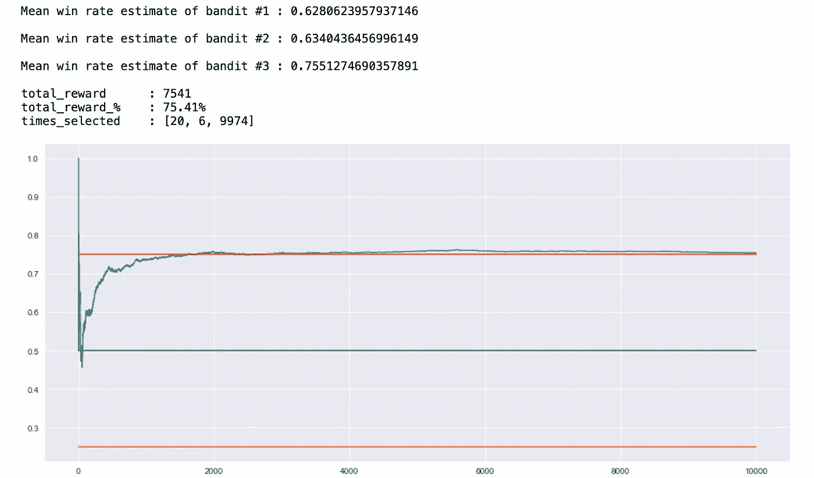

模拟结果— 1

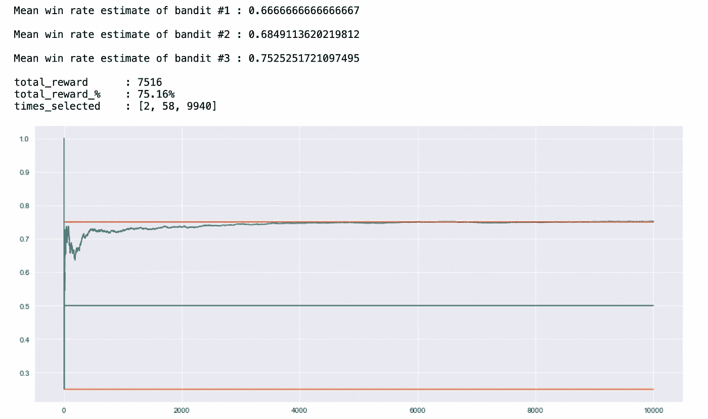

模拟结果— 2

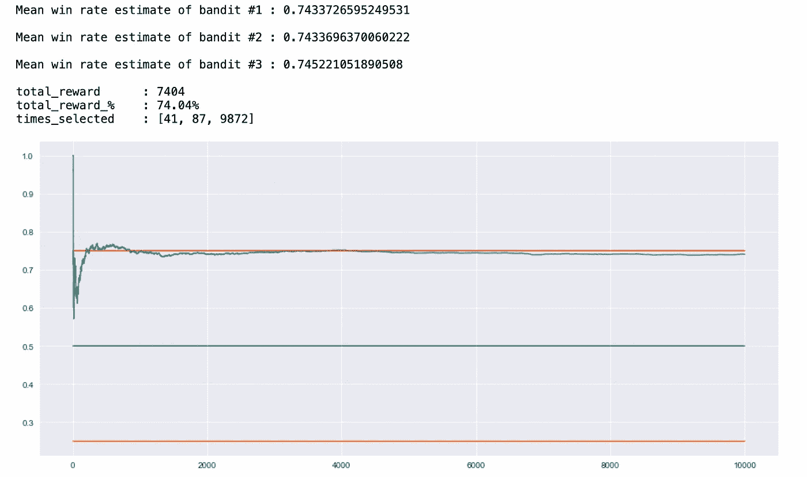

模拟结果— 3

此外，您可以尝试更高的初始值，以强制模型探索更多内容。下图显示了初始胜率估计值设置为 200%而不是之前使用的 100%的模型的结果。

请注意，与之前的配置相比，此模型选择了更多次优的土匪。

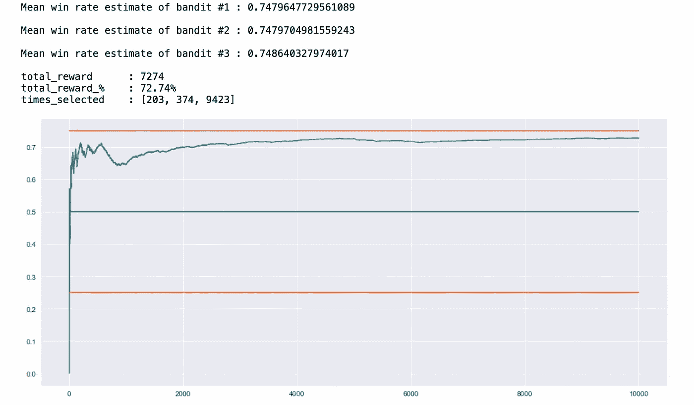

模拟结果— 4

# 感谢阅读！

这给了我很大的鼓励！😃*如果你觉得这个帖子很有趣，还想看更多，可以考虑* [***关注我***](https://medium.com/subscribe/@pratik.pandav)*🥁*。我每周发布与机器学习、统计和数据分析相关的主题。我喜欢通过可视化来学习，因此，我的帖子包含了大量的图表、模拟和代码示例。**

**简单地说，我尽最大努力将错误降到最低，但它们是我们学习的一部分，所以，如果你发现了什么，请指出来。最后，请随意提出你希望我写的主题。**