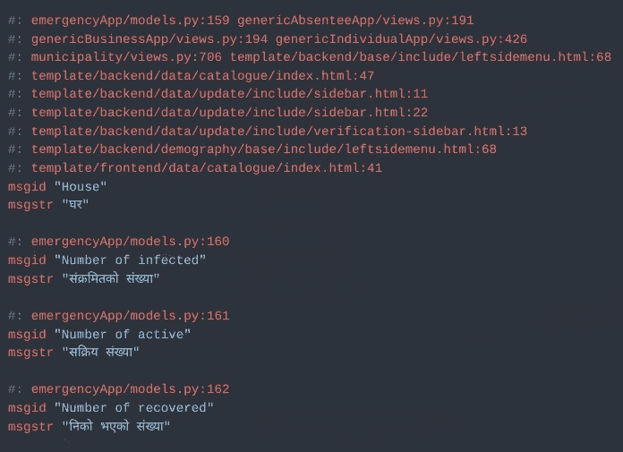
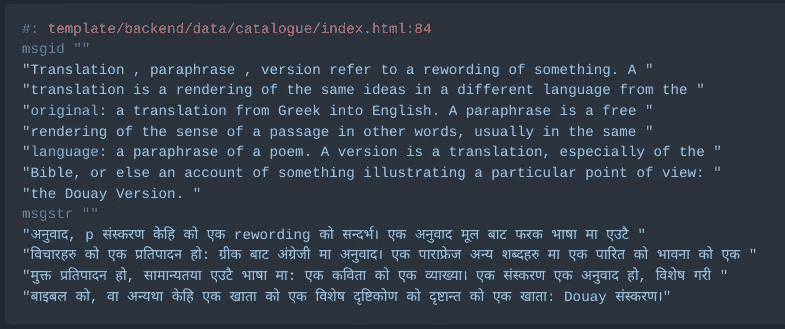

# Django 多语言网站(无数据翻译)

> 原文：<https://blog.devgenius.io/multi-language-site-with-django-f991107ba3ab?source=collection_archive---------3----------------------->


这将是一个如何在 Django 建立一个多语言网站的演练。我们将通过以下步骤进行设置。

1.  设置区域设置
2.  标记要翻译的字符串。采购订单文件
3.  添加翻译。采购订单文件和生成。维护对象文件
4.  从前端启用语言之间的切换(HTML 格式)

# 1.设置区域设置

*   制作目录到哪里。阿宝和。mo 文件应该是这样的(这是 LOCALE _ PATHS)
    * $ BASE _ DIR/LOCALE/
*   将 LOCALE_PATHS 变量添加到 settings.py 文件。

```
LOCALE_PATHS = [
   os.path.join(BASE_DIR, 'locale')
]
```

*   在 settings.py 中添加支持的语言

```
LANGUAGES = (
   ('en', _('English')),
   ('ne', _('Nepali')),
)
```

*   在 settings.py 中的通用中间件后添加“django . middleware . locale . localemiddleware”

```
MIDDLEWARE = [
    'django.middleware.security.SecurityMiddleware',
    'django.contrib.sessions.middleware.SessionMiddleware',
    'django.middleware.common.CommonMiddleware',
    'django.middleware.locale.LocaleMiddleware', # <- Add this
    'django.middleware.csrf.CsrfViewMiddleware',
    'django.contrib.auth.middleware.AuthenticationMiddleware',
    'django.contrib.messages.middleware.MessageMiddleware',
    'django.middleware.clickjacking.XFrameOptionsMiddleware',
]
```

*   用 django.conf.urls.i18n 中的 i18n_patterns 包装项目 urls.py 中的 URL 模式

```
from django.conf.urls.i18n import i18n_patterns
urlpatterns = i18n_patterns(
    path('users', include('users.urls')),
    # other urls
    url(r'^media/(?P<path>.*)$', serve,{'document_root': settings.MEDIA_ROOT}),
    url(r'^static/(?P<path>.*)$', serve,{'document_root': settings.STATIC_ROOT}),
    *static(settings.MEDIA_URL, document_root=settings.MEDIA_ROOT)
)
```

> 添加中间件并用 i18n_patterns 包装 URL 路径会将翻译 URL 设置为自动处理，例如，所有尼泊尔语页面路径的前缀都是 ne/(en 代表英语)

# 2.标记要翻译的字符串。采购订单文件

1.  让姜戈知道哪些文本应该翻译

**对于 HTML 文件:**

*   用``加载 i18n 标签
*   将每个应该翻译的文本换行
*   ``或者
*   `text_to_be_translated`

**对于 python 文件:**

*   用`from django.utils.translation import gettext as _`导入 gettext
*   像这样包装每一个应该翻译的文本`_(text_to_be_translated)`

2.运行命令:`python manage.py makemessages -l ne`

> 注意:要使 makemessages & compilemessages 命令工作，您需要在您的计算机上安装 GNU gettext 实用程序。对于 linux 用户，gettext 通常会默认安装。如果不是，您可以使用您选择的软件包管理器来安装。*对于 windows 用户，请点击此[链接](https://docs.djangoproject.com/en/2.2/topics/i18n/translation/#gettext-on-windows)了解更多信息，或点击此处下载& install getext

# 3.添加翻译。采购订单文件和生成。维护对象文件

*   编辑。采购订单文件

```
#: emergencyApp/models.py:159 genericAbsenteeApp/views.py:191
#: genericBusinessApp/views.py:194 genericIndividualApp/views.py:426
#: municipality/views.py:706 template/backend/base/include/leftsidemenu.html:68
#: template/backend/data/catalogue/index.html:47
#: template/backend/data/update/include/sidebar.html:11
#: template/backend/data/update/include/sidebar.html:22
#: template/backend/data/update/include/verification-sidebar.html:13
#: template/backend/demography/base/include/leftsidemenu.html:68
#: template/frontend/data/catalogue/index.html:41
msgid "House"
msgstr "घर"#: emergencyApp/models.py:160
msgid "Number of infected"
msgstr "संक्रमितको संख्या"#: emergencyApp/models.py:161
msgid "Number of active"
msgstr "सक्रिय संख्या"#: emergencyApp/models.py:162
msgid "Number of recovered"
msgstr "निको भएको संख्या" 
```



*   编译并重新生成。mo 文件，命令如下。这个。mo 文件是 django 用来阅读翻译文本的文件。
*   使用此命令:`python manage.py compilemessages`
*   重新启动服务器后，翻译现在应该可以工作了

# 4.从前端启用语言之间的切换(HTML 格式)

*   如果你只有两种语言可以切换，你可以用下面的方法。

```
<ol>
  <li class="">
    <a class="nav-link nav-user mr-0 waves-eff" href="/en{{ request.get_full_path|slice:'3:' }}" role="button">
      <span class="pro-user-name ml-1">
        
      </span>
    </a>
  </li>
  <li>
    <a class="nav-link nav-user mr-0 waves-eff" href="/ne{{ request.get_full_path|slice:'3:' }}" role="button">
      <span class="pro-user-name ml-1">
        
      </span>
    </a>
   </li>
</ol>
```

*   如果你想拥有多种语言，你可以试试下面的方法。

1.  在设置区域设置时，我们已经在 settings.py 中添加了如下支持的语言

```
LANGUAGES = (
       ('en', _('English')),
       ('ne', _('Nepali')),
   )
```

2.接下来，为了使用 set_language url 模式，我们必须包含如下所示的 django 翻译 url 模式。

```
urlpatterns += [path(‘i18n/’, include(‘django.conf.urls.i18n’)),]
```

3.如下所示设置翻译标签。

```

<div>



    <form action="" method="POST">
      
      <input name="next" type="hidden" value="{{ redirect_to }}">
      <select name="language" onchange="this.form.submit()">
        
        <option value="{{ language.code }}" selected>
        {{ language.name_local }} ({{ language.code }})
        </option>
        
      </select>
    </form>
</div>
```

4.这就是我们在网站中添加语言切换所需要做的一切。

# 一些提示:

**语境标记:**在不同语境下有不同含义的词的翻译同一个词可以基于不同的语境有多种翻译。例如，单词“May”可以指月份名称和动词。为了使翻译人员能够在两种上下文中翻译这个单词，如果字符串需要复数形式，可以使用 django . utils . translation . pgettext()函数或 django . utils . translation . npgettext()函数。

```
from django.utils.translation import pgettextmonth = pgettext("month name", "May")
verb = pgettext("verb", "May")
```

它们将上下文字符串作为第一个变量，该变量将出现在。po 文件如下所示，相同的文本将在。po 文件，因为它们的上下文字符串不同。

```
msgctxt "month name"
msgid "May"
msgstr "मे"msgctxt "verb"
msgid "May"
msgstr "सायद"
```

在 Django 模板中提供上下文可以通过如下所示的翻译标签来完成。阿宝和以前一样。

```
May
```

**处理 Django 模板中翻译字符串内的变量:**注意，trans 不能像预期的那样正确处理变量。如果你必须翻译`{{ count }} lemons`并像``一样把它包在 trans 标签里，Django 会把`{{ count }}`当作一个字符串。从 Django 文档中，

> 在中，不能在字符串中混合使用模板变量。如果您的翻译需要带变量(占位符)的字符串，请使用。

如果要整体翻译包含变量的字符串，需要使用 blocktrans 标签。与 trans 标签相反，blocktrans 标签允许您通过使用占位符来标记由文字和可变内容组成的复杂句子进行翻译:

```
This string will have {{ value }} inside.
```

要翻译模板表达式，比如访问对象属性或使用模板过滤器，您需要将表达式绑定到一个局部变量，以便在翻译块中使用。示例:

```

That will cost $ {{ amount }}.
This will have {{ myvar }} inside.

```

**要忽略 blocktrans 标签内的换行符，可以使用 trimmed 选项。**

```

This is a multiline text.
But it will be treated as a single line text by the blocktrans
tag because it has trimmed option given.

```

**在多个地方重复使用相同的翻译文本**

*   将变量设置为一处翻译文本
    * ``
    * ``重复文本``
*   重用`{{ var_name }}`
    * `{{ var_name }}`

**最后但同样重要的是，VSCode 非常有用的扩展**

*   `gettext`通过 MrOrz 扩展 po 文件语法高亮显示
*   `gettext-duplicate-error`ovcharik 用于检测重复翻译字符串的扩展