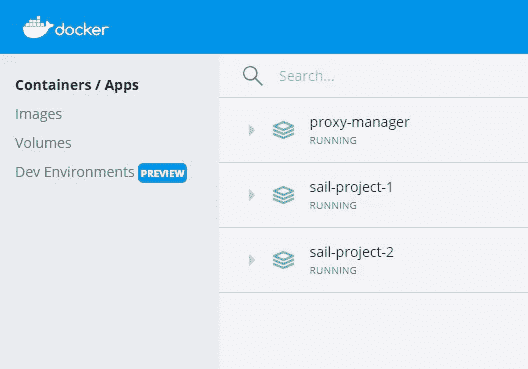
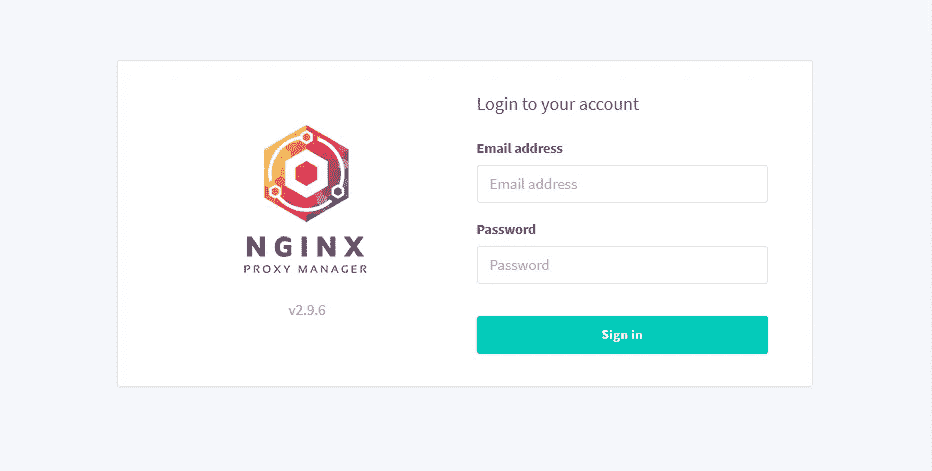
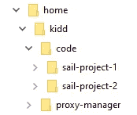
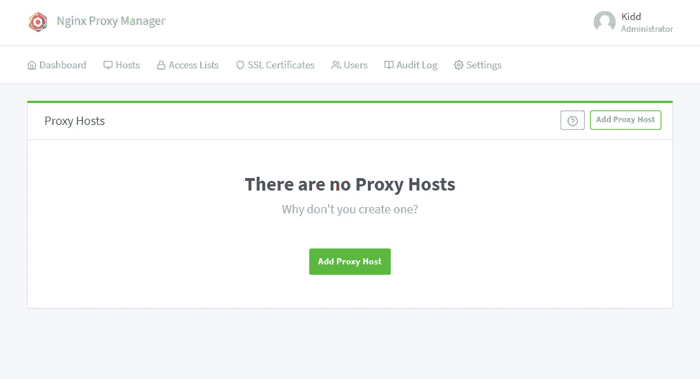
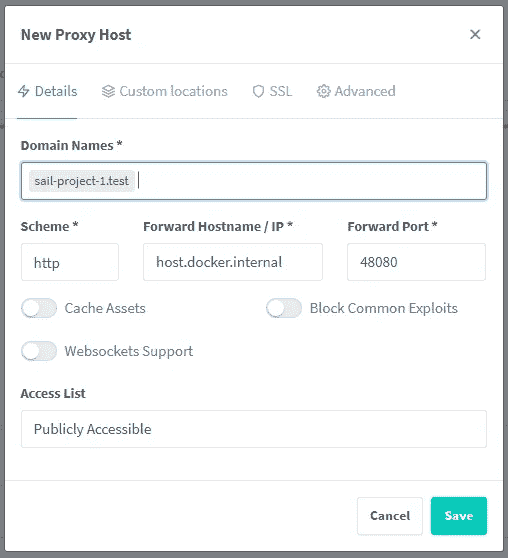
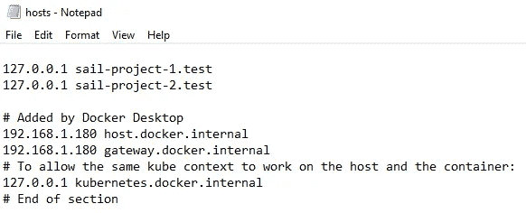
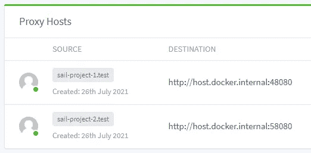
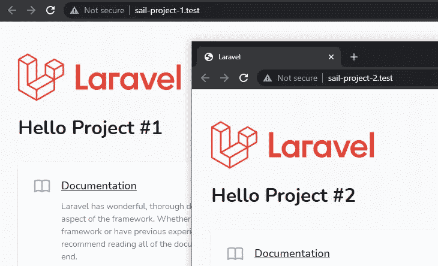

# 多 Laravel 帆网站与自定义域

> 原文：<https://blog.devgenius.io/multi-laravel-sail-sites-with-custom-domain-e13c07d9dd0c?source=collection_archive---------0----------------------->

你是快乐的 Laravel Sail 用户，刚刚从 Laravel Homestead 迁移过来，但是在你的 Homestead 中有多个站点。Laravel Sail 不像 Homestead 一样支持多站点。

这就是解决办法，像你的老情人一样工作——家园



**先决条件:**

*   带有 WSL2 的 Windows(用于 Linux 2 的 Windows 子系统)
*   运行在 WSL2 上的 Docker 桌面

阅读 [Kickstart 你的 Laravel Web App 使用 Laravel Sail](/kickstart-your-laravel-web-app-using-laravel-sail-30276265e588?source=your_stories_page-------------------------------------) (或[视频教程](https://youtu.be/rr6AngDpgnM))，
如果你是一个新鲜的新人。

# Nginx 代理管理器

我们将使用这个用户友好的工具— [Nginx 代理管理器](https://github.com/jc21/nginx-proxy-manager)来管理我们的站点。

**1** 。使用`wsl`输入你的 Ubuntu

**2** 。`cd ~`转到你在 Ubuntu 的主目录

**3** 。`mkdir proxy-manager`为这个工具创建一个文件夹

**4** 。`cd proxy-manager && nano docker-compose.yml`用于合成容器
复制并粘贴下面的内容

> 我假设你的站点应该少于 10 个，所以我们可以用 SQLite 代替 MariaDB。如果你想使用 MariaDB，你可以查看官方文档。

**5** 。保存并退出

**6** 。`docker-compose up -d`启动容器(关闭:`docker-compose down`)

**7** 。在浏览器中键入 http://localhost:81 ，您应该能够看到 GUI



> **默认登录** 邮箱:admin@example.com
> 密码:changeme

**8** 。完成必要的新帐户设置，稍后再回来。

# 配置非冲突端口

**1** 。`cd ~ && mkdir code`将我的所有项目放在代码文件夹下

**2** 。`cd code`然后

```
curl -s https://laravel.build/sail-project-1 | bash
curl -s https://laravel.build/sail-project-2 | bash
```



这是我保存文件夹的方式

我刚刚开始了两个新的项目进行演示，对于从非 Sail Laravel 项目迁移，你可以参考[官方 Laravel 文档](https://laravel.com/docs/8.x/sail#installing-sail-into-existing-applications)。新人则参考 上面的 [*链接。*](#9ce5)

**3** 。使用各自文件夹中的`code .`打开 VS 代码，然后编辑`.env` 文件。

所有服务不能使用同一个端口。如果有任何端口发生冲突，您应该在运行`sail up`时看到`Ports are not available`错误。

```
APP_PORT=48080
FORWARD_DB_PORT=43306
FORWARD_REDIS_PORT=46379
FORWARD_MEILISEARCH_PORT=47700
FORWARD_MAILHOG_PORT=41025
FORWARD_MAILHOG_DASHBOARD_PORT=48025
```

> 💡端口 49152 到 65535 使用起来相当“安全”。如有冲突，只需更改您的。环境文件。

> 您可以考虑减少默认服务，这样就不需要配置这么多端口。[Laravel 官方文档](https://laravel.com/docs/8.x/installation#choosing-your-sail-services)提供了相关步骤。

**4** 。一旦您配置了所有不冲突的端口，在每个项目文件夹中向上-d 导航以启动容器。

# 添加代理站点

一旦你的帆船项目都是绿色的，你可以通过

```
http://localhost:(PORT YOU ASSIGNED)
```

**1** 。返回代理主机以设置您的自定义域



**2** 。如下图所示创建新的代理主机:
您只需要相应地更改“**域名**”和“**转发端口**”。



使用 **host.docker.internal** 访问您的 Laravel 应用程序

**3** 。最后，您仍然需要设置`hosts`文件，让 Windows 指向正确的 IP。
只添加了两行，下面的行是由 Docker 桌面生成的。



c:\ Windows \ System32 \ drivers \ etc \ hosts

**4** 。一切都准备好了，你可以在你的浏览器中试用它们



更多关于 Laravel Sail [调试](https://medium.com/@dogcomp/b7b73e3dedf7)、[热装](https://dogcomp.medium.com/quick-tip-laravel-mix-hot-reloading-in-sail-with-browsersync-555b6c97bca3)、 [Swoole HTTPS](https://medium.com/p/ddab7f5303ec) 的内容，更多即将到来…关注我获取最新更新！感谢阅读😉

# 你准备好把你的网站放在网上，每月只需 10 美元就可以无限制地托管应用程序了吗？

Cloudways 提供了大量的功能，让你可以轻松托管你的 Laravel、WordPress 或任何 PHP 网站，而不用担心网络安全的噩梦。

现在，您可以在 BFCM 2022 活动期间享受额外折扣！


链接:www.cloudways.com/en/?id=66136

让我们开始尝试**云道**！

如果你喜欢我的文章，请鼓掌，关注并分享我的文章(或者你可以☕ [请我喝咖啡](https://buy.stripe.com/7sI03C9S56Upcpi8ww) ☕)。保重，再见！