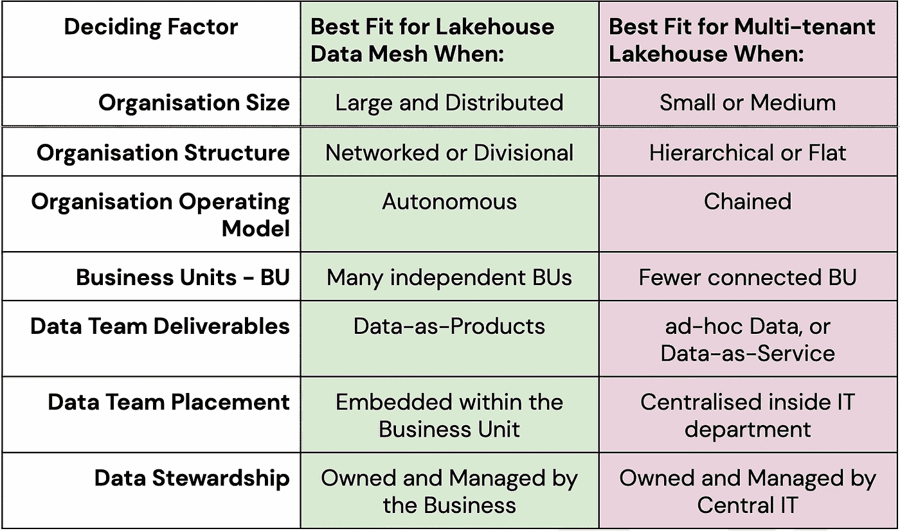

# 多租户 Lakehouse 或 Lakehouse 数据网格，选择哪种数据 Lakehouse 架构？

> 原文：<https://blog.devgenius.io/multi-tenant-lakehouse-or-lakehouse-mesh-which-lakehouse-data-architecture-to-choose-62eafa86c671?source=collection_archive---------13----------------------->

数据湖库是一种新技术，可以看作是数据湖和数据仓库的超集。Lakehouse 涵盖任何数据布局(结构化或非结构化)和任何到达速度(高速如流，或低速如批)的所有分析工作负载(BI、AI、ML)。数据湖库，如 [Databricks](https://databricks.com/product/data-lakehouse) ，可以以不同的部署方式部署，即作为一个多租户的湖库，其中所有业务域共享相同的工作环境，并在相同的工作空间上协作。或者部署为数据网格风格，其中每个业务领域保留其数据的完全所有权，并在单独的工作空间中工作，同时进行通信和协作，并采用通用的组织范围标准以保持数据处理、分析和共享的一致性。

在这篇文章中，我将讨论一些决定因素，这些因素可能会在选择遵循哪种风格时发挥作用。这些因素可能因组织而异，但是有一些因素是共同的。同样值得注意的是，原则上，组织倾向于设计反映他们自己沟通结构的系统，这就是广为人知的[康威定律](https://www.wikiwand.com/en/Conway%27s_law)。了解这一点很有帮助，因为人们可以将数据网格视为企业组织数据访问的一种组织方式。不用说，使用这两种风格中的任何一种来大规模构建数据平台都没有正确或错误的方法。任何架构选择都会产生不同的机会以及需要管理的限制。记住这一点，让我们探索这些决定性因素。

## 组织规模

组织的规模各不相同，有些是中小型企业(也称为 SMB)，有些是跨越多个地理区域的大型企业集团。Lakehouse mesh 最适合大型分布式组织。在这些组织中，数据网格的采用将主要由业务需求驱动，以保持每个业务领域的独立性，或者遵守不同的当地管辖区，这些管辖区要求特定级别的数据隔离或驻留。请记住，与传统的多租户湖边小屋相比，数据网格的管理和维护开销略高。在采用数据网格架构的好处远远超过成本的大型组织中，这种开销可以被最好地吸收，并且变得几乎不明显。对于在 unity 中运营的互联业务部门较少的小型组织，多租户 Lakehouse 将更加有效。

## 组织结构

组织也有[不同的团队结构](https://www.lucidchart.com/blog/types-of-organizational-structures),遵循这些结构可以最好地服务于业务。有些组织是严格的等级制，采用自上而下的管理方式，有些组织是由不同的独立业务单位组成的部门，在这两者之间还有其他类型。Lakehouse mesh 最适合采用鼓励分布和分散的团队结构的组织，而不是自上而下有严格指挥链的集中式模型。

## 组织运营模式

组织也有不同的运作模式。一些组织将给予每个业务部门很大的自由和自主权，以决定其 it 系统，雇用和管理自己的数据工程团队，以及决定采用哪个云服务提供商。对于这些组织来说，Lakehouse mesh 非常适合他们的数据分析需求，其中每个业务部门将在数据网格架构中代表一个独立的数据域。然而，其他组织拥有为整个企业服务的集中式 IT。IT 部门负责雇佣和管理数据工程团队，并负责选择云服务提供商。对于这些组织来说，多租户湖边别墅将是最适合他们需求的。

## 数据团队可交付成果

每个组织都可以自由决定其数据团队的任务。一些组织会要求数据团队以标准、有组织的方式为企业提供高质量的数据，组织内的每个不同团队都可以使用这些数据，并以自助方式在这些数据的基础上构建不同的数据产品。换句话说，数据团队的任务是为组织提供[数据即产品](https://medium.com/@itunpredictable/data-as-a-product-vs-data-as-a-service-d9f7e622dc55)，而组织的其余部分被视为数据团队的客户。这是最适合湖边小屋的网格。然而，其他组织可能会让数据团队向业务部门交付特定的、按需的和逐案的数据，业务部门通常会与数据团队合作来解释这些数据或从这些数据中提供见解(也称为[数据即服务](https://medium.com/@itunpredictable/data-as-a-product-vs-data-as-a-service-d9f7e622dc55))。在这种情况下，多租户湖边小屋将更适合该组织。

这些是最有可能影响组织决定采用数据网格架构的决定因素，这些因素总结如下:

