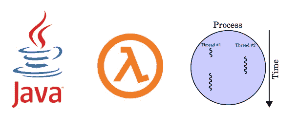
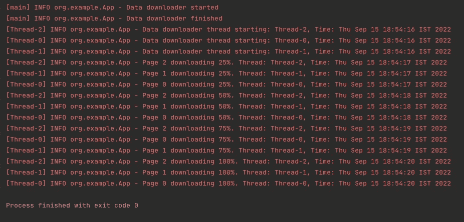
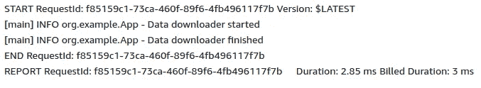
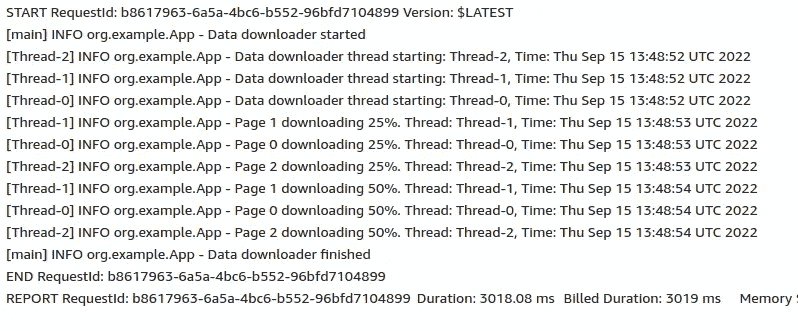
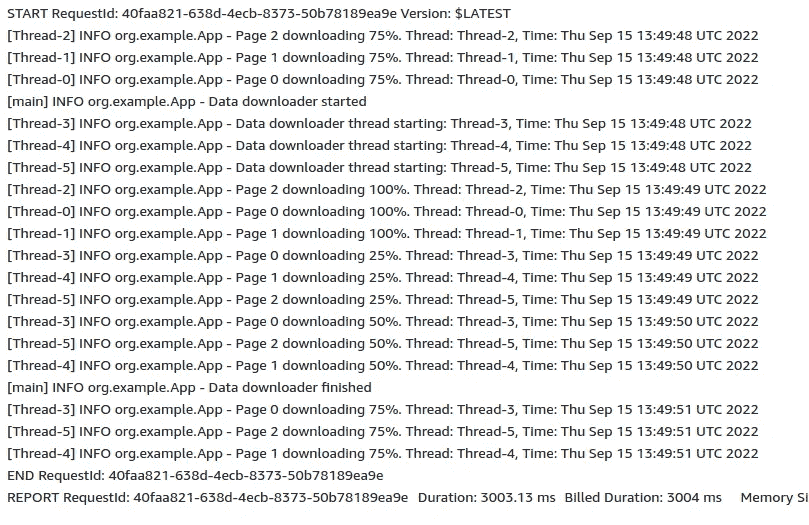
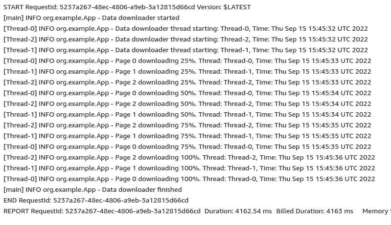

# AWS-Lambda 中的多线程

> 原文：<https://blog.devgenius.io/multi-threading-in-aws-lambda-11acbc1d85b7?source=collection_archive---------2----------------------->

AWS lambda 是一种无服务器、事件驱动的计算服务。所以我们不必考虑和管理使用 AWS Lambda 的服务器。这只是部署和运行的问题。

参考这个关于 [*如何在 AWS 中使用 Java lambda*](https://www.sentinelone.com/blog/aws-lambda-java-simple-introduction-examples/)*。*

下面例子的源代码可以在 GitHub 上找到。

## **要求**

需要从第三方 API 下载大量数据，并将其保存在 S3 桶中以备将来使用。API 中允许分页。由于数据集有点大，所以要检索多个页面。

## **解决方案**

根据要求，它不是一个阻塞任务。它可以用异步方式实现。

所以解决方案是

*   主程序将向 AWS 队列发送一条消息。那么队列将触发一个 AWS lambda 函数。
*   lambda 函数由一个 java 程序组成，该程序将下载大型数据集并将其存储在 S3 桶中。
*   为了提高程序的性能，**多线程**将处理数据下载部分。每个页面将由一个单独的线程下载。

## **实施**

让我们看看上面解决方案的 java 实现。注意 handleRequest()是 lambda 函数中程序的入口点(可以配置)。

这只是在该解决方案中应该做的模拟。让我们运行它，看看输出。

本地机器中的程序输出

所以这很好。所有线程完成任务后，程序终止。

让我们把这个上传到 AWS lambda 函数，看看输出。

AWS lambda 中的程序输出(第一次调用)

AWS Lambda 的行为似乎很不一样。数据下载器线程的日志不存在。现在我们有一个问题。数据下载线程发生了什么变化？

现在我将让主线程休眠 3000 ms，并查看 lambda 中的输出。

增加了线程睡眠

主线程休眠后的 Lambda 输出(第二次调用)

这里我们可以看到数据下载器线程的输出。*线程 0、线程 1、线程 2* 已启动，下载也正在进行。但没有完成。让我们在短暂等待后再次调用 lambda 函数。

Lambda 函数第三次调用

现在我们有一点困惑。在第三次调用中还有另外 3 个新线程在运行( *Thread-3，Thread-4，Thread-5* )。此外，先前调用中的线程也在运行。但是以前线程的日志也显示当前时间。而不是之前的调用时间。这里发生了什么？

## **结论**

当我们触发 lambda 函数时， *handleRequest()* 将开始执行。因此，它将创建 3 个新线程用于数据下载，并立即从 *handleRequest()* 返回。

因为在第一次调用中，从 *handleRequest()* 方法立即返回；即使创建了 3 个数据下载线程，这些线程也没有足够的时间来执行。因此没有数据下载线程的迹象。

但是在第二次调用中，我们让主线程休眠 3000 毫秒，因此 lambda 函数必须等待 3000 毫秒才能从 *handleRequest()* 返回，因为主线程处于休眠状态。因此，现在数据下载器线程有机会运行 3000 毫秒，这就是为什么有来自这些线程的日志。但是这些线程没有足够的时间来完成它们的任务。

> 从请求返回后，Lambda 冻结执行环境。当函数再次被调用时，lambda 抛出环境进行重用。

以上解释可以从 [*AWS Lambda 文档*](https://docs.aws.amazon.com/lambda/latest/dg/lambda-runtime-environment.html) 中找到。

根据上面的解释和第三次调用的输出，我们可以看到在第二次调用中没有足够时间完成的线程也在第三次调用中被执行。这就是为什么有 6 个数据下载线程在进行中。

这可能发生在后续的 lambda 调用中(**热启动**)。但是在 lambda 函数超时(最大 15 分钟)后，我们不能期望这种情况发生。因为在超时之后，如果发生新的调用，这将是一个**冷启动。因此 lambda 将为此创建一个新的执行环境。**

# 解决办法

为了避免 AWS Lambda 中的上述问题，我们必须等待数据下载线程在从 *handleRequest()返回之前完成它们的任务。*

我将使用一个 **CountDownLatch** 来克服这个问题。让我们看看修改后的源代码。

*带有 CountDownLatch 变化的 handle request()*

*DataDownloader.java 与 CountDownLatch 的变化*

让我们把这个上传到 AWS lambda，看看输出。

最新变更的 AWS lambda 输出

问题已解决。由于我们使用的是 CountDownLatch，它将一直等到数据下载器线程完成它们的任务，之后它才会从 *handleRequest()返回。*

这就是我如何克服我在 AWS lambda 中遇到的多线程问题。但这不是唯一的解决方案。

感谢阅读。编码快乐！🙂。