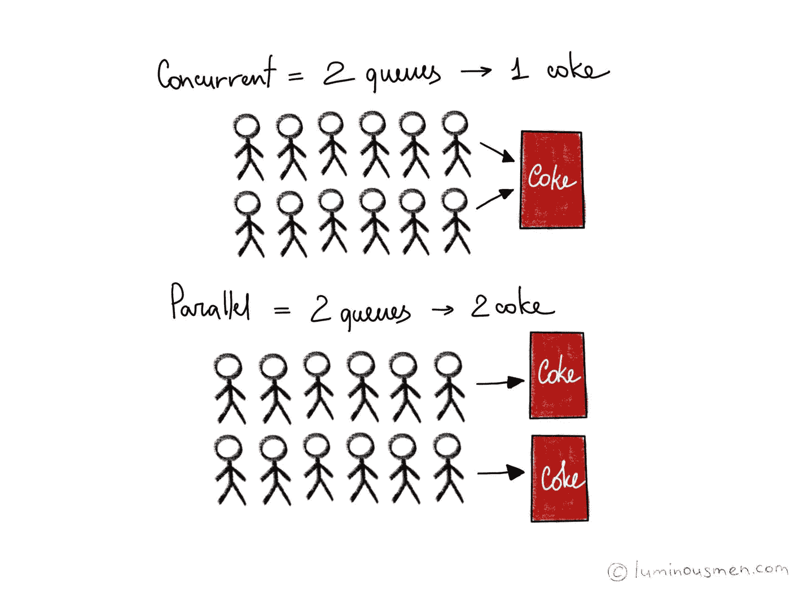
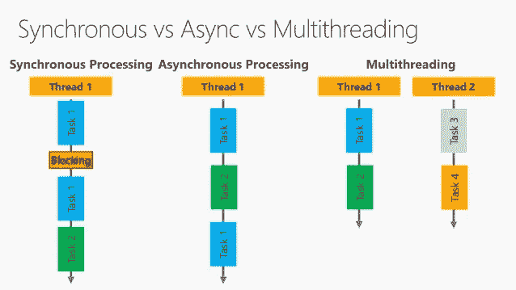

# 多线程与异步编程。有什么区别？

> 原文：<https://blog.devgenius.io/multi-threading-vs-asynchronous-programming-what-is-the-difference-3ebfe1179a5?source=collection_archive---------0----------------------->

## 在处理计算机和编码时，你可能会碰到多线程或异步编程这两个术语。

有没有想过它们到底是什么意思？嗯，了解两者的区别可以帮助任何程序员更好地编码。

同步与异步

多线程和异步编程都是不同形式的并发，但是，它们都有自己的特殊用途。在我们深入了解它们之前，我们必须了解什么是线程。计算机科学中的线程是最小的处理序列，它们是在一个进程中执行的一系列小执行。这些过程都是在操作系统中执行的，由程序员编写代码。

在**非线程环境**中，如果函数在执行下一个序列之前必须等待特定事件/输入发生。它必须等待该事件发生并完成，然后才能继续执行任何类型的进一步操作。当您执行非常简单的任务时，这可能是可以容忍的，但是，当处理大于 1+1 的任何事情时，这根本不能很好地工作。这就是多线程技术真正发挥作用的地方。

记住这个的好办法是: [*穿线是关于工人的；异步是关于任务的。*](https://stackoverflow.com/questions/34680985/what-is-the-difference-between-asynchronous-programming-and-multithreading)

第一个*多线程*CPU 起源于 20 世纪 50 年代，然而，直到 1968 年 IBM 研究人员才能够开发出同步多线程，这才真正改变了计算机的工作方式。在**多线程环境**中，存在许多同时运行的独立编程线程，这有助于 CPU 以闪电般的速度完成复杂的计算(也取决于 CPU 和操作系统的数量，有时操作系统中非常复杂的调度算法也有助于创建类似的多线程效果)。

在**异步环境**中，单个进程线程一直在运行，它能够从一个功能切换到另一个功能。在这种情况下，每当一个事件发生并到达必须等待响应/事件发生才能继续的点时，它能够在等待的同时开始另一个函数的计算。出于这个原因，事件驱动的异步编程能够避免传统多线程程序可能存在的许多问题，因为这些问题很难解决，并且有时会出现线程锁定彼此内存的情况。

# 简单来说，你可以把它想象成做鸡蛋和烤面包:

**同步方法:**

1.  获取所需材料(鸡蛋、平底锅、面包)。
2.  打开炉子。
3.  把鸡蛋敲碎，然后放进锅里。
4.  等他们做完饭。
5.  把它们从锅里拿出来。
6.  把面包放进烤面包机。
7.  等吐司烤好。
8.  拿出吐司并享用。

总烹饪时间:15 分钟。

每件事都由一个工人按顺序完成。直到最后一步完全完成，我们才能前进。

**异步方法:**

1.  获取所需材料(鸡蛋、平底锅、面包)。
2.  打开炉子。
3.  把鸡蛋敲碎，然后放进锅里。
4.  等鸡蛋吃完。
5.  在等待鸡蛋煮熟的时候——把吐司放进烤面包机。
6.  等待烤面包机完成。
7.  一旦鸡蛋完成，把鸡蛋从炉子上拿下来。
8.  吐司完成后，取出吐司。

总烹饪时间:10 分钟

你可能注意到了，因为我们是异步工作的，所以完成这顿饭需要的时间更少——所以当我们等待鸡蛋煮熟时，我们开始烤面包。

**多线程方法:**

P1=第一人

P2=第二个人

1.  **P1:** 拿出鸡蛋、面包和平底锅。打开炉子。
2.  P1:将鸡蛋敲碎，倒入锅中。P2:把面包放进烤面包机
3.  P1:等待鸡蛋煮熟。P2: 等待烤面包。
4.  P1:把鸡蛋从锅里拿出来。 **P2** :拿出吐司

总时间:5 分钟。

因为这里我们有两个不同的工作线程，每个都被分配了一系列要完成的任务。这被称为同步多线程，因为 P1 和 P2 都不会同时执行一个以上的任务。当执行复杂的资源密集型任务时，多线程可以节省大量时间，因为任务可以同时完成。

**那么哪个真的更好呢？多线程还是异步？**

答案就在程序的目的和它必须执行的任务中。如果它有很多输入/输出和简单的计算需求，那么异步应该适合您的需求。然而，如果手头的任务需要一定的计算能力，那么多线程无疑是一个不错的选择。