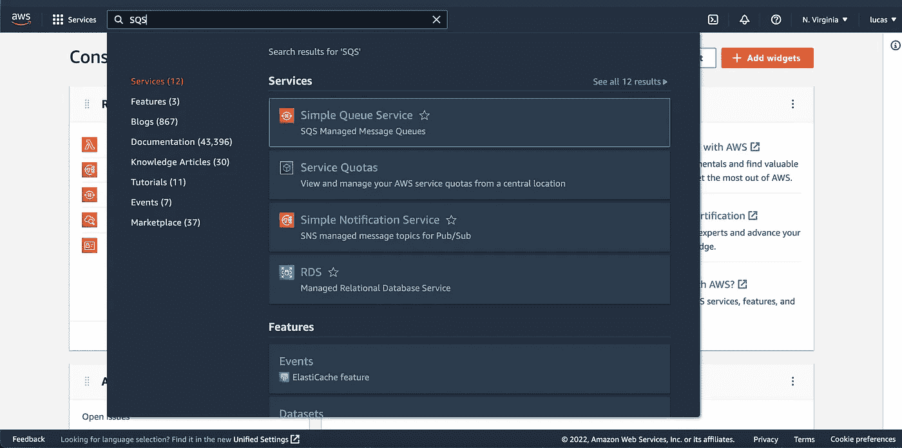
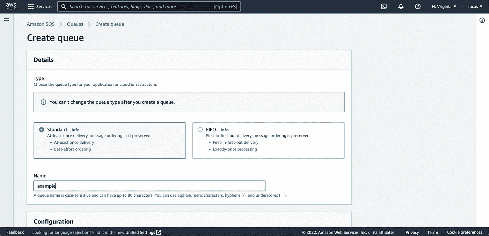
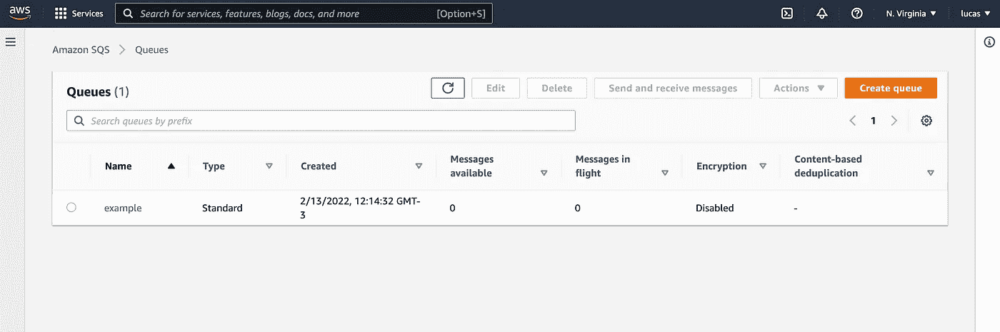
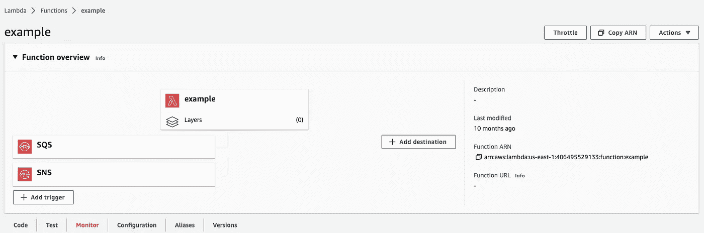

# 多触发器 AWS Lambda 函数

> 原文：<https://blog.devgenius.io/multi-trigger-aws-lambda-function-29330f5dc630?source=collection_archive---------13----------------------->

## 编写一个可以被许多 AWS 触发器触发的函数

穆罕默德·阿里·皮克在 [Unsplash](https://unsplash.com?utm_source=medium&utm_medium=referral) 上拍摄的照片

# 介绍

大家好，我希望你们今天过得愉快。今天这篇文章是为那些需要使用 Golang 实现一个 AWS Lambda，并且有必要在 Lambda 中拥有多种触发器的人准备的！

# 第一步

首先，让我们创建一个 lambda 函数，它使用来自一个 SQS 队列的消息。因此，让我们创建队列:

1.  **在 AWS 仪表盘上，搜索 SQS:**

AWS 仪表板搜索 SQS

2.**在 SQS 服务上创建您的队列:**

正在创建 SQS 队列

我选择名称 example 和队列标准的类型，因为在这个例子中我们不需要保持消息的顺序。

3.**现在我们可以看到我们的队列已经创建:**

SQS 队列

现在我们可以向前迈进，开始开发 AWS Lambda 函数。我们走吧🚀

# 编写函数

编写一个 AWS Lambda 函数通常是一项简单的任务，当我们讨论用 Golang 编写的函数时也是如此。在接下来的几个步骤中，我们将看到我们的函数正在工作，并迈出你的想法的第一步😉

以下是如何编写从 SQS 队列消费的函数的一个示例:

让我解释一下这段代码的某些部分:

1.  我们有一个名为 **func main()** 的函数，因为当 lambda 启动时会调用这个函数
2.  在主函数内部，我们调用了 **lambda。开始(处理程序)**。这个函数λ。Start 来自 AWS lambda SDK，用于启动 lambda 的进程。我们传递函数处理程序，它将接收 SQS 事件并执行必要的操作。

因此，编写一个 lambda 函数是一个非常简单的步骤，正如我们在前面的例子中看到的那样，但是以这种方式编写函数有一个问题。如果我们需要不止一种触发器，我们该怎么做？

# 多个 AWS 触发器

对于这类问题，我在 Go 中创建了一个库，我们可以用它来管理 lambda 接收的事件类型。库是使 lambda 运行的一个抽象，你只需要关心你的逻辑，而不用担心触发器和使 lambda 运行的代码。你需要做的一切，就是实现一个简单的接口，一切都会很好地工作。让我展示给你看:

正如您所看到的，我们几乎遵循了在前面的例子中已经看到的相同的概念。主要区别在于，您不需要关心 AWS 事件，因为我的库会为您完成这项工作，并且我们可以添加库支持的任何触发器。

最终结果可能是这样的:

同一个 lambda 有两种不同的触发器，但是处理它们的代码是抽象的。

# 最后的

喜欢这个主意吗？到存储库的链接是:

 [## GitHub-maiaaraujo 5/lambda-starter

### Lambda starter 抽象了 aws 中触发器的配置。使用非常简单，你只需要实现…

github.com](https://github.com/maiaaraujo5/lambda-starter) 

如果你想帮我构建这个，请打开一个拉请求，我很乐意审查你的公关。

**请在 Github 项目中留下一颗星。**

这就是今天的全部。如果你喜欢它，并且这个内容对你有帮助，请让我知道，并给我留下一个掌声:)