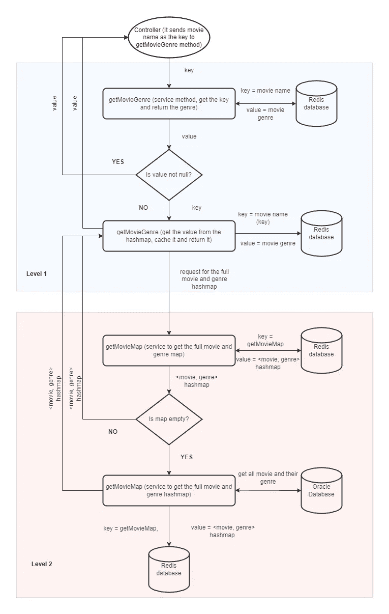

# 提高性能的多级 Redis 缓存

> 原文：<https://blog.devgenius.io/multilevel-redis-caching-to-improve-performance-8603f0ea146f?source=collection_archive---------8----------------------->

*让我们想象一下，我们正在建立一个电影维基网站，它会根据电影的类型改变外观和感觉。我们从 Oracle 数据库中获取所有电影数据。*

在本文中，我们将讨论如何改善当有人搜索电影或直接在 URL 中输入电影名称时获取电影类型的延迟。

有两种简单的方法可以提高性能。

1.  首先是创建一个索引:在我们的例子中，搜索关键字是电影名称，所以我们可以在电影名称列上创建一个索引，这将使我们的查询更快。
2.  其次是缓存:最简单的方法是将电影名称作为键，将电影细节作为值进行缓存。

但是我们仍然可以通过引入第二级缓存来做进一步的改进。让我们首先了解流程图/架构，然后我们将通过实施。



这里需要注意几件事:

1.  一级缓存是微不足道的。但是我们不会存储所有的细节，而是只缓存电影类型。对我们来说，电影类型是主要的障碍，因为我们正在加载使用它。详细信息，我们可以稍后在后台获得，因为网站懒惰加载。
2.  然后我们引入了第二个层次，在`getMovieMap`键下缓存整个电影和流派的散列表。(我们将它存储为 HashMap 而不是 list，以获得 O(1)的搜索时间复杂度。我们只是存储流派，以便 HashMap 的大小最小。)
3.  电影类型在特定电影的生命周期中不会改变，因此我们不需要刷新一级缓存。但是新电影会不断出现，所以为了刷新我们的数据，我们会将 TTL(生存时间)作为`getMovieMap`键的 1 天。

现在让我们来看一下实现。

```
/**
 * MovieMapService class
 *
 */
@Slf4j
@Service
public class MovieMapService {

    @Autowired
    private MovieDao movieDao; /**
     * Get the map of all movie name and genre
     * 
     * @return Map<String, String> - toolMap
     */
    @Cacheable(cacheNames = "movieWiki", key="#root.methodName")
    Map<String, String> getMovieMap() {
        // In the DAO method we can use 
        // [@MapKey](http://twitter.com/MapKey) annotation to get the HashMap of 
        // movie name and genre directly.
        return movieDao.getMovieMap();
    }}/**
 * Movie genre service class
 */
@Service
public class MovieGenreService {

    @Autowired
    private MovieMapService movieMapService;

    /**
     * Get the movie genre
     * 
     * @param movie String - movie name
     * @return String - movie genre
     */
    @Cacheable(cacheNames = "movieWiki", 
         key="#movie", unless =  "#result == null")
    String getMovieGenre(final String movie) {
        Map<String, String> movieMap =  movieMapService.
            getMovieMap();
        return movieMap.get(movie);
    }
}
```

1.  *结帐本* [*条*](https://pratiyush.medium.com/one-common-mistake-which-we-should-avoid-while-using-async-and-cacheable-in-spring-boot-a967cea27d55) *如果你想了解更多，为什么我们需要对每一个方法都有单独的类。*
2.  *查看这篇* [*博客*](https://programmer.help/blogs/mybatis-returns-the-case-of-map-key-value-to-data-key-value.html) *了解如何使用@MapKey 注释直接从 mybatis 获取 HashMap。*

要阅读更多关于 spring boot 中缓存的内容，您可以浏览这些。

*   [https://www.baeldung.com/spring-cache-tutorial](https://www.baeldung.com/spring-cache-tutorial)
*   [https://spring.io/guides/gs/caching/](https://spring.io/guides/gs/caching/)