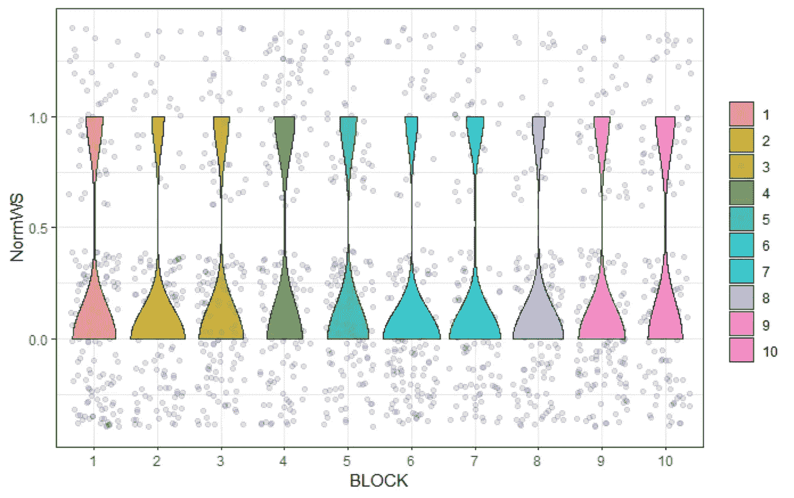

# R 中的多项式数据

> 原文：<https://blog.devgenius.io/multinomial-data-in-r-37d3ba1b6d42?source=collection_archive---------2----------------------->

## 广义线性混合模型在屠宰数据中的应用

这不是我第一次发表关于[有序/多项式数据](/power-analysis-for-categorical-data-in-sas-multinomial-ordinal-binary-binomial-beta-poisson-9398888491da)的文章，有许多方法可以分析这样的数据集，使用[泊松或负二项式分布](https://pub.towardsai.net/analyzing-ordinal-data-in-sas-poisson-and-negative-binomial-distribution-5f46b039aaeb)、[二元、二项式或贝塔分布](https://pub.towardsai.net/analyzing-ordinal-data-in-sas-using-the-binary-binomial-and-beta-distribution-8efe5fe5af66)，或者完全遵循[多项式](https://pub.towardsai.net/analyzing-ordinal-data-in-sas-fe9d9d35a449)本身。然而，这是我第一次展示 R 用于这种类型的分析。这个特定的项目实际上很老了，包含了我在 2017 年对商业数据所做的分析。这就是为什么，不幸的是，我不能分享数据，但我能做的是向你展示我是如何分析的。

让我带你四处看看，并尽可能多地解释我所做的事情。首先，图书馆。我可能没有全部用上，但是如果你愿意，所有的都可以用上。正如我之前提到的，多项式/序数数据可以通过多种方式进行分析。

```
rm(list = ls())
#### LIBRARIES ####
library(foreign)
library(lme4)
library(ggplot2)
library(rms)
library(plyr)
library(dplyr)
library(Hmisc)
library(data.table)
library(reshape2)
library(lubridate)
library(boot)
library(sjPlot)
library(sjstats)
library(sjmisc)
library(psych)
library(interval)
library(data.table)
library(effects)
library(AICcmodavg)
library(piecewiseSEM)
require(parallel) 
library(scales)        
library(gridExtra)
library(coefplot) 
library(coda)      
library(aods3)    
library(plotMCMC) 
library(bbmle)     
library(nlme)
library(MCMCglmm)
library(merTools)
library(RLRsim) 
library(pbkrtest)
library(blme)
library(MASS)
library(multcomp)
library(glmmLasso)
library(MASS)
library(CCA)
```

让我们也载入数据。这是屠宰数据，我们所做的是看看我们是否能找到标记，营养标记，来解释我们在屠宰鸡时看到的白色条纹的水平。WB 和 WS 在很大程度上都是你不希望拥有的东西。

让我们绘制数据。现在，绘制多项式或序数数据本身就是一种技能，我发现几个不同的图，如小提琴，可以帮助你对数据有一个像样的了解。

```
DATA <- read.csv("DATA.csv")
DATA$TT<-as.factor(DATA$TT)
DATA$mincrAO<-as.factor(DATA$mincrAO)
DATA$Caf<-as.factor(DATA$Caf)
DATA$vits<-as.factor(DATA$vits)
DATA$carn<-as.factor(DATA$carn)
DATA$bredol<-as.factor(DATA$bredol)
DATA$ascBCAA<-as.factor(DATA$ascBCAA)
DATA$urs<-as.factor(DATA$urs)
colnames(DATA)[3]<-"BLOCK"
DATA$BLOCK<-as.factor(DATA$BLOCK)
DATA$Caf_order=factor(DATA$Caf, ordered=TRUE)
DATA$urs_order=factor(DATA$urs, ordered=TRUE)
DATA$BOX_cat<-as.factor(DATA$BOX)
DATAcompl<-DATA[complete.cases(DATA$MultinomWS),]
class(DATAcompl$mincrAO)
class(DATAcompl$Caf)
class(DATAcompl$vits)
class(DATAcompl$carn)
class(DATAcompl$bredol)
class(DATAcompl$ascBCAA)
class(DATAcompl$urs)
class(DATAcompl$MultinomWS)
class(DATAcompl$MultinomWB)
skimr::skim(DATAcompl)
```


如您所见，数据已经被转换为多项式、序数甚至二进制数(例如重度 WB 与非重度 WB)。这里需要小心多重测试，因此，我更喜欢坚持原来的规模。

下面你会看到很多图，我会在 Y 轴上显示多项式/二进制数据，在 x 轴上显示感兴趣的预测值。我要寻找的是小提琴形状的预测值水平(也大多是二进制的)之间的差异。这不是一项容易的任务，但我一直更喜欢图形而不是统计推断，尤其是涉及到这类数据的时候。

```
ggplot(DATA, aes(x = TT, y = MultinomWS, fill=TT)) +
  geom_jitter(alpha = .1) +
  geom_violin(alpha = .75) +
  theme_bw()+
  theme(legend.position="none")
ggplot(DATA, aes(x = mincrAO, y = MultinomWS, fill=mincrAO)) +
  geom_jitter(alpha = .1) +
  geom_violin(alpha = .75) +
  theme_bw()+
  theme(legend.position="none")
ggplot(DATA, aes(x = Caf, y = MultinomWS, fill=Caf)) +
  geom_jitter(alpha = .1) +
  geom_violin(alpha = .75) +
  theme_bw()+
  theme(legend.position="none")
ggplot(DATA, aes(x = vits,y=MultinomWS, fill=vits)) +
  geom_jitter(alpha = .1) +
  geom_violin(alpha = .75) +
  theme_bw()+
  theme(legend.position="none")
ggplot(DATA, aes(x = carn,y=MultinomWS, fill=carn)) +
  geom_jitter(alpha = .1) +
  geom_violin(alpha = .75) +
  theme_bw()+
  theme(legend.position="none")
ggplot(DATA, aes(x = bredol,y=MultinomWS, fill=bredol)) +
  geom_jitter(alpha = .1) +
  geom_violin(alpha = .75) +
  theme_bw()+
  theme(legend.position="none")
ggplot(DATA, aes(x = ascBCAA,y=MultinomWS, fill=ascBCAA)) +
  geom_jitter(alpha = .1) +
  geom_violin(alpha = .75) +
  theme_bw()+
  theme(legend.position="none")
ggplot(DATA, aes(x = urs,y=MultinomWS, fill=urs)) +
  geom_jitter(alpha = .1) +
  geom_violin(alpha = .75) +
  theme_bw()+
  theme(legend.position="none")
ggplot(DATA, aes(x = TT, y = MultinomWB, fill=TT)) +
  geom_jitter(alpha = .1) +
  geom_violin(alpha = .75) +
  theme_bw()+
  theme(legend.position="none")
ggplot(DATA, aes(x = mincrAO, y = MultinomWB, fill=mincrAO)) +
  geom_jitter(alpha = .1) +
  geom_violin(alpha = .75) +
  theme_bw()+
  theme(legend.position="none")
ggplot(DATA, aes(x = Caf, y = MultinomWB, fill=Caf)) +
  geom_jitter(alpha = .1) +
  geom_violin(alpha = .75) +
  theme_bw()+
  theme(legend.position="none")
ggplot(DATA, aes(x = vits,y=MultinomWB, fill=vits)) +
  geom_jitter(alpha = .1) +
  geom_violin(alpha = .75) +
  theme_bw()+
  theme(legend.position="none")
ggplot(DATA, aes(x = carn,y=MultinomWB, fill=carn)) +
  geom_jitter(alpha = .1) +
  geom_violin(alpha = .75) +
  theme_bw()+
  theme(legend.position="none")
ggplot(DATA, aes(x = bredol,y=MultinomWB, fill=bredol)) +
  geom_jitter(alpha = .1) +
  geom_violin(alpha = .75) +
  theme_bw()+
  theme(legend.position="none")
ggplot(DATA, aes(x = ascBCAA,y=MultinomWB, fill=ascBCAA)) +
  geom_jitter(alpha = .1) +
  geom_violin(alpha = .75) +
  theme_bw()+
  theme(legend.position="none")
ggplot(DATA, aes(x = urs,y=MultinomWB, fill=urs)) +
  geom_jitter(alpha = .1) +
  geom_violin(alpha = .75) +
  theme_bw()+
  theme(legend.position="none")
ggplot(DATA, aes(x = TT, y = NormWS, fill=TT)) +
  geom_jitter(alpha = .1) +
  geom_violin(alpha = .75) +
  theme_bw() + 
  theme(legend.title=element_blank())
ggplot(DATA, aes(x = BLOCK, y = NormWS, fill=BLOCK)) +
  geom_jitter(alpha = .1) +
  geom_violin(alpha = .75) +
  theme_bw() + 
  #facet_grid(~.block)+
  theme(legend.title=element_blank())
```



正如所料，块之间没有差异。点击[这里](https://medium.com/mlearning-ai/general-introduction-to-design-of-experiments-in-animal-science-using-sas-for-codes-fe1c5272b37a)阅读更多关于使用阻断机制设计合适研究的内容。

从上面，你可以发现一些不同，但它们不会改变生活。现在，我们还需要检查我们是否有足够的数据来分析。例如，如果您有包含四个类的序数或多序数数据，但其中一个类几乎没有数据，那么多项式/序数方法将无济于事。你将不得不坚持使用二进制，或者融合一些类别来进行信息量较少的多项式/序数分析。这里，我将从二进制 WS 分析开始，寻找正常/非正常 WS。只是看看我们是否有足够的数据。由于该研究是随机完全区组设计，我将使用[一般线性混合模型](https://pub.towardsai.net/generalized-linear-mixed-models-in-sas-distributions-link-functions-scales-overdisperion-and-4b1c767bb89a)。如您所见，我们可以进一步分割数据，因为我们在块内也有副本。

```
fit<-glmer(NormWS~1+(1|BOX), 
               data=DATA, 
               family=binomial, 
               control = glmerControl(optimizer = "bobyqa", nAGQ = 10))
fit2<-glmer(NormWS~1+TT+(1|BOX), 
           data=DATA, 
           family=binomial, 
           control = glmerControl(optimizer = "bobyqa", nAGQ = 10))
fit2.1<-glmer(NormWS~1+TT+(1|BLOCK/BOX), 
            data=DATA, 
            family=binomial, 
            control = glmerControl(optimizer = "bobyqa", nAGQ = 10))
anova(fit2, fit2.1)
```


根据 AIC 和卡方检验，增加更多的方差分量会创建一个更有可能的模型，但并不是所有的模型都一致(如 BIC)。


尽管如此，让我们以 fit2.1 模型为例，进一步探索它。

```
plot_model(fit2.1)
plot_model(fit2.1, type="diag")
plot_model(fit2.1, type="pred")
```


治疗优势比——来自数据。


模型看起来不错，显示了方差分量的正态性。

让我们提高模型，并添加其他预测因素。它们中的许多都是二进制的，所以这将很快导致大量信息丢失，因为数据需要多次分割。想想决策树。

```
fit2.2<-glmer(as.factor(NormWS)~as.factor(mincrAO)+
                as.factor(Caf)+
                as.factor(vits)+
                as.factor(carn)+
                as.factor(bredol)+
                as.factor(ascBCAA)+
                as.factor(urs)+
                (1|BLOCK/BOX), 
              data=DATAcompl, 
              family=binomial, 
              control = glmerControl(optimizer = "bobyqa", nAGQ = 15))
exp(fit2.2@beta)
```


在这里，我们要处理很多部分，所以我们需要删除列。

让我们看看是否能找到任何线性相关性。通常，去除预测因素的最好方法是基于主题知识，我们可以添加线性相关估计。

```
fix.formula <- as.factor(MultinomWS)~as.factor(mincrAO)+
  as.factor(Caf)+
  as.factor(vits)+
  as.factor(carn)+
  as.factor(bredol)+
  as.factor(ascBCAA)+
  as.factor(urs)
X <- model.matrix (fix.formula, DATAcompl)
caret::findLinearCombos(X) DATAcompl$ursbin<-ifelse(DATAcompl$urs==1|DATAcompl$urs==2,1,0)
```


我们必须删除模型的第 8 和第 10 部分。这不一定是第 8 款或第 10 款。事实上，这一切都与 **urs** 变量有关。

新的模型看起来像这样，但是我没有移除。我实际上将 *urs* 变量转换成了二进制。然后我想再次检查线性依赖，我确实找到了它们，所以我开始添加更多的分类变量，这次是在 *Caf* 变量上。回顾过去，老实说，我不确定这是否是最明智的选择。

```
fit2.2<-glmer(as.factor(NormWS)~as.factor(mincrAO)+
                as.factor(Caf)+
                as.factor(vits)+
                as.factor(carn)+
                as.factor(bredol)+
                as.factor(ursbin)+
                (1|BLOCK/BOX), 
              data=DATAcompl, 
              family=binomial, 
              control = glmerControl(optimizer = "bobyqa", nAGQ = 15))fix.formula <- as.factor(NormWS)~as.factor(mincrAO)+
  as.factor(Caf)+
  as.factor(vits)+
  as.factor(carn)+
  as.factor(bredol)+
  as.factor(ursbin)
X <- model.matrix (fix.formula, DATAcompl)
findLinearCombos(X) 
DATAcompl$Cafbin<-ifelse(DATAcompl$Caf==1|DATAcompl$Caf==2,1,0) 
```


我想这不是最明智的选择，因为我仍然排名不足。

探索秩亏的另一个好而可靠的方法是将数据制成表格。这肯定是一个乏味的过程，但可以教会你很多东西，关于数据是如何建立的，尤其是在单元格太稀疏而没有任何用处的情况下。

```
### Look more into rank deficiency or singularity
with(DATAcompl, table(BLOCK, MultinomWS,mincrAO))
with(DATAcompl, table(BLOCK, MultinomWS,Caf))
with(DATAcompl, table(BLOCK, MultinomWS,vits))
with(DATAcompl, table(BLOCK, MultinomWS,carn))
with(DATAcompl, table(BLOCK, MultinomWS,bredol))
with(DATAcompl, table(BLOCK, MultinomWS,ursbin))
with(DATAcompl, table(BLOCK, MultinomWS,ascBCAA))with(DATAcompl, table(BLOCK,mincrAO,ascBCAA))
with(DATAcompl, table(BLOCK,Caf,ascBCAA))
with(DATAcompl, table(BLOCK,vits,ascBCAA))
with(DATAcompl, table(BLOCK,carn,ascBCAA))
with(DATAcompl, table(BLOCK,bredol,ascBCAA))
with(DATAcompl, table(BLOCK,ursbin,ascBCAA))with(DATAcompl, table(BLOCK,mincrAO,carn))
with(DATAcompl, table(BLOCK,Caf,carn))
with(DATAcompl, table(BLOCK,vits,carn))
with(DATAcompl, table(BLOCK,ascBCAA,carn))
with(DATAcompl, table(BLOCK,bredol,carn))
with(DATAcompl, table(BLOCK,ursbin,carn))
```


例如，您可以看到当您除以预测值 mincrAO 时，单元格如何变为零。这对分析没有帮助，这是需要注意的。

最终我删除了 *urs* 变量，保留了原来的 *caf* 变量。它主要是尝试和错误，由一些线性依赖和列表的探索支持。我本来也可以做，但现在没有做的是应用一种形式的[多元分析](https://pub.towardsai.net/multivariate-analysis-using-sas-b4f34ced6d0)，比如主成分分析。尽管处理二进制数据不那么容易，但它可能保留了大部分信息，并且仍然减少了变量的数量。

让我们继续。

```
fit2.2<-glmer(as.factor(NormWS)~as.factor(mincrAO)+
                as.factor(Caf)+
                as.factor(vits)+
                as.factor(carn)+
                as.factor(bredol)+
                (1|BLOCK/BOX), 
              data=DATAcompl, 
              family=binomial, 
              control = glmerControl(optimizer = "bobyqa", nAGQ = 15))
summary(fit2.2)
plot(fit2.2)
plot_model(fit2.2)
plot_model(fit2.2, type="diag")
plot_model(fit2.2, type="pred")
```


模型正在运行。


当然，一些变量有一些重要的信息。


模特看起来不错。左边是二项式数据的分离，中间和右边是方差分量的正态假设。

让我们根据预测值来绘制预测概率。

```
fit2.2_pred<-broom.mixed::augment(fit2.2)
g1<-ggplot(fit2.2_pred, 
       aes(fill=`as.factor(Caf)`, 
           x=plogis(.fitted)))+
  geom_density(alpha=0.5)+
  theme_bw()+
  labs(x="Fitted Probability",
       y="Density",
       fill="Caf",
       title = "Fitted probability for variable 'Caf'")
g2<-ggplot(fit2.2_pred, 
       aes(fill=`as.factor(vits)`, 
           x=plogis(.fitted)))+
  geom_density(alpha=0.5)+
  theme_bw()+
  labs(x="Fitted Probability",
       y="Density",
       fill="Vits",
       title = "Fitted probability for variable 'vits'")
g3<-ggplot(fit2.2_pred, 
       aes(fill=`as.factor(carn)`, 
           x=plogis(.fitted)))+
  geom_density(alpha=0.5)+
  theme_bw()+
  labs(x="Fitted Probability",
       y="Density",
       fill="Carn",
       title = "Fitted probability for variable 'carn'")
g4<-ggplot(fit2.2_pred, 
       aes(fill=`as.factor(bredol)`, 
           x=plogis(.fitted)))+
  geom_density(alpha=0.5)+
  theme_bw()+
  labs(x="Fitted Probability",
       y="Density",
       fill="Bredol",
       title = "Fitted probability for variable 'bredol'")
g5<-ggplot(fit2.2_pred, 
       aes(fill=`as.factor(mincrAO)`, 
           x=plogis(.fitted)))+
  geom_density(alpha=0.5)+
  theme_bw()+
  labs(x="Fitted Probability",
       y="Density",
       fill="MincrAO",
       title = "Fitted probability for variable 'mincrAO'")
grid.arrange(g1,g2,g3,g4,g5,ncol=3)
```


退一步说，这是一些奇怪的分布，这确实与两件事有关:(1)在一个模型中绘制主效应，尽管不包括相互作用，但它有更多的上下文，以及(2)低细胞数。密度图总是倾向于相当奇怪，或者变得奇怪，当有凸起的数字出现时。

然而，可以肯定的是，该模型可以从一些简化中受益，而且在那时(甚至现在)，我喜欢套索选择器。让我们看看我当时是如何运用它的。

我在这里做的是建立一个可能的 lambda 值的网格，从中[惩罚](/predictive-regression-using-splines-partial-least-squares-penalization-cross-validation-and-339b74a7e108)模型，用 lambda 值反复运行模型，显示 BIC 度量，然后确定哪个 lambda 值是最好的。

```
lambda<-seq(5,1,by=-0.1)
BIC_vec<-rep(Inf,length(lambda))
Delta.start<-as.matrix(t(rep(0,6+10))) # fixed(6) + random(10) effects
Q.start<-0.1
family=binomial(link=logit)
for(j in 1:length(lambda))
  {
    print(paste("Iteration ", j,sep=""))
fit2.2.lasso<-try(glmmLasso(NormWS~
                              as.factor(mincrAO)+
                              as.factor(Caf)+
                              as.factor(vits)+
                              as.factor(carn)+
                              as.factor(bredol),
                            rnd=list(BLOCK=~1),
                            family=family,
                            data=DATAcompl,
                            lambda=lambda[j],
                            switch.NR=F,
                            final.re=TRUE),
                  silent = TRUE)
print(colnames(fit2.2.lasso$Deltamatrix)[2:7][fit2.2.lasso$Deltamatrix[fit2.2.lasso$conv.step,2:7]!=0])
BIC_vec[j]<-fit2.2.lasso$bic
Delta.start<-rbind(Delta.start,fit2.2.lasso$Deltamatrix[fit2.2.lasso$conv.step,])
Q.start<-c(Q.start,fit2.2.lasso$Q_long[[fit2.2.lasso$conv.step+1]])
}
opt<-lambda[which.min(BIC_vec)] #2.1
```


迭代显示哪些变量被保留，哪些没有。请记住，套索惩罚为零，这意味着它转储它认为没有价值的变量。

现在我有了一个最佳的λ值，我可以对它进行积分，建立一个模型，它应该显示出最小的 BIC。

```
fit2.2.lasso<-try(glmmLasso(NormWS~
                              as.factor(mincrAO)+
                              as.factor(Caf)+
                              as.factor(vits)+
                              as.factor(carn)+
                              as.factor(bredol),
                            rnd=list(BLOCK=~1),
                            family=family,
                            data=DATAcompl,
                            lambda=lambda[which.min(BIC_vec)],
                            switch.NR=F,
                            final.re=TRUE),
                  silent = TRUE)
summary(fit2.2.lasso)
exp(fit2.2.lasso$coefficients)
```


正如你所看到的，LASSO 过程去掉了 mincrAO 变量，同时也改变了其他的系数。系数的指数显示了优势比。

下面你可以看到λ值的曲线图。这个过程到处都是，这并没有给我一个确切的感觉，即我们实际上已经找到了最佳的λ值。

```
par(mfrow = c(3, 2))
plot(lambda,
     Delta.start[2:42,2],
     type="l",
     ylab=expression(hat(beta[j])))
abline(v=opt, lty=2, col="red")
plot(lambda,
     Delta.start[2:42,3],
     type="l",
     ylab=expression(hat(beta[j])))
abline(v=opt, lty=2, col="red")
plot(lambda,
     Delta.start[2:42,4],
     type="l",
     ylab=expression(hat(beta[j])))
abline(v=opt, lty=2, col="red")
plot(lambda,
     Delta.start[2:42,5],
     type="l",
     ylab=expression(hat(beta[j])))
abline(v=opt, lty=2, col="red")
plot(lambda,
     Delta.start[2:42,6],
     type="l",
     ylab=expression(hat(beta[j])))
abline(v=opt, lty=2, col="red")
plot(lambda,
     Delta.start[2:42,7],
     type="l",
     ylab=expression(hat(beta[j])))
abline(v=opt, lty=2, col="red")
```


基于λ值的系数。这里，您可以看到系数选择为λ= 2.1，这是遵循使用 BIC 作为选择标准的程序的最佳λ。

让我们用五重交叉验证把它提升一个档次。这里的设置很繁琐，我敢肯定现在已经有自动化的软件包可以为你做这件事，但我们走吧。

```
N<-dim(DATAcompl)[1]
ind<-sample(N,N) 
lambda <- seq(10,0,by=-0.5) 
kk<-5
nk <- floor(N/kk) 
Devianz_ma<-matrix(Inf,ncol=kk,nrow=length(lambda)) family=binomial(link=logit)
PQL<-glmmPQL(NormWS~1,random=~1|BLOCK,family=family,data=DATAcompl) 
summary(PQL)Delta.start<-c(as.numeric(PQL$coef$fixed),rep(0,6),
               as.numeric(t(PQL$coef$random$BLOCK)))
Delta.startQ.start<-as.numeric(VarCorr(PQL)[,1]) 
Q.startfor(j in 1:length(lambda))
  {
  print(paste("Iteration ", j,sep=""))

  for (i in 1:kk)
  {
    if (i < kk) 
    {
    indi <- ind[(i-1)*nk+(1:nk)]
    }else{
      indi <- ind[((i-1)*nk+1):N]
    }DATAcompl.train<-DATAcompl[-indi,]
DATAcompl.test<-DATAcompl[indi,]glm2 <- try(glmmLasso(NormWS~as.factor(mincrAO)+
                        as.factor(Caf)+
                        as.factor(vits)+
                        as.factor(carn)+
                        as.factor(bredol),
                        rnd=list(BLOCK=~1),
                        family=family,
                        data=DATAcompl,
                        lambda=lambda[j],
                      switch.NR=F,
                      final.re=TRUE,       control=list(start=Delta.start,
             q_start=Q.start,
             overdispersion=TRUE, 
             maxiter=10000)),silent=TRUE)if(class(glm2)!="try-error")
{
  y.hat<-predict(glm2,DATAcompl.test)  
  Devianz_ma[j,i]<-sum(family$dev.resids(DATAcompl.test$NormWS,
  y.hat, wt=rep(1,length(y.hat))))} 
  }
  print(sum(Devianz_ma[j,]))
}Devianz_vec<-apply(Devianz_ma,1,sum)
opt2<-which.min(Devianz_vec)
lambda[opt2]
```


这是启动模型的设置，只是为了看看我是否工作。如你所见，我现在使用了一个不同的包，它使用了惩罚似然性。这意味着它也可以整合λ值。使用不同的函数和包来查看它们是否重叠总是好的。

从上面来看，我们似乎有足够的数据和组来构建一个广义的线性混合模型，但我们也知道，包括二元预测器会以非常快的速度分割数据，直到什么都没有了。


我试图为这个过程找到一个好的初始值，但是正如你所看到的，我当时不太确定这个过程是否正确。


你可以看到选择的标准，偏差，并没有真正改变。偏差是比较模型的一个指标，可以是完整的模型，也可以是空模型。这是一个空模型。越轨越少越好。观察到它确实没有变化，这让我对它找到最佳λ的能力没有太大信心。

当然，你一问，它就会吐出一个最优的 lamba，就是这次的 4.5。这与之前的 2.1 版本有很大不同，但老实说，这并不奇怪。


让我们再来看看变化的系数，作为λ的函数。

```
par(ask=FALSE)
plot(lambda[1:17],
     Delta.start,
     type="l",
     ylab=expression(hat(beta[j])))
abline(v=lambda[opt2],lty=2, col="red")
```


现在，我们可以用我们选择的λ来拟合模型。

```
fit.CV.lasso<-glmmLasso(NormWS~as.factor(mincrAO)+
                           as.factor(Caf)+
                           as.factor(vits)+
                           as.factor(carn)+
                           as.factor(bredol),
                         rnd=list(BLOCK=~1),
                         family=family,
                         data=DATAcompl,
                         lambda=lambda[opt2], switch.NR=F,  
                         final.re=TRUE,
                         control=list(start=Delta.start, 
                         q_start=Q.start, overdispersion=TRUE, 
                         maxiter=10000))
summary(fit.CV.lasso)
fit.CV.lasso$aic;fit2.2.lasso$aic
fit.CV.lasso$ranef
fit.CV.lasso$fixerror
fit.CV.lasso$ranerror
plot(fit.CV.lasso)
exp(fit.CV.lasso$coefficients)
```


这一次，他们都活了下来。即使是在之前的设置中被删除的 mincrAO 变量。


如果我们对比之前的车型，一款 lambda 为 2.1(飞度 2.2)，一款 lambda 为 4.5(飞度。CV)，我们看到 AIC 几乎保持平等。没有大的变化。

我们现在可以画出随机效应、固定效应误差和随机效应误差。


要时刻记住的是寻找[过度分散](https://medium.com/mlearning-ai/analysis-of-repeated-count-data-in-r-the-poisson-quasi-poisson-negative-binomial-e62aff528309)。如果你的数据过于分散，那么你对误差的估计就太小了。过度分布是一种令人讨厌的假象，当您在估计方差时应用一个有界于均值参数的分布时就会出现这种情况。如果你的数据过于分散，那么你对误差的估计就太小了。因此，为什么在应用正态分布时看不到它，但在应用二元、二项式或泊松分布时会遇到麻烦(尤其是泊松分布，因为方差和均值是直接关联的)。例如，二元或二项式的方差分别是 p*(1-p)或 np*(1-p)。

```
### Overdispersion
## Point estimate
overdisp_fun <- function(model) {
  ## number of variance parameters in 
  ##   an n-by-n variance-covariance matrix
  vpars <- function(m) {
    nrow(m)*(nrow(m)+1)/2
  }
  model.df <- sum(sapply(VarCorr(model),vpars))+length(fixef(model))
  rdf <- nrow(model.frame(model))-model.df
  rp <- residuals(model,type="pearson")
  Pearson.chisq <- sum(rp^2)
  prat <- Pearson.chisq/rdf
  pval <- pchisq(Pearson.chisq, df=rdf, lower.tail=FALSE)
  c(chisq=Pearson.chisq,ratio=prat,rdf=rdf,p=pval)
}
overdisp_fun(fit2.2)
```


从统计上看，没有发现过度分散，尽管我当然也可以用一种更图形化的方式。不过，至少有一些迹象总是好的。另一种可能性是查看置信区间和预测区间，并用观测数据覆盖它们。

我们也可以自举离差度量。

```
FUN <- function(fit) {
  #return(fixef(fit))
  x<-resid(fit,type="pearson")
  return(sum(x^2))
} 
m1boot<-bootMer(fit2.2,FUN,1000)
od<-function(bootobject){
  biasvals<-bootobject $t0/bootobject[2]$t
  bias<-mean(biasvals,na.rm=T)
  intervals<-quantile(biasvals,c(0.025,0.975),na.rm=T)
  dat<-c(bias,intervals)
  return(dat)
}
od(m1boot)
```


没有过度分散，值 1 落在范围内。

让我们尝试另一个模型，在这个模型中，我更深入地研究了我可以(或者应该)包括的方差分量。请记住，每次我添加一层，我也会增加组件之间的相关性，如果它们是嵌套的。来自相同上下文的值通常非常相似，因此它们不会真正添加额外的信息。因此，添加另一个方差分量并不一定会添加更多的信息。有时候会打破分析。

```
DATA$resid<-as.factor(1:dim(DATA)[1]) 
fit3<-glmer(NormWS~1+TT+(1|BOX)+(1|Number), 
            data=DATA, 
            family=binomial, 
            control = glmerControl(optimizer = "bobyqa", nAGQ = 10))
summary(fit3) # variance for residuals is 0 
anova(fit2, fit3)
```


如您所见，添加的方差分量并没有真正增加任何东西。

所以，我们回到原始数据，而不是使用套索和分析它。虽然套索在处理过度拟合方面被证明是一个更好的模型，但这个实验的目的是确定营养成分。因此，需要尽可能地接近实验，从而保持变量和系数不变。“无偏见”。

```
DATAcompl$resid<-as.factor(1:dim(DATAcompl)[1]) 
fit2.3<-glmer(as.factor(NormWS)~
                as.factor(mincrAO)+
                as.factor(Caf)+
                as.factor(vits)+
                as.factor(carn)+
                as.factor(bredol)+
                (1|BLOCK/BOX)+
                (1|Number), 
            data=DATAcompl, 
            family=binomial, 
            control = glmerControl(optimizer = "bobyqa", nAGQ = 15))
summary(fit2.3) 
anova(fit2.3, fit2.2) 
```


这个模型，以及一个显示增加更多方差分量没有任何作用的比较。

现在，让我们运行模型 fit2.2，使用 bootstrapping 来获得固定效应的 bootstrapping 估计。

```
(nc <- detectCores())
cl <- makeCluster(rep("localhost", nc))
fit2.2.boot<-confint(fit2.2, method = "boot", boot.type = "basic", nsim = 2000, parallel = "snow", ncpus=8, cl=cl)
exp(fit2.2.boot)
```


比值比的引导区间中包含 1 表明固定效应和参考值之间没有差异。

我们还可以使用内置的重采样方法对固定和随机效应进行自举估计。

```
fit2.fesim<-FEsim(fit2.2, n.sims=10000, oddsRatio=TRUE)
fit2.resim<-REsim(fit2.2, n.sims=10000, oddsRatio=TRUE)
fit2.fesim
fit2.resim
```


无法计算标准偏差。老实说，这不是一件好事，我也从来没有真正弄清楚问题出在哪里。

绘制最终模型，显示白色条纹的比值比(正常与非正常)。原来 *carn* 有一个主要的作用，增加了正常乳房里脊的几率。

```
tab_model(fit2.2, depvar.labels = "WS (yes vs. no)")
```


模型本身并不是最强的模型，随机成分很难解释，模型本身也有问题，这可以从 R 平方值看出。不是没有自己的问题，R 平方这么低不是你想看到的。

从这个模型，除了它的问题，我们可以得到比较估计。

```
comp1<-glht(fit2, mcp(TT="Tukey"))
comp1.cld<-cld(comp1)
par(mai=c(1,1.5,1,1), no.readonly=TRUE)
plot(comp1.cld)
par(mai=c(1,1.5,1,1), no.readonly=TRUE)
plot(comp1) # ugly but informative plot 
abline(v=0,lty=2,col="gray50")
```


没有一种治疗方法显示出彼此之间有任何差异。

因此，到目前为止，我们已经总结了多项式/顺序响应变量的二元方法。让我们把它提高一个档次，回到原来的规模，实际上做多项式/序数分析。

我在这里要做的实际上是使用全白色条纹尺度，并应用序数模型。在有序逻辑回归中，感兴趣的事件是观察到特定的分数或更低的分数。对于 WS 的评级，您模拟以下赔率:

1.  θ0 | 1 =概率(得分为 0) /概率(得分大于 0)
2.  θ1 | 2 =概率(得分为 0 或 1) /概率(得分大于 1)
3.  θ2 | 3 =概率(得分为 0、1 或 1) /概率(得分大于 2)

当你看到一个二分因子的正系数时，你就知道第一类更有可能得到更高的分数。负系数告诉你分数越低的可能性越大。对于连续变量，正系数告诉你，随着变量的值增加，更大分数的可能性也增加。因此，与较高分数的关联意味着较低分数的累积概率较小，因为它们不太可能发生

阈值并不真的很有趣，但这取决于你可能会问。例如，它们的值不依赖于特定情况下独立变量的值，人们应该将它们视为线性回归中的截距，只是每个阈值现在都有自己的阈值。在序数或多项式变量中，总有一个阈值比级数少。

为了更快地开始，我将从以前的模型中选择变量。至少，这应该给我一个比我现在得到的等级不足警告更好的开始。

```
fit.multinomWS<-ordinal::clmm(MultinomWS~
                       mincrAO+
                       Caf+
                       vits+
                       carn+
                       bredol+
                       (1|BLOCK), 
                     data=DATAcompl,
                     Hess = TRUE,
                     nAGQ = 10)
summary(fit.multinomWS)
exp(coef(fit.multinomWS))
exp(confint(fit.multinomWS))
fit.multinomWS$ranef
fit.multinomWS$condVar
plot(fitted(fit.multinomWS)~BLOCK, data=DATAcompl)
```


您可以清楚地看到阈值 logit 值。


这里，我们有模型的指数系数(比值比)，它们的置信区间和随机成分。


看起来相当相等的按块拟合的值。

现在，我现在最可爱的自动变量选择器之一是 [*drop1*](https://rdrr.io/cran/VGAM/man/drop1.html) 函数。我真的真的很喜欢它，因为它以一种非常快速的方式提供了一个在 AIC 的机会，基于你放弃的变量。这不仅能告诉你一些关于感兴趣的变量的信息，还能告诉你模型本身的稳定性。巨大的变化不仅意味着你有一个非常重要的预测指标，而且意味着样本量也有变化。

```
fitdrop<-drop1(fit.multinomWS, trace=T)
drop1(fit.multinomWS, test="Chi")
```


让我们继续使用一个模型，但这一次没有随机组件。所以，这不是广义的线性混合模型，而是一般的线性模型。

```
fit.multinomWS.clm<-ordinal::clm(MultinomWS~
                      mincrAO+
                      Caf+
                      vits+
                      carn+
                      bredol,
                    data=DATAcompl,
                    Hess = TRUE,
                    nAGQ = 10)
anova(fit.multinomWS.clm,fit.multinomWS) 
ci<-fit.multinomWS$ranef + qnorm(0.975) * sqrt(fit.multinomWS$condVar) %o% c(-1, 1)
ord.re <- order(fit.multinomWS$ranef)
ci <- ci[order(fit.multinomWS$ranef),]
plot(1:10, fit.multinomWS$ranef[ord.re], axes=FALSE, ylim=range(ci),
       xlab="BLOCK", ylab="BLOCK effect")
axis(1, at=1:10, labels = ord.re)
axis(2)
for(i in 1:10) segments(i, ci[i,1], i, ci[i, 2])
abline(h = 0, lty=2)
```


glmm 模型更可取，尽管我不得不提到，信息量的增加确实微不足道。


每个区块的随机效应。它们都接触到零，所以在我看来，说存在随机的阻滞效应有点过了。实验设计的顽固分子会告诉你我们需要包括 block，因为这是我们最初设计研究的方式。然而，可以肯定的是，从定义上来说，这并不是更节俭的模式。

现在我们有了模型，或者至少是我们认为可以得到的最佳模型，是时候展示模型的概率了。因为我们有一个有四个级别(0，1，2，3)的顺序模型，所以我们得到了四个类别的概率。

```
DATAcompl<-cbind(DATAcompl, fitted(fit.multinomWS)) 
ggplot(DATAcompl, 
       aes(x=fitted(fit.multinomWS), 
           fill=as.factor(MultinomWS)))+
  geom_density(alpha=0.6)+
  theme_bw()+
  labs(x="P(Category|model)", 
       y="Density", 
       fill="Category")
```


就像这样。如你所见，基于数据，我们预测进入 1 班的概率最高。这应该不会让你吃惊。

```
table(DATAcompl$MultinomWS)0    1    2    3 
375  617  337  99
```

从上表(收集的数据的频率表)可以很容易地看出，类别 1 的频率最高，类别 0 和类别 2 的频率大致相同，类别 3 的频率最低。这都体现在上面的剧情中。事实上，上面的图实际上只是检查模型是否能够复制频率表的一种方法，但并没有显示潜在预测因素的影响。

我能做的是建立一个网格，然后在网格上运行模型，这样可以更好地显示上面的图。

```
qnorm(0.95) * c(-1, 1) *fit.multinomWS$ST$BLOCK[1] # Probabilities for the four conditions at baseline experimental conditions
pred <-
  function(eta, theta, cat = 1:(length(theta)+1), inv.link = plogis)
  {
    Theta <- c(-1e3, theta, 1e3)
    sapply(cat, function(j)
      inv.link(Theta[j+1] - eta) - inv.link(Theta[j] - eta) )
  }
pred(qnorm(0.05)*fit.multinomWS$ST$BLOCK[1],fit.multinomWS$Theta) # compute and plot probabilities for average, 5th and 95th percetile BLOCKs
mat <- expand.grid(BLOCK = qnorm(0.95) * c(-1, 0, 1) * fit.multinomWS$ST$BLOCK[1],
                   mincrAO=c(0, fit.multinomWS$beta[1]),
                   Caf1=c(0, fit.multinomWS$beta[2]),
                   Caf2=c(0, fit.multinomWS$beta[3]),
                   vits=c(0, fit.multinomWS$beta[4]),
                   carn=c(0, fit.multinomWS$beta[5]),
                   bredol=c(0, fit.multinomWS$beta[6]))
pred.mat <- pred(eta=rowSums(mat), theta=fit.multinomWS$Theta)
dim(mat);dim(pred.mat)
df<-melt(pred.mat)
ggplot(df,
       aes(x=value, 
           fill=as.factor(Var2-1)))+
  geom_density(alpha=0.6)+
  theme_bw()+
  labs(x="P(Category|model)", 
       y="Density", 
       fill="Category")
```


看起来好多了。

这个例子到此结束。希望你喜欢。当然，我本可以表现得更多，做得更多，但现在，我认为这已经足够了。如果缺少了什么，如果您有问题，或者想了解更多，请联系我们！