# 使用 Kotlin 进行多平台开发

> 原文：<https://blog.devgenius.io/multiplatform-development-using-kotlin-2f9fbe3115ee?source=collection_archive---------14----------------------->

马克·赖歇尔在 [Unsplash](https://unsplash.com?utm_source=medium&utm_medium=referral) 上的照片

我想体验一下 Kotlin 多平台开发，以理解在 Android 和 iOS 项目中采用这种方法的复杂性。为此，我想针对一个小用例，通过使用 Kotlin 多平台来解决这个问题。在这篇文章中，当你和我一起踏上这段旅程时，我将和你分享我的观察。

## 先决条件

*   我假设你熟悉 Android 和 iOS 开发。
*   我假设您对 Kotlin & Swift 有足够的了解，可以理解 DSL。

首先，我们将讨论这个问题，然后是这个问题的一个可能的解决方案，以及我们将如何使用多平台方法来解决 Android 和 iOS 的问题，最后展示我们如何在这两个平台上使用我们构建的内容。

# 1.概观

在快节奏的应用程序开发周期中，我们会遇到一些问题。我们将简要回顾一下，并定义一个我们想要实现的目标。

## 1.1 问题

在这一节中，我们将介绍四种可能产生瓶颈的场景。

**1.1.1 环境** 为了帮助理解环境问题，下图用红色表示非工作环境，用绿色表示工作环境。环境可以是开发、测试、UAT 或生产。鉴于我们的应用程序指向红色，如果这个问题与环境有关，而不是与应用程序中的代码路径有关，我们希望能够灵活地切换环境，而无需执行重建来进行分类。

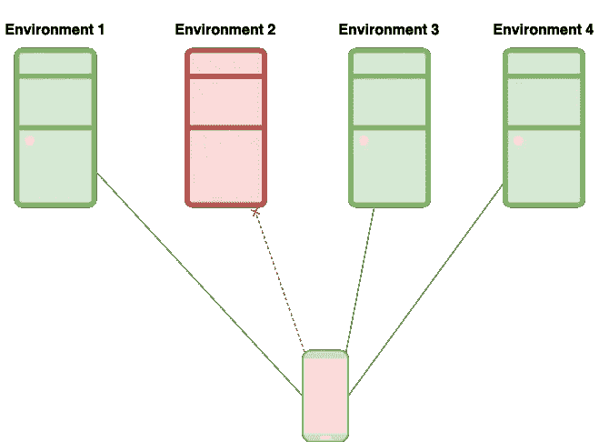

[1.1.1]环境

**1.1.2 特性** 为了了解与非工作特性相关的问题，下图显示了我们的应用程序由特性块和绿色的工作特性组成。相比之下，不工作的功能以红色显示。假设我们希望用红色标识有问题的特性，我们希望能够灵活地打开或关闭特性，而不需要执行重建来对问题进行分类。

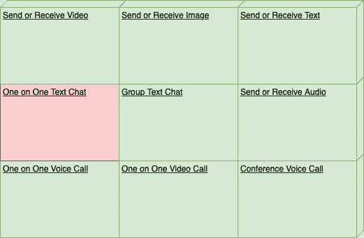

[1.1.2]功能

**1.1.3 调整阈值** 考虑到我们想要调整应用程序中的时间间隔，以使它们表现更好或看起来更合适。下图显示了一个应用程序联系 API 并接收响应。如果我们的超时间隔太短，我们的应用程序很快就会停止侦听，另一方面，如果超时间隔太长，我们的应用程序会等待很长时间，当这种等待在应用程序的关键路径上时，我们会看到我们的应用程序的性能明显滞后。为了预测正确的值，我们希望能够灵活地调整超时值，以确定什么更适合我们的应用程序，而不必每次都重新构建我们的应用程序。

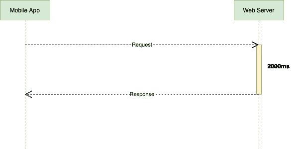

[1.1.3]调谐阈值

**1.1.4 动态值** 假设我们想要编辑一个配置值来快速测试更改，而不必重新构建我们的应用程序。为了说明这种情况，下图显示了我们的应用程序指向一个不存在的域 example.com，而我们希望执行快速检查，以确保新域 global.example.com 按预期工作。

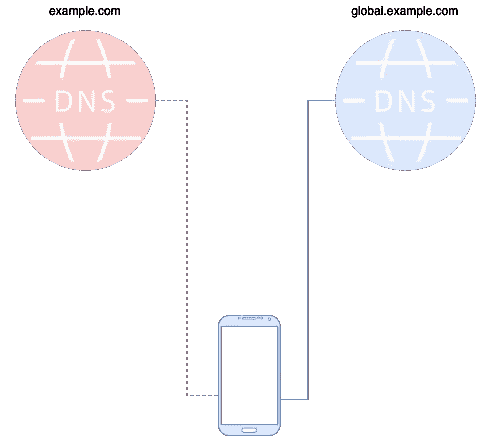

[1.1.4]动态值

## 1.2 目标

考虑了上述问题后，让我们定义我们的目标，如下所示:

> *“鉴于应用程序有必要的代码。我们希望以最小的努力改变应用程序在设备上部署后的行为。”*

# 2.解决办法

考虑到我们的目标，我们希望在部署后能够灵活地编辑应用程序的配置。为此，我们将在应用程序的启动器中放置一个**配置入口点** (CEP)，这允许我们在加载主应用程序之前更新配置。为了举例说明这一点，下图显示了 launcher 有两个应用程序的入口点，绿色显示的是应用程序的主入口点**(MEP)。相比之下，黄色部分允许我们在启动 MEP 之前自定义设置。**

**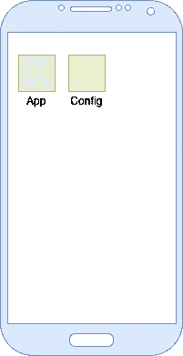**

**[2.0.1]解决方案概述**

**我们将使用多平台方法实现这个解决方案，为 Android 和 iOS 生成本地库。我们的库由三层组成，如下图所示:**

**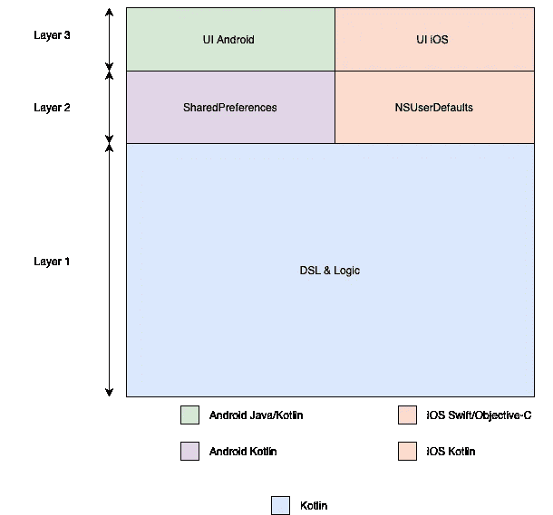**

**[2.0.2]解决方案架构**

****第一层** —这一层包含数据模型和我们解决方案的逻辑。这一层的代码不依赖于其他两层，使用 Kotlin。这里的 Kotlin 代码可以在多种平台上本机编译使用，例如 Android、iOS、Windows、Mac、Linux、JavaScript 和 JVM。**

****第二层** —这一层包含特定于平台的实现，用于在我们的解决方案中保存配置值。这一层的代码依赖于*层一*而不依赖于*层三*。这一层包含针对 iOS 和 Android 的特定于平台的 Kotlin 代码。**

****第三层** —这一层包含相应平台上的原生 UI 实现。这一层的代码依赖于*层二*和*层一*。在目标 Android 中，这一层包含 Android 布局文件和 UI 的相应 Kotlin 代码。在目标 iOS 上，这一层包含使用 UIKit 框架处理 UI 中配置状态更改的 Swift 代码。**

*****注:*** *凡是在第二层的也可以在第三层，反之亦然。这是我们必须根据复杂性做出的决定。在这种情况下，与必须在第二层中完全完成 UI 层相比，在第二层中完全完成持久层要简单得多。因此决定将 UI 实现推到第三层。***

## **2.1 DSL —第一层**

**为了在 iOS 和 Android 平台上有一个一致的配置编写方式，我们将使用 Kotlin Lambda 扩展来开发 DSL。在那些 DSL 的实现中，共享以下属性。**

*   ***键* —启用配置中的值检索。**
*   ***描述* —提供描述配置意图的选项。**

****2.1.1 使用 Choice DSL** 解决环境问题为了解决*环境【1 . 1 . 1】*中强调的问题，我们将开发一个 Choice DSL，如下所示。这个 DSL 给了我们从可用选项中选择一个项目的灵活性。在 Choice DSL 中，我们有以下内容:**

*   ***currentChoiceIndex* —在配置中选择的默认项目的值。**
*   ***项目* —该配置中的可用选项。**

**[2.1.1]选择 DSL ( [**实现**](https://github.com/juliuscanute/multi-config/blob/master/app/src/commonMain/kotlin/com/juliuscanute/multiconfig/builder/ChoiceBuilder.kt) )**

****2.1.2 解决特性问题使用开关 DSL** 为了解决*特性【1.1.2】，*中突出显示的问题，我们将开发一个开关 DSL，如下所示。这个 DSL 给了我们打开或关闭特性的灵活性。在交换机 DSL 中，我们有以下内容:**

*   ***开关值* —开关真/假的当前值。**

**[2.1.2]切换 DSL ( [**实现**](https://github.com/juliuscanute/multi-config/blob/master/app/src/commonMain/kotlin/com/juliuscanute/multiconfig/builder/SwitchBuilder.kt) )**

****2.1.3 使用范围 DSL 解决调谐阈值** 为了解决*调谐阈值【1 . 1 . 3】*，我们将开发一个范围 DSL，如下所示。这种 DSL 为我们提供了在指定的最小&最大范围内调整数值的灵活性。在 DSL 系列中，我们有以下产品:**

*   ***最小值* —该配置允许的最小值**
*   ***最大值* —该配置中允许的最大值**
*   ***当前值* —该配置的当前值**

**2.1.3 范围 DSL( [**实现**](https://github.com/juliuscanute/multi-config/blob/master/app/src/commonMain/kotlin/com/juliuscanute/multiconfig/builder/RangeBuilder.kt) )**

****2.1.4 使用可编辑 DSL** 解决动态值为了解决*动态值【1 . 1 . 4】*，我们将开发一个可编辑 DSL，如下图所示。这个 DSL 让我们可以灵活地给我们的*核心内容*编辑一个给定值。**

*   ***当前值* —该配置的当前值**

**[2.1.4]可编辑 DSL( [**实现**](https://github.com/juliuscanute/multi-config/blob/master/app/src/commonMain/kotlin/com/juliuscanute/multiconfig/builder/EditableBuilder.kt) )**

****2.1.5 AppConfig 和 Config DSL** 我们希望能够灵活地更改与应用程序相关的多种配置，并能够尝试不同的分组方式，以找到更适合我们应用程序的方式。为此，我们有 AppConfig & Config DSL，如下所示。**

**[2.1.5] AppConfig( [**实现**](https://github.com/juliuscanute/multi-config/blob/master/app/src/commonMain/kotlin/com/juliuscanute/multiconfig/builder/ConfigurationBuilder.kt))&Config DSL([**实现**](https://github.com/juliuscanute/multi-config/blob/master/app/src/commonMain/kotlin/com/juliuscanute/multiconfig/builder/ConfigurationBuilder.kt) )**

## **2.2 持久性—第二层**

**应用配置更改后，主应用程序的后续启动必须使用新配置。为此，持久层有两个职责，一个是加载现有配置，另一个是保存修改后的配置。对于这些职责，我们在第二层使用 Kotlin 编写了 Android 和 iOS 实现。**

*   **Android 使用 *SharedPreferences***
*   **iOS 使用 *NSUserDefaults***

****2.2.1 加载配置—第一层** 以下代码片段说明了已保存配置的加载。**

**[2.2.1]负载配置([实现](https://github.com/juliuscanute/multi-config/blob/master/app/src/commonMain/kotlin/com/juliuscanute/multiconfig/model/ConfigurationGetterImplementation.kt))**

****2.2.2 保存配置—第一层** 以下代码片段说明了如何保存更新的配置。**

**[2.2.2]保存配置([实现](https://github.com/juliuscanute/multi-config/blob/master/app/src/commonMain/kotlin/com/juliuscanute/multiconfig/model/ConfigurationRepository.kt))**

****2.2.3 设置期望—第一层** 从*【2 . 2 . 1】**【2 . 2 . 2】*中我们可以看出，第一层的代码是期望平台执行的操作的模板，用于设置。Kotlin native 有一种优雅的方式来做到这一点，如下所示。**

**[2.2.3]设定期望值([实施](https://github.com/juliuscanute/multi-config/blob/master/app/src/commonMain/kotlin/com/juliuscanute/multiconfig/settings/Settings.kt))**

****2.2.4 实际实现—第二层** 为了满足第一层的期望，我们必须在第二层提供相应的实际实现。Kotlin 有一个很好的方法来满足这种期望，如下图所示。**

***Android 实现* 在 Android 中，我们使用 *SharedPreferences 来满足预期。***

**[2.2.4] Android 持久性([实现](https://github.com/juliuscanute/multi-config/blob/master/app/src/androidMain/kotlin/com/juliuscanute/multiconfig/settings/Settings.kt))**

***iOS 实现* 在 iOS 中，我们使用 *NSUserDefaults 来满足预期。***

**[2.2.4] iOS 持久性([实现](https://github.com/juliuscanute/multi-config/blob/master/app/src/iosMain/kotlin/com/juliuscanute/multiconfig/settings/Settings.kt))**

## **2.3 用户界面—第三层**

**当我们通过 CEP 启动应用程序时，我们将用 DSL 编写的配置转换成与平台相对应的 UI 控件。我们已经用 Kotlin & Swift 编写的 Android & iOS 的本地实现介绍了这个逻辑。**

**为了理解整个库是如何工作的，我们将看一个使用该库的示例应用程序。**

**注意:第一层的代码比其他两层的代码越多，维护代码库就越容易。我们在第一层应用的改进对所有目标都有效。我们对所有这些层进行编码的目标是尽可能多地进入第一层。**

# **3.使用库构建应用程序**

**在开发了我们库的所有三层之后，考虑我们已经向 Maven Central 和 CocoaPods 发布了 Android & iOS 库。在下一节中，我们将在示例项目中使用已发布的库。**

# **3.1 依赖性**

**要在目标平台上本地使用这些库，请遵循下面所示的设置过程:**

****3.1.1 安卓依赖****

**[3.1.1] [build.gradle](https://github.com/juliuscanute/multi-config/blob/master/sampleAndroid/app/build.gradle)**

****3.1.2 iOS 依赖****

**【3 . 1 . 2】[pod file](https://github.com/juliuscanute/multi-config/blob/master/sampleios/Podfile)**

# **3.2 配置应用程序**

**示例项目有两种不同的配置，分别针对免费用户和高级用户，并且包含一个带有文本的视图，我们希望在启动之前配置其属性。下面列出了我们感兴趣的属性:**

*   ***可见度***
*   ***文本大小***
*   ***当前文本***
*   ***文本颜色***

****3.2.1 Android 配置** 我们的示例项目的配置在 Android 中表示如下。**

**【3 . 2 . 1】[安卓 App 配置](https://github.com/juliuscanute/multi-config/blob/master/sampleAndroid/app/src/config/java/com/juliuscanute/sampleandroid/Configuration.kt) ( [完整片段)](https://gist.github.com/juliuscanute/0651fca32f3c48974dbd1cc0ce400ceb.js)**

****3.2.2 iOS 配置** 我们的示例项目的配置在 iOS 中表示如下。**

**[3.2.2] [iOS 应用配置](https://github.com/juliuscanute/multi-config/blob/master/sampleios/sampleios/Configuration.swift) ( [完整片段](https://gist.github.com/juliuscanute/71c25c9c2be8be961ab93cb650ded9d1.js))**

# **3.3 初始化配置**

**我们可以在应用程序启动期间初始化我们的配置模块，如下所示。**

****3.3.1 使用 UI 初始化 Android** 对于 Android，我们将使用我们库的第二层中的上下文来处理共享偏好。另一方面，在更新配置之后，我们使用库的第三层上的 Intent 来启动 start 活动。**

**[3.3.1] [使用 UI 初始化 Android](https://github.com/juliuscanute/multi-config/blob/master/sampleAndroid/app/src/config/java/com/juliuscanute/sampleandroid/SampleApp.kt)**

****3.3.2 使用 UI** 初始化 iOS 对于 iOS，我们将使用我们库的第二层中的组名来初始化 NSUserDefaults。另一方面，在更新配置后，我们使用第三层中的控制器导航到应用程序的开始。**

**[3.3.2] [使用用户界面](https://github.com/juliuscanute/multi-config/blob/master/sampleios/sampleios/Configuration.swift)初始化 iOS**

## **3.4 使用当前配置值**

**初始化我们的库后，我们可以在应用程序中的任何点获得更新的配置值，如下所示。我们可以使用配置 DSL 中定义的键来获取与配置相对应的值。**

****3.4.1 安卓使用****

**【3 . 4 . 1】[安卓使用](https://github.com/juliuscanute/multi-config/blob/master/sampleAndroid/app/src/main/java/com/juliuscanute/sampleandroid/MainActivity.kt)**

****3.4.2 iOS 使用情况****

**【3 . 4 . 2】[iOS 用法](https://github.com/juliuscanute/multi-config/blob/master/sampleios/sampleios/ConfigurationData.swift)**

# **4.结果**

**显示我们的应用程序有两个入口点 MEP 和 CEP。在包含库的 Android 中，这是清单合并的结果。在 iOS 中，我们创建两个目标并将目标关联到同一个应用程序组，因此更新一个目标中的设置会反映到另一个目标中。**

**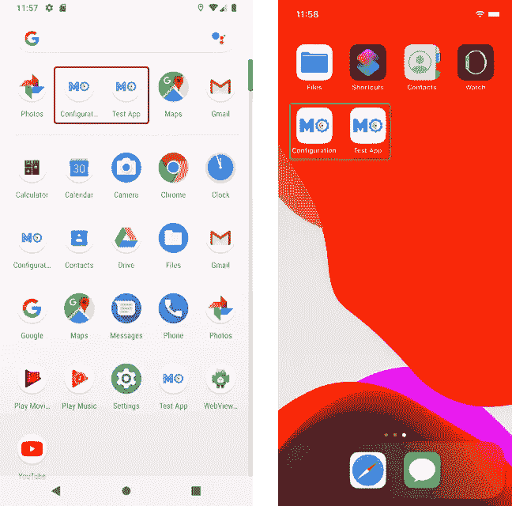**

**[4] Android 左侧，iOS 右侧— MEP 和 CEP**

**我们使用 CEP 发布我们的应用。在发布期间，我们使用 DSL 来动态创建应用程序的 UI。在下图中，显示了 CEP 的起点。此处可见的每个项目都是应用于应用程序的配置的集合(如果选中)。在下图中，我们想要调整应用程序的高级配置。因此，我们点击它来进一步编辑配置。**

**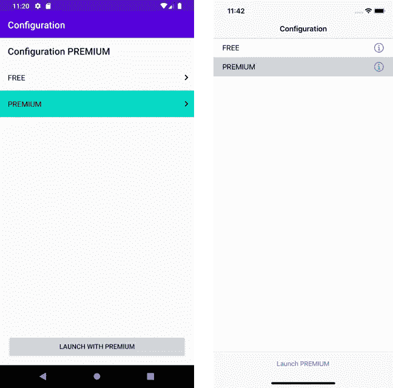**

**[4] Android 左，iOS 右—来自 DSL 的动态 UI**

**进入高级配置后，我们将更新设置，如下所示:**

**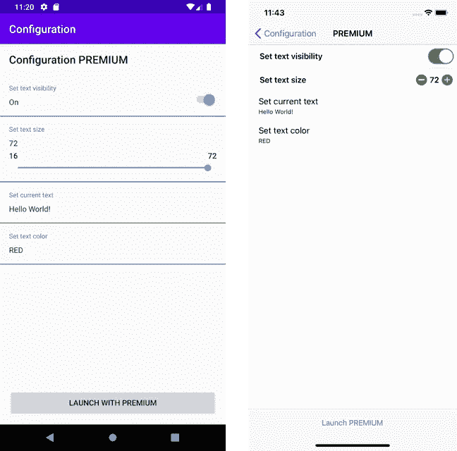**

**[4] Android 左侧，iOS 右侧—更新配置值**

**更新配置后，通过点击 Launch PREMIUM 按钮或从启动器启动 MEP 来启动我们的 MEP，会有更新的配置值。**

**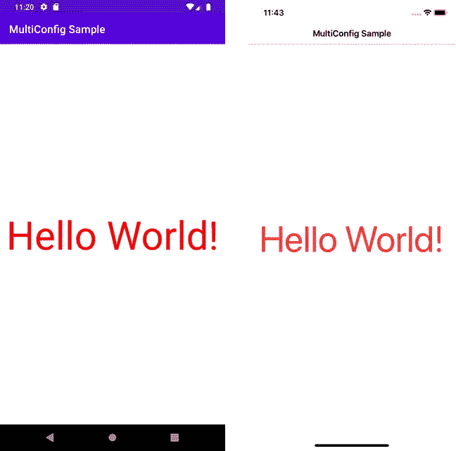**

**[4] Android 左侧，iOS 右侧—使用新配置加载**

# **5.复活节彩色蛋**

**我们在公共代码的第一层隐藏了一个复活节彩蛋，这在我们不需要第二层(持久性)和第三层(UI)的应用程序发布时会很有用。这是一个只读配置，在我们最终确定配置值后非常有用。**

## **5.1 安卓系统**

**在 Android 中使用这个复活节彩蛋需要两步。**

****5.1.1 依赖性** 我们必须在 Android 中单独打包非 UI 变体，因为我们想避免将 CEP 放在启动器上。由于清单合并，当我们依赖库的 UI 变体时，CEP 是自动配置的。**

**[5.1.1] [非 UI 依赖](https://github.com/juliuscanute/multi-config/blob/master/sampleAndroid/app/build.gradle)**

****5.1.2 初始化库** 你会发现初始化时缺少开始意图和上下文。**

**[5.1.2] [初始化库](https://github.com/juliuscanute/multi-config/blob/master/sampleAndroid/app/src/prod/java/com/juliuscanute/sampleandroid/SampleApp.kt)**

## **5.2 iOS 初始化库**

**你会发现组名和启动控制器在初始化时丢失了。**

**[5.2] [初始化库](https://github.com/juliuscanute/multi-config/blob/master/sampleios/sampleios/Configuration.swift)**

## **5.3 输出**

**下图显示了应用程序开始使用库中没有持久层和 UI 层的 DSL。**

**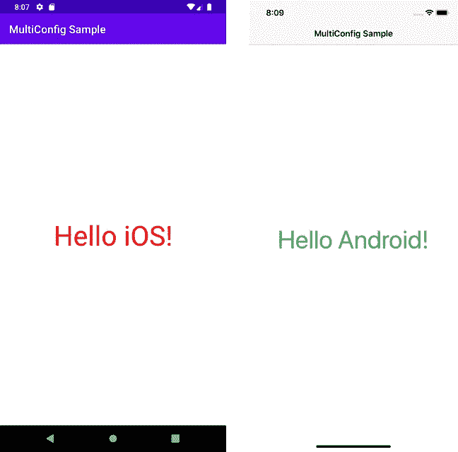**

**[5]没有用户界面开始**

**我们已经到达了多平台旅程的终点，在我们离开之前，我有一些评论。在撰写本文时，多平台还处于试验阶段。在它稳定之前，这里显示的实现允许我在测试环境中使用代码，并获得进一步扩展其用途的信心。**

**我进行这次旅行是因为我对能够使用 Kotlin 针对多个平台的提议感到兴奋。当我从 Swift 调用顶级 Kotlin 函数、Kotlin 对象和重载成员函数时，我感到惊讶了几次。但是，不用担心，您可以使用生成的框架头文件轻松找到自己的路。**

**在这一点上，我们总结这一材料，希望它是有用的人谁采取多平台的冒险。然而，当我看着[5]上的插图时，我不禁思考一个事实:**

> **虽然我们有分歧，但我们的本质是相同的。**

# **参考**

1.  **[https://kot linlang . org/docs/reference/building-MPP-with-grad le . html](https://kotlinlang.org/docs/reference/building-mpp-with-gradle.html)**
2.  **[https://eladnava . com/publish-a-universal-binary-IOs-framework-in-swift-using-cocoapods/](https://eladnava.com/publish-a-universal-binary-ios-framework-in-swift-using-cocoapods/)**
3.  **[https://github.com/bintray/gradle-bintray-plugin](https://github.com/bintray/gradle-bintray-plugin)**
4.  **[https://developer.apple.com/xcode/swiftui/](https://developer.apple.com/xcode/swiftui/)**
5.  **[https://developer.android.com/jetpack/compose](https://developer.android.com/jetpack/compose)**
6.  **[https://kot linlang . org/docs/reference/platform-specific-declarations . html](https://kotlinlang.org/docs/reference/platform-specific-declarations.html)**
7.  **[https://kot linlang . org/docs/tutorials/native/apple-framework . html](https://kotlinlang.org/docs/tutorials/native/apple-framework.html)**
8.  **[https://kot linlang . org/docs/reference/type-safe-builders . html](https://kotlinlang.org/docs/reference/type-safe-builders.html)**
9.  **[https://developer . Android . com/training/data-storage/shared-preferences](https://developer.android.com/training/data-storage/shared-preferences)**
10.  **[https://developer . apple . com/documentation/foundation/nsuserfaults](https://developer.apple.com/documentation/foundation/nsuserdefaults)**
11.  **[https://github.com/russhwolf/multiplatform-settings](https://github.com/russhwolf/multiplatform-settings)**
12.  **[https://github.com/Kotlin/kotlinx.serialization](https://github.com/Kotlin/kotlinx.serialization)**