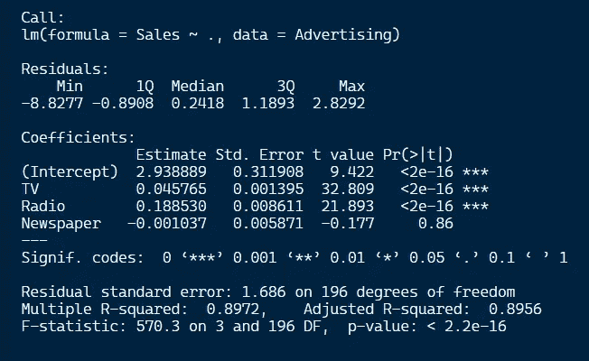
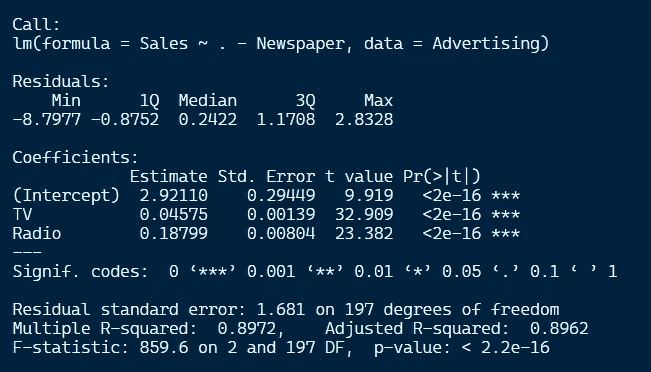
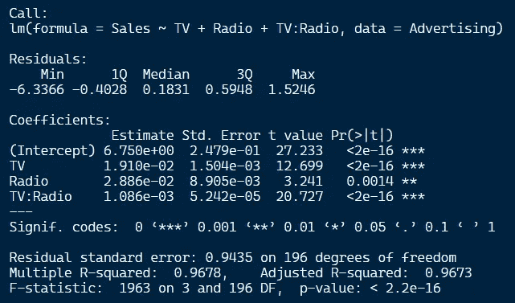
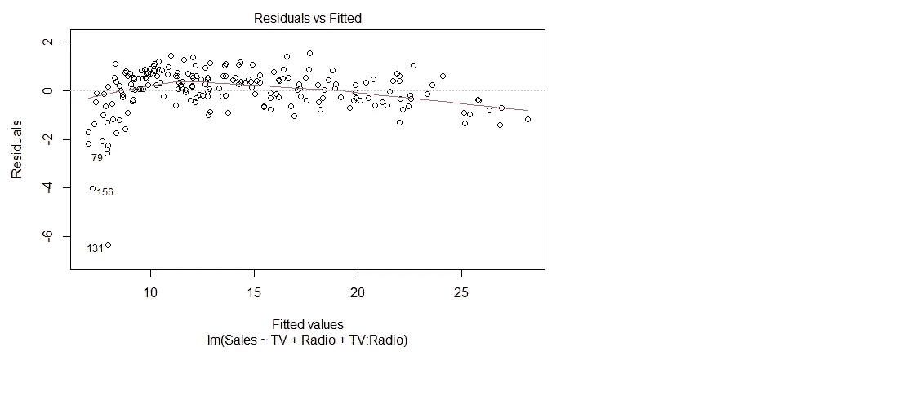
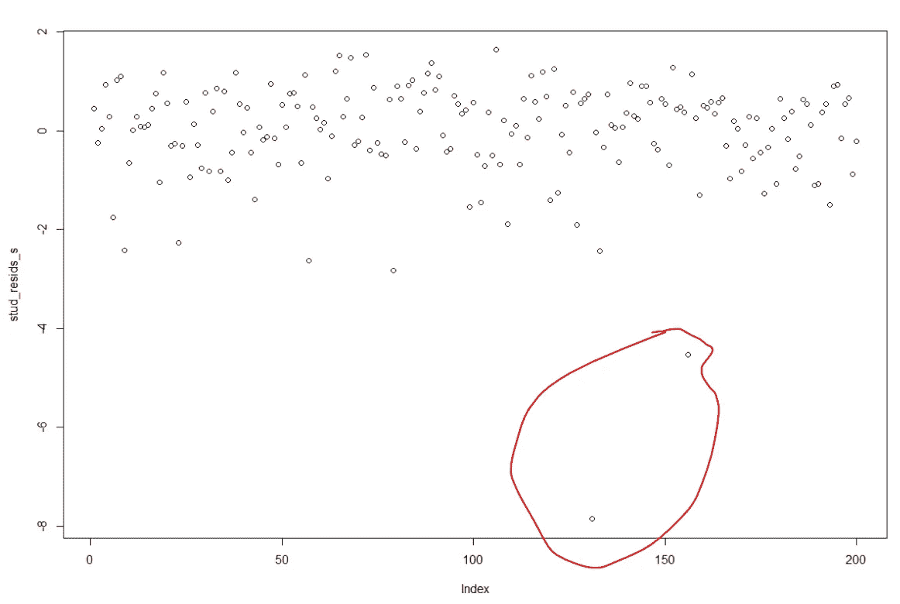
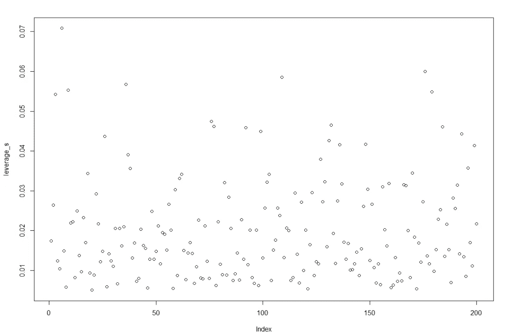
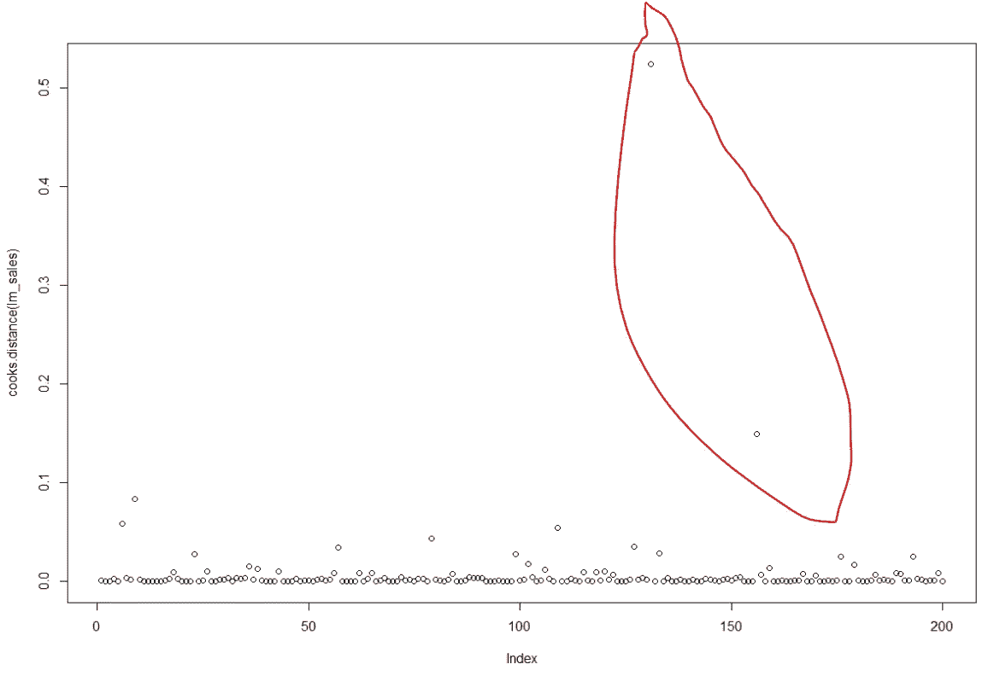
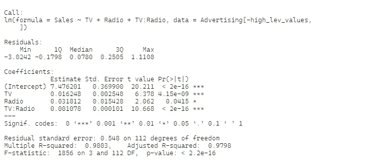
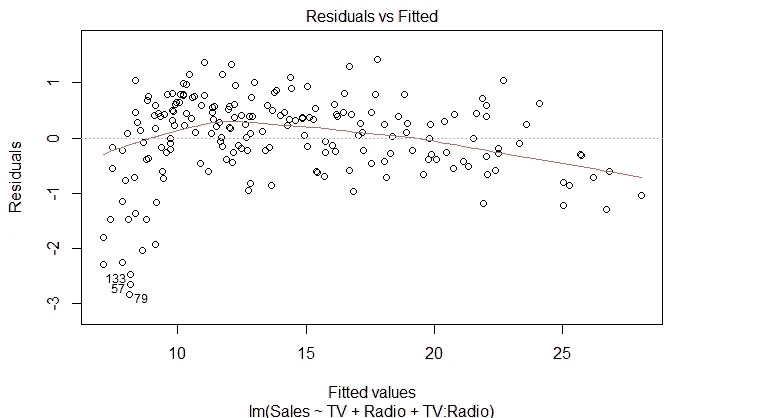

# 多元线性回归

> 原文：<https://blog.devgenius.io/multiple-linear-regression-9448ef1ce721?source=collection_archive---------6----------------------->

执行多元线性回归的完整演练


Stephan Margo 在 [Unsplash](https://unsplash.com/photos/yt8mmYgLLLA) 上拍摄的图片

在我们之前的故事中，我们了解了为什么使用回归以及什么是简单线性回归。

如果你想了解更多关于简单线性回归[这里](https://medium.com/dev-genius/an-introduction-to-simple-linear-regression-7ad6c5287225)，我建议你浏览一下之前的故事。

在这篇文章中，我试图用一些补充来总结我从 ISLR 回归书中学到的东西。在这里，我们将借助广告数据讨论多元线性回归的基础知识，并学习验证模型假设。

多元线性回归是一种利用多个预测因子预测响应变量 Y 的方法，假设响应变量与其他预测因子呈线性关系。

数学上，我们可以将等式写成


其中，βₚ是 Xₚ增加一个单位对 y 的平均影响，保持所有其他预测因子不变，p 是预测因子的数量。

当使用回归处理问题陈述时，我们可以回答以下问题

1.  反应变量和预测因子之间有关系吗？
2.  哪些预测因子可用于预测反应变量？
3.  我们能多准确地预测响应变量？
4.  给定一组预测值，响应值应该是多少？

随着文章的深入，我们将讨论所有这些问题。

让我们首先在这里加载 Kaggle [上的广告数据。](https://www.kaggle.com/datasets/ashydv/advertising-dataset)

```
#View the datasethead(Advertising)
```


图片来自作者

这里，我们有电视、广播和报纸的广告支出，以美元为单位，销售额以单位表示。

让我们在整个数据集上拟合模型，看看我们会得到什么结果

```
lm_sales <- lm(data = Advertising, Sales ~ .) 
# . in R means all #variables
summary(lm_sales)
```



**1。让我们试着理解我们的反应变量和预测变量之间是否存在关系？**

要回答统计学中的任何问题，最好的方法是创建一个假设。

在这里，我们创建我们的假设，使我们假设零假设没有任何影响反应的预测；和备选假设，因为至少一个预测值非零。

H₀ : β₁ = β₂ = = βₚ = 0
Hₐ:至少有一个βₚ不为零。

为了评估这一点，我们在模型结果中使用 F 统计量。


乳胶制成的图像

当我们的零假设为真时，我们的 F 统计值更接近 1。在我们的例子中，我们观察到我们的 F 值是 570.3，这在统计上也是显著的(观察 F 统计右侧的 p 值)，因此我们成功地拒绝了零假设，并得出结论，在反应变量和预测因子之间存在关系

*注意:在 p 大于 n 的情况下，这种解释不起作用*

**2。哪些预测因子有助于我们预测反应变量？**

为了回答这个问题，我们将看看所有变量的 p 值，看看它是否显著。对于电视和广播支出，我们看到 p 值为< 0.05, hence these predictors have a significant effect on the response variable.

Here, I will rerun the model excluding Newspaper

```
# Consider all predictors except Newspaper
lm_sales <- lm(data = Advertising, Sales ~ . — Newspaper) # - is #used to remove the variable
summary(lm_sales)
```



*。当预测值较小时，这种查看 p 值的方法通常很有帮助。但是，当我们有大量预测值时，我们可能希望应用更复杂的方法，如向前、向后或逐步选择(我们不会在教程中介绍这些方法，以使其专注于模型)*

**3。我们能多准确地预测响应变量？**

我们将使用调整后的 R 平方来评估 89%的数据拟合度。也就是说，我们的模型可以解释 89%的销售变化

*移除报纸后观察，我们的模型拟合度略有提高*

4 **。给定一组预测值，响应值应该是多少？**

从模型中获得系数估计值后，我们可以简单地将方程写成

销售额= 2.921+ 0.045 *电视+ 0.187 *收音机

因此，如果我们已经花费了所有销售渠道的价值，我们可以很容易地使用上述模型方程预测销售额。

**包含回归中的交互作用:**

我们之前讨论的方法也称为加法方法，因为我们直接将所有变量的影响相加，并假设系数值独立于其他变量，但这并不总是正确的。营销中的一个重要概念是协同效应，即如果我们在两个渠道上花钱，促销的有效性可以增加销售额，远远超过我们在电视上或广播上花钱的线性模型的预期，同时保持 Betas 不变。让我们扩展我们的模型，通过在线性模型中添加一个相互作用项，看看这个概念在我们的例子中是否真实

销量= β₀ + β₁ ×电视+ β₂ ×广播+ β₃ ×(广播×电视)+ ϵ

= β₀ + (β₁ + β₃ ×电台)×电视+ β₂ ×电台+ ϵ

*观察现在电视和广播是如何变得相互依赖的*

让我们试着发现增加一个交互项是否会帮助我们提高拟合度。

```
lm_sales <- lm(data = Advertising, formula = Sales ~ TV + Newspaper + Radio + TV:Radio)summary(lm_sales)
```



我们观察到相互作用项确实是重要的，因此将它包含在我们的模型中对我们是有好处的。我们还观察到，模型的拟合度从 89%提高到了 96%，这是一个很大的进步。

*注意:如果我们包括基于交互项，那么我们应该总是包括那些我们已经交互的变量，不管它们的 p 值如何*

构建我们的第一个模型很好，但是在我们最终确定我们的解释之前，让我们看看我们的模型是否符合线性回归的假设。

**线性回归模型的假设:**

1.  **反应-预测值关系的线性**

线性模型假设预测值和响应之间的关系是线性的。这可以通过绘制残差图来检验。残差不应该有模式，应该是随机的。如果我们在残差中看到模式(如增加或减少或漏斗形)，那么关系不是线性的。

对于我们的模型，让我们使用 R 中的绘图函数来绘制残差

```
lm_sales <- lm(data = Advertising, formula = Sales ~ TV + Newspaper + Radio + TV:Radio)
summary(lm_sales)
```



我们可以在残差中轻微的模式，R 也突出显示了具有高残差值的点。我们可以看到，索引值(行号)为 156 和 131 点似乎与其他点稍微有些隔离。

**2。错误术语无关联:**

这意味着，如果我们知道ϵi，我们应该没有关于ϵi+1.迹象的信息这种相关性可能出现在时间序列数据中，或者如果我们的预测因子彼此相关，例如，在一项研究中，如果我们使用体重来预测身高，如果一些人是同一家庭的成员并分享相同的饮食，则假设可能会被违反。这里，如果我们在残差图中观察，很难预测下一个误差，因为模式看起来是随机的。

**3。无异常值:**

异常值是其 yᵢ值与其他数据非常不同的值。例如，具有非常大误差项的值可以被分类为异常值。由于仅通过残差有时难以对异常值进行分类，我们使用学生化残差图来验证这一点。

学生化残差是残差除以其标准误差，通常大于|3|的值被视为异常值。

学生化残差在这个[环节](https://online.stat.psu.edu/stat462/node/247/)已经解释得很清楚了

我们看到所有的点都在-3 到 2 的范围内，但是 2 点看起来远远超过绝对值 3

```
library(MASS)
stud_resids_s <- studres(lm_sales)
plot(stud_resids_s) 
```



这些术语在 156 和 131 中的索引值(我们在残差图中也获得了相同索引点的一些线索)

**4。没有高杠杆点:**

高杠杆点是由于不寻常的 xᵢ值而对斜率具有高影响的点。

*杠杆涉及一些矩阵代数，因此我们不会在这里讨论杠杆理论。更多详情可以在* [*这里*](https://online.stat.psu.edu/stat462/node/171/) 的链接中找到

```
leverage_s <- hatvalues(lm_sales)plot(leverage_s)
```



在这里，我们没有看到非常孤立的点，因此我们应该很好地利用这一点。

通常为了验证，也可以使用利用库克距离计算的杠杆和异常值的组合，其利用 xᵢ和 Yᵢ变量说明高影响点


这里 hᵢᵢ是杠杆，k 是除截距之外的贝塔数

**如果我们绘制厨师距离，我们会观察到 2 个点，这 2 个点似乎与其他数据不同**

```
plot(cooks.distance(lm_sales))
```



在检查这些点的指数时，我们发现它又是 156 和 131。

**5。无共线性:**

最后，我们检查共线性。在多元线性回归中，建议使用 VIF 检查共线性，因为它也可以解释多重共线性。

```
library(car)
vif(lm_sales,type = "predictor")
```


这里，由于我们有一个相互作用项，我们修改我们的标准 VIF 并计算 VIF_new = GVIG ^ (1/(2*DF))(大于 10 的阈值可用于检查高 VIF_new)

我们看到 GVIG ^ (1/(2*DF))值为 1，因此我们没有看到任何多重共线性

在检查了所有这些假设之后，我们发现的 2 个点似乎可以被删除，我们可以重新运行我们的模型来获得新的估计。

我附上残差图和模型结果，以显示去除这些值后模型的改进。



看起来残差仍然有一个较小的模式，但它比我们之前的图更好，也更随机，因此使用它作为我们的最终模型。

最后，希望你喜欢这篇文章。

欢迎分享您的反馈或意见，或者通过 Linkedinf 联系我。

参考资料:

1.  【statlearning.com 统计学习导论
2.  【第十课:回归陷阱| STAT 462(psu.edu)