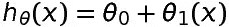
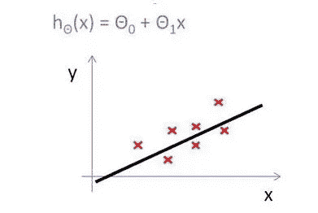
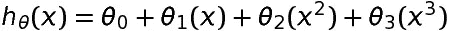
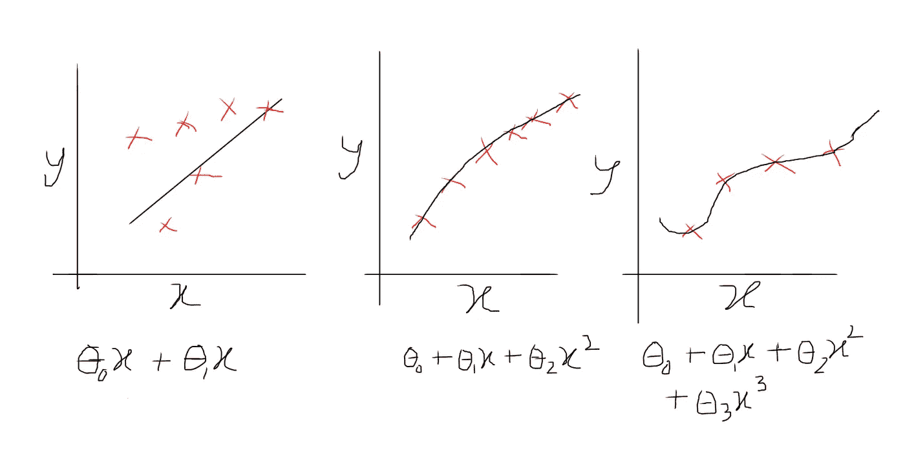
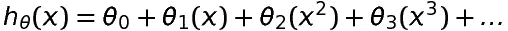
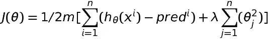

# 多元线性回归

> 原文：<https://blog.devgenius.io/multiple-linear-regression-b7eb053bcf9d?source=collection_archive---------39----------------------->

在上一篇文章中，我们学习了一元线性回归。它的假设函数是:

这是一条直线。

如果，我们有不止一个自变量或特征。那么我们的假设函数可以是:

我们的(y 对 x 图)图表如下:

正如我们所看到的，由于有更多的独立变量，我们的模型完全符合训练数据。这叫做**过拟合**。虽然特征较少，但它不太适合输入，这被称为**欠拟合**。现在，虽然欠拟合会导致错误的预测，但过拟合对我们的机器学习模型也没有好处。因为虽然它会很好地匹配训练集，但它可能不会很好地处理测试或实际数据。因为它偏向于我们的训练集，并且只在相同或相似的输入下工作良好。在可变数据集上，它的性能会很差。

**如何选择参数个数？**

很明显，为了解决欠拟合，我们可以引入更多的特性。但是我们如何解决**过拟合**？

**避免过度拟合:**

1.  一种自然的方法是减少参数的数量并对它们进行调整，使其不仅仅适用于给定的数据集。
2.  第二种方式是**规范化**。这意味着在保持所有特征的同时减少参数𝜃𝑖的大小。

**规范化**:

例如，如果我们的假设函数是:

我们惩罚成本函数中较高的项。所以我们的成本函数会变成这样:

这里，最后一个术语是正则化术语。记住，我们的目标是最小化成本函数。现在，通过引入正则化，我们正在增加某些参数(𝜃𝑗)的成本函数值

**选择正则化因子(𝜆 )**

如果𝜆太大，可能会导致拟合不足。如果𝜆太小，可能没有效果。所以我们必须根据我们的数据选择正则化因子。

**注意:在某些 ML 库中，如 XGBoost，正则化因子也被称为𝛼。**

参考: [Coursera](http://Coursera | Online Courses & Credentials From Top Educators. Join for Free | Coursera)