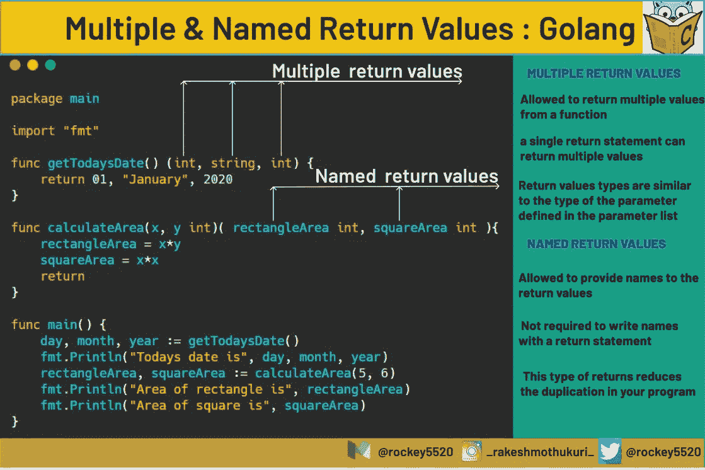

# 多个返回值:Golang

> 原文：<https://blog.devgenius.io/multiple-return-values-golang-bd8496a34c77?source=collection_archive---------0----------------------->

## 在 Golang 中，允许使用 return 语句从一个函数返回多个值


在 Golang 中，允许使用 return 语句从一个[函数](https://www.geeksforgeeks.org/functions-in-go-language/)返回多个值。返回值的类型与为参数定义的类型相匹配。

**举例:**

```
func functionName(x, y int)(int, int){
     return x*3, y*7
}
```



## 命名返回值

它还为返回值提供了名称，同样的名称也可以用在代码中。没有必要用 return 语句写这些名字，因为 Go 编译器会自动理解这些变量必须返回。这种类型的返回被称为**裸返回**。这减少了程序中的重复。

```
func calculateArea(x, y *int*)( rectangleArea *int*, squareArea ) *int* {
     rectangleArea = x*y
     squareArea = x*x
     return
}
```

这里，rectangleArea 和 squareArea 是指定的返回值。

非常感谢乔纳斯·b·尼尔森指出了我的疏忽。我很高兴你喜欢这篇文章。