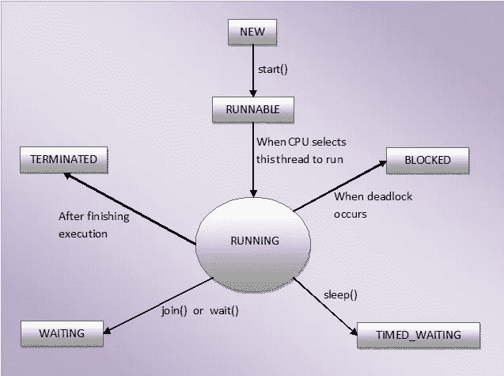

# Java 中的多线程——进阶基础

> 原文：<https://blog.devgenius.io/multithreading-in-java-basics-to-advance-e68f8e344df7?source=collection_archive---------14----------------------->

嗨，我是一名有 2 年多经验的软件开发人员，在我的职业生涯中，我曾多次使用 thread，在一次技术面试中被问到 50 多次，所以我想让我们在一个地方分享我所有的知识。


本文的目标是将学习线程所需的所有主题与链接的资源放在一起。这也有助于在面试前快速回顾多线程的所有内容。当然，现在每个主题或关键词的详细解释都可以很容易地在互联网上找到。

我想强调一下，为了学习与 JAVA 多线程相关的知识，您必须熟悉哪些主题。

我将这篇文章分成三个部分

*   **基础知识**:或必须知道的概念
*   **高级**:一些高级主题及其用例
*   **Industrial** :线程在生产就绪型应用中的实际应用。

让我们从线程中的先决条件和*必须知道的*事情开始。

1: **进程 vs 线程**

进程意味着任何程序都在执行中。该进程需要更多的时间来终止，它是孤立的，意味着它不与任何其他进程共享内存。一个进程共享代码、数据、堆栈和寄存器。

线程是进程的一部分，这意味着一个进程可以有多个线程，而这些多个线程包含在一个进程中。与进程相比，线程需要更少的时间来终止，并且类似的进程线程不会被隔离。

2: **上下文切换**

线程或进程之间的切换是一种上下文切换。

线程切换非常有效，而且便宜得多，因为它只涉及切换出标识和资源，如程序计数器、寄存器和堆栈指针。

而在进程的情况下，它包括用新进程所需的资源关闭所有进程资源。这意味着交换内存地址空间。这包括内存地址、页表、内核资源、处理器中的缓存。

3: **多处理 vs 多线程**

一台电脑同时运行多个程序(比如同时运行 Skype 和 Chrome)就是多重处理。

多线程是多任务的扩展。在这里，任务共享一个公共资源(比如 1 个 CPU)。

4: **线程的生命周期**



5: **守护线程(什么&如何创建它们？)**

*   守护线程是一个低优先级线程，在后台运行，执行垃圾收集(GC)等任务。JVM 不会等待这个线程结束，所以你的程序可以结束，守护线程仍然可以在后台运行。
*   在线程启动之前，将线程设置为守护进程的唯一方法是 setDaemon(true)。

6: **创建线程的不同方式**

*   通过实现**可运行的**接口。
*   通过扩展**线程**类。
*   使用线程池(在第 3 部分中讨论)
*   使用匿名线程类

```
new Thread(new Runnable() {
    @Override
    public void run() {
    }
}).start();
```

**第二部:**

线程的高级概念和实际用例场景。

1: **ThreadLocal**

借助 ThreadLocal，可以创建只能由同一个线程读写的变量。因此，即使两个线程正在执行相同的代码，并且该代码引用了相同的 ThreadLocal 变量，这两个线程也看不到彼此的 ThreadLocal 变量。

*例如，*假设您正在开发一个电子商务应用程序。您需要为每个请求该控制器流程的客户生成一个唯一的事务 id，并且您需要将该事务 id 传递给 manager/DAO 类中的业务方法，以便进行日志记录。一种解决方案是将这个事务 id 作为参数传递给所有的业务方法。但是这不是一个好的解决方案，因为代码是多余的，不必要的。

为了解决这个问题，这里可以使用 ThreadLocal 变量。您可以在控制器或任何预处理器拦截器中生成事务 id；并在 ThreadLocal 中设置这个事务 id。此后，无论控制器调用什么方法，它们都可以从 threadlocal 访问这个事务 id。事务 id 对于每个线程都是唯一的，并且可以从线程的整个执行路径上进行访问。

Java 中的 **Volatile 关键字**

Java volatile 关键字用于将 Java 变量标记为“存储在主内存中”。这基本上意味着，对一个可变变量的每次读写，都是从计算机的主存中读取的。
当线程同时处理变量时，当变量快速更新时，使变量变得不稳定。

3: **Syn 块和 Syn 方法**

两个主要的**区别**

synchronized 方法和块之间的一个显著区别是 Synchronized 块通常会缩小锁的范围。它只锁定了方法的一部分。最好只锁定代码的关键部分，而不是锁定整个方法。

在同步方法的情况下，线程在进入方法时获取锁，在离开方法时释放锁，通常是通过抛出异常。另一方面，在同步块的情况下，线程在进入同步块时获得锁，在离开同步块时释放锁。

4: **所有** **线程类方法**

一些最常用的线程类方法有

run()、start()、Thread.slpeep( long millis)、join()、isDaemon()、interrupt()、getPriority()、getId()、getName()

*对象类方法* : wait()，notify()，notifyAll()

5:**Java 中的 blocking q**

Java BlockingQueue 接口是 Java 集合框架的一部分，它主要用于实现**生产者消费者问题**。Java 提供了几种 BlockingQueue 实现，如 ArrayBlockingQueue、LinkedBlockingQueue、PriorityBlockingQueue。

6: **用 n 根线打印序列…这是一个很常见的面试问题，通过两个线程在一个序列中打印奇偶数，所以我决定为什么不写逻辑并提前做好准备。下面是我的实现的链接。**

[](https://pastebin.com/TysMnyMp) [## 使用线程按顺序打印偶数和奇数的程序](https://pastebin.com/TysMnyMp) 

第三部分:

**螺纹的工业用例**

这一部分详细介绍了线程是如何实现的，以及哪些类和接口用于软件行业的真实场景。

1: **锁定 Java 中的接口**

Java 中的锁定与同步:

锁和同步块之间的主要区别是:

1)超时尝试访问同步块是不可能的。使用 Lock.tryLock(long timeout，TimeUnit timeUnit)，是有可能的。

2)同步块必须完全包含在一个方法中。锁可以在不同的方法中调用 Lock()和 unlock()。

*Java 中锁实现的类型*

*   重入锁
*   reentrantreadwritellock

2:**Java 中的 CountDownLatch**

CountDownLatch 用于确保任务在启动前等待其他线程。为了理解它的应用，让我们考虑一个服务器，其中主任务只能在所有需要的服务都已启动时启动。

用计数器(整数类型)初始化 CountDownLatch 当从属线程完成执行时，此计数器递减。但是一旦计数器达到零，其他线程就会被释放。

如果您自己处理线程，则只能使用 Thread.join。大多数人选择不直接处理令人头痛的线程处理，而是使用 ExecutorService 来为他们处理。ExecutorServices 不直接显示它们是如何执行任务的，所以您必须使用 CountDownLatch:(假设您不想只是关闭整个服务，也就是说。)

3:**Java 中的线程池**

*   ***fixed thread pool***:一个队列，10 个 runnable 和一个 5 线程池，然后并行启动 5 个线程，等待 1 个线程完成，然后给队列中的第 6 个线程机会。
*   ***CachedThreadPool***:一个线程池，创建它需要的尽可能多的线程(MAX_INTEGER)来并行执行任务。旧的可用线程将被重新用于新的任务。如果一个线程在 60 秒内没有被使用，它将被终止并从池中删除
*   **调度线程池**:定期调度任务的线程池。

4: **执行器接口**

Java 中的并发 API 提供了一个被称为**执行器**的特性，由**发起并控制线程**的执行。因此，执行器提供了使用 thread 类管理线程的替代方法。在实际应用中，该接口主要用于将创建线程的逻辑与业务逻辑分离开来。

前面提到的线程池实际上是使用 Executor 接口创建的。

```
ExecutorService service = Executors.newFixedThreadPool(5);
for(int x = 0; x < numOfThreads; x++) {
service.submit(new Runnable() {
  public void run() {
  // do something
 }
});
}
```

5:**Java 中的期货**

如果你需要从一个线程返回一些东西或者检查线程的进度，那么 Java Futures 就派上了用场。

所以你不用 runnable，而是使用一个 callable 对象，这个 Callable 对象返回一个 Future 对象，这个 Future 对象提供了监控一个线程正在执行的任务的进程的方法。future 对象可用于检查可调用对象的状态，然后在线程完成后从可调用对象中检索结果。它还提供超时功能。

```
Future<Long> result10 = executor.submit(new CalculateService(10));  

//get the result using get method of the Future object
//get method waits till the thread execution and then return the result of the execution.
Long var10 = result10.get();
```

**6:停止线程的方法**

通常有三种方法可以做到这一点。

使用 ExcecuterService 并将 Runnables 提交给它们，如果使用 Callable 和 Future，则使用 executors . shut down()
或
。然后就是 future.cancel(真)。
或
在简单线程类中有 kill()或 stop()方法，但它们已被弃用。

但是在这两种情况下，JVM 都不保证线程停止。

所以你能做的是:

使用可变变量或原子变量

```
public void run( ) {while(keepRunning == true){……..}}
```

这是因为当 run 方法完成时，线程就会死亡。

这都是来自我这边的 JAVA 多线程。请随时纠正我或评论或建议我可能错过的任何新主题。

***和鼓掌欣赏我的作品*** 如果觉得有意思。
你可以在: [LinkedIn](https://www.linkedin.com/in/ankityadav1801/) ， [GitHub](https://github.com/yadav-ankit) 上找到我。我们连线吧！🤝