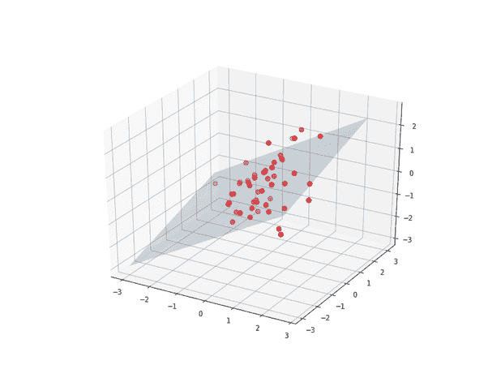
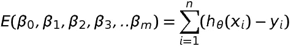

# 多元线性回归

> 原文：<https://blog.devgenius.io/multivariate-linear-regression-dfd18a26431d?source=collection_archive---------6----------------------->

这类似于线性回归，但我们有多个输出变量，而不是单一的因变量 Y。它可以写成，

**Y = XB + U** ，

其中 **Y** 是具有一系列多变量测量值的矩阵(每一列是对一个因变量的一组测量值)， **X** 是对可能是设计矩阵的独立变量的观察值的矩阵(每一列是对一个独立变量的一组观察值)， **B** 是包含通常要估计的参数的矩阵。 **U** 是正则化因子。

用旧的形式来表现它，

**多元线性回归 vs 多元线性回归**

**在这里阅读更多:**[https://www.aureollabs.com/multivariate-linear-regression/](https://www.aureollabs.com/multivariate-linear-regression/)

在下一篇文章中，我们将学习使用 Python 进行*数据分析。*

**脚注**

[【1】](https://www.quora.com/profile/Himanshu-Kansal-6/all_posts#cite-szMcY)[用最少的符号/数学解释多元回归和多元回归的区别](https://stats.stackexchange.com/questions/2358/explain-the-difference-between-multiple-regression-and-multivariate-regression#:~:text=In%20multivariate%20regression%20there%20are,more%20than%20one%20or%20multiple.&text=To%20summarise%20multiple%20refers%20to,more%20than%20one%20dependent%20variables.)