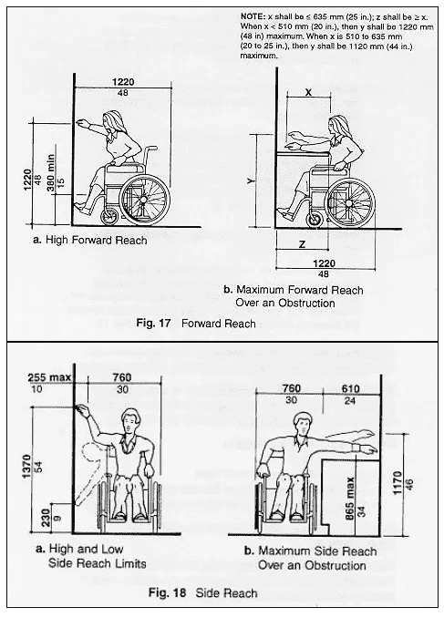
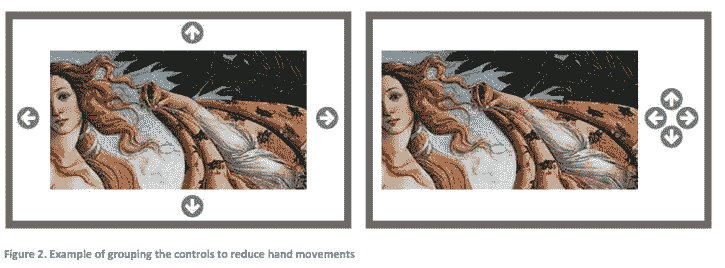

# 软件工程师博物馆设计

> 原文：<https://blog.devgenius.io/museum-design-for-software-engineers-d63df1b960e6?source=collection_archive---------28----------------------->

在 [Unsplash](https://unsplash.com?utm_source=medium&utm_medium=referral) 上[科学高清](https://unsplash.com/@scienceinhd?utm_source=medium&utm_medium=referral)拍摄的照片

虽然我现在是一名软件工程师，但我过去在博物馆领域工作。我获得了博物馆研究的硕士学位，并在一家博物馆展览设计公司担任内容开发员和解说作家。这些看起来是不同的职业，但是我发现了惊人的重叠。会展开发和软件开发都是以用户为中心的迭代过程。博物馆和软件设计团队都试图以优雅、高效的方式传达他们的信息。

随着博物馆寻求以最好的方式教育和娱乐他们的游客，他们越来越多地转向技术来增加新的和现有的展览。从移动应用到增强和虚拟现实，最常见的是触摸屏互动活动。这些触摸屏通过以下方式增加了博物馆参观的价值:

*   与看不见或摸不着的东西(原子、分子等)的相互作用。).
*   与不安全或不可及的事物(电、外太空、易碎的艺术品)互动。
*   以前“静态”的话题变得生动起来，引起人们的好奇心。[Via [壁虎群](https://geckogroup.com/2018/11/05/digital-and-mechanical-interactive-exhibits/)

在我的博物馆职业生涯中，我帮助开发了许多这样的交互，虽然它们看起来和功能上像大多数 web 应用程序，但是除了典型的 UI 最佳实践之外，还有一些需要仔细考虑的问题。我想把这些知识分享给软件开发人员和博物馆客户，甚至是在内部制作软件的博物馆设计师。(如果你是作为软件开发人员阅读本文的，那么访问者=用户)。这绝不是一个考虑事项的详尽列表，我鼓励您访问我链接的参考资料并做更多的研究。

1.  Jakob Nielson 的 [**10 条用户界面设计的可用性启发**](https://www.nngroup.com/articles/ten-usability-heuristics/) 在这里绝对适用，在博物馆触摸屏软件中绝对不应该被忽略。
2.  这种类型的用户界面应该能够适应访问者想要在屏幕前停留的时间。基本上每一项博物馆行为研究都得出结论，游客的注意力持续时间很短。我们是没有耐心的生物！你不能马上用一堵文字墙打你的访客，否则他们会马上走开。想想[“一次点击一颗太妃糖”的方法](https://link.springer.com/content/pdf/10.1007%2F978-3-642-11762-6_14.pdf)。关注视觉效果和可消化的文本是最好的，对于那些想知道一切的罕见访问者，添加“了解更多”功能进行更深入的探讨。
3.  **仔细考虑** [**平面 vs 3D 设计**](https://www.nngroup.com/articles/flat-design-long-exposure/?fbclid=IwAR3dPkRc9Xrii5LMnpwlug-zlKMfR59JQwIQpiZnubctWTOb7QHMW1bIkUk) 的利弊。作为 UI 设计师，我们都知道美学不应该优先于功能，但这在博物馆环境中尤其重要。参见上一点:访问者的注意力持续时间。你的网站或网络应用程序的访问者很可能有特定的目的，会花更多的时间来解决导航问题。在一个自由选择或非正式的教育环境中，如果导航不是很明显，你可能会马上失去你的访问者。
4.  **一个小小的警告:**你的触摸屏内容不应该直接将用户链接到第三方网站。除非它也是由博物馆拥有和管理的网站，否则你无法确定该网站的质量或可靠性。
5.  因为通用设计是博物馆设计的一个主要原则，它也必须被考虑到数字交互中。如果你只从这篇文章中得到一样东西，那就是:**你的软件必须能被尽可能多的访问者访问**。我知道可访问性是任何好的网络应用的焦点，但是博物馆软件的可访问性需要更仔细的思考。触摸屏互动通常很大，可以容纳家庭或团体游客。它们的大小使得它们的使用比在电脑上访问 web 应用程序更加实际。虽然对于数字媒体有许多[可访问性](https://www.sifacilities.si.edu/ae_center/pdf/Accessible-Exhibition-Design.pdf)问题，比如展品中的物理位置或屏幕眩光，但我在这里主要关注 UI 元素。

*   网站导航通常位于网页的顶部和一些网络应用程序的旁边。当设计博物馆触摸屏用户界面时，导航应该朝向底部。无论屏幕是垂直安装还是水平安装，将导航放在底部都可以让轮椅用户或其他行动不便的人更容易看到。

展示轮椅使用者通过[史密森尼](https://www.sifacilities.si.edu/ae_center/pdf/Accessible-Exhibition-Design.pdf)到达的图

*   考虑视力低下或无视力的游客。这包括我们作为 UI 设计师已经想到的东西，比如按钮和文本的足够对比度，但你也应该考虑辅助硬件或语音控制和语音旁白选项，这样这些参观者就不会错过这部分展览。
*   失聪或听力困难的游客依赖于视频和音频字幕，但不要只是在那里加上一些字幕，然后就结束了。无论您使用开放式字幕还是提供隐藏式字幕选项，都要让字幕成为您设计中有意识的一部分，而不是事后的想法。这似乎是显而易见的，但是要确保字幕无论出现在哪里都是可读的。
*   让你的界面尽可能的直观，让行动号召按钮脱颖而出，并有一致的位置和外观。关于平面设计与 3D 设计的对比研究，请参见第 3 点。
*   必要时添加简短的说明。
*   触摸敏感区域应该足够大(史密森尼标准直径为 3 英寸)，以便精细运动控制受到影响的游客使用。
*   尽量避免包含需要双手或多个手指滑动/拖动/缩放的动作。
*   考虑集中按钮以减少手和手臂的运动:

通过 Ivan Burmistrov 的 [this](https://www.researchgate.net/publication/282049608_Touchscreen_Kiosks_in_Museums) 文献综述对按钮进行分组的示例

*我在这篇文章中引用的资源都有链接。如果你有我应该添加到这个列表中的东西，请通过*[*LinkedIn*](https://www.linkedin.com/in/asha-misra/)*联系我！*