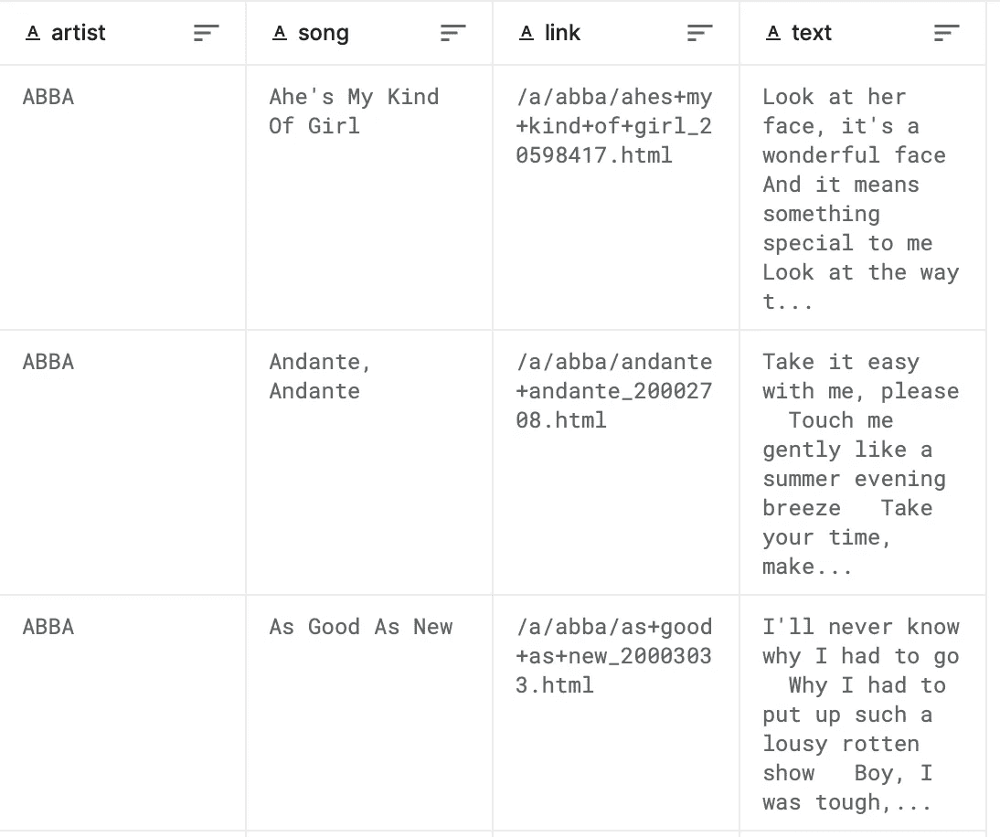

# 音乐推荐系统使用句子变压器，Faiss 与 DVC。

> 原文：<https://blog.devgenius.io/music-recommendation-system-using-sentence-transformers-faiss-with-dvc-60508ccdc5d0?source=collection_archive---------18----------------------->

## **引言。**

在这篇文章中，我将讲述如何使用另一个 MLops 框架 **DVC** 来执行数据版本、代码版本、代码可再现性、模型注册和实验跟踪。我已经创建了一个基本的音乐推荐系统，它使用**语句转换器**来计算嵌入矩阵，使用 **Faiss** 来执行相似性搜索。这篇文章的主要目的是让我们深入了解如何使用 DVC。

## DVC。

DVC 是一个机器学习项目的开源版本控制系统。但是我对称它为版本控制系统有相当大的分歧，因为我认为它不是一个完整的版本控制系统，稍后会讨论这个问题。

*   DVC 可以做其他 MLops 框架能够做的事情:模型、代码、数据版本、模型注册、代码可复制性等。
*   如果有人对 git 命令有基本的了解，就可以很容易理解 DVC 是如何工作的。

**DVC 是如何工作的？**

让我们通过一个例子来理解这一点，我在情感分析任务上训练了我的模型，在训练时，我使用了 **DVCLive** 来跟踪实验，一旦我的模型被训练，DVC**就会为这个实验创建一个具有不同情节的 HTML 文件。结果是模型的大小约为 **2.3GB** ，数据集大小约为 **200MB。**现在，为了存储模型和数据，并对其进行版本化，我们可以使用 GitHub，但问题是数据集和模型的大小。DVC 通过允许添加远程存储提供了解决方案，远程存储可以是 Dagshub、云存储、GoogleDrive 等。DVC 在 GitHub 和你的远程存储器之间建立了一个链接，在 Github 中保存哈希键，在远程位置保存与哈希键对应的数据，所以现在每当有人需要获取数据时，它只需检查我们在 Github 中创建的标签，然后使用 DVC pull 命令获取与哈希键相关的相应文件。因此，如果我们理解这一点，我们可以说 DVC 实际上是聪明地利用 GitHub 来执行所有的版本控制任务，所以这就是为什么我之前说 DVC 实际上没有做版本控制，而 Github 负责版本控制，DVC 做所有的繁重工作。**

## 句子变形金刚& Faiss。

SentenceTransformers 是一个 Python 框架，用于最先进的句子、文本和图像嵌入。它提供了一个不同的微调模型，可以很容易地用来计算嵌入。FAISS(脸书人工智能相似性搜索)是一个库，允许人们快速搜索彼此相似的多媒体文档的嵌入。它解决了针对基于散列的搜索而优化的传统查询搜索引擎的局限性，并提供了更多可扩展的相似性搜索功能。

## 数据集详细信息。

本实验使用的数据集是取自 Kaggle 的 **Spotify 百万首歌曲数据集**，可从以下链接下载:

> [https://www . ka ggle . com/code/not shri rang/music-recommender-using-pair-similarities/data](https://www.kaggle.com/code/notshrirang/music-recommender-using-pair-similarities/data)



该数据集包含歌曲名称、艺术家姓名、歌曲链接和歌词。该数据集可用于推荐歌曲和对歌曲进行分类或聚类。我已经用它在我们的案例中构建了一个推荐系统，但是您可以尝试不同的用例。

## 实施细节。

我构建了两个不同的 py 文件，一个用于数据集的预处理，另一个是主文件，它接受输入查询并推荐前 5 首歌曲。

**预处理。**

```
import pandas as pd
import string
import re 
from config import CONFIG

class PREPROCESS:
    def __init__(self) -> None:
        df = pd.read_csv(CONFIG.DATA_FILE)
        df["prepText"] = df["text"].apply(self.cleanString)
        df = df[["artist", "song", "prepText"]]
        df["allText"] = df["artist"]+" "+df["song"] + " "+df["prepText"]
        # save the file 
        df.to_csv(CONFIG.REFRACTOR_FILE_PATH, index=False)

    def cleanString(self,sentence):
        sentence = sentence.translate(str.maketrans("","", string.punctuation)).strip().lower()
        sentence = re.sub(r"https?://\s+", "", sentence)
        sentence = re.sub(r"\b\d+\b",  "", sentence)
        sentence = re.sub(r" +"," ",sentence).replace("\n", " ").replace("\r", "").replace("\r\n", "")
        sentence = re.sub("\s+", " ", sentence)
        return sentence    

PREPROCESS()
```

这是一个非常基本的预处理文件，由类**预处理**组成，负责通过删除链接、标点、数字等来清理句子。数据清理后，我们将*艺术家、歌曲、prepText* 组合在一起，保存在 **allText** 中。

**推荐制。**

```
class findEmbedding:
    def __init__(self) -> None:
        self.df = pd.read_csv(CONFIG.REFRACTOR_FILE_PATH)
        self.model = SentenceTransformer('all-MiniLM-L6-v2')
        embeddings = self.computeEmbeddings()
        # let's check if the folder exist 
        if not os.path.isdir(CONFIG.SAVE_EMBEDDINGS):
            os.mkdir(CONFIG.SAVE_EMBEDDINGS)
        #save the embedding file.
        PATH = os.path.join(CONFIG.SAVE_EMBEDDINGS, "embedding.npy")
        with open( PATH, "wb") as fp:
            np.save(fp, embeddings)

    def computeEmbeddings(self):
        sentences = self.df["allText"].values
        # let's compute the embeddding
        embeddings = []
        for sentence in tqdm(sentences):
            embeddings.append(self.model.encode(sentence))
        return np.array(embeddings)

class recmmSystem:
    def __init__(self) -> None:
        self.model = SentenceTransformer('all-MiniLM-L6-v2')
        self.df = pd.read_csv(CONFIG.REFRACTOR_FILE_PATH)
        PATH = os.path.join(CONFIG.SAVE_EMBEDDINGS, "embedding.npy")
        embeddings = np.load(PATH)
        dimension = embeddings.shape[1]
        quantize = faiss.IndexFlatL2(dimension)
        self.index = faiss.IndexIVFFlat(quantize, dimension, 50)

        if not self.index.is_trained:
            self.index.train(embeddings)

        if self.index.is_trained:
            # let's add this 
            self.index.add(embeddings)

        print("Total Number of embeddings index {}".format(self.index.ntotal))

    def nearestNeighbour(self, query, k):
        # we can now search 
        queryEmbeddings = self.model.encode([query])
        D, I = self.index.search(queryEmbeddings, k)
        # let's get the index result 
        artist_songs = dict()
        allRelatable = self.df.iloc[I[0]]
        for index, rows in allRelatable.iterrows():
            artist_songs[rows["artist"]] = rows["song"]

        print("Query: ", query)
        pprint(artist_songs)
```

我构建了两个类:

1.  **findEmbedding:** 这个类负责计算列名 **allText 上的嵌入，**它使用 SentenceTransformers 来计算文本的嵌入。使用的型号是**全小型 L6 v2。**所有计算的嵌入都存储在一个 NumPy 文件中，该文件将使用 **DVC、**保存在远程位置，我们将在本文后面看到。
2.  **recmmSystem:** 这是推荐系统的大脑，这个类负责使用 **FAISS、**创建搜索索引，该索引用于在方法**nereastnighborhood**中对给定的查询执行搜索。

## 用于版本控制的 DVC/Github。

到目前为止，我们讨论了两个名为预处理和推荐的文件。运行这两个文件将节省两件事:

1.  **refactor.csv:** 这是预处理后的数据集。
2.  **embedding.npy:** 嵌入文件由 **SentenceTransformers** 使用 **refactor.csv** 文件中的数据计算得出。

如前所述，我们可以使用 GitHub 进行版本控制，使用 DVC 进行繁重的工作。所以这个想法是告诉 Github 只跟踪重文件的散列键，比如**refactor . CSV&embeddings . npy，**，让 **DVC** 在远程位置**存储重文件。**我们需要遵循一些命令:

1.  创建 GitHub 存储库。
2.  克隆存储库。

> **git 克隆 https**

3.克隆的存储库最初将是空的，我们将所有我们希望 **DVC/Github** 跟踪的文件移到存储库中。

4.我们去仓库里面吧。

> **光盘储存库名称**

5.让我们决定你想为 DVC 使用哪个远程存储，在我的例子中，我使用 **DagsHub** 来存储大文件，GitHub 来跟踪小文件。人们也可以使用 google drive。

6.一旦我们决定了要为 DVC 使用哪个远程存储位置，我们就可以开始这个过程。

在进入下一步之前，记得按照上述步骤进行:

1.  让我们初始化 **DVC，**并添加远程位置，在我的例子中，我使用 DagsHub。

```
dvc init
dvc remote add origin https://dagshub.com/Anurich/DVC.dvc
dvc remote modify origin - local auth basic
dvc remote modify origin - local user username
dvc remote modify origin - local password your_token
```

2.如果您正在使用 Google Drive，我们可以简单地做到:

```
dvc init dvc
remote add -d storage gdrive://driverFolder
```

3.开始时，我们说过运行两个不同的文件**预处理和推荐**将生成两个工件 **refactor.csv 和 embedding.npy** 。我们可以使用 **DVC 运行** CLI 命令来运行这两个 ***py*** 文件。

```
dvc run -n dataPreprocessing -d filepath -o outputpath python3 preprocessing.py
dvc run -n recommd -d filepath -o outputpath python3 recommendation.py
```

*   **-n:** 我们要为这次运行指定的名称。
*   **-d:** 指定当前运行的文件依赖于哪个文件。
*   **-o:** 输出文件的名称。

4.运行上面显示的命令后， **DVC** 将创建两个不同的文件 **dvc.lock、dvc.yaml、**，并通过将它们添加到 **.gitignore.** 中告诉 GitHub 不要跟踪这两个文件的输出

5.所有这些步骤都将通过运行 **DVC** 运行命令自动完成，我们只需要使用下面的命令将其添加到 GitHub。

```
git add dvc.lock dvc.yaml .gitignore
# We can also do this way
git add .
```

6.下一步是使用 **GitHub** 提交，使用标签，跟随标签我们现在可以将文件推送到 **GitHub** 和 **DVC** 。 **DVC** 将包含大文件，而 **GitHub** 将只包含那些大文件的哈希密钥，以及那些 **DVC** 没有跟踪的文件。

```
Git commit -m "v1.1"
Git tag "v1.1"
# now we push
Git push -u origin main
dvc push -r origin
```

7.现在，我们可以在不同版本之间切换，并从 DVC 远程存储位置提取存储的文件。

```
git checkout v1.1
dvc pull
```

**DVC 再现性。**

运行 **DVC** 运行命令创建了两个文件，分别是 **dvc.lock，dvc.yaml.** 在进入 DVC 的再现性特性之前，让我们先了解一下这些文件。

**dvc.lock**

```
schema: '2.0'
stages:
  dataPreprocessing:
    cmd: python3 src/preprocessing.py
    deps:
    - path: dataset/spotify_millsongdata.csv
      md5: 43362926568f939553de657b8be80d79
      size: 74864162
    outs:
    - path: dataset/refactor.csv
      md5: 54052d04458ccb02c462db552f0cb77c
      size: 125596291
  ComputeEmbeddings:
    cmd: python3 src/recommendationSystem.py
    deps:
    - path: dataset/refactor.csv
      md5: 54052d04458ccb02c462db552f0cb77c
      size: 125596291
    outs:
    - path: embeddings/
      md5: 6bdddf35b4ffcb060cad65a59cdd8bf4.dir
      size: 88550528
      nfiles: 1
```

dvc.lock 文件包含两个阶段，每个阶段显示使用 **DVC** 运行命令时我们分配给文件的名称。在每个阶段，它显示三种不同的 YAML 阵列:

*   **cmd :** 这是我们在 **DVC** 运行命令期间传递的**命令**来运行相应的文件。
*   **deps :** 表示依赖，即当前运行的文件依赖于哪个文件。它由列表名**路径**和对应的哈希值组成。哈希值用于从远程位置提取数据。
*   **outs :** 它是输出目录的路径，当前运行文件的输出将存储在这个目录中。它也有自己的哈希值。

**DVC** 正在使用文件的哈希值跟踪文件。我们可以使用这个哈希值来提取原始文件。

**dvc.yaml**

```
stages:
  dataPreprocessing:
    cmd: python3 src/preprocessing.py
    deps:
    - dataset/spotify_millsongdata.csv
    outs:
    - dataset/refactor.csv
  ComputeEmbeddings:
    cmd: python3 src/recommendationSystem.py
    deps:
    - dataset/refactor.csv
    outs:
    - embeddings/
```

该文件也由 **DVC** 运行命令生成。该文件显示了完整的管道和执行顺序。它以 YAML 格式存储了我们在 DVC 运行期间传递的所有命令。现在，一旦我们从 **DVC** 运行中获得这些文件，我们就不需要重写 **DVC** 运行命令，我们可以简单地做:

> **dvc 再现**

只有在以前从未运行过或者文件中发生了任何更改的情况下，此命令才会重新运行整个管道。如果 **DVC** 发现该进程已经执行并且该文件内没有新的添加或者没有新的参数添加 **DVC** 将不会执行这些文件。 **DVC** 的这个特性非常有用，因为它省去了一次不必要的运行。

*访问 GitHub 获取完整代码:*[https://github.com/Anurich/DVC](https://github.com/Anurich/DVC)

## 结论

在本文中，我们看到了如何使用 **DVC/Github** 对数据进行版本控制，以及如何重现完整的管道。我们还讨论了用于计算嵌入和搜索前 k 个结果的语句转换器 Faiss。总的来说，这篇文章的主要内容是我们如何使用 **DVC/Github** 对工件进行版本控制。