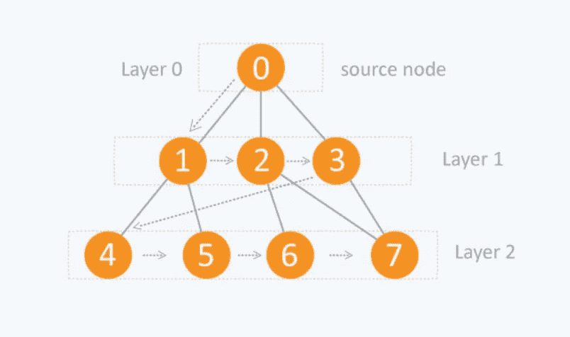

# 必须知道编码采访的算法

> 原文：<https://blog.devgenius.io/must-know-algorithms-for-coding-interviews-4e327bca59fd?source=collection_archive---------8----------------------->


在开始这篇文章之前，有一件事我想告诉你，这并不是什么新的编码问题，每个问题都可以通过你所研究的算法来解决，问题是你必须识别出这个问题的模式。这里我列出了一些在编码面试中经常被问到的重要算法。

附:不能保证你学会这些算法后能找到工作，但是 80%的情况下你会找到与这些算法相关的问题。

在本文中，您可以找到算法:-

*   两点
*   推拉窗
*   BFS
*   深度优先搜索
*   拓扑排序
*   Dijkstra 算法
*   二进位检索

# 两点

> 两个指针确实是一个简单有效的技巧，通常用在问题中

*   这些问题你必须指出两点。一个指针移动得慢，而另一个指针移动得快。
*   这些问题你必须指出两点。一个指针将从起点开始，而另一个指针将从终点开始。他们相向而行，直到相遇。

示例:- **有效回文**

```
int main()
{

   string str;
   cin>>str;
   int i=0;
   int j=str.length()-1;

   while(i<j){
       if(str[i]!=str[j]) cout<<false;

       i++;
       j--;
   }

   cout<<true;

}
```

这里我们使用两个指针的方法来检查给定的字符串是否是回文。我们从起始位置开始一个指针，从末端开始第二个指针。他们相向而行，直到相遇。

**多一些问题两个指针练习:-**

[](https://leetcode.com/problems/two-sum-ii-input-array-is-sorted/) [## 两个和 II -输入数组排序- LeetCode

### 给定一个已按非降序排序的 1 索引整数数组，找出两个数字，使得…

leetcode.com](https://leetcode.com/problems/two-sum-ii-input-array-is-sorted/) [](https://leetcode.com/problems/3sum/) [## 3 求和- LeetCode

### 提高你的编码技能，迅速找到工作。这是扩展你的知识和做好准备的最好地方…

leetcode.com](https://leetcode.com/problems/3sum/) [](https://leetcode.com/problems/container-with-most-water/) [## 装水最多的容器

### 给你一个长度为 n 的整数数组高度，画了 n 条垂直线，使得数组的两个端点…

leetcode.com](https://leetcode.com/problems/container-with-most-water/) [](https://leetcode.com/problems/trapping-rain-water/) [## 收集雨水- LeetCode

### 提高你的编码技能，迅速找到工作。这是扩展你的知识和做好准备的最好地方…

leetcode.com](https://leetcode.com/problems/trapping-rain-water/) 

# 推拉窗

> 滑动窗口技术背后的基本思想是将两个嵌套循环转换成一个循环。

*   问题将基于数组、列表或字符串类型的数据结构。
*   它将要求在数组或字符串中查找子范围，必须给出最长、最短或目标值。
*   它的概念主要基于这样的想法，比如完美地满足给定条件的事物的最长序列或最短序列。
*   假设我们有数组

```
[ 5, 7, 1, 4, 3, 6, 2,]
```

大小为 3 的滑动窗口看起来像:-

```
[5,7,1]
[7,1,4]
[1,4,3]
[4,3,6]
[3,6,2] 
```

解决滑动窗口问题的一些基本步骤

*   使用 HashMap 或 dictionary 来计算特定的数组输入，并坚持使用外部循环向右增加窗口。
*   将一个放入循环中，通过向右滑动来减少窗口边。这个循环会很短。
*   根据问题陈述存储当前最大或最小窗口大小或计数。

示例:- **具有总和 k 的最长子阵列**

```
int lenOfLongSubarr(int A[], int N, int K)
{

    int i = 0, j = 0, sum = 0;
    int maxLen = INT_MIN;

    while (j < N) {
        sum += A[j];
        if (sum < K) {
            j++;
        }
        else if (sum == K) {
            maxLen = max(maxLen, j-i+1);
            j++;
        }
        else if (sum > K) {
            while (sum > K) {
                sum -= A[i];
                 i++;
            }
              if(sum == K){
              maxLen = max(maxLen, j-i+1);
            }
            j++;
        }
    }
    return maxLen;
}
```

这里，我们必须找到总和为 k 的最长子数组。我们使用滑动窗口方法，取两个指针 I 和 j。我们递增 j 指针，并将元素添加到总和变量。一旦总和等于 k，我们将数组大小存储在 maxLen 变量中。如果 sum 超过 k，我们开始减少 sum 变量，同时增加 I 指针。

**更多问题滑动窗口练习:-**

[](https://leetcode.com/problems/longest-substring-without-repeating-characters/) [## 没有重复字符的最长子串- LeetCode

### 提高你的编码技能，迅速找到工作。这是扩展你的知识和做好准备的最好地方…

leetcode.com](https://leetcode.com/problems/longest-substring-without-repeating-characters/) [](https://leetcode.com/problems/minimum-window-substring/) [## 最小窗口子串- LeetCode

### 给定长度分别为 m 和 n 的两个字符串 s 和 t，返回 s 的最小窗口子串，使得每个…

leetcode.com](https://leetcode.com/problems/minimum-window-substring/) [](https://leetcode.com/problems/sliding-window-maximum/) [## 滑动窗口最大- LeetCode

### 给你一个整数数组 nums，有一个大小为 k 的滑动窗口，它从数组的最左边移动…

leetcode.com](https://leetcode.com/problems/sliding-window-maximum/) [](https://leetcode.com/problems/permutation-in-string/) [## 字符串中的置换- LeetCode

### 提高你的编码技能，迅速找到工作。这是扩展你的知识和做好准备的最好地方…

leetcode.com](https://leetcode.com/problems/permutation-in-string/) 

# 广度优先搜索(BFS)

> BFS 是一种遍历算法，您应该从选定的节点(源节点或起始节点)开始遍历，并逐层遍历图，从而探索相邻节点(直接连接到源节点的节点)。然后，您必须向下一级邻居节点移动。

正如 BFS 的名字所暗示的，你需要横向遍历这个图，如下所示:

*   首先水平移动并访问当前层的所有节点
*   移动到下一层



解决 BFS 问题的一些基本步骤

*   排队
*   在队列中添加根节点
*   对队列中的所有元素运行循环。弹出该元素并将其子节点推入队列。

示例:-二叉树的层次顺序遍历

```
void LevelOrder(Node * root) {

  if (root == NULL) return;

  queue<Node*> q;
  q.push(root);while (q.empty() == false) {
    Node * node = q.front();
    cout << node -> data << " ";
    q.pop();
    if (node -> left != NULL)
      q.push(node -> left);
    if (node -> right != NULL)
      q.push(node -> right);
  }
}
```

这里我们打印二叉树的节点。因此，我们采用队列推送根元素，并对队列中元素运行循环，将根元素的两个子元素添加到队列中，并弹出根节点。

**多一些 BFS 练习题:-**

[](https://leetcode.com/problems/cousins-in-binary-tree/) [## 二叉树中的表亲- LeetCode

### 给定具有唯一值的二叉树的根以及树的两个不同节点 x 和 y 的值，返回…

leetcode.com](https://leetcode.com/problems/cousins-in-binary-tree/) [](https://leetcode.com/problems/find-if-path-exists-in-graph/) [## 查找图形中是否存在路径- LeetCode

### 有一个有 n 个顶点的双向图，其中每个顶点被标记为从 0 到 n - 1(包括 0 和 n-1)。边缘…

leetcode.com](https://leetcode.com/problems/find-if-path-exists-in-graph/) [](https://leetcode.com/problems/binary-tree-zigzag-level-order-traversal/) [## 二叉树曲折层次顺序遍历- LeetCode

### 给定二叉树的根，返回其节点值的 z 字形层次顺序遍历。(即从左到…

leetcode.com](https://leetcode.com/problems/binary-tree-zigzag-level-order-traversal/) [](https://leetcode.com/problems/binary-tree-right-side-view/) [## 二叉树右侧视图- LeetCode

### 给定一棵二叉树的根，想象你站在它的右边，返回你…

leetcode.com](https://leetcode.com/problems/binary-tree-right-side-view/) 

# 深度优先搜索

> 深度优先搜索或深度优先遍历是一种递归算法，用于搜索图形或树数据结构的所有顶点

DFS 算法的工作原理如下

*   首先将图形的任意一个顶点放在堆栈的顶部。
*   取出堆栈的顶部项目，并将其添加到已访问列表中
*   创建该顶点相邻音符的列表。将不在已访问列表中的添加到堆栈的顶部。
*   重复步骤 2 和 3，直到堆栈为空

**图的一般 dfs 看起来是这样的**

```
void dfs(int i, vector<int>& vis, vector<int> adj[], vector<int>& res){
        res.push_back(i);
        vis[i] = 1;
        for(auto it : adj[i]){
            if(!vis[it]){
               dfs(it,vis,adj,res);
            }
        }
        return;
    }

    vector<int> dfsOfGraph(int V, vector<int> adj[]) {
        // Code here
         vector<int>res;
       vector<int>vis(V,0);
       for(int i=0;i<V;i++)
       {
           if(!vis[i])
           dfs(i,vis,adj,res);
       }
       return res;
    }
```

**还有一些问题需要练习:-**

[](https://leetcode.com/problems/number-of-islands/) [## 岛屿数量- LeetCode

### 提高你的编码技能，迅速找到工作。这是扩展你的知识和做好准备的最好地方…

leetcode.com](https://leetcode.com/problems/number-of-islands/) [](https://leetcode.com/problems/redundant-connection/) [## 冗余连接- LeetCode

### 在这个问题中，树是一个无向图，它是连通的，没有圈。给你一张图表，开始…

leetcode.com](https://leetcode.com/problems/redundant-connection/) [](https://leetcode.com/problems/flood-fill/) [## 洪水填充-洪水代码

### 图像由 m×n 整数网格图像表示，其中 image[i][j]表示图像的像素值。你…

leetcode.com](https://leetcode.com/problems/flood-fill/) [](https://www.techiedelight.com/replace-occurrences-of-0-surrounded-by-1-matrix/) [## 替换二进制矩阵中所有被 1 包围的 0

### 给定一个 M × N 二进制矩阵，用 1 替换所有出现的 0，它们完全被所有的 1 包围…

www.techiedelight.com](https://www.techiedelight.com/replace-occurrences-of-0-surrounded-by-1-matrix/) 

# 拓扑排序

> DAG(有向无环图)的拓扑排序是顶点的线性排序，使得对于每个有向边 u v，顶点 u 在排序中位于 v 之前。

*   我们使用临时堆栈。
*   我们不立即打印顶点，
*   我们首先递归调用所有相邻顶点的拓扑排序，然后将其推入堆栈。
*   最后，打印堆栈的内容。

```
void dfs(int node , vector<int> adj[] , vector<int> &vis , stack<int> &st){

     vis[node] =1;
     for(auto x : adj[node]){
         if(!vis[x]){
             dfs(x , adj , vis , st);
         }
     }

     st.push(node);

 }

 vector<int> topoSort(int V, vector<int> adj[]) 
 {
     // code here
     vector<int> vis(V);
     stack<int> st;
     vector<int> ans;

     for(int i=0;i<V;i++){
         if(!vis[i]){
             dfs(i,adj,vis,st);
         }
     }

     while(!st.empty()){
         ans.push_back(st.top());
         st.pop();
     }

     return ans;
 }
```

**关于拓扑排序练习的一些问题:-**

[](https://leetcode.com/problems/course-schedule/) [## 课程表- LeetCode

### 你总共有 numCourses 门课程要上，从 0 到 numCourses - 1。给你一个数组…

leetcode.com](https://leetcode.com/problems/course-schedule/) [](https://leetcode.com/problems/longest-increasing-path-in-a-matrix/) [## 矩阵中最长增长路径- LeetCode

### 给定一个 m x n 整数矩阵，返回矩阵中最长增长路径的长度。从每个单元格中，您可以…

leetcode.com](https://leetcode.com/problems/longest-increasing-path-in-a-matrix/) [](https://leetcode.com/problems/longest-cycle-in-a-graph/) [## 图中最长的循环- LeetCode

### 给你一个从 0 到 n - 1 的 n 个节点的有向图，其中每个节点最多有一条向外的边。的…

leetcode.com](https://leetcode.com/problems/longest-cycle-in-a-graph/) 

# Dijkstra 算法

> Dijkstra 的算法允许我们找到一个图的任意两个顶点之间的最短路径。

```
vector <int> dijkstra(int V, vector<vector<int>> adj[], int S)
    {
        // Code here
        priority_queue<pair<int,int> , vector<pair<int,int>> , greater<pair<int,int>>>pq;

        vector<int> vis(V , 1e9);

        vis[S] = 0;
        pq.push({0 , S});

        while(!pq.empty()){
            int dist = pq.top().first;
            int node = pq.top().second;

            pq.pop();

            for(auto it : adj[node]){
                int adjNode = it[0];
                int wt = it[1];
                // cout<<wt<<" "<<dist<<" "<<vis[adjNode]<<endl;

                if(dist + wt < vis[adjNode]){
                    vis[adjNode] = dist + wt;

                    pq.push({dist + wt , adjNode});
                }
            }
        }

        return vis;

    }
```

为了获得最小距离，我们在算法中使用了 min_heap 数据结构。只有该算法的实现对于编码轮和技术面试轮都是重要的。

# 二进位检索

> 二分搜索法是一种应用于排序数组的排序算法，通过重复地将搜索区间分成两半

基本步骤是:-

*   从整个数组的中间元素开始作为搜索关键字。
*   如果搜索关键字的值等于该项，则返回搜索关键字的索引。
*   或者，如果搜索关键字的值小于间隔中间的项目，则将间隔缩小到下半部分。
*   否则，缩小到上半部分。
*   从第二点开始重复检查，直到找到值或间隔为空。

```
int binarysearch(int arr[], int n, int k) {int start = 0;
        int end = n-1;while(s<=e){

    int mid = s + (e-s)/2;

    if(arr[mid]== k){
           return mid;
      }
    else if (k < arr[mid]){
        e =  mid - 1;
      }
     else{
         s = mid + 1;
      }
 } return -1;
 }
```

用二分搜索法搜索一个元素时间复杂度为 O(logn)，而线性搜索的时间复杂度为 O(N)。

对于面试来说，这个算法非常重要。

**关于二分搜索法练习的一些问题:-**

[](https://leetcode.com/problems/search-in-rotated-sorted-array/) [## 在旋转排序数组中搜索- LeetCode

### 有一个整数数组 nums 按升序排序(具有不同的值)。在传递给你之前…

leetcode.com](https://leetcode.com/problems/search-in-rotated-sorted-array/) [](https://leetcode.com/problems/find-minimum-in-rotated-sorted-array/) [## 在旋转排序数组中查找最小值- LeetCode

### 假设按升序排序的长度为 n 的数组被旋转 1 到 n 次。例如，数组 nums =…

leetcode.com](https://leetcode.com/problems/find-minimum-in-rotated-sorted-array/) [](https://leetcode.com/problems/search-a-2d-matrix/) [## 搜索 2D 矩阵- LeetCode

### 写一个有效的算法，在一个 m×n 的整数矩阵中搜索一个值目标。这个矩阵有…

leetcode.com](https://leetcode.com/problems/search-a-2d-matrix/) [](https://leetcode.com/problems/median-of-two-sorted-arrays/) [## 两个排序数组的中值- LeetCode

### 提高你的编码技能，迅速找到工作。这是扩展你的知识和做好准备的最好地方…

leetcode.com](https://leetcode.com/problems/median-of-two-sorted-arrays/) 

排序算法对面试也很重要。如果你想通过这篇博客了解所有的排序算法，我解释了每个排序算法的细节和代码。

[](https://medium.com/@mgarg6858/sorting-algorithms-asked-in-interviews-2df23be8b348) [## 面试中问到的排序算法

### 整理

算法在采访中问 Sortingmedium.com](https://medium.com/@mgarg6858/sorting-algorithms-asked-in-interviews-2df23be8b348)