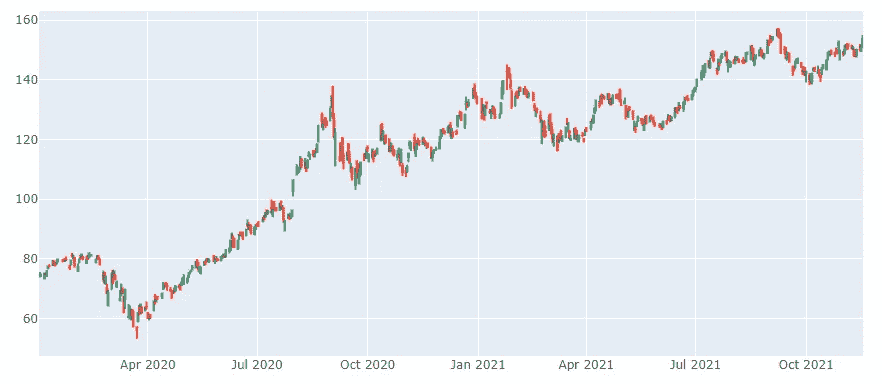

# 熊猫时间序列数据的必备函数

> 原文：<https://blog.devgenius.io/must-know-functions-for-pandas-time-series-data-abc84d957650?source=collection_archive---------4----------------------->

## 了解如何从 Pandas 时序数据中选择行

Pandas 是处理时间序列数据的一个很好的工具。比较日期时间对象有时会很乏味。本教程向我们展示了用于从 pandas 时间序列中选择行的 pandas 函数。



AAPL 蜡烛图

# 设置来自雅虎财经的熊猫时间序列数据

让我们首先设置我们的数据集。我们将从雅虎财经下载苹果公司的股票价值。

```
import yfinance as yf
df = yf.download("AAPL", interval="5m", period="60d")
```

这给出了一个时间序列数据帧，也就是说索引是一个日期时间对象。

```
2021–08–31 09:30:00
2021–08–31 09:35:00
2021–08–31 09:40:00
2021–08–31 09:45:00
2021–08–31 09:50:00
2021–08–31 09:55:00
2021–08–31 10:00:00
2021–08–31 10:05:00
2021–08–31 10:10:00
2021–08–31 10:15:00
```

我们有 60 天的数据，时间间隔为 5 分钟。需要注意的是，如果您希望筛选的日期时间列在索引中，则只能使用下面演示的函数。如果不是这种情况，可以用 set_index 函数将其设置为索引。

# 从特定的每日间隔中选择行

假设我们对每天 09:30 到 10:00 之间的最高股票价格感兴趣。

```
df.between_time("09:30", "09:45")["High"]
```

输出:

```
Datetime
2021-08-31 09:30:00-04:00    152.729996
2021-08-31 09:35:00-04:00    152.425003
2021-08-31 09:40:00-04:00    152.100006
2021-08-31 09:45:00-04:00    152.389999
2021-09-01 09:30:00-04:00    154.500000
                                ...    
2021-11-22 09:45:00-05:00    163.759995
2021-11-23 09:30:00-05:00    161.800003
2021-11-23 09:35:00-05:00    160.719498
2021-11-23 09:40:00-05:00    160.740097
2021-11-23 09:45:00-05:00    160.757095
Name: High, Length: 240, dtype: float64
```

在我们需要一个特定的时间间隔时，我们应该使用 at_time 函数。

```
df.at_time("09:30")
```

# 基于日期选择行

如果您想要特定日期的所有数据，您可以将索引与 ISO 格式的日期字符串进行比较。

```
df.loc["2021-09-01"]
```

假设您想要选择某个日期之后的行。

```
df.loc["2021-09-01":]
```

输出:

```
 Datetime
2021–09–01 09:30:00–04:00 154.500000
2021–09–01 09:35:00–04:00 154.720001
2021–09–01 09:40:00–04:00 154.625000
2021–09–01 09:45:00–04:00 154.539993
2021–09–01 09:50:00–04:00 154.750000
 … 
2021–11–23 15:35:00–05:00 161.100006
2021–11–23 15:40:00–05:00 161.227097
2021–11–23 15:45:00–05:00 161.250000
2021–11–23 15:50:00–05:00 161.585007
2021–11–23 15:55:00–05:00 161.690002
Name: High, Length: 4602, dtype: float64
```

如您所见，输出中包含了开始日期。

# 根据每月季节性选择行

让我们看一个例子，当我们有不同粒度的数据时。让我们下载 5 年的每日数据。

```
import yfinance as yf
df = yf.download("AAPL", interval="1d", period="5Y")
```

假设我们想要创建一些季节性技术指标，并希望选择 12 月份的行。

```
df.loc[df.index.month == 12]["High"]
```

输出:

```
Date
2016–12–01 27.735001
2016–12–02 27.522499
2016–12–05 27.507500
2016–12–06 27.590000
2016–12–07 27.797501
 … 
2020–12–24 133.460007
2020–12–28 137.339996
2020–12–29 138.789993
2020–12–30 135.990005
2020–12–31 134.740005
Name: High, Length: 103, dtype: float64
```

# 熊猫和时间序列数据摘要

熊猫对于时间序列来说很棒。用于选择行的特定函数在创建季节属性或构建技术指标时非常有用。

感谢您的阅读！