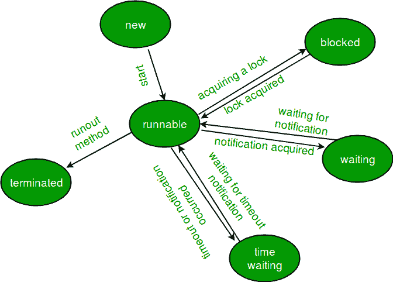
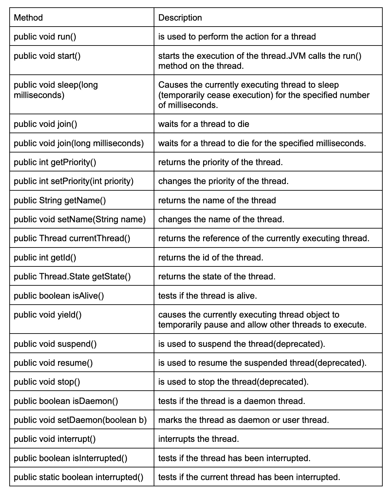

# Java 开发人员必须了解这些线程概念

> 原文：<https://blog.devgenius.io/must-know-these-thread-concepts-for-java-developers-ed9bdea495bf?source=collection_archive---------1----------------------->

## 软件工程之旅

## 如何开始使用 Java 中的线程

肯尼·埃利亚松在 [unsplash](https://unsplash.com/) 上的照片

# 概观

在 Java 编程中，线程是最流行的并发和并行编程技术。就 Java 技术概念而言，线程帮助我们在 Java 程序中实现并行性，它使应用程序运行得更快，尤其是同时运行多个任务。在本文中，我将通过简单的理论和例子与您分享如何在 Java 编程中使用线程，帮助您更容易理解。

# 为什么线程很重要

使用线程有四个原因:

*   **为了更快地处理后台/批处理任务**:当必须同时执行多个任务时，多线程允许不同的任务并行进行。结果减少了总的处理时间。
*   **充分利用 CPU 能力**:大多数现代 CPU 都有多个处理器，每个处理器都有多个内核。多线程允许不同的处理器运行不同的线程，从而更有效地利用系统资源。
*   **为了减少响应时间**:我们也可以使用多线程来减少响应时间，方法是通过将一个大问题分成较小的块并使用多线程处理它们来进行快速计算。
*   **同时为多个用户服务**:假设有一个多线程服务器，这意味着多个用户可以同时连接到服务器。例如，有许多用户同时向服务器发送请求，因此在多线程服务器中，每个用户不必等到应用程序处理完前一个用户的请求，因为他们是独立处理的，彼此不依赖。

# 线程生命周期

线程的生命周期是线程从诞生开始到死亡结束时的转换状态。当通过调用 thread 类的 start()方法创建并执行一个新的线程实例时，线程进入 runnable 状态。当调用 Thread 类的 sleep()或 wait()方法时，线程进入不可运行的模式。线程在退出 run()进程时会死亡。

生命周期中基本上有几个阶段，见下文:

**New** :当一个新线程被创建时，它以新的状态开始它的生命周期。

**可运行**:新线程启动后，进入可运行状态。在这种状态下，线程被认为正在执行它的任务。

**阻塞/等待**:当一个线程暂时不活动时，它就处于阻塞/等待状态。

**定时等待**:处于定时等待状态的线程在调用带有超时参数的方法时，等待直到超时结束。例如，当一个线程调用 sleep()方法时，它将进入定时等待状态。

**Terminate (Dead)** :线程在其 run()方法完成语句执行时，处于终止状态。当调用 stop()方法时，线程也可能是死的。

来源:[https://www.geeksforgeeks.org](https://www.geeksforgeeks.org)

# 使用线程类

Java 提供了一个线程类来实现编程，它提供了在线程上创建和执行操作的构造函数和方法。

使用线程构造函数创建线程的示例代码:

线程():

这个例子没有为线程指定任何要执行的代码。

线程(可运行 r):

**输出:**

可运行的运行

# 扩展线程类

这样，一个线程就被一个扩展了 thread 类的新类创建了。该类将覆盖 run()方法，该方法包含应该由线程实现的功能。

下面是通过扩展 thread 类来创建线程的示例:

**输出:**

线程正在运行

上面，start()方法用于创建一个新线程并使其可运行。新线程从 void run()方法内部开始。

# 实现可运行接口

在 Java 中实现多线程的另一种方法是创建一个实现 Runnable 接口的类。Runnable 接口是 java 平台附带的标准 Java 接口。Runnable 接口只有一个方法 run()。我们应该在 run()方法中编写代码来执行线程。

这里有一个例子:

start()方法用于调用 run()方法。当 start()被调用时，一个新的堆栈被赋予线程，run()方法被调用以在程序中引入一个新的线程。

# 线程优先级

在 Java 中，每个线程都有一个优先级。优先级由 1 到 10 之间的数字表示。线程调度器根据线程的优先级来调度线程，以确定应该允许哪个线程执行。

线程类中定义了三个优先级常量:

*   线程。最小优先级
*   线程。NORM _ 优先级
*   线程。最高优先级

NORM_PRIORITY 是一个线程的默认优先级，为 5。MIN_PRIORITY 和 MAX_PRIORITY 的其余部分，值分别为 1 和 10。

线程优先级的示例:

**输出:**

线程的优先级线程-1

线程的优先级线程 2

线程的优先级线程-0

当执行线程时，优先级高的线程将优先于优先级低的线程。

但是，如果有两个线程具有相同的优先级，那么就无法预测哪个线程将获得优先执行权。然后，执行取决于线程调度器的算法(先来先服务等)。

**举例:**

**输出:**

线程的优先级线程 2

线程的优先级线程-0

线程的优先级线程-1

# 线程中常用的方法

Thread 类中有很多常用的方法，举例如下:

# 线程中的同步

当我们在一个程序中启动两个或多个线程时，可能会出现这样的情况:多个线程试图访问相同的资源，最终产生错误的和无法预料的结果。

例如，有三个线程:A 和 B，它们并发执行，需要访问一个关键资源 C，为了避免访问 C 时发生冲突，线程 A 和 B 必须同步。因此，当 A 访问 C，B 也试图访问 C 时，B 对 C 的访问必须避免冲突，直到 A 完成其操作并从 C 中出来。

Java 提供了一种创建线程和使用同步块同步线程任务的方法。Java 中的同步块用 Synchronized 关键字标记。

使用了两种同步策略:

**同步方法:**

它在声明中使用了 synchronized 关键字。当线程调用同步方法时，同步方法自动获取该方法的锁，并在该方法返回或退出时释放它。

示例:

**输出:**

**同步语句:**

声明要同步的代码块。Java 中的同步块在某些对象上是同步的。所有其他试图进入 synchronized 语句的线程都被阻塞，直到 synchronized 语句中的线程退出该块。

示例:

**输出:**

# 结论

Java 中的线程是每个 Java 开发者都应该知道的重要部分。这对于高效开发同时处理多个任务并充分利用 CPU 能力的程序非常有帮助。这篇文章向我们传达了 Java 中的线程概念以及它们是如何实现的。我希望这篇文章能帮助你更容易地理解 Java 中的线程。

# 参考

 [## Java - GeeksforGeeks 中的 Java.lang.Thread 类

### 线程化程序中的一行执行。每个程序可以有多个关联的线程。每个线程都有一个…

www.geeksforgeeks.org](https://www.geeksforgeeks.org/java-lang-thread-class-java/)