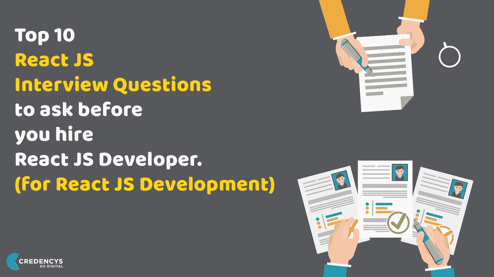

# 下一次前端面试必须知道的问题——第一部分

> 原文：<https://blog.devgenius.io/must-known-react-questions-for-your-next-frontend-interview-part-1-7711e74e5930?source=collection_archive---------4----------------------->



在这篇文章中，我将为你的下一次面试列出一些重要的问题和答案。

1.  **什么是 ReactJs？列出它的一些重要特征？**

ReactJS 是脸书在 2013 年为用户界面开发的 javascript 库。它用于创建单页 web 或移动应用程序。

反应堆的一些特征

*   虚拟 DOM 的使用
*   单向数据绑定:-单向数据绑定使得代码非常稳定。
*   可重用组件
*   JSX :-我们可以通过插入花括号({})在 html 代码中编写 javascript 代码。
*   这是搜索引擎友好。

**2。元素和组件的区别是什么？**

Element :-一个*元素*是一个普通的对象，它描述了您希望在屏幕上以 DOM 节点或其他组件的形式出现的内容。*元素*可以在其道具中包含其他*元素*。创建一个 React 元素成本很低。一个元素一旦被创造出来，就永远不会变异。

组件:-而组件可以用几种不同的方式声明。它可以是一个带有`render()`方法的类，也可以被定义为一个函数。在这两种情况下，它都将 props 作为输入，并返回一棵 JSX 树作为输出

**3。** **什么时候使用类组件而不是函数组件？**

如果组件需要*状态或生命周期方法*，则使用类组件，否则使用功能组件。然而，从 React 16.8 开始，通过增加钩子，你可以在你的函数组件中使用状态、生命周期方法和其他只在类组件中可用的特性。

**4。什么是纯组件？**

如果 React 组件为相同的状态和属性呈现相同的输出，则认为它是纯的。对于这种类型的类组件，React 提供了`PureComponent`基类。扩展了`React.PureComponent`类的类组件被视为纯组件。

纯组件有一些性能改进和渲染优化，因为 React 为它们实现了`shouldComponentUpdate()`方法，并对属性和状态进行了简单的比较。

**5。React 中的状态是什么？**

组件的状态是一个对象，它保存了一些信息，这些信息可能会随着组件的生命周期而改变。我们应该总是尽量使我们的状态简单，并尽量减少有状态组件的数量。

```
class User extends React.Component {
  constructor(props) {
    super(props)

    this.state = {
      message: 'Welcome to React world'
    }
  }

  render() {
    return (
      <div>
        <h1>{this.state.message}</h1>
      </div>
    )
  }
}
```

6。React 里的道具是什么？

*道具*是组件的输入。它们是单个值或包含一组值的对象，这些值在创建时使用类似于 HTML 标记属性的命名约定传递给组件。它们是从父组件传递到子组件的数据。

基于类的道具:-

```
import React from 'react'
import ReactDOM from 'react-dom'

class ChildComponent extends React.Component {
    render() {
        return (
            <div>
                <p>{this.props.name}</p>
                <p>{this.props.age}</p>
            </div>
        )
    }
}

class ParentComponent extends React.Component {
    render() {
        return (
            <div>
                <ChildComponent name='John' age='30' />
                <ChildComponent name='Mary' age='25' />
            </div>
        )
    }
}
```

基于功能的道具:-

```
import React from 'react'
import ReactDOM from 'react-dom'

const ChildComponent = (props) => {
    return (
        <div>
            <p>{props.name}</p>
            <p>{props.age}</p>
        </div>
    )
}

const ParentComponent = () => {
    return (
        <div>
            <ChildComponent name='John' age='30' />
            <ChildComponent name='Mary' age='25' />
        </div>
    )
}
```

**7。状态和道具有什么区别？**

*道具*和*状态*都是普通的 JavaScript 对象。虽然它们都包含影响渲染输出的信息，但它们在组件方面的功能是不同的。属性传递给组件类似于函数参数，而状态在组件中管理类似于函数中声明的变量。

**8。为什么不应该直接更新状态？**

如果你试图直接更新状态，那么它不会重新渲染组件。

```
//Wrong
this.state.message = 'Hello world'
```

而是使用`setState()`方法。它计划更新组件的状态对象。当状态改变时，组件通过重新呈现来响应。

```
//Correct
this.setState({ message: 'Hello World' })
```

**9。React 中的合成事件是什么？**

`SyntheticEvent`是围绕浏览器原生事件的跨浏览器包装器。它的 API 与浏览器的本地事件相同，包括`stopPropagation()`和`preventDefault()`，只是这些事件在所有浏览器中的工作方式相同。

**10。什么是内联条件表达式？**

您可以使用 JS 提供的 *if 语句*或*三元表达式*来有条件地呈现表达式。除了这些方法之外，你还可以在 JSX 中嵌入任何表达式，方法是用花括号把它们括起来，然后跟上 JS 逻辑运算符`&&`。

```
<h1>Hello!</h1>
{
    messages.length > 0 && !isLogin?
      <h2>
          You have {messages.length} unread messages.
      </h2>
      :
      <h2>
          You don't have unread messages.
      </h2>
}
```

这里我列出了 10 个 ReactJs 的问题，这是第一部分。关于这个话题我会分享更多的部分。确保:-

*   给它鼓掌
*   跟着我[莫希特·加格](https://medium.com/u/8a9ce53808fd?source=post_page-----7711e74e5930--------------------------------)，也可以获得其他部分的通知。