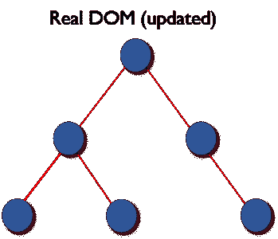

# 下一次前端面试必须知道的问题——第二部分

> 原文：<https://blog.devgenius.io/must-known-react-questions-for-your-next-frontend-interview-part-2-2430fe2d131a?source=collection_archive---------13----------------------->


这篇文章是上一篇文章的延续，在上一篇文章中，我为你的下一次前端面试列出了一些重要的问题和答案。

1.  **如何将参数传递给事件处理程序或回调函数？**

您可以使用一个*箭头函数*来环绕一个*事件处理程序*并传递参数:

```
<button onClick={() => this.handleClick(id)} />
```

这相当于调用`.bind`:

```
<button onClick={this.handleClick.bind(this, id)} />
```

除了这两种方法，您还可以将参数传递给被定义为 arrow function 的函数

```
<button onClick={this.handleClick(id)} />
handleClick = (id) => () => {
    console.log("Hello, your ticket number is", id)
};
```

**2。参考文献有什么用？**

*ref* 用于返回对元素的引用。在大多数情况下，应该避免使用它们*,但是，当您需要直接访问 DOM 元素或组件实例时，它们会很有用。*

***3。什么是虚拟 DOM？***

**虚拟 DOM* (VDOM)是*真实 DOM* 的内存表示。UI 的表示保存在内存中，并与“真正的”DOM 同步。这是调用渲染函数和在屏幕上显示元素之间的一个步骤。这整个过程被称为*和解*。*

***4。虚拟 DOM 是如何工作的？***

*虚拟 DOM 工作在三个简单的步骤中。*

*   *每当底层数据发生变化时，整个 UI 都会以虚拟 DOM 表示重新呈现。*

**

*   *然后计算以前的 DOM 表示和新的 DOM 表示之间的差异。*

**

*   *一旦计算完成，真正的 DOM 将只更新实际发生变化的内容。*

**

***5。什么是受控组件***

*在后续用户输入中控制表单中的输入元素的组件称为受控组件，也就是说，每个状态突变都有一个关联的处理函数。*

*例如，要用大写字母写所有的名字，我们使用如下的 handleChange，*

```
*handleChange(event) {
  this.setState({value: event.target.value.toUpperCase()})
}*
```

*6。什么是不受控制的组件？*

*不受控制的组件是那些在内部存储它们自己的状态的组件，当需要时，可以使用 ref 查询 DOM 以找到它的当前值。这有点像传统的 HTML。*

*在下面的 UserProfile 组件中，使用 ref 访问`name`输入。*

```
*class UserProfile extends React.Component {
  constructor(props) {
    super(props)
    this.handleSubmit = this.handleSubmit.bind(this)
    this.input = React.createRef()
  }

  handleSubmit(event) {
    alert('A name was submitted: ' + this.input.current.value)
    event.preventDefault()
  }

  render() {
    return (
      <form onSubmit={this.handleSubmit}>
        <label>
          {'Name:'}
          <input type="text" ref={this.input} />
        </label>
        <input type="submit" value="Submit" />
      </form>
    );
  }
}*
```

*在大多数情况下，建议使用受控组件来实现表单。在受控组件中，表单数据由 React 组件处理。另一种方法是不受控制的组件，表单数据由 DOM 本身处理。*

***7。React 的生命周期方法有哪些？***

*这是 react 开发者访谈中**真正重要的问题**。因此，我就这个问题写了整篇文章，我建议您阅读这篇文章，以了解 React 所有生命周期方法。在这里，我附上相同的链接。*

*[](https://medium.com/@mgarg6858/react-component-lifecycle-in-class-and-functional-component-d001f3615a83) [## 在类和功能组件中反应组件生命周期

### 介绍

medium.com](https://medium.com/@mgarg6858/react-component-lifecycle-in-class-and-functional-component-d001f3615a83) 

**8。什么是高阶元件？**

一个*高阶组件* ( *HOC* )是一个接受一个组件并返回一个新组件的函数。基本上，这是一种源自 React 的组合性质的模式。

我们称它们为纯组件，因为它们可以接受任何动态提供的子组件，但不会修改或复制其输入组件的任何行为。

**9。什么是儿童道具？**

*Children* 是一个道具(`this.props.children`)，允许你将组件作为数据传递给其他组件，就像你使用的任何其他道具一样。放在组件开始和结束标签之间的组件树将作为`children`属性传递给该组件。

儿童道具的简单用法如下:

```
const MyDiv = React.createClass({
  render: function() {
    return <div>{this.props.children}</div>
  }
})

ReactDOM.render(
  <MyDiv>
    <span>{'Hello'}</span>
    <span>{'World'}</span>
  </MyDiv>,
  node
)
```

**10。如何在 React 中写评论？**

React/JSX 中的注释类似于 JavaScript 的多行注释，但是用花括号括起来。

单行注释:

```
<div>
  {/* Single-line comments(In vanilla JavaScript, the single-line comments are represented by double slash(//)) */}
  {`Welcome ${user}, let's play React`}
</div>
```

多行注释:

```
<div>
  {/* Multi-line comments for more than
   one line */}
  {`Welcome ${user}, let's play React`}
</div>
``` 

*在这里，我列出了 10 个 ReactJs 的问题，这是这个系列的第二部分。我会分享更多关于这个话题的部分和前端面试的问题。确保:-*

*   *给它鼓掌*
*   *跟着我[莫希特·加格](https://medium.com/u/8a9ce53808fd?source=post_page-----2430fe2d131a--------------------------------)，也可以获得其他部分的通知。*