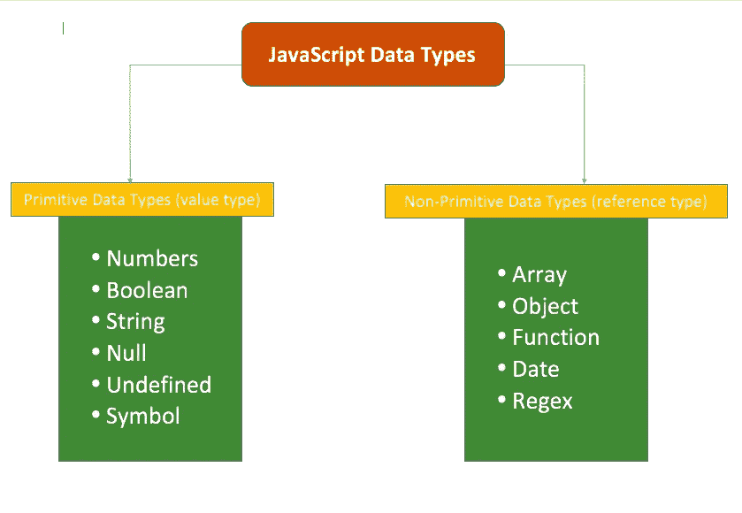
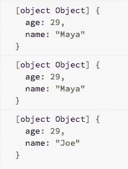

# JavaScript 中的可变和不可变

> 原文：<https://blog.devgenius.io/mutable-and-immutable-in-javascript-78a3cbc6187c?source=collection_archive---------0----------------------->


[Adri Tormo](https://unsplash.com/@tormius?utm_source=medium&utm_medium=referral) 在 [Unsplash](https://unsplash.com?utm_source=medium&utm_medium=referral) 上拍摄的照片

根据 T4 的定义

> *可变*是一种可以改变的变量。在 JavaScript 中，只有[对象](https://developer.mozilla.org/en-US/docs/Glossary/Object)和[数组](https://developer.mozilla.org/en-US/docs/Glossary/Array)是可变的，而不是[原始值](https://developer.mozilla.org/en-US/docs/Glossary/primitive)。
> 
> 一个**可变对象**是一个对象，它的状态在它被创建后可以被修改。
> 
> **不变量**是一旦对象被创建，其状态就不能改变的对象。

# 我们来分解一下

JavaScript 中有两种数据类型——基本类型(值类型)和非基本类型(引用类型)。



## 值类型

值类型存储在内存中的堆栈**中。栈只是一个数据**的**栈，具有“后进先出”的数据结构。它没有太多的空间(与其他数据结构相比)，但由于它的工作方式，它的访问速度非常快。**

当在内存中存储一个值类型时，它用新创建的变量的值将一个元素添加到堆栈的顶部。当创建一个新变量并将第一个变量赋给新变量时，它会在堆栈顶部添加一个新元素，该元素包含新变量的值(即第一个创建的变量的值)。

通过创造

```
var name = "Maya";
var newName = name;
```

第一个变量— **name** 与变量 data 的值一起进入堆栈。然后， **newName** 用变量 data 的值进入堆栈的新内存位置。


## 参考类型

引用类型存储在**堆**中。堆与堆栈无关，没有存储数据的顺序。你可以把它想象成随机存储数据，每个数据都有自己的地址。它的访问速度较慢，但由于它处理更复杂的变量，所以有更多的空间。

当在内存中存储引用类型时，当它的值是指向已经存储在**堆**上的对象地址的指针/引用时，它将一个新元素添加到**栈**的顶部。

通过创造

```
var Person = {name: "Maya", age: "29"}
var newPerson = Person;
```

一个新元素进入**栈**，其值为已经存储在**堆**中的**人**对象的**指针/引用**。


当创建一个 **newPerson** 对象并将 **Person** 对象分配给它时，它将一个新元素添加到**堆栈**的顶部，其值为已经存储在**堆**上的第一个 **Person** 对象的**指针/引用**。


## 让我们看看一些代码

让我们创建一个以字符串为值的变量。然后，我们创建一个新变量，并将第一个变量赋给它。然后，我们将更改第一个变量值。我们将在创建变量后打印每个变量。

```
var name = 'Maya';
console.log(name);var newName = name;
console.log(newName);name = 'Joe';
console.log(newName);
```

不出意外的话，我们将在控制台中看到它。


现在，让我们创建一个对象变量。然后，我们将创建一个新的对象变量，并将第一个对象赋给它。然后，我们将更改第一个对象的数据。同样，我们将在创建变量后打印每个变量。

```
var person = {name:'Maya', age:29};
console.log(person);var newPerson = person;
console.log(newPerson);person.name = 'Joe';
console.log(newPerson);
```

这一次，我们将在控制台中看到



## 可变和不可变

你知道改变值类型**名字**数据不会影响**新名字**数据，但是当改变**人物**对象数据时，它会影响**新人物**数据吗？

这是由于数据的存储方式造成的。

每次创建值类型时，都会有一个新元素进入堆栈的顶部，存储该变量的数据。另一方面，当创建一个引用类型时，一个新元素进入堆栈的顶部，但是这次，它将引用/指针存储到堆中对象的地址位置。然后，当我们将创建的对象赋给一个新的对象变量时，一个新元素进入堆栈的顶部，但具有指向第一个对象的相同引用/指针。

**因此，当改变一个已创建对象的数据时，指向堆上相同地址位置的所有其他对象也被改变。**

记住这一点，我们可以说**值类型是不可变的**，而**引用类型是可变的**。